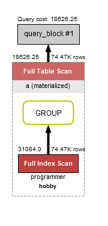
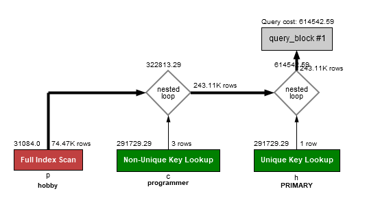
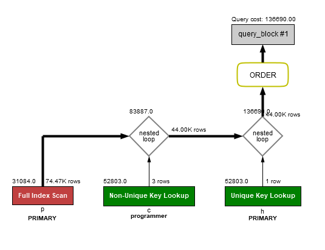
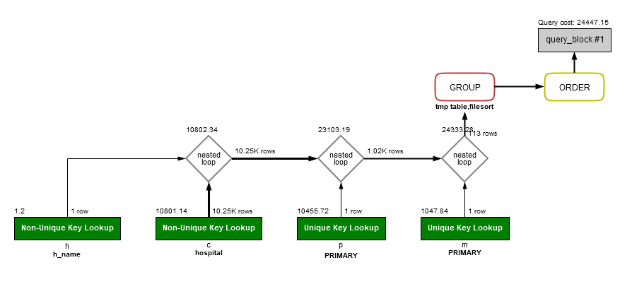
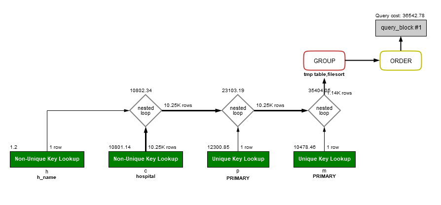

<p align="center">
    
</p>
<p align="center">
  
  
  <a href="https://edu.nextstep.camp/c/R89PYi5H" alt="nextstep atdd">
    
  </a>
  
</p>

<br>

# 인프라공방 샘플 서비스 - 지하철 노선도

<br>

## 🚀 Getting Started

### Install
#### npm 설치
```
cd frontend
npm install
```
> `frontend` 디렉토리에서 수행해야 합니다.

### Usage
#### webpack server 구동
```
npm run dev
```
#### application 구동
```
./gradlew clean build
```
<br>

## 미션

* 미션 진행 후에 아래 질문의 답을 작성하여 PR을 보내주세요.

### 1단계 - 화면 응답 개선하기
1. 성능 개선 결과를 공유해주세요 (Smoke, Load, Stress 테스트 결과)
    `performance` 디렉토리 안에 결과 올렸습니다. 
2. 어떤 부분을 개선해보셨나요? 과정을 설명해주세요
    1. `WebPageTest`, `Page Speed Insights`를 통해 성능 지표를 검토
    2. `load`, `smoke`, `stress` 테스트를 통하여 지표 출력
    3. 정적 파일 경량화
        - 번들 크기 줄이기
        - Code Splitting
        - Dynamic import
    4. Reverse Proxy 개선하기
        - http 블록 수준에서 gzip 압축 활성화
        - 캐시 설정
        - http2 적용
    5. WAS 성능 개선하기
        - Redis 활용 : 사용자, 노선, 역에 적용
        - 비동기 설정 추가 및 스레드 수 변경
        
---

### 2단계 - 조회 성능 개선하기
#### 인덱스 적용해보기 실습을 진행해본 과정을 공유해주세요
1. Coding as a Hobby 와 같은 결과를 반환하세요.  
    - `programmer.hobby`에 index 적용
    - **결과 : 0.063ms**
    ```
    select concat(round(sum(case when a.hobby = 'yes' then a.cnt else 0 end) / sum(a.cnt) * 100, 1), "%") as "Yes",
            concat(round(sum(case when a.hobby = 'no' then a.cnt else 0 end) / sum(a.cnt) * 100, 1), "%") as "No"
    from (select hobby, count(hobby) as "cnt"
          from subway.programmer
          group by hobby
    ) a;
    ```
   

2. 프로그래머별로 해당하는 병원 이름을 반환하세요. (covid.id, hospital.name)
    - `programmer`, `covid`, `hospital` 각 `id`에 `Primary Key` 적용
    - `covid.hospital_id`에 index 적용
    - **결과 : 0.016ms**
    ```
    select c.id, h.name
    from subway.covid c join subway.programmer p on (p.id = c.programmer_id)
                        join subway.hospital h on (h.id = c.hospital_id);
    ```
   

3. 프로그래밍이 취미인 학생 혹은 주니어(0-2년)들이 다닌 병원 이름을 반환하고 user.id 기준으로 정렬하세요.  
(covid.id, hospital.name, user.Hobby, user.DevType, user.YearsCoding)  
    - **결과 : 0.016ms**
    ```
    select h.name
    from subway.covid c join subway.programmer p on (p.id = c.programmer_id)
                        join subway.hospital h on (h.id = c.hospital_id)
    where (p.hobby ='yes' and p.student != 'no')
    or years_coding = '0-2 years'
    order by p.id;
    ```
   

4. 서울대병원에 다닌 20대 India 환자들을 병원에 머문 기간별로 집계하세요.(covid.Stay)
    - `covid`에 `programmer_id`, `hospital_id`, `member_id` 인덱스로 추가
    - `hospital`에 `name`을 인덱스로 추가
    - **결과 : 0.063ms**
    ```
    select c.stay, count(c.id) as cnt
    from  subway.covid c join subway.programmer p on (p.id = c.programmer_id)
                         join subway.hospital h on (h.id = c.hospital_id)
                         join subway.member m on (m.id = c.member_id)
    where h.name = '서울대병원'
    and p.country = 'India'
    and (m.age >= 20 and m.age < 30)
    group by c.stay
    order by stay;
    ```
   

5. 서울대병원에 다닌 30대 환자들을 운동 횟수별로 집계하세요. (user.Exercise)
    - **결과 : 0.063ms**
    ```
    select p.exercise, count(c.id) as cnt
    from  subway.covid c join subway.programmer p on (p.id = c.programmer_id)
                         join subway.hospital h on (h.id = c.hospital_id)
                         join subway.member m on (m.id = c.member_id)
    where h.name = '서울대병원'
    and (m.age >= 30 and m.age < 40)
    group by p.exercise
    order by exercise;
    ```
   
   
#### 페이징 쿼리를 적용한 API endpoint를 알려주세요

