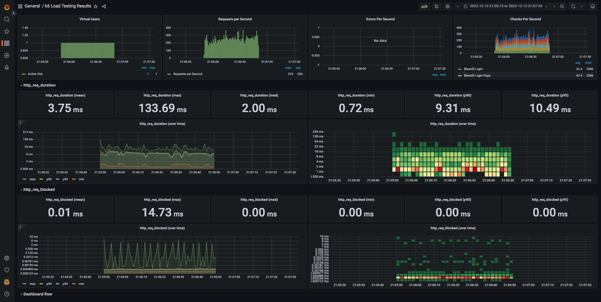

<p align="center">
    
</p>
<p align="center">
  
  
  <a href="https://edu.nextstep.camp/c/R89PYi5H" alt="nextstep atdd">
    
  </a>
  
</p>

<br>

# 인프라공방 샘플 서비스 - 지하철 노선도

<br>

## 🚀 Getting Started

### Install
#### npm 설치
```
cd frontend
npm install
```
> `frontend` 디렉토리에서 수행해야 합니다.

### Usage
#### webpack server 구동
```
npm run dev
```
#### application 구동
```
./gradlew clean build
```
<br>

## 미션

* 미션 진행 후에 아래 질문의 답을 작성하여 PR을 보내주세요.

### 1단계 - 화면 응답 개선하기

1. 성능 개선 결과를 공유해주세요 (Smoke, Load, Stress 테스트 결과)

<details>
<summary>smoke 스크립트 실행 이전 결과</summary>

```text

          /\      |‾‾| /‾‾/   /‾‾/
     /\  /  \     |  |/  /   /  /
    /  \/    \    |     (   /   ‾‾\
   /          \   |  |\  \ |  (‾)  |
  / __________ \  |__| \__\ \_____/ .io

  execution: local
     script: smoke.js
     output: InfluxDBv1 (http://localhost:8086)

  scenarios: (100.00%) 1 scenario, 1 max VUs, 1m30s max duration (incl. graceful stop):
           * default: 1 looping VUs for 1m0s (gracefulStop: 30s)


running (1m00.1s), 0/1 VUs, 502 complete and 0 interrupted iterations
default ✓ [======================================] 1 VUs  1m0s

     ✓ [Result] Main Page
     ✓ [Result] Login Page
     ✓ [Result] Login
     ✓ [Result] me
     ✓ [Result] Path Page
     ✓ [Result] Search Path

     checks.........................: 100.00% ✓ 3012     ✗ 0
     data_received..................: 3.7 MB  62 kB/s
     data_sent......................: 624 kB  10 kB/s
     http_req_blocked...............: avg=11.98µs  min=1.18µs   med=2.32µs   max=13.82ms  p(90)=3.48µs   p(95)=4.25µs
     http_req_connecting............: avg=951ns    min=0s       med=0s       max=938.6µs  p(90)=0s       p(95)=0s
   ✓ http_req_duration..............: avg=19.79ms  min=887.92µs med=4.03ms   max=534.68ms p(90)=85.41ms  p(95)=104.58ms
       { expected_response:true }...: avg=19.79ms  min=887.92µs med=4.03ms   max=534.68ms p(90)=85.41ms  p(95)=104.58ms
     http_req_failed................: 0.00%   ✓ 0        ✗ 3012
     http_req_receiving.............: avg=63.87µs  min=22.04µs  med=54.16µs  max=4.35ms   p(90)=88.51µs  p(95)=102.86µs
     http_req_sending...............: avg=17.35µs  min=6.2µs    med=12.73µs  max=813.69µs p(90)=25.13µs  p(95)=30.07µs
     http_req_tls_handshaking.......: avg=7.7µs    min=0s       med=0s       max=12.71ms  p(90)=0s       p(95)=0s
     http_req_waiting...............: avg=19.7ms   min=846.43µs med=3.95ms   max=534.58ms p(90)=85.28ms  p(95)=104.49ms
     http_reqs......................: 3012    50.13412/s
     iteration_duration.............: avg=119.66ms min=67.59ms  med=113.65ms max=576.87ms p(90)=156.07ms p(95)=176.29ms
     iterations.....................: 502     8.355687/s
     vus............................: 1       min=1      max=1
     vus_max........................: 1       min=1      max=1
```

</details>

<details>
<summary>smoke 스크립트 실행 이후 결과</summary>

```text

          /\      |‾‾| /‾‾/   /‾‾/
     /\  /  \     |  |/  /   /  /
    /  \/    \    |     (   /   ‾‾\
   /          \   |  |\  \ |  (‾)  |
  / __________ \  |__| \__\ \_____/ .io

  execution: local
     script: load.js
     output: InfluxDBv1 (http://localhost:8086)

  scenarios: (100.00%) 1 scenario, 14 max VUs, 29m40s max duration (incl. graceful stop):
           * default: Up to 14 looping VUs for 29m10s over 12 stages (gracefulRampDown: 30s, gracefulStop: 30s)


running (06m30.9s), 00/14 VUs, 39465 complete and 6 interrupted iterations
default ✗ [=======>------------------------------] 01/14 VUs  06m30.9s/29m10.0s

     ✓ [Result] Main Page
     ✓ [Result] Login Page
     ✓ [Result] Login
     ✓ [Result] me
     ✓ [Result] Path Page
     ✓ [Result] Search Path

     checks.........................: 100.00% ✓ 236806     ✗ 0
     data_received..................: 209 MB  534 kB/s
     data_sent......................: 14 MB   37 kB/s
     http_req_blocked...............: avg=6.45µs  min=151ns    med=286ns   max=65.29ms  p(90)=413ns   p(95)=464ns
     http_req_connecting............: avg=1.01µs  min=0s       med=0s      max=27.48ms  p(90)=0s      p(95)=0s
   ✓ http_req_duration..............: avg=3.71ms  min=669.93µs med=1.96ms  max=93.05ms  p(90)=8.82ms  p(95)=11.17ms
       { expected_response:true }...: avg=3.71ms  min=669.93µs med=1.96ms  max=93.05ms  p(90)=8.82ms  p(95)=11.17ms
     http_req_failed................: 0.00%   ✓ 0          ✗ 236806
     http_req_receiving.............: avg=45.48µs min=10.67µs  med=26.9µs  max=47.46ms  p(90)=47.78µs p(95)=62.5µs
     http_req_sending...............: avg=31.97µs min=9.47µs   med=24.55µs max=20.91ms  p(90)=44.46µs p(95)=52.39µs
     http_req_tls_handshaking.......: avg=4.8µs   min=0s       med=0s      max=37.7ms   p(90)=0s      p(95)=0s
     http_req_waiting...............: avg=3.63ms  min=0s       med=1.9ms   max=92.51ms  p(90)=8.74ms  p(95)=11.04ms
     http_reqs......................: 236806  605.839848/s
     iteration_duration.............: avg=22.92ms min=10.35ms  med=19.39ms max=253.69ms p(90)=32.44ms p(95)=46.64ms
     iterations.....................: 39465   100.966486/s
     vus............................: 6       min=1        max=6
     vus_max........................: 14      min=14       max=14

```

</details>

<details>
<summary>smoke grafana 결과</summary>

`이전결과`


`이후결과`


</details>

<br>

<details>
<summary>load 스크립트 실행 이전 결과</summary>

```text

          /\      |‾‾| /‾‾/   /‾‾/
     /\  /  \     |  |/  /   /  /
    /  \/    \    |     (   /   ‾‾\
   /          \   |  |\  \ |  (‾)  |
  / __________ \  |__| \__\ \_____/ .io

  execution: local
     script: load.js
     output: InfluxDBv1 (http://localhost:8086)

  scenarios: (100.00%) 1 scenario, 14 max VUs, 29m40s max duration (incl. graceful stop):
           * default: Up to 14 looping VUs for 29m10s over 12 stages (gracefulRampDown: 30s, gracefulStop: 30s)


running (29m10.2s), 00/14 VUs, 37082 complete and 0 interrupted iterations
default ✓ [======================================] 00/14 VUs  29m10s

     ✓ [Result] Main Page
     ✓ [Result] Login Page
     ✓ [Result] Login
     ✓ [Result] me
     ✓ [Result] Path Page
     ✓ [Result] Search Path

     checks.........................: 100.00% ✓ 222492     ✗ 0
     data_received..................: 277 MB  158 kB/s
     data_sent......................: 46 MB   26 kB/s
     http_req_blocked...............: avg=8.78µs   min=803ns    med=1.99µs   max=32.76ms p(90)=3.27µs   p(95)=3.91µs
     http_req_connecting............: avg=1.07µs   min=0s       med=0s       max=22.92ms p(90)=0s       p(95)=0s
   ✗ http_req_duration..............: avg=65.52ms  min=723.95µs med=2.64ms   max=5.1s    p(90)=170.61ms p(95)=298.36ms
       { expected_response:true }...: avg=65.52ms  min=723.95µs med=2.64ms   max=5.1s    p(90)=170.61ms p(95)=298.36ms
     http_req_failed................: 0.00%   ✓ 0          ✗ 222492
     http_req_receiving.............: avg=58.66µs  min=13.96µs  med=44.7µs   max=29.76ms p(90)=84.12µs  p(95)=100.26µs
     http_req_sending...............: avg=17.48µs  min=4.7µs    med=11.55µs  max=28.15ms p(90)=24µs     p(95)=28.93µs
     http_req_tls_handshaking.......: avg=4.64µs   min=0s       med=0s       max=31.86ms p(90)=0s       p(95)=0s
     http_req_waiting...............: avg=65.44ms  min=684µs    med=2.58ms   max=5.1s    p(90)=170.53ms p(95)=298.24ms
     http_reqs......................: 222492  127.121754/s
     iteration_duration.............: avg=393.95ms min=59.63ms  med=219.34ms max=5.74s   p(90)=467.89ms p(95)=2.17s
     iterations.....................: 37082   21.186959/s
     vus............................: 1       min=1        max=14
     vus_max........................: 14      min=14       max=14

ERRO[1751] some thresholds have failed
```

</details>

<details>
<summary>load 스크립트 실행 이후 결과</summary>

```text

          /\      |‾‾| /‾‾/   /‾‾/
     /\  /  \     |  |/  /   /  /
    /  \/    \    |     (   /   ‾‾\
   /          \   |  |\  \ |  (‾)  |
  / __________ \  |__| \__\ \_____/ .io

  execution: local
     script: load.js
     output: InfluxDBv1 (http://localhost:8086)

  scenarios: (100.00%) 1 scenario, 14 max VUs, 29m40s max duration (incl. graceful stop):
           * default: Up to 14 looping VUs for 29m10s over 12 stages (gracefulRampDown: 30s, gracefulStop: 30s)

running (29m10.0s), 00/14 VUs, 361135 complete and 0 interrupted iterations
default ✓ [======================================] 00/14 VUs  29m10s

     ✓ [Result] Main Page
     ✓ [Result] Login Page
     ✓ [Result] Login
     ✓ [Result] me
     ✓ [Result] Path Page
     ✓ [Result] Search Path

     checks.........................: 100.00% ✓ 2166810     ✗ 0
     data_received..................: 1.9 GB  1.1 MB/s
     data_sent......................: 132 MB  75 kB/s
     http_req_blocked...............: avg=9.41µs  min=123ns    med=302ns   max=102.94ms p(90)=398ns   p(95)=440ns
     http_req_connecting............: avg=1µs     min=0s       med=0s      max=32.52ms  p(90)=0s      p(95)=0s
   ✓ http_req_duration..............: avg=6.62ms  min=646.48µs med=3.52ms  max=732.58ms p(90)=16.41ms p(95)=21.24ms
       { expected_response:true }...: avg=6.62ms  min=646.48µs med=3.52ms  max=732.58ms p(90)=16.41ms p(95)=21.24ms
     http_req_failed................: 0.00%   ✓ 0           ✗ 2166810
     http_req_receiving.............: avg=98.8µs  min=10.02µs  med=26.68µs max=76.96ms  p(90)=92µs    p(95)=219.53µs
     http_req_sending...............: avg=32.67µs min=8.54µs   med=22.4µs  max=58.21ms  p(90)=41.64µs p(95)=49.88µs
     http_req_tls_handshaking.......: avg=7.83µs  min=0s       med=0s      max=53.92ms  p(90)=0s      p(95)=0s
     http_req_waiting...............: avg=6.49ms  min=0s       med=3.44ms  max=732.46ms p(90)=16.2ms  p(95)=20.91ms
     http_reqs......................: 2166810 1238.151737/s
     iteration_duration.............: avg=40.4ms  min=9.87ms   med=25.28ms max=1.81s    p(90)=93.51ms p(95)=117.95ms
     iterations.....................: 361135  206.358623/s
     vus............................: 1       min=1         max=14
     vus_max........................: 14      min=14        max=14

```

</details>

<details>
<summary>load grafana 결과</summary>

`이전결과`


`이후결과`


</details>

<br>

<details>
<summary>stress 스크립트 실행 이전결과</summary>

```text

          /\      |‾‾| /‾‾/   /‾‾/
     /\  /  \     |  |/  /   /  /
    /  \/    \    |     (   /   ‾‾\
   /          \   |  |\  \ |  (‾)  |
  / __________ \  |__| \__\ \_____/ .io

  execution: local
     script: stress.js
     output: InfluxDBv1 (http://localhost:8086)

  scenarios: (100.00%) 1 scenario, 384 max VUs, 28m40s max duration (incl. graceful stop):
           * default: Up to 384 looping VUs for 28m10s over 16 stages (gracefulRampDown: 30s, gracefulStop: 30s)


running (28m10.1s), 000/384 VUs, 44047 complete and 33 interrupted iterations
default ✓ [======================================] 000/384 VUs  28m10s

     ✓ [Result] Main Page
     ✓ [Result] Login Page
     ✗ [Result] Login
      ↳  99% — ✓ 44074 / ✗ 6
     ✓ [Result] me
     ✓ [Result] Path Page
     ✗ [Result] Search Path
      ↳  99% — ✓ 44038 / ✗ 9

     checks.........................: 99.99% ✓ 264424     ✗ 15
     data_received..................: 330 MB 195 kB/s
     data_sent......................: 55 MB  33 kB/s
     http_req_blocked...............: avg=14.75µs  min=923ns    med=2.06µs  max=50.38ms p(90)=3.37µs  p(95)=4.02µs
     http_req_connecting............: avg=1.51µs   min=0s       med=0s      max=14.78ms p(90)=0s      p(95)=0s
   ✗ http_req_duration..............: avg=912.86ms min=709.84µs med=4.27ms  max=32.18s  p(90)=2.46s   p(95)=3.74s
       { expected_response:true }...: avg=910.6ms  min=709.84µs med=4.27ms  max=32.18s  p(90)=2.46s   p(95)=3.74s
     http_req_failed................: 0.00%  ✓ 23         ✗ 264416
     http_req_receiving.............: avg=58.86µs  min=13.81µs  med=46.47µs max=17.47ms p(90)=87.67µs p(95)=105.56µs
     http_req_sending...............: avg=17.83µs  min=4.8µs    med=12.37µs max=20.79ms p(90)=25.09µs p(95)=32µs
     http_req_tls_handshaking.......: avg=9.85µs   min=0s       med=0s      max=28.24ms p(90)=0s      p(95)=0s
     http_req_waiting...............: avg=912.78ms min=677.02µs med=4.18ms  max=32.18s  p(90)=2.46s   p(95)=3.74s
     http_reqs......................: 264439 156.464657/s
     iteration_duration.............: avg=5.45s    min=56.68ms  med=2.27s   max=1m13s   p(90)=10.37s  p(95)=24.86s
     iterations.....................: 44047  26.06196/s
     vus............................: 1      min=1        max=384
     vus_max........................: 384    min=384      max=384

ERRO[1691] some thresholds have failed
```

</details>

<details>
<summary>stress 스크립트 실행 이후결과</summary>

```text

          /\      |‾‾| /‾‾/   /‾‾/
     /\  /  \     |  |/  /   /  /
    /  \/    \    |     (   /   ‾‾\
   /          \   |  |\  \ |  (‾)  |
  / __________ \  |__| \__\ \_____/ .io

  execution: local
     script: stress.js
     output: InfluxDBv1 (http://localhost:8086)

  scenarios: (100.00%) 1 scenario, 384 max VUs, 28m40s max duration (incl. graceful stop):
           * default: Up to 384 looping VUs for 28m10s over 16 stages (gracefulRampDown: 30s, gracefulStop: 30s)


running (28m10.0s), 000/384 VUs, 462482 complete and 0 interrupted iterations
default ✓ [======================================] 000/384 VUs  28m10s

     ✓ [Result] Main Page
     ✓ [Result] Login Page
     ✓ [Result] Login
     ✓ [Result] me
     ✓ [Result] Path Page
     ✓ [Result] Search Path

     checks.........................: 100.00% ✓ 2774892     ✗ 0
     data_received..................: 2.4 GB  1.4 MB/s
     data_sent......................: 194 MB  115 kB/s
     http_req_blocked...............: avg=33.71µs  min=136ns    med=308ns    max=472.33ms p(90)=393ns    p(95)=433ns
     http_req_connecting............: avg=2.28µs   min=0s       med=0s       max=125.2ms  p(90)=0s       p(95)=0s
   ✓ http_req_duration..............: avg=85.49ms  min=675.69µs med=53.22ms  max=7.49s    p(90)=175.35ms p(95)=229.8ms
       { expected_response:true }...: avg=85.49ms  min=675.69µs med=53.22ms  max=7.49s    p(90)=175.35ms p(95)=229.8ms
     http_req_failed................: 0.00%   ✓ 0           ✗ 2774892
     http_req_receiving.............: avg=734.29µs min=10.69µs  med=35.86µs  max=163.46ms p(90)=1.07ms   p(95)=2.35ms
     http_req_sending...............: avg=49.86µs  min=8.29µs   med=24.38µs  max=137.8ms  p(90)=44.34µs  p(95)=56.32µs
     http_req_tls_handshaking.......: avg=30.84µs  min=0s       med=0s       max=469.73ms p(90)=0s       p(95)=0s
     http_req_waiting...............: avg=84.7ms   min=0s       med=52.54ms  max=7.49s    p(90)=173.72ms p(95)=227.9ms
     http_reqs......................: 2774892 1641.937747/s
     iteration_duration.............: avg=513.8ms  min=10.49ms  med=388.84ms max=11.09s   p(90)=1.03s    p(95)=1.65s
     iterations.....................: 462482  273.656291/s
     vus............................: 1       min=1         max=384
     vus_max........................: 384     min=384       max=384

```

</details>

<details>
<summary>stress grafana 결과</summary>

`이전결과`


`이후결과`


</details>

- http_req_duration(avg) 기준
  - smoke : 19.79ms -> 3.71ms
  - load : 65.52ms -> 6.62ms
  - stess : 912.86ms -> 85.49ms

2. 어떤 부분을 개선해보셨나요? 과정을 설명해주세요

- WEB 성능 개선 (nginx.conf 설정 수정)
  - gzip 압축
  - cache 설정
  - http/2
- WAS 성능 개선 (Redis를 활용한 캐시 적용)
  - LineService, MapService, StationService 목록 조회 메소드에 캐시 적용

---

### 2단계 - 스케일 아웃

1. Launch Template 링크를 공유해주세요.

2. cpu 부하 실행 후 EC2 추가생성 결과를 공유해주세요. (Cloudwatch 캡쳐)

```sh
$ stress -c 2
```

3. 성능 개선 결과를 공유해주세요 (Smoke, Load, Stress 테스트 결과)

---

### 3단계 - 쿼리 최적화

1. 인덱스 설정을 추가하지 않고 아래 요구사항에 대해 1s 이하(M1의 경우 2s)로 반환하도록 쿼리를 작성하세요.

- 활동중인(Active) 부서의 현재 부서관리자 중 연봉 상위 5위안에 드는 사람들이 최근에 각 지역별로 언제 퇴실했는지 조회해보세요. (사원번호, 이름, 연봉, 직급명, 지역, 입출입구분, 입출입시간)

---

### 4단계 - 인덱스 설계

1. 인덱스 적용해보기 실습을 진행해본 과정을 공유해주세요

---

### 추가 미션

1. 페이징 쿼리를 적용한 API endpoint를 알려주세요
