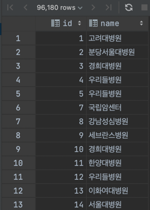
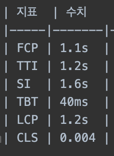
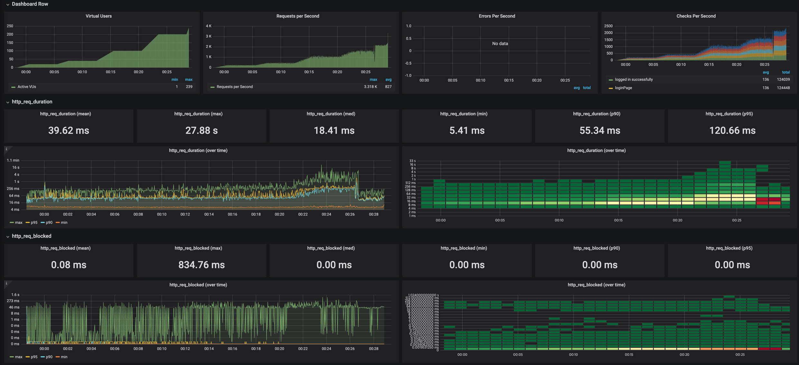
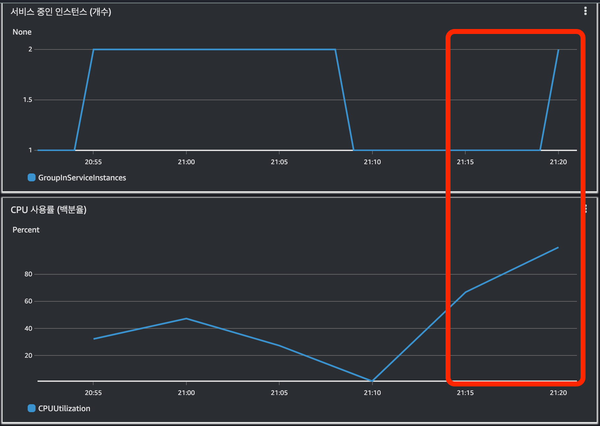
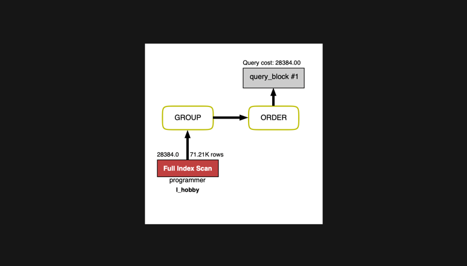

<p align="center">
    
</p>
<p align="center">
  
  
  <a href="https://edu.nextstep.camp/c/R89PYi5H" alt="nextstep atdd">
    
  </a>
  
</p>

<br>

# 인프라공방 샘플 서비스 - 지하철 노선도

<br>

## 🚀 Getting Started

### Install
#### npm 설치
```
cd frontend
npm install
```
> `frontend` 디렉토리에서 수행해야 합니다.

### Usage
#### webpack server 구동
```
npm run dev
```
#### application 구동
```
./gradlew clean build
```
<br>

## 미션

* 미션 진행 후에 아래 질문의 답을 작성하여 PR을 보내주세요.


### 1단계 - 화면 응답 개선하기
1. 성능 개선 결과를 공유해주세요 (Smoke, Load, Stress 테스트 결과)
- 이전 미션 성능테스트 결과 및 전제조건
  - https://github.com/next-step/infra-subway-monitoring/tree/ssamzag
- ### 웹 성능 테스트 
|      | FCP  | TTI  | SI   | TBT  | LCP |CLS|
|------|------|------|------|------|---|---|
| 개선 전 | 3.1s | 3.1s | 3.0s | 3.0s |10ms|0|
| 개선 후 | 1.3s | 1.3s | 1.5s | 1.3s |0ms|0|

- ### k6 테스트 전/후
- Smoke
  - 개선 전
  ```
           /\      |‾‾| /‾‾/   /‾‾/
      /\  /  \     |  |/  /   /  /
     /  \/    \    |     (   /   ‾‾\
    /          \   |  |\  \ |  (‾)  |
   / __________ \  |__| \__\ \_____/ .io
    
   execution: local
      script: smoke.js
      output: -
    
   scenarios: (100.00%) 1 scenario, 1 max VUs, 1m0s max duration (incl. graceful stop):
            * default: 1 looping VUs for 30s (gracefulStop: 30s)
    
    
  running (0m33.1s), 0/1 VUs, 10 complete and 0 interrupted iterations
  default ✓ [======================================] 1 VUs  30s
    
      ✓ Main Page
      ✓ Login Page
      ✓ logged in successfully
      ✓ Path Page
      ✓ Request Path
    
      checks.........................: 100.00% ✓ 50       ✗ 0
      data_received..................: 77 kB   2.3 kB/s
      data_sent......................: 7.4 kB  222 B/s
      http_req_blocked...............: avg=836.44µs min=2µs    med=7µs    max=41.48ms  p(90)=10.1µs   p(95)=11µs
      http_req_connecting............: avg=136.92µs min=0s     med=0s     max=6.84ms   p(90)=0s       p(95)=0s
    ✓ http_req_duration..............: avg=60.16ms  min=7.47ms med=9.6ms  max=473.65ms p(90)=190.13ms p(95)=274.07ms
        { expected_response:true }...: avg=68.42ms  min=7.47ms med=9.29ms max=473.65ms p(90)=193.84ms p(95)=321.54ms
      http_req_failed................: 20.00%  ✓ 10       ✗ 40
      http_req_receiving.............: avg=93.58µs  min=45µs   med=92.5µs max=157µs    p(90)=123.3µs  p(95)=127.65µs
      http_req_sending...............: avg=37.86µs  min=7µs    med=31.5µs max=235µs    p(90)=52.1µs   p(95)=57.94µs
      http_req_tls_handshaking.......: avg=489.22µs min=0s     med=0s     max=24.46ms  p(90)=0s       p(95)=0s
      http_req_waiting...............: avg=60.03ms  min=7.31ms med=9.48ms max=473.49ms p(90)=189.98ms p(95)=273.92ms
      http_reqs......................: 50      1.510712/s
      iteration_duration.............: avg=3.3s     min=3.18s  med=3.25s  max=3.57s    p(90)=3.44s    p(95)=3.5s
      iterations.....................: 10      0.302142/s
      vus............................: 1       min=1      max=1
      vus_max........................: 1       min=1      max=1
  ```
  - 개선 후
  ```
            /\      |‾‾| /‾‾/   /‾‾/
       /\  /  \     |  |/  /   /  /
      /  \/    \    |     (   /   ‾‾\
     /          \   |  |\  \ |  (‾)  |
    / __________ \  |__| \__\ \_____/ .io
    
    execution: local
       script: smoke.js
       output: InfluxDBv1 (http://52.78.136.247:8086)
    
    scenarios: (100.00%) 1 scenario, 1 max VUs, 1m0s max duration (incl. graceful stop):
             * default: 1 looping VUs for 30s (gracefulStop: 30s)
    
    
  running (0m33.7s), 0/1 VUs, 8 complete and 0 interrupted iterations
  default ✓ [======================================] 1 VUs  30s
    
       ✓ mainPage
       ✓ loginPage
       ✓ logged in successfully
       ✓ retrieved member
       ✓ pathPage
       ✓ requestPath
    
       checks.........................: 100.00% ✓ 48       ✗ 0
       data_received..................: 61 kB   1.8 kB/s
       data_sent......................: 4.2 kB  126 B/s
       http_req_blocked...............: avg=1.61ms   min=0s      med=1µs     max=77.52ms p(90)=2µs     p(95)=2µs
       http_req_connecting............: avg=455.93µs min=0s      med=0s      max=21.88ms p(90)=0s      p(95)=0s
     ✓ http_req_duration..............: avg=31.99ms  min=10.63ms med=18.91ms max=325.5ms p(90)=44.97ms p(95)=74.86ms
         { expected_response:true }...: avg=31.99ms  min=10.63ms med=18.91ms max=325.5ms p(90)=44.97ms p(95)=74.86ms
       http_req_failed................: 0.00%   ✓ 0        ✗ 48
       http_req_receiving.............: avg=82.45µs  min=29µs    med=79.5µs  max=135µs   p(90)=104.7µs p(95)=113.3µs
       http_req_sending...............: avg=235.33µs min=42µs    med=258.5µs max=852µs   p(90)=301.7µs p(95)=355.04µs
       http_req_tls_handshaking.......: avg=847.33µs min=0s      med=0s      max=40.67ms p(90)=0s      p(95)=0s
       http_req_waiting...............: avg=31.67ms  min=10.4ms  med=18.57ms max=325.1ms p(90)=44.69ms p(95)=74.67ms
       http_reqs......................: 48      1.426085/s
       iteration_duration.............: avg=4.2s     min=4.11s   med=4.12s   max=4.74s   p(90)=4.33s   p(95)=4.53s
       iterations.....................: 8       0.237681/s
       vus............................: 1       min=1      max=1
       vus_max........................: 1       min=1      max=1
  ```
- Load
  - 개선 전
  ```
            /\      |‾‾| /‾‾/   /‾‾/
       /\  /  \     |  |/  /   /  /
      /  \/    \    |     (   /   ‾‾\
     /          \   |  |\  \ |  (‾)  |
    / __________ \  |__| \__\ \_____/ .io
    
    execution: local
       script: load.js
       output: InfluxDBv1 (http://52.78.136.247:8086)
    
    scenarios: (100.00%) 1 scenario, 12 max VUs, 41m30s max duration (incl. graceful stop):
             * default: Up to 12 looping VUs for 41m0s over 7 stages (gracefulRampDown: 30s, gracefulStop: 30s)
    
    
  running (41m02.9s), 00/12 VUs, 2796 complete and 0 interrupted iterations
  default ✓ [======================================] 00/12 VUs  41m0s
    
       ✓ mainPage
       ✓ loginPage
       ✓ logged in successfully
       ✓ pathPage
       ✓ requestPath
    
       checks.........................: 100.00% ✓ 13980    ✗ 0
       data_received..................: 20 MB   8.3 kB/s
       data_sent......................: 2.0 MB  795 B/s
       http_req_blocked...............: avg=100.59µs min=0s     med=6µs    max=185.8ms  p(90)=9µs      p(95)=10µs
       http_req_connecting............: avg=35.13µs  min=0s     med=0s     max=153.16ms p(90)=0s       p(95)=0s
     ✗ http_req_duration..............: avg=63.57ms  min=6.23ms med=9.91ms max=2.41s    p(90)=134.34ms p(95)=416.69ms
         { expected_response:true }...: avg=74.42ms  min=6.23ms med=9.7ms  max=2.41s    p(90)=187.23ms p(95)=529.65ms
       http_req_failed................: 20.00%  ✓ 2796     ✗ 11184
       http_req_receiving.............: avg=94.8µs   min=9µs    med=88µs   max=5.77ms   p(90)=132µs    p(95)=160µs
       http_req_sending...............: avg=31.33µs  min=2µs    med=28µs   max=1.18ms   p(90)=45µs     p(95)=51µs
       http_req_tls_handshaking.......: avg=48.65µs  min=0s     med=0s     max=176.05ms p(90)=0s       p(95)=0s
       http_req_waiting...............: avg=63.45ms  min=6.15ms med=9.79ms max=2.41s    p(90)=134.2ms  p(95)=416.58ms
       http_reqs......................: 13980   5.676327/s
       iteration_duration.............: avg=3.32s    min=3.09s  med=3.18s  max=5.52s    p(90)=3.67s    p(95)=3.72s
       iterations.....................: 2796    1.135265/s
       vus............................: 1       min=1      max=12
       vus_max........................: 12      min=12     max=12
  ```
- 개선 후
  ```
            /\      |‾‾| /‾‾/   /‾‾/
       /\  /  \     |  |/  /   /  /
      /  \/    \    |     (   /   ‾‾\
     /          \   |  |\  \ |  (‾)  |
    / __________ \  |__| \__\ \_____/ .io
    
    execution: local
       script: load.js
       output: InfluxDBv1 (http://52.78.136.247:8086)
    
    scenarios: (100.00%) 1 scenario, 12 max VUs, 41m30s max duration (incl. graceful stop):
             * default: Up to 12 looping VUs for 41m0s over 7 stages (gracefulRampDown: 30s, gracefulStop: 30s)
    
    
  running (41m03.2s), 00/12 VUs, 2218 complete and 0 interrupted iterations
  default ✓ [======================================] 00/12 VUs  41m0s
    
       ✓ mainPage
       ✓ loginPage
       ✓ logged in successfully
       ✓ retrieved member
       ✓ pathPage
       ✓ requestPath
    
       checks.........................: 100.00% ✓ 13308    ✗ 0
       data_received..................: 16 MB   6.4 kB/s
       data_sent......................: 1.0 MB  417 B/s
       http_req_blocked...............: avg=113.18µs min=0s     med=1µs     max=402.02ms p(90)=2µs     p(95)=2µs
       http_req_connecting............: avg=43.69µs  min=0s     med=0s      max=193.55ms p(90)=0s      p(95)=0s
     ✗ http_req_duration..............: avg=31.02ms  min=6.44ms med=20.46ms max=577.3ms  p(90)=51.1ms  p(95)=60.7ms
         { expected_response:true }...: avg=31.02ms  min=6.44ms med=20.46ms max=577.3ms  p(90)=51.1ms  p(95)=60.7ms
       http_req_failed................: 0.00%   ✓ 0        ✗ 13308
       http_req_receiving.............: avg=74.49µs  min=10µs   med=63µs    max=7.36ms   p(90)=99µs    p(95)=112µs
       http_req_sending...............: avg=192.07µs min=23µs   med=158µs   max=6.32ms   p(90)=304µs   p(95)=360µs
       http_req_tls_handshaking.......: avg=59.21µs  min=0s     med=0s      max=351.1ms  p(90)=0s      p(95)=0s
       http_req_waiting...............: avg=30.75ms  min=2.91ms med=20.23ms max=577.17ms p(90)=50.77ms p(95)=60.32ms
       http_reqs......................: 13308   5.402782/s
       iteration_duration.............: avg=4.19s    min=4.06s  med=4.19s   max=4.95s    p(90)=4.25s   p(95)=4.39s
       iterations.....................: 2218    0.900464/s
       vus............................: 1       min=1      max=12
       vus_max........................: 12      min=12     max=12
  ```

- Stress
  - 개선 전
  ```
  running (38m14.2s), 000/500 VUs, 767394 complete and 0 interrupted iterations
  default ✓ [======================================] 000/500 VUs  38m0s
    
       ✗ mainPage
        ↳  4% — ✓ 31228 / ✗ 736166
       ✗ loginPage
        ↳  4% — ✓ 31390 / ✗ 736004
       ✗ logged in successfully
        ↳  4% — ✓ 31498 / ✗ 735896
       ✓ retrieved member
       ✗ pathPage
        ↳  99% — ✓ 31253 / ✗ 225
       ✗ requestPath
        ↳  99% — ✓ 31203 / ✗ 275
    
       checks.........................: 7.84%   ✓ 188050      ✗ 2208566
       data_received..................: 250 MB  109 kB/s
       data_sent......................: 33 MB   14 kB/s
       http_req_blocked...............: avg=71.44µs  min=0s      med=0s       max=1.9s    p(90)=0s      p(95)=3µs
       http_req_connecting............: avg=18.88µs  min=0s      med=0s       max=1.21s   p(90)=0s      p(95)=0s
     ✗ http_req_duration..............: avg=98.89ms  min=0s      med=0s       max=40.94s  p(90)=0s      p(95)=18.06ms
         { expected_response:true }...: avg=1.26s    min=5.18ms  med=58.11ms  max=40.94s  p(90)=4.55s   p(95)=6.3s
       http_req_failed................: 92.15%  ✓ 2208586     ✗ 188050
       http_req_receiving.............: avg=5.16µs   min=0s      med=0s       max=26.31ms p(90)=0s      p(95)=41µs
       http_req_sending...............: avg=29.28µs  min=0s      med=0s       max=30.07s  p(90)=0s      p(95)=14µs
       http_req_tls_handshaking.......: avg=40.72µs  min=0s      med=0s       max=1.89s   p(90)=0s      p(95)=0s
       http_req_waiting...............: avg=98.86ms  min=0s      med=0s       max=30.05s  p(90)=0s      p(95)=17.86ms
       http_reqs......................: 2396636 1044.636222/s
       iteration_duration.............: avg=446.55ms min=95.95µs med=103.59ms max=51.83s  p(90)=185.1ms p(95)=228.43ms
       iterations.....................: 767394  334.488662/s
       vus............................: 13      min=1         max=500
       vus_max........................: 500     min=500       max=500
  ```
  - 개선 후
  ```
  ✗ mainPage
  ↳  9% — ✓ 217151 / ✗ 2053276
  ✗ loginPage
  ↳  9% — ✓ 217283 / ✗ 2053144
  ✗ logged in successfully
  ↳  9% — ✓ 217318 / ✗ 2053109
  ✓ retrieved member
  ✗ pathPage
  ↳  99% — ✓ 217114 / ✗ 203
  ✗ requestPath
  ↳  99% — ✓ 217060 / ✗ 257
  
  checks.........................: 17.46%  ✓ 1303243    ✗ 6159989
  data_received..................: 1.5 GB  675 kB/s
  data_sent......................: 100 MB  44 kB/s
  http_req_blocked...............: avg=10.74µs  min=0s      med=0s      max=834.75ms p(90)=0s       p(95)=1µs
  http_req_connecting............: avg=2.72µs   min=0s      med=0s      max=197.46ms p(90)=0s       p(95)=0s
  ✓ http_req_duration..............: avg=6.88ms   min=0s      med=0s      max=27.87s   p(90)=21.74ms  p(95)=37ms
  { expected_response:true }...: avg=39.4ms   min=5.41ms  med=25ms    max=27.87s   p(90)=58.55ms  p(95)=88.15ms
  http_req_failed................: 82.53%  ✓ 6159990    ✗ 1303243
  http_req_receiving.............: avg=41.27µs  min=0s      med=0s      max=4.74s    p(90)=28µs     p(95)=51µs
  http_req_sending...............: avg=13.89µs  min=0s      med=0s      max=32.71ms  p(90)=45µs     p(95)=78µs
  http_req_tls_handshaking.......: avg=7.87µs   min=0s      med=0s      max=824.97ms p(90)=0s       p(95)=0s
  http_req_waiting...............: avg=6.82ms   min=0s      med=0s      max=27.87s   p(90)=21.53ms  p(95)=36.77ms
  http_reqs......................: 7463233 3271.74627/s
  iteration_duration.............: avg=150.48ms min=86.29µs med=35.25ms max=29.39s   p(90)=158.81ms p(95)=1.18s
  iterations.....................: 2270427 995.314104/s
  vus............................: 37      min=1        max=500
  vus_max........................: 500     min=500      max=500
  ```
- ### 그라파나 대시보드
- Smoke

- Load

- Stress


2. 어떤 부분을 개선해보셨나요? 과정을 설명해주세요
- nginx 프록시 개선
  - gzip 설정
  - cache 설정
  - http/2 적용
- was 서버 redis cache 적용
---

### 2단계 - 스케일 아웃

1. Launch Template 링크를 공유해주세요.

   https://ap-northeast-2.console.aws.amazon.com/ec2/v2/home?region=ap-northeast-2#LaunchTemplateDetails:launchTemplateId=lt-0462747c8a6281a8f

2. cpu 부하 실행 후 EC2 추가생성 결과를 공유해주세요. (Cloudwatch 캡쳐)
   
   
```sh
$ stress -c 2
```

3. 성능 개선 결과를 공유해주세요 (Smoke, Load, Stress 테스트 결과)
- Smoke
``` K6
          /\      |‾‾| /‾‾/   /‾‾/
     /\  /  \     |  |/  /   /  /
    /  \/    \    |     (   /   ‾‾\
   /          \   |  |\  \ |  (‾)  |
  / __________ \  |__| \__\ \_____/ .io

  execution: local
     script: smoke.js
     output: InfluxDBv1 (http://52.78.136.247:8086)

  scenarios: (100.00%) 1 scenario, 1 max VUs, 1m0s max duration (incl. graceful stop):
           * default: 1 looping VUs for 30s (gracefulStop: 30s)


running (0m31.1s), 0/1 VUs, 7 complete and 0 interrupted iterations
default ✓ [======================================] 1 VUs  30s

     ✓ mainPage
     ✓ loginPage
     ✓ logged in successfully
     ✓ retrieved member
     ✓ pathPage
     ✓ requestPath

     checks.........................: 100.00% ✓ 42       ✗ 0
     data_received..................: 54 kB   1.7 kB/s
     data_sent......................: 3.8 kB  123 B/s
     http_req_blocked...............: avg=2.7ms    min=0s      med=1µs      max=113.42ms p(90)=2µs     p(95)=2µs
     http_req_connecting............: avg=476.78µs min=0s      med=0s       max=20.02ms  p(90)=0s      p(95)=0s
   ✓ http_req_duration..............: avg=69.22ms  min=12.56ms med=22.53ms  max=1.44s    p(90)=41.06ms p(95)=138.83ms
       { expected_response:true }...: avg=69.22ms  min=12.56ms med=22.53ms  max=1.44s    p(90)=41.06ms p(95)=138.83ms
     http_req_failed................: 0.00%   ✓ 0        ✗ 42
     http_req_receiving.............: avg=255.78µs min=44µs    med=88µs     max=3.22ms   p(90)=272.2µs p(95)=1.26ms
     http_req_sending...............: avg=240.19µs min=79µs    med=231.99µs max=614µs    p(90)=386.1µs p(95)=407.15µs
     http_req_tls_handshaking.......: avg=1.24ms   min=0s      med=0s       max=52.08ms  p(90)=0s      p(95)=0s
     http_req_waiting...............: avg=68.72ms  min=12.41ms med=21.65ms  max=1.44s    p(90)=40.52ms p(95)=138.38ms
     http_reqs......................: 42      1.35218/s
     iteration_duration.............: avg=4.43s    min=4.12s   med=4.16s    max=6.17s    p(90)=4.97s   p(95)=5.57s
     iterations.....................: 7       0.225363/s
     vus............................: 1       min=1      max=1
     vus_max........................: 1       min=1      max=1
```

- Load
```
running (58m13.8s), 00/12 VUs, 2263 complete and 0 interrupted iterations
default ✓ [======================================] 00/12 VUs  41m0s

     ✗ mainPage
      ↳  99% — ✓ 2259 / ✗ 4
     ✓ loginPage
     ✗ logged in successfully
      ↳  99% — ✓ 2262 / ✗ 1
     ✓ retrieved member
     ✗ pathPage
      ↳  99% — ✓ 2257 / ✗ 5
     ✗ requestPath
      ↳  99% — ✓ 2260 / ✗ 2

     checks.........................: 99.91% ✓ 13563    ✗ 12
     data_received..................: 16 MB  4.5 kB/s
     data_sent......................: 1.1 MB 301 B/s
     http_req_blocked...............: avg=109.79µs min=0s     med=1µs     max=152.69ms p(90)=2µs     p(95)=2µs
     http_req_connecting............: avg=15.35µs  min=0s     med=0s      max=14.65ms  p(90)=0s      p(95)=0s
   ✓ http_req_duration..............: avg=16.33ms  min=7.02ms med=13.87ms max=412.27ms p(90)=22.27ms p(95)=26.08ms
       { expected_response:true }...: avg=15.99ms  min=7.02ms med=13.86ms max=345.54ms p(90)=22.22ms p(95)=25.96ms
     http_req_failed................: 0.08%  ✓ 12       ✗ 13563
     http_req_receiving.............: avg=124.73µs min=0s     med=76µs    max=22.67ms  p(90)=113µs   p(95)=137µs
     http_req_sending...............: avg=208.74µs min=13µs   med=177µs   max=5.8ms    p(90)=331µs   p(95)=381.29µs
     http_req_tls_handshaking.......: avg=76.53µs  min=0s     med=0s      max=100.77ms p(90)=0s      p(95)=0s
     http_req_waiting...............: avg=16ms     min=6.82ms med=13.52ms max=412.25ms p(90)=21.87ms p(95)=25.54ms
     http_reqs......................: 13575  3.885495/s
     iteration_duration.............: avg=4.1s     min=1.57s  med=4.09s   max=5.57s    p(90)=4.12s   p(95)=4.14s
     iterations.....................: 2263   0.647726/s
     vus............................: 1      min=1      max=12
     vus_max........................: 12     min=12     max=12
```

- Stress
```
     ✗ mainPage
      ↳  9% — ✓ 246939 / ✗ 2462131
     ✗ loginPage
      ↳  9% — ✓ 246945 / ✗ 2462125
     ✗ logged in successfully
      ↳  9% — ✓ 246952 / ✗ 2462118
     ✓ retrieved member
     ✗ pathPage
      ↳  99% — ✓ 246928 / ✗ 24
     ✗ requestPath
      ↳  99% — ✓ 246928 / ✗ 24

     checks.........................: 16.70%  ✓ 1481644     ✗ 7386422
     data_received..................: 1.7 GB  757 kB/s
     data_sent......................: 113 MB  50 kB/s
     http_req_blocked...............: avg=1.29µs   min=0s     med=0s      max=321.91ms p(90)=0s      p(95)=1µs
     http_req_connecting............: avg=282ns    min=0s     med=0s      max=35.68ms  p(90)=0s      p(95)=0s
   ✓ http_req_duration..............: avg=2.43ms   min=0s     med=0s      max=6.86s    p(90)=11.59ms p(95)=15.22ms
       { expected_response:true }...: avg=14.59ms  min=5.53ms med=12.58ms max=6.86s    p(90)=19.33ms p(95)=22.52ms
     http_req_failed................: 83.29%  ✓ 7386422     ✗ 1481644
     http_req_receiving.............: avg=29.28µs  min=0s     med=0s      max=4.5s     p(90)=29µs    p(95)=51µs
     http_req_sending...............: avg=12.12µs  min=0s     med=0s      max=38.51ms  p(90)=43µs    p(95)=77µs
     http_req_tls_handshaking.......: avg=892ns    min=0s     med=0s      max=312.93ms p(90)=0s      p(95)=0s
     http_req_waiting...............: avg=2.39ms   min=0s     med=0s      max=6.86s    p(90)=11.41ms p(95)=14.99ms
     http_reqs......................: 8868066 3887.831865/s
     iteration_duration.............: avg=126.19ms min=85.7µs med=31.86ms max=8.01s    p(90)=120.2ms p(95)=1.07s
     iterations.....................: 2709070 1187.678201/s
     vus............................: 32      min=1         max=500
     vus_max........................: 500     min=500       max=500
```

---
### 3단계 - 쿼리 최적화

1. 인덱스 설정을 추가하지 않고 아래 요구사항에 대해 1s 이하(M1의 경우 2s)로 반환하도록 쿼리를 작성하세요.

- 활동중인(Active) 부서의 현재 부서관리자 중 연봉 상위 5위안에 드는 사람들이 최근에 각 지역별로 언제 퇴실했는지 조회해보세요. (사원번호, 이름, 연봉, 직급명, 지역, 입출입구분, 입출입시간)

  ```sql
  SELECT employee.id            AS 사원번호,
         employee.last_name     AS 이름,
         salary.annual_income   AS 연봉,
         position.position_name AS 직급명,
         record.time            AS 입출입시간,
         record.region          AS 지역,
         record.record_symbol   AS 입출입구분
  FROM   (
          SELECT salary.id, salary.annual_income
            FROM (SELECT id, annual_income FROM tuning.salary WHERE end_date = '9999-01-01') AS salary
      INNER JOIN (SELECT employee_id FROM tuning.manager WHERE end_date = '9999-01-01') AS manager 
              ON salary.id = manager.employee_id
        ORDER BY salary.annual_income DESC
           LIMIT 5
         ) salary
  INNER JOIN (SELECT id, last_name FROM tuning.employee) AS employee 
          ON salary.id = employee.id
  INNER JOIN (SELECT employee_id, department_id FROM tuning.employee_department WHERE end_date = '9999-01-01') AS department
          ON department.employee_id = employee.id
  INNER JOIN (SELECT id, position_name FROM tuning.position WHERE end_date = '9999-01-01') AS position
          ON position.id = employee.id
  INNER JOIN (SELECT employee_id, time, region, record_symbol FROM tuning.record WHERE record_symbol = 'O' AND region <> '') AS record
          ON record.employee_id = department.employee_id
    ORDER BY salary.annual_income DESC, record.record_symbol ASC; 
  ```
---
### 3단계 - 인덱스 설계
1. 인덱스 적용해보기 실습을 진행해본 과정을 공유해주세요

---
### 추가 미션
1. 인덱스 적용해보기 실습을 진행해본 과정을 공유해주세요
