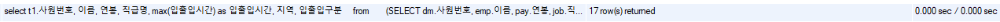
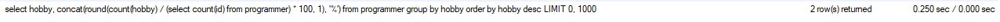
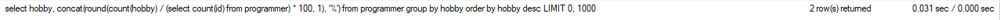
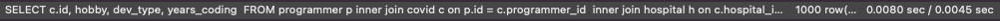
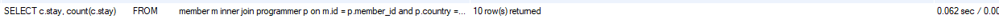
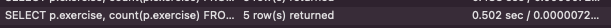

<p align="center">
    
</p>
<p align="center">
  
  
  <a href="https://edu.nextstep.camp/c/R89PYi5H" alt="nextstep atdd">
    
  </a>
  
</p>

<br>

# 인프라공방 샘플 서비스 - 지하철 노선도

<br>

## 🚀 Getting Started

### Install
#### npm 설치
```
cd frontend
npm install
```
> `frontend` 디렉토리에서 수행해야 합니다.

### Usage
#### webpack server 구동
```
npm run dev
```
#### application 구동
```
./gradlew clean build
```
<br>

## 미션

* 미션 진행 후에 아래 질문의 답을 작성하여 PR을 보내주세요.

### 1단계 - 화면 응답 개선하기
1. 성능 개선 결과를 공유해주세요 (Smoke, Load, Stress 테스트 결과)
   - Load : [main](/k6/main/load_main_result.md), [line-update](/k6/line-update/load_update_result.md), [paths](/k6/path/load_path_result.md)
   - Smoke : [main](/k6/main/smoke_main_result.md), [line-update](/k6/line-update/smoke_update_result.md), [paths](/k6/path/smoke_path_result.md)
   - Stress : [main](/k6/main/stress_main_result.md), [line-update](/k6/line-update/stress_update_result.md), [paths](/k6/path/stress_path_result.md)
2. 어떤 부분을 개선해보셨나요? 과정을 설명해주세요
- 
- 
- 페이지에 대한 성능은 별로 차이가 없음을 볼 수 있습니다..
- k6로 다시 테스트 했을 때 paths 조회에서 http_req_duration이 4~5배 가량 좋아진 것을 볼 수 있습니다.
- [paths stress test](/k6/path/stress_path_result.md), [paths load test](/k6/path/load_path_result.md)
---

### 2단계 - 조회 성능 개선하기
1. 인덱스 적용해보기 실습을 진행해본 과정을 공유해주세요

2. 페이징 쿼리를 적용한 API endpoint를 알려주세요

- 쿼리 최적화
   - [X] 활동중인(Active) 부서의 현재 부서관리자 중 연봉 상위 5위안에 드는 사람들이 최근에 각 지역별로 언제 퇴실했는지 조회해보세요.
     (사원번호, 이름, 연봉, 직급명, 지역, 입출입구분, 입출입시간)
   1. 쿼리 작성만으로 1s 이하로 반환한다.
    ```
    select t1.사원번호, 이름, 연봉, 직급명, max(입출입시간) as 입출입시간, 지역, 입출입구분
    from
      (SELECT dm.사원번호, emp.이름, pay.연봉, job.직급명
      FROM 부서관리자 dm inner join 직급 job on dm.사원번호 = job.사원번호 AND dm.종료일자 > now() AND job.직급명 = 'Manager'
      inner join 부서 dept on dm.부서번호 = dept.부서번호 AND upper(dept.비고) = 'ACTIVE'
      inner join 급여 pay on dm.사원번호 = pay.사원번호 AND pay.종료일자 > now()
      inner join 사원 emp on dm.사원번호 = emp.사원번호
      order by pay.연봉 desc
      limit 5) t1
      inner join 사원출입기록 io on t1.사원번호 = io.사원번호 AND io.입출입구분 = 'O'
    group by t1.사원번호, 이름, 연봉, 직급명, 입출입시간, 지역, 입출입구분
    order by t1.연봉 desc, 지역;
    ```
   - 조회 시간 : *0.356 sec*
   2. 인덱스 설정을 추가하여 50 ms 이하로 반환한다.
   - `create index I_입출입구분 on 사원출입기록 (입출입구분);` 인덱스 추가
   - `create index I_사원출입기록_사원번호 on 사원출입기록 (사원번호);` 인덱스 추가
   - 조회 시간 : *0.000 sec*

- 인덱스 설계
   - 주어진 데이터셋을 활용하여 아래 조회 결과를 100ms 이하로 반환
  - [X] Coding as a Hobby 와 같은 결과를 반환하세요.
    - 개선 전 : 0.250 sec
      
    - 인덱스 추가 후 : 0.031 sec 
      
    ```sql
      select hobby, concat(round(count(hobby) / (select count(id) from programmer) * 100, 1), '%')
        from programmer
        group by hobby
        order by hobby desc;
    ```
     - 인덱스 추가
    ```sql
      alter table programmer add constraint pk_programmer_id primary key(id);
      create index I_programmer_hobby on programmer (hobby);
    ```
  - [X] 프로그래머별로 해당하는 병원 이름을 반환하세요. (covid.id, hospital.name)
     - 개선 전 : 0.731 sec
       
     - 인덱스 추가 후 : 0.0053 sec
       
    ```sql
      select c.id, h.name
      from programmer p inner join covid c on p.id = c.programmer_id
        inner join hospital h on c.hospital_id = h.id
    ```
     - 인덱스 추가
    ```sql
      alter table covid add constraint pk_covid_id primary key(id);
      alter table programmer add constraint pk_programmer_id primary key(id);
      alter table hospital add constraint pk_hospital_id primary key(id);
    ```
  - [X] 프로그래밍이 취미인 학생 혹은 주니어(0-2년)들이 다닌 병원 이름을 반환하고 user.id 기준으로 정렬하세요. (covid.id, hospital.name, user.Hobby, user.DevType, user.YearsCoding)
     - 개선 전 : 2.852 sec
       
     - 인덱스 추가 후 : 0.0080 sec
       
    ```sql
      SELECT c.id, hobby, dev_type, years_coding 
      FROM programmer p inner join covid c on p.id = c.programmer_id
        inner join hospital h on c.hospital_id = h.id
      where (upper(hobby) = 'YES' and upper(p.student) like 'YES%') or years_coding = '0-2 years'
      order by p.id;
    ```
     - 인덱스 추가
    ```sql
      create index I_programmer_hobby on programmer (hobby);
      create index I_programmer_years_coding on programmer (years_coding);
      create index I_covid_programmer_id on covid (programmer_id);
      create index i_programmer_student on programmer (student);
    ```
  - [X] 서울대병원에 다닌 20대 India 환자들을 병원에 머문 기간별로 집계하세요. (covid.Stay)
     - 개선 전 : 0.760 sec
       
     - 인덱스 추가 후 : 0.062 sec
       
    ```sql
      SELECT c.stay, count(c.stay)
      FROM
        member m inner join programmer p on m.id = p.member_id and p.country = 'India' and m.age > 19 and m.age < 30
        inner join covid c on c.programmer_id = p.id
        inner join hospital h on h.id = c.hospital_id and h.name = '서울대병원'
      group by c.stay;
    ```
     - 인덱스 추가
    ```sql
      create index i_hospital_name on hospital (name);
      create index i_programmer_country on programmer (country);
      create index i_programmer_member_id on programmer (member_id);
      create index i_member_age on member (age);
      create index i_covid_stay on covid (stay);
      create index i_covid_hospital_id on covid (hospital_id);
    ```
  - [X] 서울대병원에 다닌 30대 환자들을 운동 횟수별로 집계하세요. (user.Exercise)
     - 개선 전 : 0.502 sec <br>
       
     - 인덱스 추가 후 : 0.106 sec <br/>
       

    ```sql
      SELECT p.exercise, count(p.exercise)
      FROM
        member m inner join programmer p on m.id = p.member_id
        inner join covid c on c.programmer_id = p.id
        inner join hospital h on h.id = c.hospital_id
      where h.name = '서울대병원' and m.age >= 30 and m.age <= 39
      group by p.exercise;
    ```
     - 인덱스 추가
    ```sql
      create index i_programmer_exercise on programmer (exercise);
    ```
- [X] 페이징 쿼리 적용해보기
- http://keepbang-alb-975163363.ap-northeast-2.elb.amazonaws.com/stations
