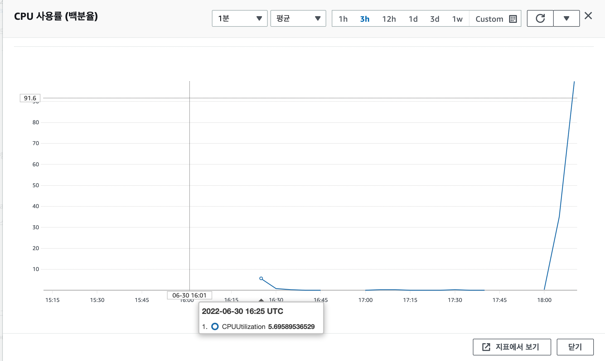
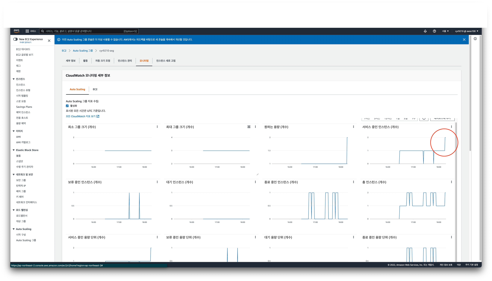
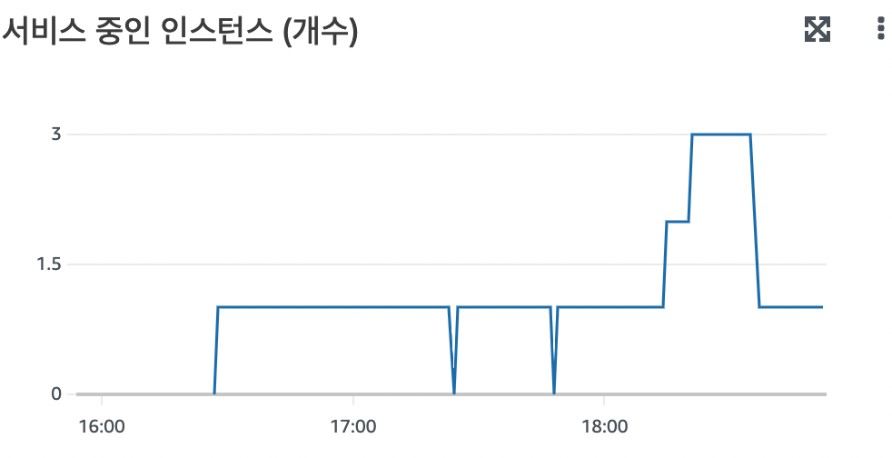

<p align="center">
    
</p>
<p align="center">
  
  
  <a href="https://edu.nextstep.camp/c/R89PYi5H" alt="nextstep atdd">
    
  </a>
  
</p>

<br>

# 인프라공방 샘플 서비스 - 지하철 노선도

<br>

## 🚀 Getting Started

### Install
#### npm 설치
```
cd frontend
npm install
```
> `frontend` 디렉토리에서 수행해야 합니다.

### Usage
#### webpack server 구동
```
npm run dev
```
#### application 구동
```
./gradlew clean build
```
<br>

## 미션

* 미션 진행 후에 아래 질문의 답을 작성하여 PR을 보내주세요.


### 1단계 - 화면 응답 개선하기
1. 성능 개선 결과를 공유해주세요 (Smoke, Load, Stress 테스트 결과)
   - 개선전
     - [smoke](docs/step1/before/smoke_result.txt)
     - [load](docs/step1/before/load_result.txt)
     - [stress](docs/step1/before/stress_result.txt)
       - 실패
   - 개선후
     - [smoke](docs/step1/after/smoke_result.txt)
     - [load](docs/step1/after/load_result.txt)
     - [stress](docs/step1/after/stress_result.txt)

2. 어떤 부분을 개선해보셨나요? 과정을 설명해주세요
   - nginx-gzip 압축 설정 추가
   - nginx cache 사용
   - http2 설정
   - application cache

---

### 2단계 - 스케일 아웃

1. Launch Template 링크를 공유해주세요.
    - https://ap-northeast-2.console.aws.amazon.com/ec2/v2/home?region=ap-northeast-2#LaunchTemplateDetails:launchTemplateId=lt-0140434017d0691da
2. cpu 부하 실행 후 EC2 추가생성 결과를 공유해주세요. (Cloudwatch 캡쳐)
   
   

```sh
$ stress -c 2
```

3. 성능 개선 결과를 공유해주세요 (Smoke, Load, Stress 테스트 결과)
    - [smoke](./docs/step2/test_result/smoke_result.txt)
    - [load](./docs/step2/test_result/load_result.txt)
    - [stress](./docs/step2/test_result/stress_result.txt)
      - 기존 테스트 보다 부하 2배치 상승시켜 진행
      - 3~4배 상승 시, 스트레스 테스트 실패
        - 인스턴스 수를 3대로 제한하여 3개의 인스턴 스케일 아웃까지 확인해볼 수 있었음.  
          


---
### 1단계 - 쿼리 최적화

1. 인덱스 설정을 추가하지 않고 아래 요구사항에 대해 1s 이하(M1의 경우 2s)로 반환하도록 쿼리를 작성하세요.

- 활동중인(Active) 부서의 현재 부서관리자 중 연봉 상위 5위안에 드는 사람들이 최근에 각 지역별로 언제 퇴실했는지 조회해보세요. (사원번호, 이름, 연봉, 직급명, 지역, 입출입구분, 입출입시간)

```sql
select r.employee_id as "사원번호",
       filter.name as "이름",
       filter.income as "연봉",
       filter.position as "직급명",
       r.region as "지역",
       r.record_symbol as "입출입구분",
       r.time as "입출입시간"
       from record r
inner join (
    select m.employee_id as id,
           e.last_name as name,
           s.annual_income as income,
           p.position_name as position from manager m
    inner join employee e on m.employee_id = e.id and m.end_date > sysdate()
    inner join department d on m.department_id = d.id and d.note = 'active'
    inner join position p on m.employee_id = p.id and position_name = 'Manager'
    inner join salary s on m.employee_id = s.id and s.end_date > sysdate()
    order by s.annual_income desc
    limit 5
    ) filter
on filter.id = r.employee_id
where r.record_symbol = 'O';
```
result   

|사원번호|이름|연봉|직급명|지역|입출입구분|입출입시간|
|---|---|---|---|---|---|---|
| 110039 | Vishwani | 106491 | Manager | a | O | 2020-09-05 20:30:07 |
| 110039 | Vishwani | 106491 | Manager | b | O | 2020-08-05 21:01:50 |
| 110039 | Vishwani | 106491 | Manager | d | O | 2020-07-06 11:00:25 |
| 111133 | Hauke | 101987 | Manager | a | O | 2020-01-24 02:59:37 |
| 111133 | Hauke | 101987 | Manager | b | O | 2020-05-07 16:30:37 |
| 110114 | Isamu | 83457 | Manager | a | O | 2020-05-29 19:38:12 |
| 110114 | Isamu | 83457 | Manager | b | O | 2020-09-03 01:33:01 |
| 110114 | Isamu | 83457 | Manager | c | O | 2020-11-12 02:29:00 |
| 110114 | Isamu | 83457 | Manager | d | O | 2020-04-25 08:28:54 |
| 110567 | Leon | 74510 | Manager | a | O | 2020-10-17 19:13:31 |
| 110567 | Leon | 74510 | Manager | b | O | 2020-02-03 10:51:15 |
| 110228 | Karsten | 65400 | Manager | a | O | 2020-07-13 11:42:49 |
| 110228 | Karsten | 65400 | Manager | b | O | 2020-09-23 06:07:01 |
| 110228 | Karsten | 65400 | Manager | d | O | 2020-01-11 22:29:04 |

```
[2022-07-02 17:32:52] 14 rows retrieved starting from 1 in 266 ms (execution: 249 ms, fetching: 17 ms)
```

---

### 2단계 - 인덱스 설계

1. 인덱스 적용해보기 실습을 진행해본 과정을 공유해주세요
- Coding as a Hobby 와 같은 결과를 반환하세요.
```mysql
## 1
alter table programmer
    add primary key (id);

create index idx_hobby
    on programmer (hobby);

select hobby, round(count(*) * 100.0 / (select count(*) from programmer), 1)
from programmer
group by hobby
order by hobby desc;
```

- 프로그래머별로 해당하는 병원 이름을 반환하세요. (covid.id, hospital.name)
```mysql
alter table covid
    add primary key (id);

alter table hospital
    add primary key (id);

create index idx_programmerId_hospitalId
    on covid (programmer_id, hospital_id);

select c.id, h.name
from covid c
         inner join programmer p on c.programmer_id = p.id
         inner join hospital h on c.hospital_id = h.id;
```

- 프로그래밍이 취미인 학생 혹은 주니어(0-2년)들이 다닌 병원 이름을 반환하고 user.id 기준으로 정렬하세요. (covid.id, hospital.name, user.Hobby, user.DevType, user.YearsCoding)
```mysql
select c.id, h.name, p.hobby, p.dev_type, p.years_coding
from covid c
         inner join hospital h on c.hospital_id = h.id
         inner join programmer p on c.programmer_id = p.id
         inner join member m on c.member_id = m.id
where (p.hobby = 'Yes' and p.student like 'Yes%')
   or p.years_coding = '0-2 years'
order by p.id;
```

- 서울대병원에 다닌 20대 India 환자들을 병원에 머문 기간별로 집계하세요. (covid.Stay)
```mysql
alter table member
    add primary key (id);

create index idx_name
    on hospital(name);

create index idx_hospitalId_memberId
    on covid (hospital_id, member_id);

select c.stay, count(*)
from programmer p
         inner join covid c on c.programmer_id = p.id
         inner join member m on c.member_id = m.id
         inner join hospital h on c.hospital_id = h.id
where h.name = '서울대병원'
  and p.country = 'India'
  and m.age BETWEEN 20 and 29
group by c.stay;
```

- 서울대병원에 다닌 30대 환자들을 운동 횟수별로 집계하세요. (user.Exercise)
```mysql
select p.exercise, count(p.exercise)
from programmer p
         inner join covid c on p.id = c.programmer_id
         inner join hospital h on c.hospital_id = h.id
         inner join member m on c.member_id = m.id
where m.age between 30 and 39
  and h.name = '서울대병원'
group by p.exercise
```


---

### 추가 미션

1. 페이징 쿼리를 적용한 API endpoint를 알려주세요
