<p align="center">
    
</p>
<p align="center">
  
  
  <a href="https://edu.nextstep.camp/c/R89PYi5H" alt="nextstep atdd">
    
  </a>
  
</p>

<br>

# 인프라공방 샘플 서비스 - 지하철 노선도

<br>

## 🚀 Getting Started

### Install
#### npm 설치
```
cd frontend
npm install
```
> `frontend` 디렉토리에서 수행해야 합니다.

### Usage
#### webpack server 구동
```
npm run dev
```
#### application 구동
```
./gradlew clean build
```
<br>

## 미션

* 미션 진행 후에 아래 질문의 답을 작성하여 PR을 보내주세요.


### 1단계 - 화면 응답 개선하기
1. 성능 개선 결과를 공유해주세요 (Smoke, Load, Stress 테스트 결과)
   - http_req_duration(avg) 기준
     - smoke : 21.42ms -> 4.21ms
     - load : 67.16ms -> 7.27ms
     - stess : 914.32ms -> 612.21ms

<details>
<summary>smoke.js</summary>

- smoke.js 실행 이전 결과
```text

          /\      |‾‾| /‾‾/   /‾‾/
     /\  /  \     |  |/  /   /  /
    /  \/    \    |     (   /   ‾‾\
   /          \   |  |\  \ |  (‾)  |
  / __________ \  |__| \__\ \_____/ .io

  execution: local
     script: smoke.js
     output: InfluxDBv1 (http://localhost:8086)

  scenarios: (100.00%) 1 scenario, 1 max VUs, 1m30s max duration (incl. graceful stop):
           * default: 1 looping VUs for 1m0s (gracefulStop: 30s)


running (1m00.1s), 0/1 VUs, 502 complete and 0 interrupted iterations
default ✓ [======================================] 1 VUs  06m30.9s/29m10.0s

     ✓ [Result] Main Page
     ✓ [Result] Login Page
     ✓ [Result] Login
     ✓ [Result] me
     ✓ [Result] Path Page
     ✓ [Result] Search Path

     checks.........................: 100.00% ✓ 3012     ✗ 0
     data_received..................: 3.7 MB  62 kB/s
     data_sent......................: 624 kB  10 kB/s
     http_req_blocked...............: avg=11.98µs  min=1.18µs   med=2.32µs   max=13.82ms  p(90)=3.48µs   p(95)=4.25µs
     http_req_connecting............: avg=951ns    min=0s       med=0s       max=938.6µs  p(90)=0s       p(95)=0s
   ✓ http_req_duration..............: avg=21.42ms  min=887.92µs med=4.03ms   max=534.68ms p(90)=85.41ms  p(95)=104.58ms
       { expected_response:true }...: avg=21.42ms  min=887.92µs med=4.03ms   max=534.68ms p(90)=85.41ms  p(95)=104.58ms
     http_req_failed................: 0.00%   ✓ 0        ✗ 3012
     http_req_receiving.............: avg=63.87µs  min=22.04µs  med=54.16µs  max=4.35ms   p(90)=88.51µs  p(95)=102.86µs
     http_req_sending...............: avg=17.35µs  min=6.2µs    med=12.73µs  max=813.69µs p(90)=25.13µs  p(95)=30.07µs
     http_req_tls_handshaking.......: avg=7.7µs    min=0s       med=0s       max=12.71ms  p(90)=0s       p(95)=0s
     http_req_waiting...............: avg=19.7ms   min=846.43µs med=3.95ms   max=534.58ms p(90)=85.28ms  p(95)=104.49ms
     http_reqs......................: 3012    50.13412/s
     iteration_duration.............: avg=119.66ms min=67.59ms  med=113.65ms max=576.87ms p(90)=156.07ms p(95)=176.29ms
     iterations.....................: 502     8.355687/s
     vus............................: 1       min=1      max=1
     vus_max........................: 1       min=1      max=1
```


- smoke.js 실행 이후 결과
```text

          /\      |‾‾| /‾‾/   /‾‾/
     /\  /  \     |  |/  /   /  /
    /  \/    \    |     (   /   ‾‾\
   /          \   |  |\  \ |  (‾)  |
  / __________ \  |__| \__\ \_____/ .io

  execution: local
     script: smoke.js
     output: InfluxDBv1 (http://localhost:8086)

  scenarios: (100.00%) 1 scenario, 1 max VUs, 1m30s max duration (incl. graceful stop):
           * default: 1 looping VUs for 1m0s (gracefulStop: 30s)

running (1m00.1s), 0/1 VUs, 502 complete and 0 interrupted iterations
default ✓ [======================================] 1 VUs  1m0s

     ✓ [Result] Main Page
     ✓ [Result] Login Page
     ✓ [Result] Login
     ✓ [Result] me
     ✓ [Result] Path Page
     ✓ [Result] Search Path

     checks.........................: 100.00% ✓ 236806     ✗ 0
     data_received..................: 209 MB  534 kB/s
     data_sent......................: 14 MB   37 kB/s
     http_req_blocked...............: avg=6.45µs  min=151ns    med=286ns   max=65.29ms  p(90)=413ns   p(95)=464ns
     http_req_connecting............: avg=1.01µs  min=0s       med=0s      max=27.48ms  p(90)=0s      p(95)=0s
   ✓ http_req_duration..............: avg=4.21ms  min=669.93µs med=1.96ms  max=93.05ms  p(90)=8.82ms  p(95)=11.17ms
       { expected_response:true }...: avg=4.21ms  min=669.93µs med=1.96ms  max=93.05ms  p(90)=8.82ms  p(95)=11.17ms
     http_req_failed................: 0.00%   ✓ 0          ✗ 236806
     http_req_receiving.............: avg=45.48µs min=10.67µs  med=26.9µs  max=47.46ms  p(90)=47.78µs p(95)=62.5µs
     http_req_sending...............: avg=31.97µs min=9.47µs   med=24.55µs max=20.91ms  p(90)=44.46µs p(95)=52.39µs
     http_req_tls_handshaking.......: avg=4.8µs   min=0s       med=0s      max=37.7ms   p(90)=0s      p(95)=0s
     http_req_waiting...............: avg=3.63ms  min=0s       med=1.9ms   max=92.51ms  p(90)=8.74ms  p(95)=11.04ms
     http_reqs......................: 236806  605.839848/s
     iteration_duration.............: avg=22.92ms min=10.35ms  med=19.39ms max=253.69ms p(90)=32.44ms p(95)=46.64ms
     iterations.....................: 39465   100.966486/s
     vus............................: 6       min=1        max=6
     vus_max........................: 14      min=14       max=14
```

</details>


<details>
<summary>grafana</summary>

- 개선 이전 grafana
  
- 개선 이후 grafana
  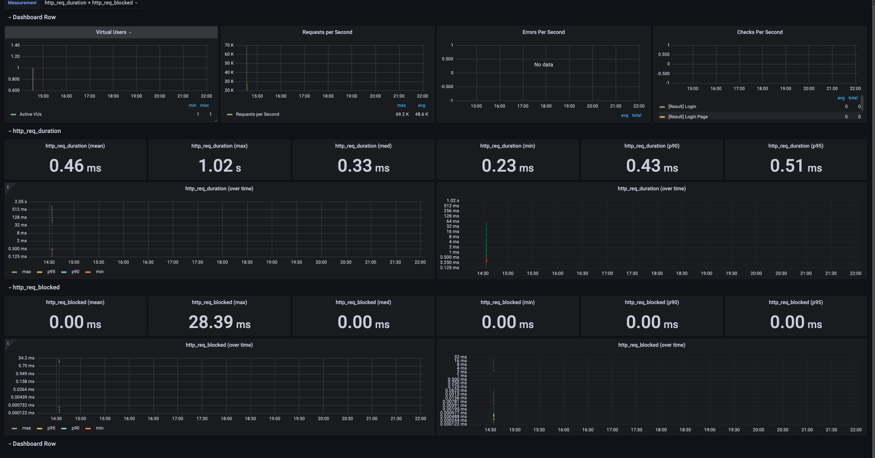
</details>   

<br>

<details>
<summary>load.js</summary>

- load.js 실행 이전 결과
```text

          /\      |‾‾| /‾‾/   /‾‾/
     /\  /  \     |  |/  /   /  /
    /  \/    \    |     (   /   ‾‾\
   /          \   |  |\  \ |  (‾)  |
  / __________ \  |__| \__\ \_____/ .io

  execution: local
     script: load.js
     output: InfluxDBv1 (http://localhost:8086)

  scenarios: (100.00%) 1 scenario, 14 max VUs, 29m40s max duration (incl. graceful stop):
           * default: Up to 14 looping VUs for 29m10s over 12 stages (gracefulRampDown: 30s, gracefulStop: 30s)


running (29m10.2s), 00/14 VUs, 37082 complete and 0 interrupted iterations
default ✓ [======================================] 00/14 VUs  29m10s

     ✓ [Result] Main Page
     ✓ [Result] Login Page
     ✓ [Result] Login
     ✓ [Result] me
     ✓ [Result] Path Page
     ✓ [Result] Search Path

     checks.........................: 100.00% ✓ 222492     ✗ 0
     data_received..................: 277 MB  158 kB/s
     data_sent......................: 46 MB   26 kB/s
     http_req_blocked...............: avg=8.78µs   min=803ns    med=1.99µs   max=32.76ms p(90)=3.27µs   p(95)=3.91µs
     http_req_connecting............: avg=1.07µs   min=0s       med=0s       max=22.92ms p(90)=0s       p(95)=0s
   ✗ http_req_duration..............: avg=67.16ms  min=723.95µs med=2.64ms   max=5.1s    p(90)=170.61ms p(95)=298.36ms
       { expected_response:true }...: avg=67.16ms  min=723.95µs med=2.64ms   max=5.1s    p(90)=170.61ms p(95)=298.36ms
     http_req_failed................: 0.00%   ✓ 0          ✗ 222492
     http_req_receiving.............: avg=58.66µs  min=13.96µs  med=44.7µs   max=29.76ms p(90)=84.12µs  p(95)=100.26µs
     http_req_sending...............: avg=17.48µs  min=4.7µs    med=11.55µs  max=28.15ms p(90)=24µs     p(95)=28.93µs
     http_req_tls_handshaking.......: avg=4.64µs   min=0s       med=0s       max=31.86ms p(90)=0s       p(95)=0s
     http_req_waiting...............: avg=65.44ms  min=684µs    med=2.58ms   max=5.1s    p(90)=170.53ms p(95)=298.24ms
     http_reqs......................: 222492  127.121754/s
     iteration_duration.............: avg=393.95ms min=59.63ms  med=219.34ms max=5.74s   p(90)=467.89ms p(95)=2.17s
     iterations.....................: 37082   21.186959/s
     vus............................: 1       min=1        max=14
     vus_max........................: 14      min=14       max=14
```

- load.js 실행 이후 결과
```text

          /\      |‾‾| /‾‾/   /‾‾/
     /\  /  \     |  |/  /   /  /
    /  \/    \    |     (   /   ‾‾\
   /          \   |  |\  \ |  (‾)  |
  / __________ \  |__| \__\ \_____/ .io

  execution: local
     script: load.js
     output: InfluxDBv1 (http://localhost:8086)

  scenarios: (100.00%) 1 scenario, 14 max VUs, 29m40s max duration (incl. graceful stop):
           * default: Up to 14 looping VUs for 29m10s over 12 stages (gracefulRampDown: 30s, gracefulStop: 30s)


running (29m10.2s), 00/14 VUs, 37082 complete and 0 interrupted iterations
default ✓ [======================================] 00/14 VUs  29m10s

     ✓ [Result] Main Page
     ✓ [Result] Login Page
     ✓ [Result] Login
     ✓ [Result] me
     ✓ [Result] Path Page
     ✓ [Result] Search Path

     checks.........................: 100.00% ✓ 2166810     ✗ 0
     data_received..................: 1.9 GB  1.1 MB/s
     data_sent......................: 132 MB  75 kB/s
     http_req_blocked...............: avg=9.41µs  min=123ns    med=302ns   max=102.94ms p(90)=398ns   p(95)=440ns
     http_req_connecting............: avg=1µs     min=0s       med=0s      max=32.52ms  p(90)=0s      p(95)=0s
   ✓ http_req_duration..............: avg=7.27ms  min=646.48µs med=3.52ms  max=732.58ms p(90)=16.41ms p(95)=21.24ms
       { expected_response:true }...: avg=7.27ms  min=646.48µs med=3.52ms  max=732.58ms p(90)=16.41ms p(95)=21.24ms
     http_req_failed................: 0.00%   ✓ 0           ✗ 2166810
     http_req_receiving.............: avg=98.8µs  min=10.02µs  med=26.68µs max=76.96ms  p(90)=92µs    p(95)=219.53µs
     http_req_sending...............: avg=32.67µs min=8.54µs   med=22.4µs  max=58.21ms  p(90)=41.64µs p(95)=49.88µs
     http_req_tls_handshaking.......: avg=7.83µs  min=0s       med=0s      max=53.92ms  p(90)=0s      p(95)=0s
     http_req_waiting...............: avg=6.49ms  min=0s       med=3.44ms  max=732.46ms p(90)=16.2ms  p(95)=20.91ms
     http_reqs......................: 2166810 1238.151737/s
     iteration_duration.............: avg=40.4ms  min=9.87ms   med=25.28ms max=1.81s    p(90)=93.51ms p(95)=117.95ms
     iterations.....................: 361135  206.358623/s
     vus............................: 1       min=1         max=14
     vus_max........................: 14      min=14        max=14
```

</details>

<details>
<summary>grafana</summary>

- 개선 이전 grafana
  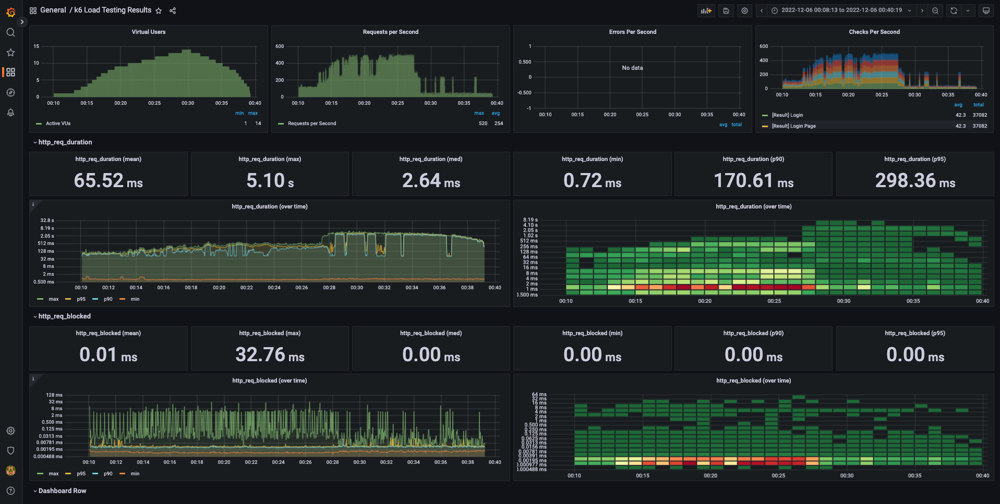
- 개선 이후 grafana
  
</details>

<br>


<details>
<summary>stress.js</summary>

- stress.js 실행 이전 결과
```text

          /\      |‾‾| /‾‾/   /‾‾/
     /\  /  \     |  |/  /   /  /
    /  \/    \    |     (   /   ‾‾\
   /          \   |  |\  \ |  (‾)  |
  / __________ \  |__| \__\ \_____/ .io

  execution: local
     script: stress.js
     output: InfluxDBv1 (http://localhost:8086)

  scenarios: (100.00%) 1 scenario, 384 max VUs, 28m40s max duration (incl. graceful stop):
           * default: Up to 384 looping VUs for 28m10s over 16 stages (gracefulRampDown: 30s, gracefulStop: 30s)


running (1m00.1s), 0/1 VUs, 502 complete and 0 interrupted iterations
default ✓ [======================================] 00/14 VUs  29m10s

     ✓ [Result] Main Page
     ✓ [Result] Login Page
     ✓ [Result] Login
     ✓ [Result] me
     ✓ [Result] Path Page
     ✓ [Result] Search Path

     checks.........................: 99.99% ✓ 264424     ✗ 15
     data_received..................: 330 MB 195 kB/s
     data_sent......................: 55 MB  33 kB/s
     http_req_blocked...............: avg=14.75µs  min=923ns    med=2.06µs  max=50.38ms p(90)=3.37µs  p(95)=4.02µs
     http_req_connecting............: avg=1.51µs   min=0s       med=0s      max=14.78ms p(90)=0s      p(95)=0s
   ✗ http_req_duration..............: avg=914.32ms min=709.84µs med=4.27ms  max=32.18s  p(90)=2.46s   p(95)=3.74s
       { expected_response:true }...: avg=910.6ms  min=709.84µs med=4.27ms  max=32.18s  p(90)=2.46s   p(95)=3.74s
     http_req_failed................: 0.00%  ✓ 23         ✗ 264416
     http_req_receiving.............: avg=58.86µs  min=13.81µs  med=46.47µs max=17.47ms p(90)=87.67µs p(95)=105.56µs
     http_req_sending...............: avg=17.83µs  min=4.8µs    med=12.37µs max=20.79ms p(90)=25.09µs p(95)=32µs
     http_req_tls_handshaking.......: avg=9.85µs   min=0s       med=0s      max=28.24ms p(90)=0s      p(95)=0s
     http_req_waiting...............: avg=912.78ms min=677.02µs med=4.18ms  max=32.18s  p(90)=2.46s   p(95)=3.74s
     http_reqs......................: 264439 156.464657/s
     iteration_duration.............: avg=5.45s    min=56.68ms  med=2.27s   max=1m13s   p(90)=10.37s  p(95)=24.86s
     iterations.....................: 44047  26.06196/s
     vus............................: 1      min=1        max=384
     vus_max........................: 384    min=384      max=384
```


- stress.js 실행 이후 결과
```text

          /\      |‾‾| /‾‾/   /‾‾/
     /\  /  \     |  |/  /   /  /
    /  \/    \    |     (   /   ‾‾\
   /          \   |  |\  \ |  (‾)  |
  / __________ \  |__| \__\ \_____/ .io

  execution: local
     script: stress.js
     output: InfluxDBv1 (http://localhost:8086)

  scenarios: (100.00%) 1 scenario, 384 max VUs, 28m40s max duration (incl. graceful stop):
           * default: Up to 384 looping VUs for 28m10s over 16 stages (gracefulRampDown: 30s, gracefulStop: 30s)


running (1m00.1s), 0/1 VUs, 502 complete and 0 interrupted iterations
default ✓ [======================================] 00/14 VUs  29m10s

     ✓ [Result] Main Page
     ✓ [Result] Login Page
     ✓ [Result] Login
     ✓ [Result] me
     ✓ [Result] Path Page
     ✓ [Result] Search Path

     checks.........................: 100.00% ✓ 2774892     ✗ 0
     data_received..................: 2.4 GB  1.4 MB/s
     data_sent......................: 194 MB  115 kB/s
     http_req_blocked...............: avg=33.71µs  min=136ns    med=308ns    max=472.33ms p(90)=393ns    p(95)=433ns
     http_req_connecting............: avg=2.28µs   min=0s       med=0s       max=125.2ms  p(90)=0s       p(95)=0s
   ✓ http_req_duration..............: avg=871.82ms  min=675.69µs med=53.22ms  max=7.49s    p(90)=175.35ms p(95)=229.8ms
       { expected_response:true }...: avg=612.21ms  min=675.69µs med=53.22ms  max=7.49s    p(90)=175.35ms p(95)=229.8ms
     http_req_failed................: 0.00%   ✓ 0           ✗ 2774892
     http_req_receiving.............: avg=734.29µs min=10.69µs  med=35.86µs  max=163.46ms p(90)=1.07ms   p(95)=2.35ms
     http_req_sending...............: avg=49.86µs  min=8.29µs   med=24.38µs  max=137.8ms  p(90)=44.34µs  p(95)=56.32µs
     http_req_tls_handshaking.......: avg=30.84µs  min=0s       med=0s       max=469.73ms p(90)=0s       p(95)=0s
     http_req_waiting...............: avg=84.7ms   min=0s       med=52.54ms  max=7.49s    p(90)=173.72ms p(95)=227.9ms
     http_reqs......................: 2774892 1641.937747/s
     iteration_duration.............: avg=513.8ms  min=10.49ms  med=388.84ms max=11.09s   p(90)=1.03s    p(95)=1.65s
     iterations.....................: 462482  273.656291/s
     vus............................: 1       min=1         max=384
     vus_max........................: 384     min=384       max=384
```

</details>


<details>
<summary>grafana</summary>

- 개선 이전 grafana
  
- 개선 이후 grafana
  
</details>


2. 어떤 부분을 개선해보셨나요? 과정을 설명해주세요
   - WEB 성능 개선 (nginx.conf 설정 수정)
     - gzip 압축
     - cache 설정(redis 이용)
     - http/2
     

---

### 2단계 - 스케일 아웃

* 미션1: 모든 정적 자원에 대해 no-cache, private 설정을 하고 테스트 코드를 통해 검증합니다.
* 미션2: 확장자는 css인 경우는 max-age를 1년, js인 경우는 no-cache, private 설정을 합니다.
* 미션3: 모든 정적 자원에 대해 no-cache, no-store 설정을 한다. 가능한가요?
  <details>
  <summary> 가능한가? </summary>
    HTTP의 스펙이 모든 상황을 완벽하게 대응하고 있지 못하기 때문에 no-cache 또는 no-store만으로는 캐시 무효화를 만족하지 못하는 상황이 있을 수 있습니다.
    따라서 이러한 옵션들을 같이 설정할 수 있음
  </details>


1. Launch Template 링크를 공유해주세요.
    - [바로가기](https://ap-northeast-2.console.aws.amazon.com/ec2/v2/home?region=ap-northeast-2#LaunchTemplateDetails:launchTemplateId=lt-0a51deb0d23640730)

2. cpu 부하 실행 후 EC2 추가생성 결과를 공유해주세요. (Cloudwatch 캡쳐)
- cpu 부하를 주고 난 이후 오토스케일링으로 최대 5개까지 추가 생성되는 것을 확인했습니다.

- http_req_duration(avg) 기준(서버 6대)
  - smoke : 21.42ms -> 4.21ms(step1) -> 3.52ms(step2)
  - load : 67.16ms -> 7.27ms(step1) -> 6.72ms(step2)
  - stess : 914.32ms -> 612.21ms(step1) -> 161.7ms(step2)

<details open>
<summary>cloudwatch</summary>

* autosacle server
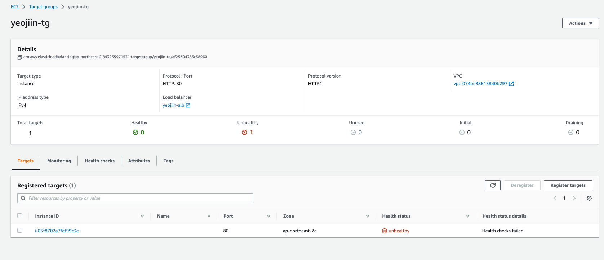
  * DNS 주소: yeojiin-alb-1510260166.ap-northeast-2.elb.amazonaws.com

* cloudwatch_autoscales
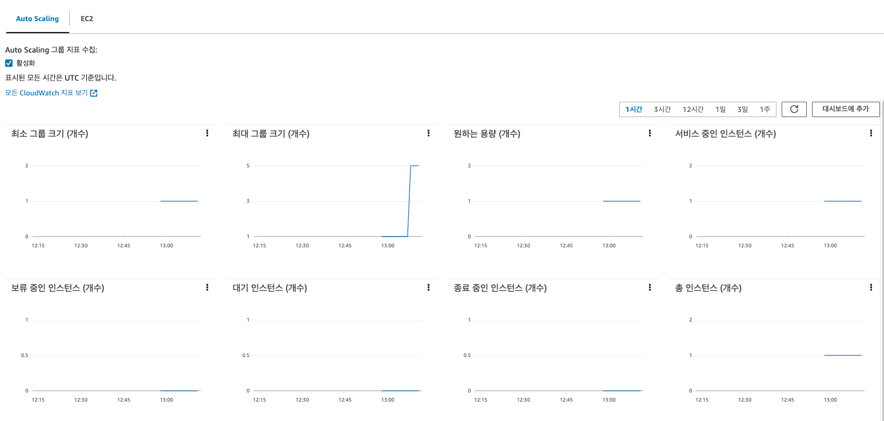
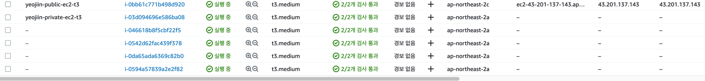
</details>


```sh
$ stress -c 2
```

3. 성능 개선 결과를 공유해주세요 (Smoke, Load, Stress 테스트 결과)
<details>
<summary>smoke</summary>
   
* smoke.js
```text

          /\      |‾‾| /‾‾/   /‾‾/
     /\  /  \     |  |/  /   /  /
    /  \/    \    |     (   /   ‾‾\
   /          \   |  |\  \ |  (‾)  |
  / __________ \  |__| \__\ \_____/ .io

  execution: local
     script: smoke.js
     output: InfluxDBv1 (http://localhost:8086)

  scenarios: (100.00%) 1 scenario, 1 max VUs, 1m30s max duration (incl. graceful stop):
           * default: 1 looping VUs for 1m0s (gracefulStop: 30s)


running (1m00.0s), 0/1 VUs, 2738 complete and 0 interrupted iterations
default ✓ [======================================] 1 VUs  1m0s

     ✓ [Result] Main Page
     ✓ [Result] Login Page
     ✓ [Result] Login
     ✓ [Result] me
     ✓ [Result] Path Page
     ✓ [Result] Search Path

     checks.........................: 100.00% ✓ 16428      ✗ 0
     data_received..................: 19 MB   322 kB/s
     data_sent......................: 973 kB  16 kB/s
     http_req_blocked...............: avg=4.46µs  min=259ns    med=464ns   max=21.39ms  p(90)=595ns   p(95)=663ns
     http_req_connecting............: avg=213ns   min=0s       med=0s      max=279.59µs p(90)=0s      p(95)=0s
   ✓ http_req_duration..............: avg=3.52ms  min=537.03µs med=1.65ms  max=859.61ms p(90)=8.42ms  p(95)=9.62ms
       { expected_response:true }...: avg=3.52ms  min=537.03µs med=1.65ms  max=859.61ms p(90)=8.42ms  p(95)=9.62ms
     http_req_failed................: 0.00%   ✓ 0          ✗ 16428
     http_req_receiving.............: avg=52.22µs min=24.26µs  med=45.47µs max=7.82ms   p(90)=66.54µs p(95)=75.04µs
     http_req_sending...............: avg=38.96µs min=18.49µs  med=33.67µs max=4.45ms   p(90)=53.23µs p(95)=61.16µs
     http_req_tls_handshaking.......: avg=2.99µs  min=0s       med=0s      max=11.77ms  p(90)=0s      p(95)=0s
     http_req_waiting...............: avg=3.42ms  min=0s       med=1.56ms  max=859.48ms p(90)=8.32ms  p(95)=9.51ms
     http_reqs......................: 16428   273.717028/s
     iteration_duration.............: avg=21.9ms  min=15.39ms  med=19.95ms max=997.12ms p(90)=28.27ms p(95)=32.96ms
     iterations.....................: 2738    45.619505/s
     vus............................: 1       min=1        max=1
     vus_max........................: 1       min=1        max=1
```

* grafana   
  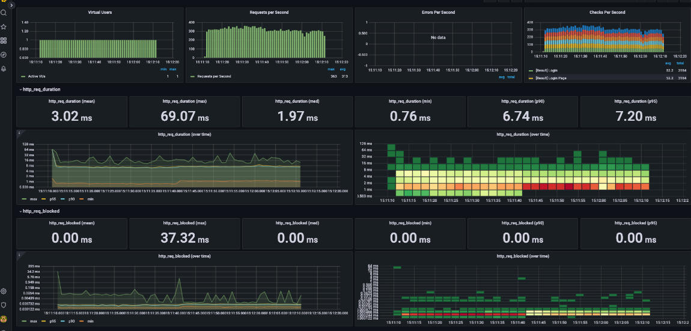
</details>


<details>
<summary>load</summary>

* load.js
```text

          /\      |‾‾| /‾‾/   /‾‾/
     /\  /  \     |  |/  /   /  /
    /  \/    \    |     (   /   ‾‾\
   /          \   |  |\  \ |  (‾)  |
  / __________ \  |__| \__\ \_____/ .io

  execution: local
     script: load.js
     output: InfluxDBv1 (http://localhost:8086)

  scenarios: (100.00%) 1 scenario, 14 max VUs, 29m40s max duration (incl. graceful stop):
           * default: Up to 14 looping VUs for 29m10s over 12 stages (gracefulRampDown: 30s, gracefulStop: 30s)


running (29m10.0s), 00/14 VUs, 224983 complete and 0 interrupted iterations
default ✓ [======================================] 00/14 VUs  29m10s

     ✓ [Result] Main Page
     ✓ [Result] Login Page
     ✗ [Result] Login
      ↳  0% — ✓ 0 / ✗ 224983
     ✓ [Result] me
     ✓ [Result] Path Page
     ✓ [Result] Search Path

     checks.........................: 83.33%  ✓ 1124915    ✗ 224983
     data_received..................: 1.6 GB  907 kB/s
     data_sent......................: 79 MB   45 kB/s
     http_req_blocked...............: avg=13.55µs  min=145ns    med=423ns    max=48.23ms p(90)=537ns    p(95)=608ns
     http_req_connecting............: avg=1.07µs   min=0s       med=0s       max=16.96ms p(90)=0s       p(95)=0s
   ✓ http_req_duration..............: avg=10.46ms  min=495.94µs med=7.1ms    max=1.05s   p(90)=24.26ms  p(95)=29.53ms
       { expected_response:true }...: avg=6.72ms   min=495.94µs med=5.19ms   max=139.5ms p(90)=21.85ms  p(95)=26.43ms
     http_req_failed................: 33.33%  ✓ 449966     ✗ 899932
     http_req_receiving.............: avg=677.45µs min=10.52µs  med=169.97µs max=61.35ms p(90)=1.88ms   p(95)=3.03ms
     http_req_sending...............: avg=112.32µs min=12.41µs  med=32.26µs  max=52.48ms p(90)=101.41µs p(95)=351.24µs
     http_req_tls_handshaking.......: avg=10.96µs  min=0s       med=0s       max=44.58ms p(90)=0s       p(95)=0s
     http_req_waiting...............: avg=9.67ms   min=0s       med=6.05ms   max=1.04s   p(90)=23.59ms  p(95)=28.89ms
     http_reqs......................: 1349898 771.367257/s
     iteration_duration.............: avg=64.84ms  min=10.97ms  med=46.15ms  max=1.12s   p(90)=142.33ms p(95)=165.96ms
     iterations.....................: 224983  128.561209/s
     vus............................: 1       min=1        max=14
     vus_max........................: 14      min=14       max=14

```

* grafana   
  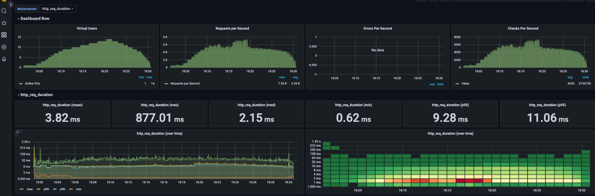
</details>


<details>
<summary>stress</summary>

* stress.js
```text
running (28m10.0s), 000/384 VUs, 238902 complete and 0 interrupted iterations
default ✓ [======================================] 000/384 VUs  28m10s

     ✗ [Result] Main Page
      ↳  99% — ✓ 238834 / ✗ 68
     ✗ [Result] Login Page
      ↳  99% — ✓ 238860 / ✗ 42
     ✗ [Result] Login
      ↳  99% — ✓ 238858 / ✗ 44
     ✓ [Result] me
     ✗ [Result] Path Page
      ↳  99% — ✓ 238747 / ✗ 61
     ✗ [Result] Search Path
      ↳  99% — ✓ 238770 / ✗ 38

     checks.........................: 99.98%  ✓ 1432877    ✗ 253
     data_received..................: 1.8 GB  1.1 MB/s
     data_sent......................: 126 MB  74 kB/s
     http_req_blocked...............: avg=12.5ms   min=0s       med=421ns    max=2.04s    p(90)=565ns    p(95)=703ns
     http_req_connecting............: avg=561.87µs min=0s       med=0s       max=579.57ms p(90)=0s       p(95)=0s
   ✓ http_req_duration..............: avg=161.76ms min=0s       med=107.38ms max=4.35s    p(90)=345.81ms p(95)=463.57ms
       { expected_response:true }...: avg=161.7ms  min=558.28µs med=107.36ms max=4.35s    p(90)=345.66ms p(95)=463.17ms
     http_req_failed................: 0.02%   ✓ 303        ✗ 1432877
     http_req_receiving.............: avg=33.09ms  min=0s       med=13.86ms  max=762.44ms p(90)=94.58ms  p(95)=127.74ms
     http_req_sending...............: avg=14.81ms  min=0s       med=36.86µs  max=4.27s    p(90)=324.88µs p(95)=1.7ms
     http_req_tls_handshaking.......: avg=2.13ms   min=0s       med=0s       max=1.5s     p(90)=0s       p(95)=0s
     http_req_waiting...............: avg=113.86ms min=0s       med=79.99ms  max=1.68s    p(90)=244.41ms p(95)=328.31ms
     http_reqs......................: 1433180 848.012665/s
     iteration_duration.............: avg=995ms    min=17.01ms  med=762.53ms max=8.62s    p(90)=2.16s    p(95)=2.57s
     iterations.....................: 238902  141.358323/s
     vus............................: 1       min=1        max=384
     vus_max........................: 384     min=384      max=384
```

* grafana   
  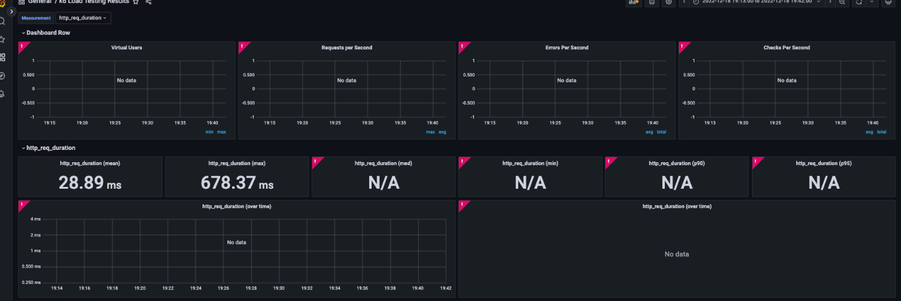
</details>

---

### 3단계 - 쿼리 최적화

1. 인덱스 설정을 추가하지 않고 아래 요구사항에 대해 1s 이하(M1의 경우 2s)로 반환하도록 쿼리를 작성하세요.

- 활동중인(Active) 부서의 현재 부서관리자 중 연봉 상위 5위안에 드는 사람들이 최근에 각 지역별로 언제 퇴실했는지 조회해보세요. (사원번호, 이름, 연봉, 직급명, 지역, 입출입구분, 입출입시간)

* sql query
```sql
SELECT ST.id AS '사원번호'
    , ST.last_name AS '이름'
    , ST.annual_income AS '연봉'
    , ST.position_name AS '직급'
    , r.region AS '지역'
    , r.record_symbol AS '입출입구분'
    , r.time AS '입출입시간'
FROM record r
INNER JOIN (
    SELECT e.id
         , e.last_name
         , s.annual_income
         , p.position_name
    FROM employee e
             INNER JOIN position p
                        ON e.id = p.id AND p.position_name = 'manager' AND p.start_date <= NOW() AND p.end_date >= NOW()
             INNER JOIN manager m ON e.id = m.employee_id AND m.start_date <= NOW() and m.end_date >= NOW()
             INNER JOIN department d on m.department_id = d.id AND d.note = 'active'
             INNER JOIN salary s on s.id = e.id AND s.start_date <= NOW() AND s.end_date >= NOW()
    WHERE e.join_date <= NOW()
    ORDER BY s.annual_income DESC
    LIMIT 5
) ST ON ST.id = r.employee_id AND r.record_symbol = 'o'
```
쿼리 측정 시간 : 196ms

* 실행계획 결과
  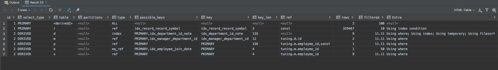

<details open>
<summary> sql 측정 시간 </summary>
 
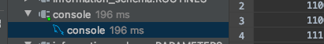

</details>

---

### 4단계 - 인덱스 설계

1. 인덱스 적용해보기 실습을 진행해본 과정을 공유해주세요

---

### 추가 미션

1. 페이징 쿼리를 적용한 API endpoint를 알려주세요

---

<details>
<summary> 🚀 1단계 - 화면 응답 개선하기 </summary>

#### 요구사항
* [x] 부하테스트 각 시나리오의 요청시간을 목푯값 이하로 개선
  * 개선 전 / 후를 직접 계측하여 확인

#### 힌트
1. Reverse Proxy 개선하기


**gzip 압축**
```
http {
  gzip on; ## http 블록 수준에서 gzip 압축 활성화
  gzip_comp_level 9;
  gzip_vary on;
  gzip_types text/plain text/css application/json application/x-javascript application/javascript text/xml application/xml application/rss+xml text/javascript image/svg+xml application/vnd.ms-fontobject application/x-font-ttf font/opentype;
}
```

**cache**
```
http {
  ## Proxy 캐시 파일 경로, 메모리상 점유할 크기, 캐시 유지기간, 전체 캐시의 최대 크기 등 설정
  proxy_cache_path /tmp/nginx levels=1:2 keys_zone=mycache:10m inactive=10m max_size=200M;

  ## 캐시를 구분하기 위한 Key 규칙
  proxy_cache_key "$scheme$host$request_uri $cookie_user";
  
    server {
        location ~* \.(?:css|js|gif|png|jpg|jpeg)$ {
            proxy_pass http://app;
      
            ## 캐시 설정 적용 및 헤더에 추가
            # 캐시 존을 설정 (캐시 이름)
            proxy_cache mycache;
            # X-Proxy-Cache 헤더에 HIT, MISS, BYPASS와 같은 캐시 적중 상태정보가 설정
            add_header X-Proxy-Cache $upstream_cache_status;
            # 200 302 코드는 20분간 캐싱
            proxy_cache_valid 200 302 10m;    
            # 만료기간을 1 달로 설정
            expires 1M;
            # access log 를 찍지 않는다.
            access_log off;
        }
    }
}    
```

**TLS, HTTP/2 설정**
```
http {
  server {
    listen 80;
    return 301 https://$host$request_uri;
  }
  server {  
  listen 443 ssl http2;
    
    ssl_certificate /etc/letsencrypt/live/[도메인주소]/fullchain.pem;
    ssl_certificate_key /etc/letsencrypt/live/[도메인주소]/privkey.pem;

    # Disable SSL
    ssl_protocols TLSv1 TLSv1.1 TLSv1.2;

    # 통신과정에서 사용할 암호화 알고리즘
    ssl_prefer_server_ciphers on;
    ssl_ciphers ECDH+AESGCM:ECDH+AES256:ECDH+AES128:DH+3DES:!ADH:!AECDH:!MD5;

    # Enable HSTS
    # client의 browser에게 http로 어떠한 것도 load 하지 말라고 규제합니다.
    # 이를 통해 http에서 https로 redirect 되는 request를 minimize 할 수 있습니다.
    add_header Strict-Transport-Security "max-age=31536000" always;
    
    # SSL sessions
    ssl_session_cache shared:SSL:10m;
    ssl_session_timeout 10m; 
  }
}
```
📌 HTTP2.0은 SSL 계층 위에서만 동작합니다.


2. WAS 성능 개선하기
* application server의 경우
  * 작업 스레드풀을 필요 이상으로 크게 설정하면 DB 부하가 증가할 수 있습니다.
  * 애플리케이션 서버가 낼 수 있는 최대 성능을 넘어서는 동시처리 요청이 들어오면 TPS가 증가하지 않은 채 응답시간만 증가하다가 큐가 쌓여 서비스 멈춤현상이 발생할 수 있습니다.
  
성능 튜닝의 한 축은 서비스 간이나 서비스 내에서 반복되는 로직을 제거하는 것입니다. 기존에 작업한 결과를 저장해두었다가 이후에 다시 동일한 작업이 수행되었을 때 결과를 재사용하면 반복되는 로직을 제거할 수 있습니다.   
애플리케이션 캐시를 활용하여 기존에 작업한 결과를 저장해두었다가 이후에 다시 동일한 작업이 수행되었을 때 결과를 재사용하면 반복되는 로직을 제거할 수 있습니다. 또는 병렬 처리 등을 활용하여 `제한된 스레드 수 내에서 자원을 재사용하여 성능을 개선`할 수 있습니다.

A. Spring Data Cache
* Redis Server
```
$ docker pull redis
$ docker run -d -p 6379:6379 redis
```

* application.properties
```
spring.cache.type=redis
spring.redis.host=localhost
spring.redis.port=6379
```

* build.gradle
```
implementation('org.springframework.boot:spring-boot-starter-data-redis')
```

```
@EnableCaching
@Configuration
public class CacheConfig extends CachingConfigurerSupport {

    @Autowired
    RedisConnectionFactory connectionFactory;


    @Bean
    public CacheManager redisCacheManager() {
        RedisCacheConfiguration redisCacheConfiguration = RedisCacheConfiguration.defaultCacheConfig()
            .serializeKeysWith(RedisSerializationContext.SerializationPair.fromSerializer(new StringRedisSerializer()))
            .serializeValuesWith(RedisSerializationContext.SerializationPair.fromSerializer(new GenericJackson2JsonRedisSerializer()));

        RedisCacheManager redisCacheManager = RedisCacheManager.RedisCacheManagerBuilder.
            fromConnectionFactory(connectionFactory).cacheDefaults(redisCacheConfiguration).build();
        return redisCacheManager;
    }
}
```

```
# 메서드 실행 전에 캐시를 확인하여 최소 하나의 캐시가 존재한다면 값을 반환한다.
# SpEL 표현식을 활용하여 조건부 캐싱이 가능하다. 
@Cacheable(value = "line", key = "#id")
public Line getLine(Long id) {

# 메서드 실행에 영향을 주지 않고 캐시를 갱신해야 하는 경우 사용한다.
@CachePut(value = "line", key = "#id")
public void updateLine(Long id, LineRequest lineUpdateRequest) {

# 캐시를 제거할 때 사용한다.
@CacheEvict(value = "line", key = "#id")
public void deleteLineById(Long id) {
```
* ResponseEntity는 Deserialize 되지 않으니 도메인 객체를 직접 반환하거나, Service Layer에 적용하여야 합니다.
* LocalDateTime은 Deserialize 되지 않으니 String으로 변환하여야 합니다.
* Spring AOP의 제약사항을 가집니다.
  * pulbic method에만 사용가능 합니다.
  * 같은 객체내의 method끼리 호출시 AOP가 동작하지 않습니다.
  * Runtime Weaving으로 처리 되기 때문에 약간의 성능저하가 있습니다.

**B. 비동기 처리**
외부 API를 활용할 경우 비동기처리를 하여 병목을 피할 수 있습니다. 또한, Thread pool을 활용하여 Thread를 재사용할 수 있습니다.

**\* blocking vs non-blocking / synchronous vs asynchronous** 
* Synchronous I/O와 Asynchronous I/O
  * 동기 : 작업을 요청한 후 작업의 결과가 나올 때까지 기다린 후 처리 (프로세스는 커널에 지속적으로 I/O 준비사항을 체크)
  * 비동기 : 직전 시스템 호출의 종료가 발생하면 그에 따른 처리를 진행

* Blocking I/O과 Non-Blocking I/O
  * Blocking : 유저 프로세스가 시스템 호출을 하고나서 결과가 반환되기까지 다음 처리로 넘어가지 않음
  * Non-Blocking : 호출한 직후에 프로그램으로 제어가 돌아와서 시스템 호출의 종료를 기다리지 않고 다음 처리로 넘어갈 수 있음

a. @Async
Spring data cache와 마찬가지로 Spring AOP의 제약사항을 가집니다.
```
@Async
public void sendMail(String to, String subject, String contents) {
```

b. 적절한 Thread pool size 구하기
 - https://brainbackdoor.tistory.com/27
```
## CPU 모델명
$ cat /proc/cpuinfo | grep "model name" | uniq -c | awk '{print $5 $6, $7,$8, $9, $10 $11}'

## CPU당 물리 코어 수
$ cat /proc/cpuinfo | grep "cpu cores" | tail -1 | awk '{print $4}'

## 물리 CPU 수 
$ cat /proc/cpuinfo | grep "physical id" | sort -u | wc -l

## 리눅스 전체 코어(프로세스)개수 
$ grep -c processor /proc/cpuinfo
```
* 적절한 스레드 수 = 사용 가능한 코어 수 * (1+대기 시간/서비스 시간)
  * 즉, 적절한 스레드 수는 사용 가능한 코어 수의 1 ~ 2 배 내로 수렴합니다.

대기 시간은 I/O waiting, 원격 서비스에 대한 HTTP response wating 등 작업 하나가 완료되기까지 소모되는 시간을 의미합니다. CPU를 많이 쓰는 계산 작업의 경우 대기를 거의 하지 않으므로 (대기 시간/서비스 시간)의 값이 0에 수렴합니다. 이 경우, 스레드의 수는 사용 가능한 코어의 수와 동일합니다.

c. Thread pool 설정   
@Async에 대한 별도 설정이 없더라도 TaskExecutionAutoConfiguration에 의해 Thread pool이 생성됩니다. 다만, 이 때 설정은 TaskExecutionProperties.Pool에 정의된 설정을 기본으로 따릅니다. 따라서 애플리케이션이 구동되는 상황에 따라 적절히 변경해줍니다.
```
    public static class Pool {
        private int queueCapacity = 2147483647;
        private int coreSize = 8;
        private int maxSize = 2147483647;
        private boolean allowCoreThreadTimeout = true;
        private Duration keepAlive = Duration.ofSeconds(60L);        
```

```
@Configuration 
@EnableAsync 
public class AsyncThreadConfig { 

    @Bean 
    public Executor asyncThreadTaskExecutor() { 
        ThreadPoolTaskExecutor exexcutor = new ThreadPoolTaskExecutor();     
        /* 기본 Thread 사이즈 */
        exexcutor.setCorePoolSize(2); 
        /* 최대 Thread 사이즈 */        
        exexcutor.setMaxPoolSize(4); 
        /* MaxThread가 동작하는 경우 대기하는 Queue 사이즈 */                
        exexcutor.setQueueCapacity(100)
        exexcutor.setThreadNamePrefix("subway-async-"); 
        return exexcutor; 
    } 
}
```

3. Scale out - 초간단 Blue-Green 배포 구성하기
* nomad 를 활용하여 배포 구성을 합니다.
* nomad 도구 사용이 미션의 목표가 아니니, 배포 전략 학습 외의 용도로는 굳이 사용하지 않으셔도 좋습니다.
```
# nomad 설치 및 실행
$ curl -fsSL https://apt.releases.hashicorp.com/gpg | sudo apt-key add -
$ sudo apt-add-repository "deb [arch=amd64] https://apt.releases.hashicorp.com $(lsb_release -cs) main"
$ sudo apt-get update && sudo apt-get install nomad
$ sudo nomad agent -dev -bind=0.0.0.0 > /dev/null 2>&1 &

# nomad 명령어
$ nomad run deploy.nomad
$ watch nomad status app
```
1. 배포하려는 도커 이미지를 빌드합니다.
2. 설정파일의 image 값을 변경한 후, 배포해봅니다.
3. 변경된 버전의 도커 이미지를 빌드하고 설정 파일을 수정해봅니다.
4. [서버 공인 IP]:4646 페이지를 통해 배포과정을 살펴봅니다.

**\* Blue-Green 배포**
* 배포하려는 docker image 이름을 설정하여 작성합니다.
```
$ vi deploy.nomad

job "app" {
  datacenters = ["dc1"]
  type = "service"

  group "app" {
    count = 3

    update {
      max_parallel     = 1
      canary = 3
      min_healthy_time = "10s"
      healthy_deadline = "1m"
      auto_revert      = true
      auto_promote     = true
    }

    task "app" {
      driver = "docker"

      config {
        image = "docker image 이름"
        port_map {
          http = 8080
        }
      }

      resources {
        cpu    = 500 # 500 MHz
        memory = 250 # 256MB

        network {
          mbits = 10
          port "http" {}
        }
      }

      service {
        name = "app"
        tags = ["app"]
        port = "http"

        check {
          name     = "alive"
          type     = "tcp"
          interval = "10s"
          timeout  = "2s"
        }
      }
    }
  }
}
```

**Nginx dynamic port**   
배포시 Port를 동적으로 할당하도록 구성한다면 앞단에 있는 Reverse Proxy 혹은 Load Balancer의 설정도 변경해야 합니다. 이를 위해 Service Discovery인 consul를 활용하여 nginx를 재배포합니다.
```
# consul 설치 및 실행
$ curl -fsSL https://apt.releases.hashicorp.com/gpg | sudo apt-key add -
$ sudo apt-add-repository "deb [arch=amd64] https://apt.releases.hashicorp.com $(lsb_release -cs) main"
$ sudo apt-get update && sudo apt-get install consul
$ consul agent -dev > /dev/null 2>&1 &

$ nomad run nginx.nomad
$ nomad status nginx
...
Allocations
ID        Node ID   Task Group  Version  Desired  Status   Created    Modified
1c1b2f65  5ed4b90d  nginx       16       run      running  3m30s ago  3m17s ago

$ sudo docker ps -a

$ nomad alloc fs 1c1b2f65 nginx/local/load-balancer.conf
upstream backend {
  server 127.0.0.1:21538;
  server 127.0.0.1:31189;
...  
  
$ curl -I localhost
HTTP/1.1 200
Server: nginx/1.19.6
...
```

```
$ vi nginx.nomad

job "nginx" {
  datacenters = ["dc1"]

  group "nginx" {
    count = 1

    task "nginx" {
      driver = "docker"

      config {
        image = "nginx"

	network_mode = "host"

        volumes = [
          "local:/etc/nginx/conf.d",
        ]
      }
      template {
        data = <<EOF
upstream backend {
{{ range service "app" }}
  server {{ .Address }}:{{ .Port }};
{{ else }}server 172.17.0.1:65535; # force a 502
{{ end }}
}

server {
   listen 80;

   location / {
      proxy_pass http://backend;
      proxy_http_version 1.1;
      proxy_set_header Upgrade $http_upgrade;
      proxy_set_header Connection 'upgrade';
      proxy_set_header Host $host;
   }
}
EOF

        destination   = "local/load-balancer.conf"
        change_mode   = "signal"
        change_signal = "SIGHUP"
      }

      resources {
        network {
          mbits = 10

          port "http" {
            static = 80
 	    host_network = "public"
          }
        }
      }

      service {
        name = "nginx"
        port = "http"
      }
    }
  }
}
```

4. 정적 파일 경량화
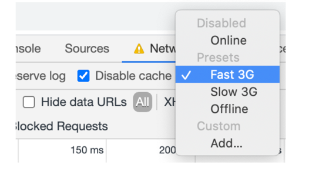

* 미션의 경우 정적 리소스가 많지 않고, 이 과정은 프론트엔드 과정이 아니니, 컨셉만 이해하고 넘어가도록 해요 🙏🏻
* 크롬 브라우저 도구의 Network 탭을 활용하여 실제로 업로드, 다운로드되고 있는 리소스와 각 리소스의 속성(HTTP 헤더, 콘텐츠, 크기 등)을 확인할 수 있으며, 위의 그림과 같이 네트워크 대역폭 제한, 브라우저 캐시 비활성화 등의 설정을 할 수 있습니다. Performance 탭을 활용하면 페이지로드 혹은 사용자 상호작용 후 발생하는 이벤트를 모두 분석할 수 있습니다.

* 번들 크기 줄이기 : 모듈을 필요한 부분만 import하거나 불필요한 라이브러리 제거를 제거 혹은 용량이 작은 라이브러리로 교체하여 성능을 개선합니다.
```
const BundleAnalyzerPlugin = require('webpack-bundle-analyzer').BundleAnalyzerPlugin;

module.exports = {
  plugins : [
    new BundleAnalyzerPlugin()
  ]
}
```

* Code Splitting :
```
const OptimizeCssAssetsPlugin = require('optimize-css-assets-webpack-plugin')
const TerserPlugin = require('terser-webpack-plugin')

module.exports = {
  optimization: {
    splitChunks: {
      chunks: 'all',
      cacheGroups: {
        vendors: {
          test: /[\\/]node_modules[\\/]/,
          name: 'js/vendors'
        }
      }
    },
    minimizer: [
      new TerserPlugin({
        cache: true,
        parallel: true,
        terserOptions: {
          warnings: false,
          compress: {
            warnings: false
          },
          ecma: 6,
          mangle: true
        },
        sourceMap: true
      }),
      new OptimizeCssAssetsPlugin()
    ]
  }
}
```

* Dynamic import
```
const mainRoutes = [
  {
    path: '/',
    component: () => import(/* webpackChunkName: "main" */ '@/views/main/MainPage')
  }
]
```

* 웹 폰트 최적화
```
@font-face {
  font-family: 'hanna';
  src: url(/fonts/BMHANNAPro.otf) format('woff2');
}
```

### 피드백
- reverse proxy개선 후 부하 테스트, was개선 추가해서 부하 테스트를 진행 -> 어디서 성능 개선이 되었는지 파악 용이
  - stress같은 경우에는 시스템의 한계치를 확인하는 테스트이기 때문에 VUser를 증가시키면서 한계를 확인하고 성능 개선 전과 비교했을 때 VUser가 얼마나 증가했는지 확인
</details>

---


<details>
<summary> 🚀 2단계 - 스케일 아웃 (with ASG)</summary>

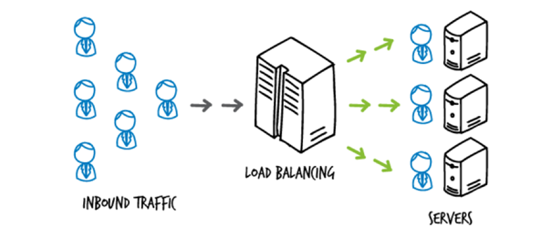

지금까지 단일 서버 구성에서 성능 개선을 진행해보았어요.   
단일 사용자에게는 빠르지만 부하가 많아질 경우 속도가 느려질 경우, 확장성에 문제가 있는 경우로 부하분산이 필요합니다.   
원활한 부하분산을 위해 시작 템플릿을 구성해고 Scale out을 해봅니다   


#### * Spring Boot에 컨테이너 설정 및 HTTP 캐싱 적용하기
소스코드는 Spring Boot 학습 저장소의 step1-container-http 브랜치 참고하시면 되어요
- https://github.com/woowacourse/jwp-spring-boot
  * git clone https://github.com/woowacourse/jwp-spring-boot
  * git checkout -t origin/step1-container-http
  
* **캐싱 설정, 테스트 코드**
  * myblog.WebMvcConfig: Spring Boot에서 캐싱, ETag 설정
  * support.handlebars.BlogHandlebarsHelper: 캐싱 무효화를 위한 Handlerbars.java template engine Helper
    * Helper가 사용된 곳은 src/main/resources/templates의 include/header.html에서 확인 가능합니다.
  * myblog.web.StaticResourcesTest: 테스트 코드를 활용해 ETag 학습할 수 있어요.
  
* **미션 요구사항**
  * 미션1: 모든 정적 자원에 대해 no-cache, private 설정을 하고 테스트 코드를 통해 검증합니다.
  * 미션2: 확장자는 css인 경우는 max-age를 1년, js인 경우는 no-cache, private 설정을 합니다.
  * 미션3: 모든 정적 자원에 대해 no-cache, no-store 설정을 한다. 가능한가요?

**Spring Boot에 gzip 설정하기**
```
# gzip 압축
server.compression.enabled: true
server.compression.mime-types: text/html,text/plain,text/css,application/javascript,application/json
server.compression.min-response-size: 500
```

#### 요구사항
* [x] springboot에 HTTP Cache, gzip 설정하기
* [x] Launch Template 작성하기
* [x] Auto Scaling Group 생성하기
* [x] Smoke, Load, Stress 테스트 후 결과를 기록

#### 힌트
아래 설정들은 자신의 상황에 맞게 세팅합니다. 이미지의 정보는 단순 예시입니다.

1. 배포 스크립트 업로드

   * S3 의 nextstep-camp-pro 버킷에 배포 스크립트를 업로드합니다.

2. Launch Template 작성하기
  * Auto Scaling Group에서 자동으로 생성할 EC2 템플릿을 생성합니다.
  1. ubuntu 이미지 선택

  * 이미지는 최신 버전이 보안상 안전합니다.

  2. EC2 설정
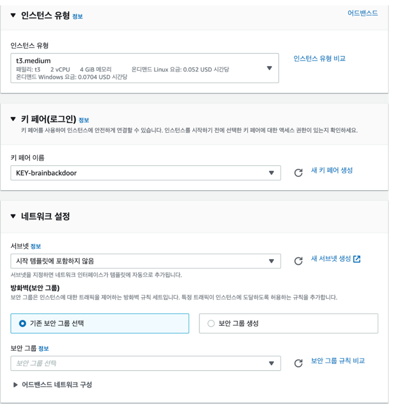
  * 인스턴스 유형, Key pair, 서브넷, 보안그룹 등을 `WAS에 적용할 정책`을 설정합니다.

  3. IAM 권한 설정
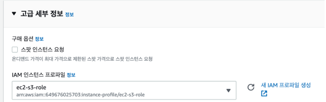
  * 배포 스크립트를 받기 위해서는 EC2에서 S3로 접근 가능해야 합니다.
  * 사전에 강사가 생성해둔 IAM 역할 `ec2-s3-api` 을 설정합니다.

  4. 배포 명령어 설정
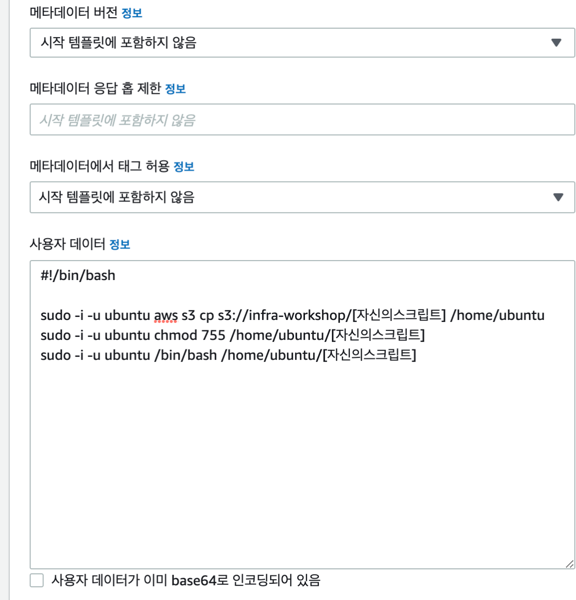
  * EC2가 정상적으로 실행된 후에 동작해야 할 명령어들을 입력합니다.
  ```
  #!/bin/bash

sudo apt-get update
sudo apt install unzip 
curl "https://awscli.amazonaws.com/awscli-exe-linux-x86_64.zip" -o "awscliv2.zip"
unzip awscliv2.zip
sudo ./aws/install

sudo -i -u ubuntu aws s3 cp s3://nextstep-camp-pro/[자신의스크립트] /home/ubuntu
sudo -i -u ubuntu chmod 755 /home/ubuntu/[자신의스크립트] 
sudo -i -u ubuntu /bin/bash /home/ubuntu/[자신의스크립트] 

  ```

3. Auto Scaling Group 생성
   1. Launch Template 설정
   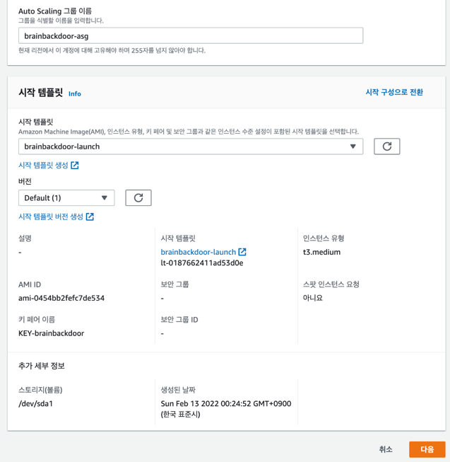
  * Launch Template 보안 패치 등의 이유로 버전이 바뀐다면 추후 Auto scaling group 상 템플릿 버전만 바꿔도 보안 패치가 이루어집니다.
  
  2. 네트워크 설정
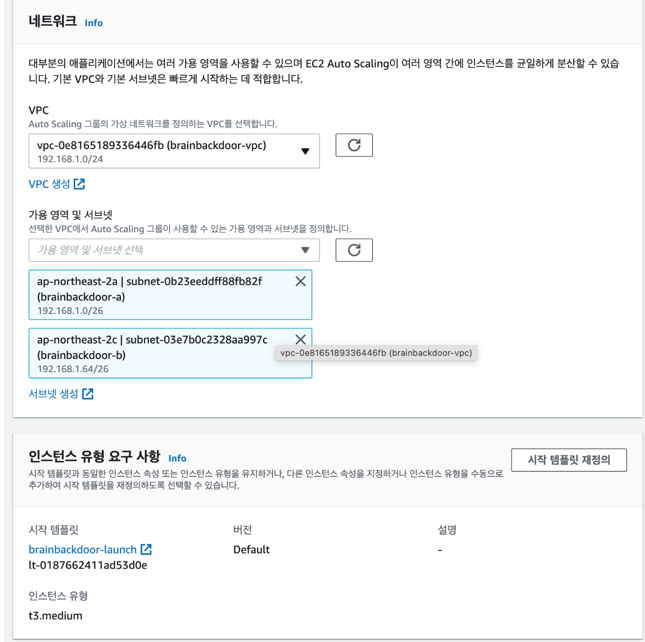
  * 자신의 VPC 인지 다시 확인합니다. 설정되어 있지 않다면, 여기서 설정합니다.
  * WAS 용도로 사용할 예정이므로 외부망 2개 서브넷을 설정해줍니다.

  3. 로드밸런서 생성
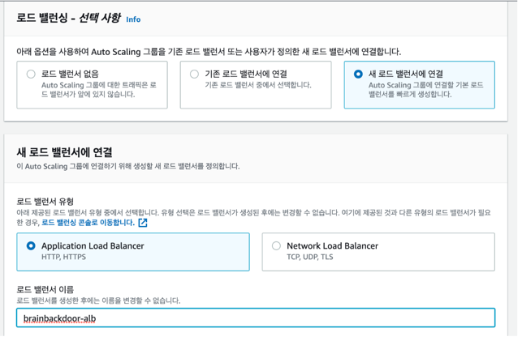
     * EC2 앞단에 부하분산 용도의 로드밸런서를 생성합니다.
     * Application Load Balancer 로 생성해야 이 후 WAF 등을 추가할 수 있습니다.

  4. 타겟 대상 생성
     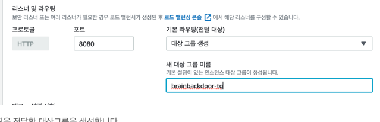
     * 로드밸런서의 트래픽을 전달할 대상그룹을 생성합니다.
     * 우리가 앞서 작성해둔 LaunchTemplate을 통해 생성되는 EC2 인스턴스가 타겟 대상 그룹에 속하게 됩니다. 

  5. 그룹 크기 설정
  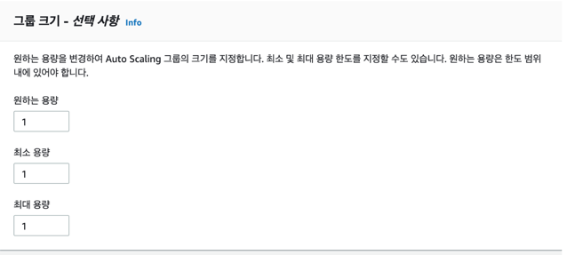
     * 생성하길 희망하는 EC2 인스턴스 갯수, 최소 갯수, 최대 갯수 등을 설정합니다. 사용하지 않는다면 0으로 두어도 좋습니다.

  6. 임계값 설정
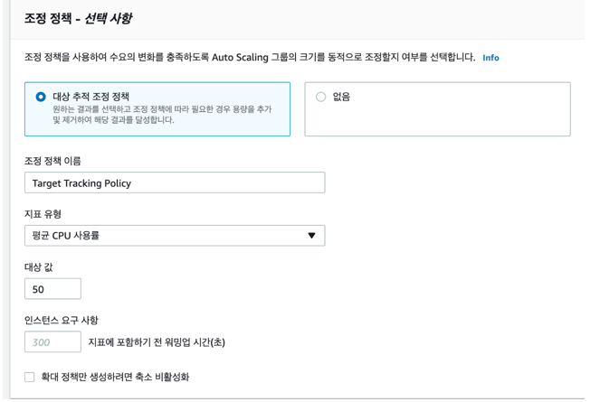
     * CPU 사용률, 네트워크 트래픽 등 특정 지표가 임계값에 이르면 EC2 인스턴스를 증설하도록 구성할 수 있어요.

  7. 종료 정책 구성
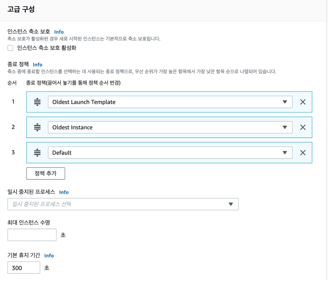

* 이 정책은 Auto Scaling Group 을 생성한 후에 편집을 통해 설정할 수 있어요.
* 기본 정책으로 둔다면, 그룹 크기를 줄일 때 임의로 서버를 종료시킵니다.
* Launch Template 버전, 오래전에 생성된 인스턴스 순으로 먼저 종료시키도록 종료 정책을 구성해봅니다.

4. DNS 설정
이제 DNS에는 CNAME으로 ALB도메인을 설정합니다.

5. TLS설정하기
기존에 생성한 인증서를 ACM에 가져옵니다.
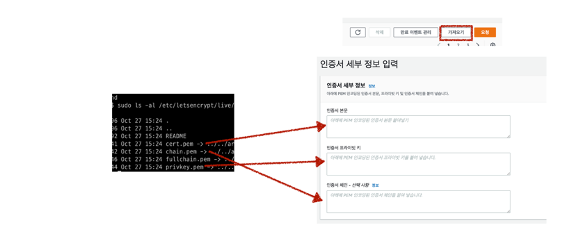
BEGIN CERTIFICATE와 END CERTIFICATE 까지 포함하여야 합니다.
   * 인증서 본문 -> cert.pem
   * 프라이빗 키 -> privkey.pem
   * 체인 -> chain.pem

* ALB에 인증서 적용하기
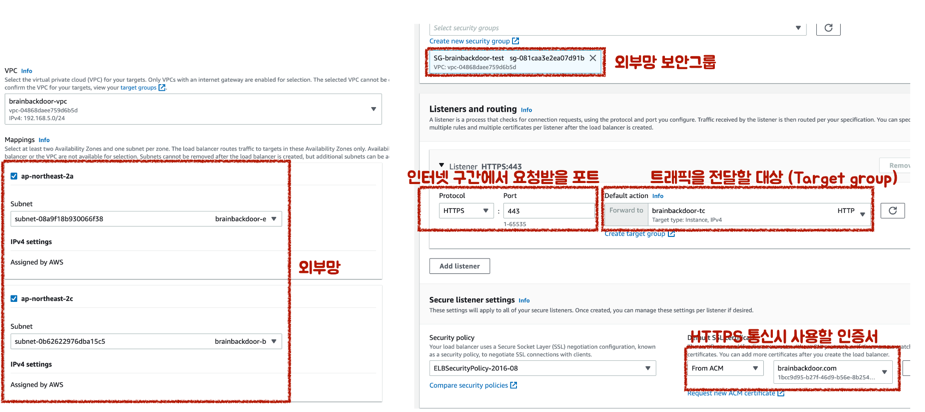

</details>

---

<details> 
<summary>🚀 3단계 - 쿼리 최적화</summary>

#### 실습환경 세팅
```
$ docker run -d -p 23306:3306 brainbackdoor/data-tuning:0.0.3
```

#### 요구사항
* [x] 활동중인(Active) 부서의 현재 부서관리자(manager) 중 연봉 상위 5위안에 드는 사람들이 최근에 각 지역별로 언제 퇴실(O)했는지 조회해보세요.
  (사원번호, 이름, 연봉, 직급명, 지역, 입출입구분, 입출입시간)
* [x] 인덱스 설정을 추가하지 않고 200ms 이하로 반환합니다.
    * M1의 경우엔 시간 제약사항을 달성하기 어렵습니다. 2s를 기준으로 해보시고 어렵다면, 일단 리뷰요청 부탁드려요
    * 급여 테이블의 사용여부 필드는 사용하지 않습니다. 현재 근무중인지 여부는 종료일자 필드로 판단해주세요.
</details>
