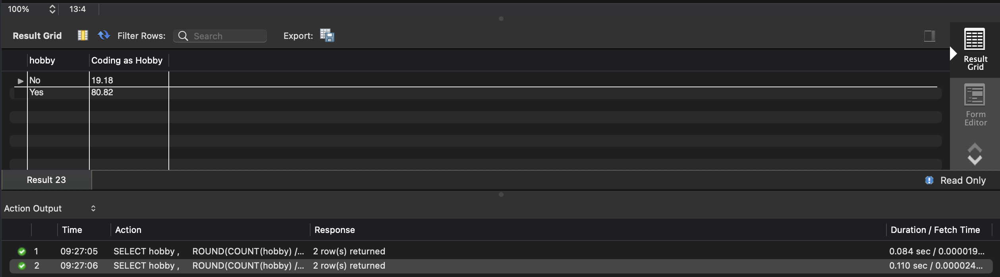
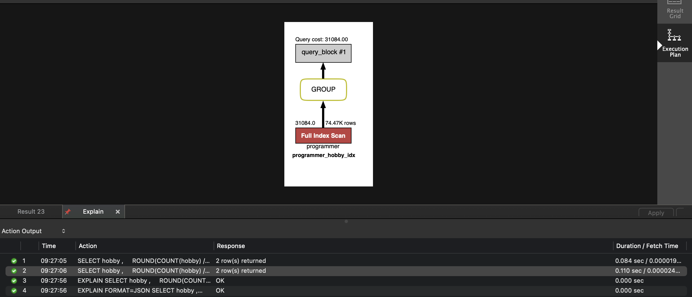
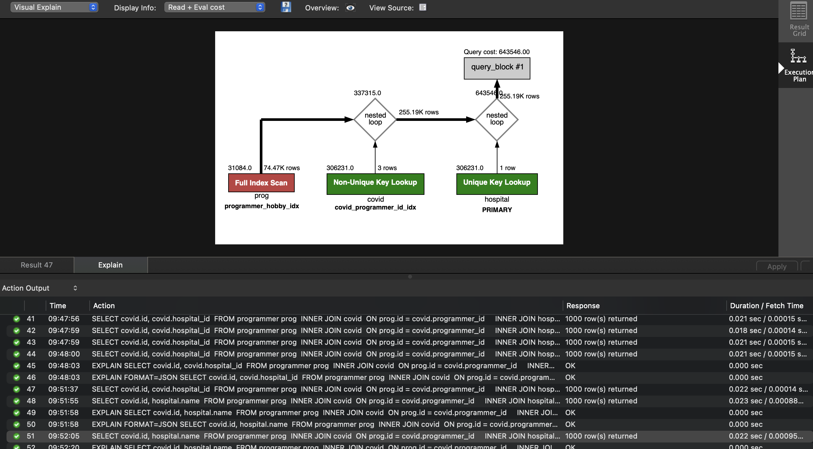
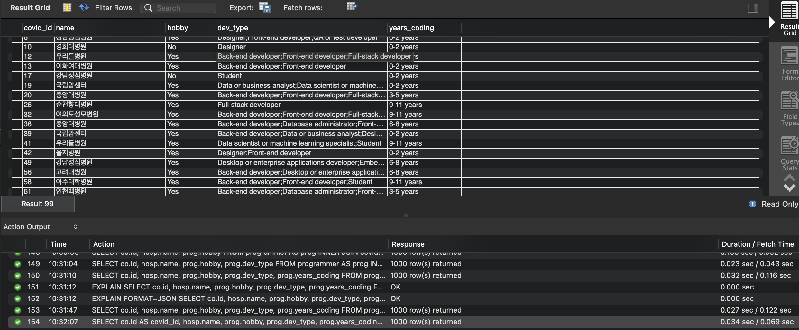
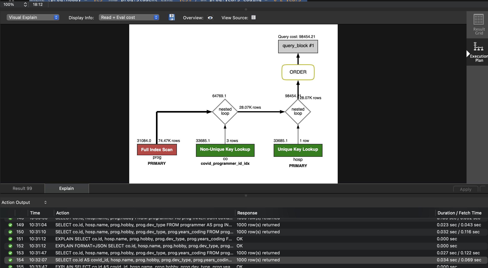
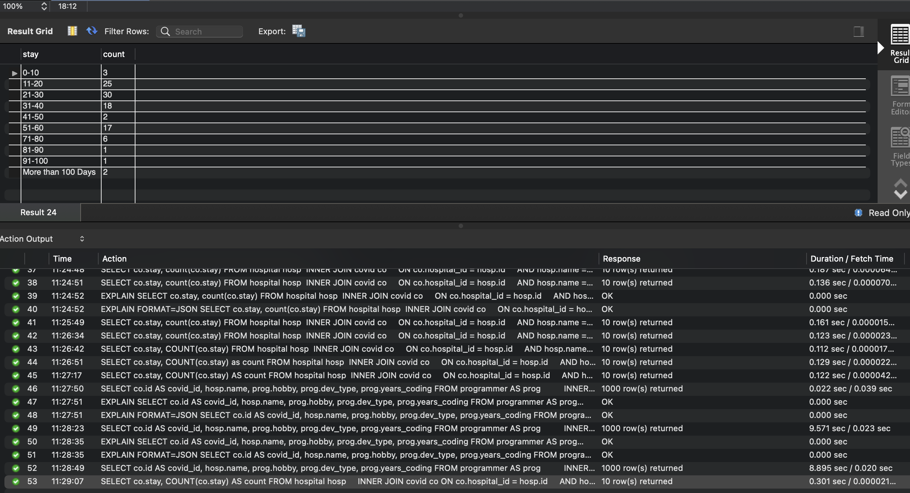
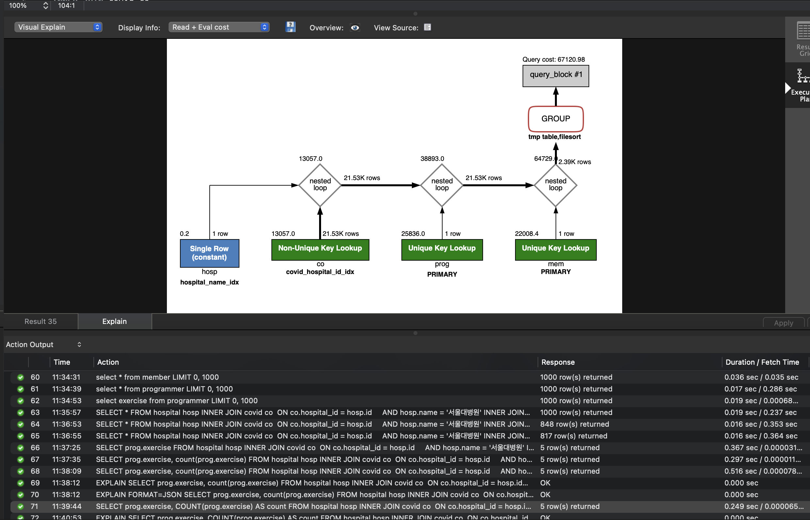

<p align="center">
    
</p>
<p align="center">
  
  
  <a href="https://edu.nextstep.camp/c/R89PYi5H" alt="nextstep atdd">
    
  </a>
  
</p>

<br>

# 인프라공방 샘플 서비스 - 지하철 노선도

<br>

## 🚀 Getting Started

### Install
#### npm 설치
```
cd frontend
npm install
```
> `frontend` 디렉토리에서 수행해야 합니다.

### Usage
#### webpack server 구동
```
npm run dev
```
#### application 구동
```
./gradlew clean build
```
<br>

## 미션

* 미션 진행 후에 아래 질문의 답을 작성하여 PR을 보내주세요.


### 1단계 - 화면 응답 개선하기
1. 성능 개선 결과를 공유해주세요 (Smoke, Load, Stress 테스트 결과)
    step1 folder 참조
2. 어떤 부분을 개선해보셨나요? 과정을 설명 해주세요
    gzip 압축 설정
    cache 및 TLS 설정
    경로 조회 캐싱 설정
---

### 2단계 - 스케일 아웃

1. Launch Template 링크를 공유해주세요.
https://ap-northeast-2.console.aws.amazon.com/ec2/v2/home?region=ap-northeast-2#LaunchTemplateDetails:launchTemplateId=lt-0977fe629ce708f90
   
2. cpu 부하 실행 후 EC2 추가생성 결과를 공유해주세요. (Cloudwatch 캡쳐)
  step2 cloud watch 이미지 참조
```sh
$ stress -c 2
```

3. 성능 개선 결과를 공유해주세요 (Smoke, Load, Stress 테스트 결과)
    step2 folder 참조
---

### 1단계 - 쿼리 최적화

1. 인덱스 설정을 추가하지 않고 아래 요구사항에 대해 1s 이하(M1의 경우 2s)로 반환하도록 쿼리를 작성하세요.

- 활동중인(Active) 부서의 현재 부서관리자 중 연봉 상위 5위안에 드는 사람들이 최근에 각 지역별로 언제 퇴실했는지 조회해보세요. (사원번호, 이름, 연봉, 직급명, 지역, 입출입구분, 입출입시간)

[쿼리 파일](step3/query.sql)


---

### 2단계 - 인덱스 설계

- 주어진 데이터셋을 활용하여 아래 조회 결과를 100ms 이하로 반환
    - M1의 경우엔 시간 제약사항을 달성하기 어렵습니다. 2배를 기준으로 해보시고 어렵다면, 일단 리뷰요청 부탁드려요

[쿼리 파일](step4/query.sql)
-[x] Coding as a Hobby 와 같은 결과를 반환하세요.







- [x] 프로그래머별로 해당하는 병원 이름을 반환하세요. (covid.id, hospital.name)





- [x] 프로그래밍이 취미인 학생 혹은 주니어(0-2년)들이 다닌 병원 이름을 반환하고 user.id 기준으로 정렬하세요. (covid.id, hospital.name, user.Hobby, user.DevType, user.YearsCoding)







- [x] 서울대병원에 다닌 20대 India 환자들을 병원에 머문 기간별로 집계하세요. (covid.Stay)




- [x] 서울대병원에 다닌 30대 환자들을 운동 횟수별로 집계하세요. (user.Exercise)




1. 인덱스 적용해보기 실습을 진행해본 과정을 공유해주세요.
실무 에서 table index 설정 시 가장 중요 하게 생각 하는 부분은 , 해당 테이블의 컬럼의 변경이 얼마나 자주 일어 나는지, 조회를 많이 하는 것인지 생각 하고 index 생성을 합니다.
또한 테이블의 cardinality 수가 적으면 index 생성을 할지 고민 하는 편이구요.
해당 미션 에는 우선.. 테이블 조회 관련된 미션 만 있엇고, 변경이 자주 일어나지 않는 pk / fk 위주로 인덱스를 생성 하였습니다.
마지막 2가지 미션 중 병원(hospital_name) 에 인덱스를 생성하지 않을 경우 추후에 hospital_name에 index 생성을 하였습니다. 해당 부분은 변경이 자주 일어나지 않고 조회성 으로
더 많이 사용될것 같아 적용 하였습니다.
workbench 의 도움을 받아... full scan 이 되는 부분은 최대한 index scan 이 타도록 적용 해 보았습니다.
---
### 추가 미션

1. 페이징 쿼리를 적용한 API endpoint를 알려주세요
