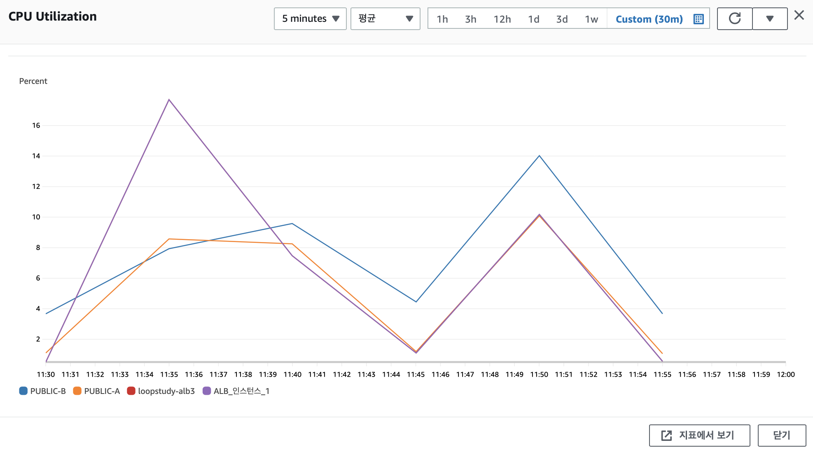
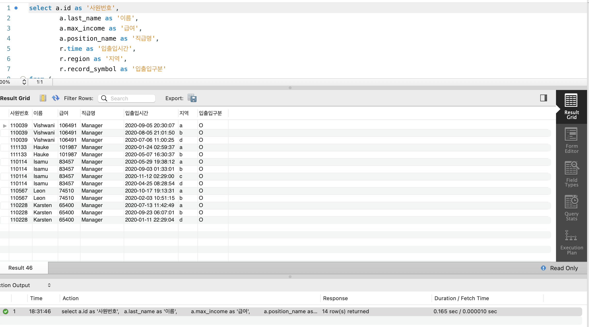
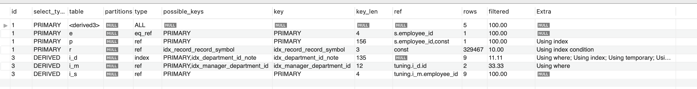
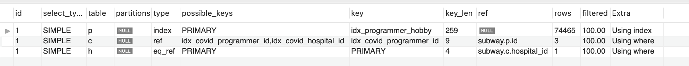
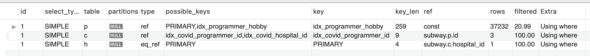
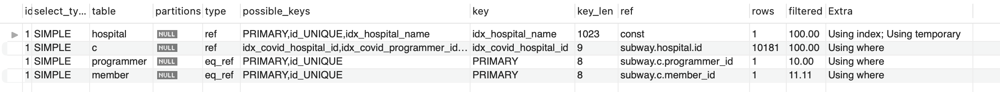
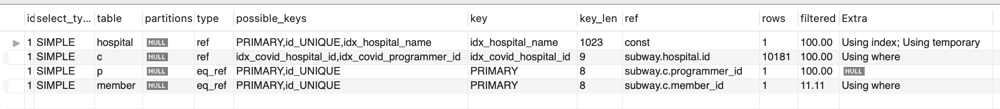

<p align="center">
    
</p>
<p align="center">
  
  
  <a href="https://edu.nextstep.camp/c/R89PYi5H" alt="nextstep atdd">
    
  </a>
  
</p>

<br>

# 인프라공방 샘플 서비스 - 지하철 노선도

<br>

## 🚀 Getting Started

### Install
#### npm 설치
```
cd frontend
npm install
```
> `frontend` 디렉토리에서 수행해야 합니다.

### Usage
#### webpack server 구동
```
npm run dev
```
#### application 구동
```
./gradlew clean build
```
<br>

## 미션

* 미션 진행 후에 아래 질문의 답을 작성하여 PR을 보내주세요.


## 1단계 - 화면 응답 개선하기
### 요구사항
- [x] Reverse Proxy 개선하기 (nginx)
  - [x] gzip 설정
  - [x] cache 설정
  - [x] TLS, HTTP/2 설정
 
- [] WAS 성능 개선
  - [x] Spring Data Cache
    - [x] Redis Server 세팅
    - [x] application.properties에 redis, cache 설정 추가
    - [x] build.gradle 의존성 추가
    - [x] 반복되는 작업에 캐쉬 적용하기
      - [x] line 조회 적용
      - [x] Path 조회 적용

  - [x] 비동기 처리
    - [x] 적절한 Thread pool size 구하기
      - Intel(R)Xeon(R) Platinum 8259CL CPU @2.50GHz
      - Cpu Cores : 1
      - physical id : 1
      - processor : 2
  
  - [x] Thread pool 설정 
    - [x] 애플리케이션 상황에 맞게 Thread Pool 설정
      - 기본 Thread 사이즈 : 2 
      - 최대 Thread 사이즈 : 4
      - MaxThread가 동작하는 경우 대기하는 Queue 사이즈 : 100 
    
1. 성능 개선 결과를 공유해주세요 (Smoke, Load, Stress 테스트 결과)
- 목표 성능 (https://pagespeed.web.dev/ 참고하여 작성)
 
| .   | FCP  | TTI  | SI   | LCP  | TBT    | CLS    |
|-----|------|------|------|------|--------|--------|
| 목표치 | 1.8초 | 3.8초 | 3.4초 | 2.5초 | 200밀리초 | 0.1 이하 |

- 지난 주와 성능 비교

| 사이트   | FCP    | TTI    | SI     | LCP    | TBT      | CLS     |
|-------|--------|--------|--------|--------|----------|---------|
| 개선 전  | 3.0초   | 3.0초   | 3.0초   | 3.0초   | 10 밀리초   | 0.000   |
| 개선 후  | 1.2초   | 1.3초   | 1.8초   | 1.3초   | 70 밀리초   | 0.004   |
| ----- | ------ | ------ | ------ | ------ | -------- | ------- |
| 비교    | -1.8초  | -1.7초  | -1.2초  | -1.7초  | +60 밀리초  | +0.004  |

- 부하테스트 (smoke, load, stress)
지난 주와 결과 비교는 부하테스트 폴더 참고 부탁드립니다.

2. 어떤 부분을 개선해보셨나요? 과정을 설명해주세요
- Reverse Proxy 개선방안으로 nginx에서 gzip 압축과 cache, HTTP/2 설정을 추가했습니다.
gzip.conf
```
  gzip on; ## http 블록 수준에서 gzip 압축 활성화
  gzip_comp_level 9;
  gzip_vary on;
  gzip_types text/plain text/css application/json application/x-javascript application/javascript text/xml application/xml application/rss+xml text/javascript image/svg+xml application/vnd.ms-fontobject application/x-font-ttf font/opentype;
```

cache.conf
```
## Proxy 캐시 파일 경로, 메모리상 점유할 크기, 캐시 유지기간, 전체 캐시의 최대 크기 등 설정
  proxy_cache_path /tmp/nginx levels=1:2 keys_zone=mycache:10m inactive=10m max_size=200M;

  ## 캐시를 구분하기 위한 Key 규칙
  proxy_cache_key "$scheme$host$request_uri $cookie_user";

    server {
        location ~* \.(?:css|js|gif|png|jpg|jpeg)$ {
            proxy_pass http://app;

            ## 캐시 설정 적용 및 헤더에 추가
            # 캐시 존을 설정 (캐시 이름)
            proxy_cache mycache;
            # X-Proxy-Cache 헤더에 HIT, MISS, BYPASS와 같은 캐시 적중 상태정보가 설정
            add_header X-Proxy-Cache $upstream_cache_status;
            # 200 302 코드는 20분간 캐싱
            proxy_cache_valid 200 302 10m;
            # 만료기간을 1 달로 설정
            expires 1M;
            # access log 를 찍지 않는다.
            access_log off;
        }
    }
```

nginx.conf 
```
events {}
http {
    upstream app {
        server 172.17.0.1:8080;

    }

    server {
        listen 80;
        return 301 https://$host$request_uri;
    }

    server {
        listen 443 ssl http2;
        ssl_certificate /etc/letsencrypt/live/loopstudy.kro.kr/fullchain.pem;
        ssl_certificate_key /etc/letsencrypt/live/loopstudy.kro.kr/privkey.pem;

        # Disable SSL
        ssl_protocols TLSv1 TLSv1.1 TLSv1.2;

        # 통신과정에서 사용할 암호화 알고리즘
        ssl_prefer_server_ciphers on;
        ssl_ciphers ECDH+AESGCM:ECDH+AES256:ECDH+AES128:DH+3DES:!ADH:!AECDH:!MD5;

        # Enable HSTS
        # client의 browser에게 http로 어떠한 것도 load 하지 말라고 규제합니다.
        # 이를 통해 http에서 https로 redirect 되는 request를 minimize 할 수 있습니다.
        add_header Strict-Transport-Security "max-age=31536000" always;

        # SSL sessions
        ssl_session_cache shared:SSL:10m;
        ssl_session_timeout 10m;

        location / {
          proxy_pass http://app;
        }
    }

    # gzip
    include /etc/nginx/gzip.conf;
    # cache
    include /etc/nginx/cache.conf;
}
```

- WAS 성능 개선을 위해서 기존 조회에 오래 걸렸던 '역 조회', '경로 탐색'에 레디스를 적용하여 캐쉬처리했습니다.
```
    @Cacheable(value = "path", key = "{#source-#target}")
    public PathResponse findPath(Long source, Long target) {
        ....
    }
```

---

## 2단계 - 스케일 아웃
### 요구사항
- [x] springboot에 HTTP Cache, gzip 설정하기 


- [x] AWS S3 배포스크립트 업로드 
- [x] Launch Template 작성하기
- [x] Auto Scaling Group 생성하기
- [x] Smoke, Load, Stress 테스트 후 결과를 기록

1. Launch Template 링크를 공유해주세요
   https://ap-northeast-2.console.aws.amazon.com/ec2/v2/home?region=ap-northeast-2#LaunchTemplateDetails:launchTemplateId=lt-0206013aee338803a

### 배포 명령어 
``` 
sudo apt-get update
sudo apt install default-jre -y
sudo apt install default-jdk -y

sudo apt install docker.io -y
sudo docker pull redis
sudo docker run -d -p 6379:6379 redis
 
sudo apt install unzip 
curl "https://awscli.amazonaws.com/awscli-exe-linux-x86_64.zip" -o "awscliv2.zip"
unzip awscliv2.zip
sudo ./aws/install

sudo -i -u ubuntu aws s3 cp s3://nextstep-infra-workshop/loopstudy-deploy2.sh /home/ubuntu
sudo -i -u ubuntu chmod 755 /home/ubuntu/loopstudy-deploy2.sh
sudo -i -u ubuntu /bin/bash /home/ubuntu/loopstudy-deploy2.sh
```

 
2. cpu 부하 실행 후 EC2 추가생성 결과를 공유해주세요. (Cloudwatch 캡쳐)


3. 성능 개선 결과를 공유해주세요 (Smoke, Load, Stress 테스트 결과)
2단계 부하테스트 폴더 참고 부탁드립니다. 
--- 

### 3단계 - 쿼리 최적화

1. 인덱스 설정을 추가하지 않고 아래 요구사항에 대해 1s 이하(M1의 경우 2s)로 반환하도록 쿼리를 작성하세요.
- 활동중인(Active) 부서의 현재 부서관리자 중 연봉 상위 5위안에 드는 사람들이 최근에 각 지역별로 언제 퇴실했는지 조회해보세요. (사원번호, 이름, 연봉, 직급명, 지역, 입출입구분, 입출입시간)
```
select a.id as '사원번호',
		a.last_name as '이름',
        a.max_income as '급여',
        a.position_name as '직급명',
        r.time as '입출입시간',
        r.region as '지역',
        r.record_symbol as '입출입구분'
from (
	select e.id,
			e.last_name,
			s.max_income,
			p.position_name 
	from (select id, last_name from employee) as e
	inner join (
		select max(i_s.annual_income) as max_income, 
				i_m.employee_id
		from (select department_id, employee_id from manager where end_date > now()) as i_m
		inner join (select id from department where note = 'Active') as i_d on i_d.id = i_m.department_id
		inner join salary as i_s on i_m.employee_id = i_s.id
		group by i_m.employee_id
		order by max_income desc 
		limit 0, 5
	) as s on s.employee_id = e.id 
	inner join (select id, position_name from position where position_name = 'Manager') as p on p.id = s.employee_id
) as a
inner join (select employee_id, time, region, record_symbol from record where record_symbol = 'O') as r on a.id = r.employee_id
;
```  

- 조회 시간


- explain


---

## 4단계 - 인덱스 설계
### 요구사항
- [x] 주어진 데이터셋을 활용하여 아래 조회 결과를 100ms 이하로 반환

1. 인덱스 적용해보기 실습을 진행해본 과정을 공유해주세요
- [x] Coding as a Hobby 와 같은 결과를 반환하세요.
``` 
ALTER TABLE `subway`.`programmer` 
CHANGE COLUMN `id` `id` BIGINT(20) NOT NULL ,
ADD PRIMARY KEY (`id`),
ADD UNIQUE INDEX `id_UNIQUE` (`id` ASC);

CREATE INDEX `idx_programmer_hobby`  ON `subway`.`programmer` (hobby) COMMENT '' ALGORITHM DEFAULT LOCK DEFAULT;
 
-- 0.036 sec / 0.0000088 sec
select hobby as '취미', 
round(count(1) / (select count(1) from programmer), 3) * 100 as '비율'
from (select hobby from programmer) as p
group by hobby
;
```


- [x] 프로그래머별로 해당하는 병원 이름을 반환하세요. (covid.id, hospital.name)
```
ALTER TABLE `subway`.`hospital` 
CHANGE COLUMN `id` `id` BIGINT(20) NOT NULL ,
ADD PRIMARY KEY (`id`),
ADD UNIQUE INDEX `id_UNIQUE` (`id` ASC);

ALTER TABLE `subway`.`covid` 
CHANGE COLUMN `id` `id` BIGINT(20) NOT NULL ,
ADD PRIMARY KEY (`id`),
ADD UNIQUE INDEX `id_UNIQUE` (`id` ASC);

CREATE INDEX `idx_covid_hospital_id`  ON `subway`.`covid` (hospital_id) COMMENT '' ALGORITHM DEFAULT LOCK DEFAULT;
CREATE INDEX `idx_covid_programmer_id`  ON `subway`.`covid` (programmer_id) COMMENT '' ALGORITHM DEFAULT LOCK DEFAULT;

-- 0.0045 sec / 0.0021 sec
select c.id, c.programmer_id, h.name
from (select id, name from hospital) as h
inner join (select id, programmer_id, hospital_id from covid) as c on h.id = c.hospital_id 
inner join (select id from programmer) as p on c.programmer_id = p.id
;
```


- [x] 프로그래밍이 취미인 학생 혹은 주니어(0-2년)들이 다닌 병원 이름을 반환하고 user.id 기준으로 정렬하세요. (covid.id, hospital.name, programmer.Hobby, programmer.DevType, programmer.YearsCoding)
```
-- 0.0043 sec / 0.015 sec
select p.id, h.name, p.hobby, p.student, p.dev_type, p.years_coding
from (select id, name from hospital) as h
inner join (select hospital_id, programmer_id from covid) as c on h.id = c.hospital_id 
inner join (select id, hobby, student, dev_type, years_coding from programmer where hobby = 'Yes' and (student like 'Yes%' or years_coding like '0%')) as p on p.id = c.programmer_id
;
```


- [x] 서울대병원에 다닌 20대 India 환자들을 병원에 머문 기간별로 집계하세요. (covid.Stay)
```
ALTER TABLE `subway`.`member` 
CHANGE COLUMN `id` `id` BIGINT(20) NOT NULL ,
ADD PRIMARY KEY (`id`),
ADD UNIQUE INDEX `id_UNIQUE` (`id` ASC);
;

CREATE INDEX `idx_programmer_member_id`  ON `subway`.`programmer` (member_id) COMMENT '' ALGORITHM DEFAULT LOCK DEFAULT;
CREATE INDEX `idx_hospital_name`  ON `subway`.`hospital` (name) COMMENT '' ALGORITHM DEFAULT LOCK DEFAULT;

-- 0.088 sec / 0.0000088 sec
select c.stay, count(1)
from (select id from member where age like '2%') as m
inner join (select stay, member_id, programmer_id, hospital_id from covid) as c on m.id = c.member_id  
inner join (select id from programmer where country = 'India') as p on c.programmer_id = p.id
inner join (select id from hospital where name = '서울대병원') as h on c.hospital_id = h.id
group by c.stay
order by null
;
```


- [x] 서울대병원에 다닌 30대 환자들을 운동 횟수별로 집계하세요. (user.Exercise)
```
-- 0.091 sec / 0.0000091 sec
select p.exercise, count(1)
from (select id from member where age like '3%') as m
inner join (select member_id, programmer_id, hospital_id from covid) as c on m.id = c.member_id  
inner join (select id from hospital where name = '서울대병원') as h on c.hospital_id = h.id
inner join programmer as p on p.id = c.programmer_id
group by p.exercise 
order by null
;
```



### 추가 미션

1. 페이징 쿼리를 적용한 API endpoint를 알려주세요