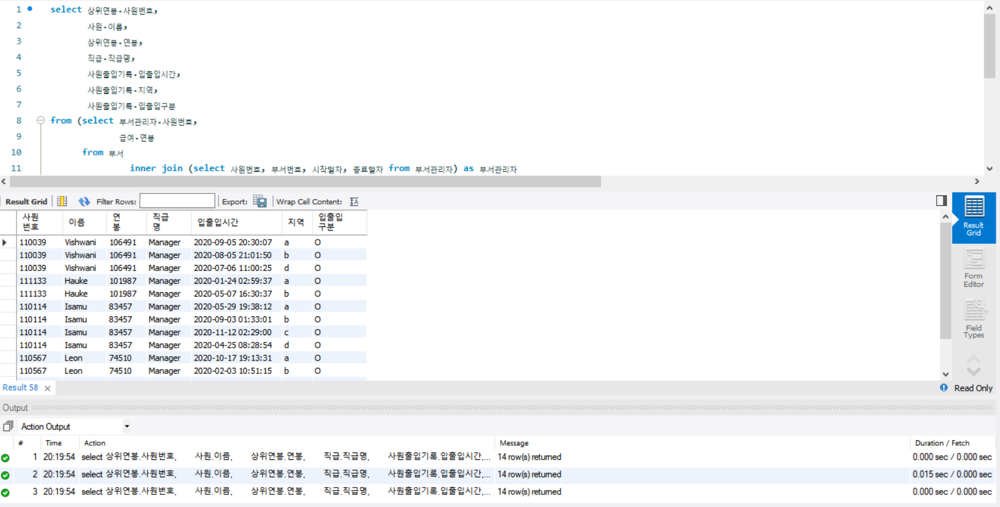
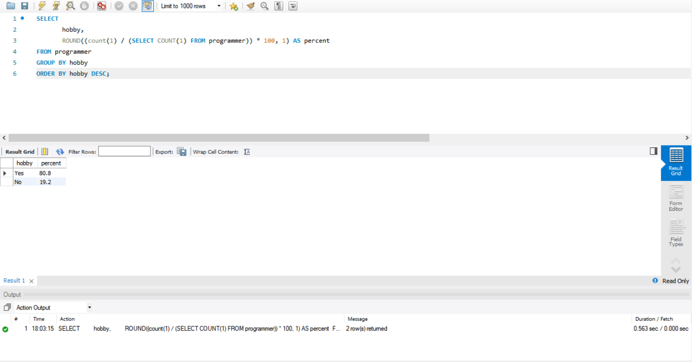
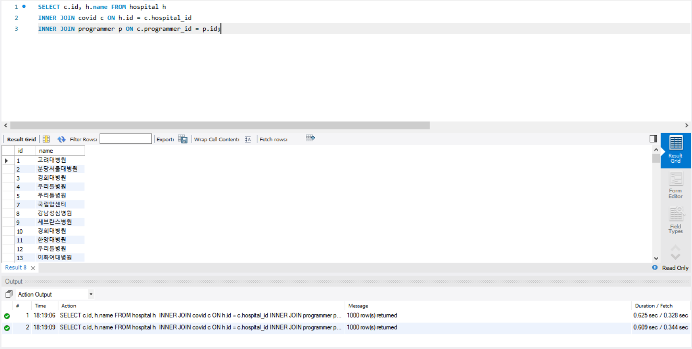
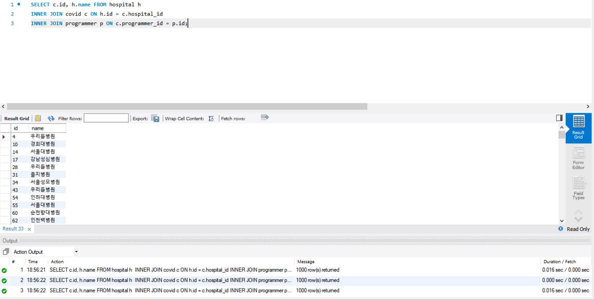
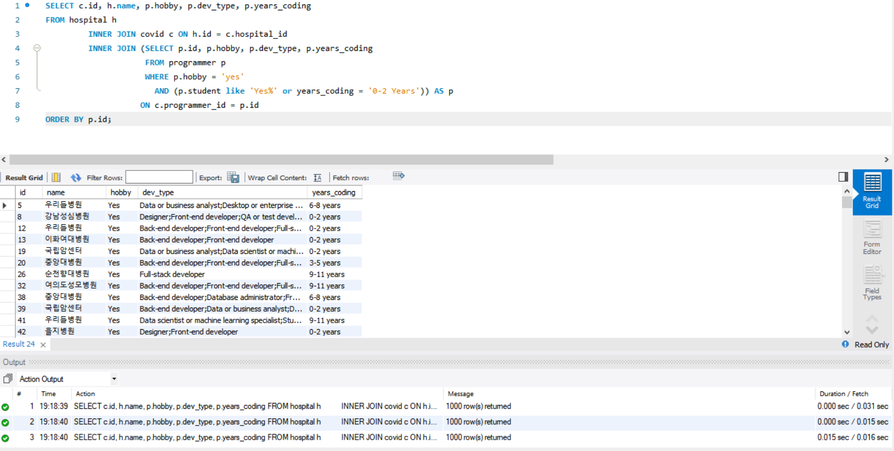
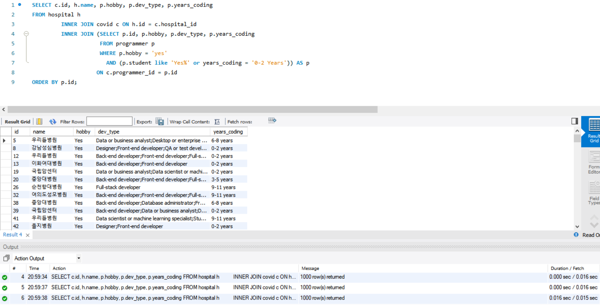
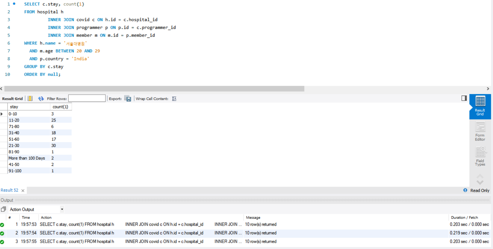
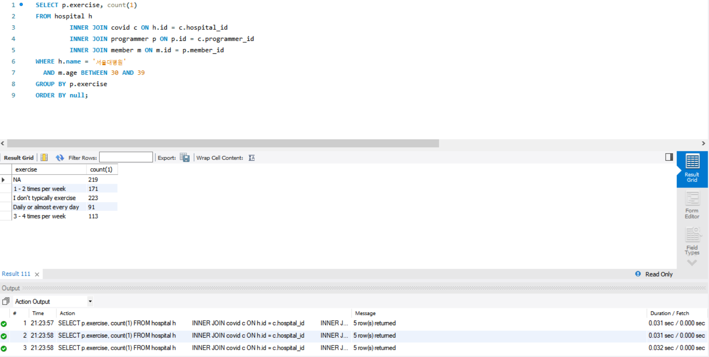

<p align="center">
    
</p>
<p align="center">
  
  
  <a href="https://edu.nextstep.camp/c/R89PYi5H" alt="nextstep atdd">
    
  </a>
  
</p>

<br>

# 인프라공방 샘플 서비스 - 지하철 노선도

<br>

## 🚀 Getting Started

### Install
#### npm 설치
```
cd frontend
npm install
```
> `frontend` 디렉토리에서 수행해야 합니다.

### Usage
#### webpack server 구동
```
npm run dev
```
#### application 구동
```
./gradlew clean build
```
<br>

## 미션

* 미션 진행 후에 아래 질문의 답을 작성하여 PR을 보내주세요.

### 1단계 - 화면 응답 개선하기
1. 성능 개선 결과를 공유해주세요 (Smoke, Load, Stress 테스트 결과)

2. 어떤 부분을 개선해보셨나요? 과정을 설명해주세요

---

### 2단계 - 조회 성능 개선하기

#### A. 쿼리 최적화
활동중인(Active) 부서의 현재 부서관리자 중 연봉 상위 5위안에 드는 사람들이 최근에 각 지역별로 언제 퇴실했는지 조회해 보세요.<br/>
(사원번호, 이름, 연봉, 직급명, 지역, 입출입구분, 입출입시간) <br/>

```sql
select 상위연봉.사원번호,
       사원.이름,
       상위연봉.연봉,
       직급.직급명,
       사원출입기록.입출입시간,
       사원출입기록.지역,
       사원출입기록.입출입구분
from (select 부서관리자.사원번호,
             급여.연봉
      from 부서
               inner join (select 사원번호, 부서번호, 시작일자, 종료일자 from 부서관리자) as 부서관리자
                          on 부서.부서번호 = 부서관리자.부서번호 and 부서.비고 = 'ACTIVE'
                              and now() between 부서관리자.시작일자 and 부서관리자.종료일자
               inner join (select 급여.연봉, 급여.사원번호, 급여.시작일자, 급여.종료일자 from 급여) as 급여
                          on 부서관리자.사원번호 = 급여.사원번호
                              and now() between 급여.시작일자 and 급여.종료일자
      order by 급여.연봉 desc
      limit 5
     ) as 상위연봉
         inner join 사원 on 상위연봉.사원번호 = 사원.사원번호
         inner join 직급 on 상위연봉.사원번호 = 직급.사원번호 and now() between 직급.시작일자 and 직급.종료일자
         inner join 사원출입기록 on 상위연봉.사원번호 = 사원출입기록.사원번호 and 사원출입기록.입출입구분 = 'o'
order by 상위연봉.연봉 desc, 사원출입기록.지역;

```


```sql
CREATE INDEX idx_사원출입기록_입출입구분 ON 사원출입기록 (입출입구분);
CREATE INDEX idx_사원출입기록_사원번호 ON 사원출입기록 (사원번호);
```


#### B. 인덱스 설계

- Coding as a Hobby 와 같은 결과를 반환하세요.
```sql
SELECT 
       hobby, 
       ROUND((count(1) / (SELECT COUNT(1) FROM programmer)) * 100, 1) AS percent 
FROM programmer
GROUP BY hobby
ORDER BY hobby DESC;
```

```sql
CREATE INDEX idx_programmer_hobby ON programmer (hobby);
```


- 프로그래머별로 해당하는 병원 이름을 반환하세요. (covid.id, hospital.name)
```sql
SELECT c.id, h.name FROM hospital h 
INNER JOIN covid c ON h.id = c.hospital_id
INNER JOIN programmer p ON c.programmer_id = p.id;
```

```sql
ALTER TABLE covid ADD PRIMARY KEY (id);
ALTER TABLE hospital ADD PRIMARY KEY (id);
ALTER TABLE programmer ADD PRIMARY KEY (id);

CREATE INDEX idx_covid_programmer_id  ON covid (programmer_id);
CREATE INDEX idx_covid_hospital_id  ON covid (hospital_id);
```


- 프로그래밍이 취미인 학생 혹은 주니어(0-2년)들이 다닌 병원 이름을 반환하고 user.id 기준으로 정렬하세요.
  - covid.id, hospital.name, user.Hobby, user.DevType, user.YearsCoding
```sql
SELECT c.id, h.name, p.hobby, p.dev_type, p.years_coding
FROM hospital h
         INNER JOIN covid c ON h.id = c.hospital_id
         INNER JOIN (SELECT p.id, p.hobby, p.dev_type, p.years_coding
                     FROM programmer p
                     WHERE p.hobby = 'yes'
                       AND (p.student like 'Yes%' or years_coding = '0-2 Years')) AS p
                    ON c.programmer_id = p.id
ORDER BY p.id;
```


```sql
CREATE INDEX idx_programmer_years_coding  ON programmer (years_coding);
CREATE INDEX idx_programmer_student  ON programmer (student);
CREATE INDEX idx_programmer_hobby  ON programmer (hobby);
```



- 서울대병원에 다닌 20대 India 환자들을 병원에 머문 기간별로 집계하세요. (covid.Stay)
```sql
SELECT c.stay, count(1)
FROM hospital h
         INNER JOIN covid c ON h.id = c.hospital_id
         INNER JOIN programmer p ON p.id = c.programmer_id
         INNER JOIN member m ON m.id = p.member_id
WHERE h.name = '서울대병원'
  AND m.age BETWEEN 20 AND 29
  AND p.country = 'India'
GROUP BY c.stay
ORDER BY null;
```

```sql
ALTER TABLE hospital MODIFY name varchar(255) NOT NULL;
CREATE INDEX idx_hospital_name ON hospital (name);
CREATE INDEX idx_programmer_country ON programmer (country);
CREATE INDEX idx_programmer_member_id ON programmer (member_id);
CREATE INDEX idx_member_age ON member (age);
```


- 서울대병원에 다닌 30대 환자들을 운동 횟수별로 집계하세요. (user.Exercise)
```sql
SELECT p.exercise, count(1)
FROM hospital h
         INNER JOIN covid c ON h.id = c.hospital_id
         INNER JOIN programmer p ON p.id = c.programmer_id
         INNER JOIN member m ON m.id = p.member_id
WHERE h.name = '서울대병원'
  AND m.age BETWEEN 30 AND 39
GROUP BY p.exercise
ORDER BY null;
```


```sql
CREATE INDEX idx_hospital_name ON hospital (name);
CREATE INDEX idx_covid_hospital_id  ON covid (hospital_id);
CREATE INDEX idx_member_age ON member (age);
```


#### C. 페이징 쿼리
- 페이징 쿼리를 적용한 API endpoint를 알려주세요
  - /stations, /lines, /favorites
