<p align="center">
    
</p>
<p align="center">
  
  
  <a href="https://edu.nextstep.camp/c/R89PYi5H" alt="nextstep atdd">
    
  </a>
  
</p>

<br>

# 인프라공방 샘플 서비스 - 지하철 노선도

<br>

## 🚀 Getting Started

### Install
#### npm 설치
```
cd frontend
npm install
```
> `frontend` 디렉토리에서 수행해야 합니다.

### Usage
#### webpack server 구동
```
npm run dev
```
#### application 구동
```
./gradlew clean build
```
<br>

## 미션

* 미션 진행 후에 아래 질문의 답을 작성하여 PR을 보내주세요.


### 1단계 - 화면 응답 개선하기
  * 1단계 요구사항
    부하테스트 각 시나리오의 요청시간을 목푯값 이하로 개선
    - [X] 개선 전 / 후를 직접 계측하여 확인
    

1. 성능 개선 결과를 공유해주세요 (Smoke, Load, Stress 테스트 결과)
   * ###FCP 
      - 개선전 : 2.6초
      - web 서버 성능 개선 : 1.2초
      - was 개선 : 1.2초
     
   * ###Smoke
     * 개선전 
     
     * web 서버 성능 개선 
     
     * was 서버 성능 개선
     
   * ###Load
     * 개선전
     
     * web 서버 성능 개선
     
     * was 서버 성능 개선
     
   * ###Stress  
     * 개선전 - vus(256)
     
     * web 서버 성능 개선 - vus(270) 
     
     * was 서버 성능 개선 - vus(300)
     
   

3. 어떤 부분을 개선해보셨나요? 과정을 설명해주세요
   1. web 서버 성능 개선 
      - gzip 압축 활성화
      - 웹 cache 설정  
      - http2 설정
   2. was 서버 개선
      - 경로조회 API 부분 Redis Cache 적용
      - spring boot gzip 적용 

   > ~~전반적으로 성능개선을 진행하면서 WEB 서버를 개선했을때 속도 측면에서는 제일 많이
   > 개선 되었습니다.  
   > WAS 레디스와 gizp 설정으로 속도적인 측면에서는 오히려 늘어난감이 있었는데 Stress 테스트시  
   > 더 많은 성공율을 보여주네요~~ 
   > 환경설정을 잘못해서 실제 프로덕션에서는 잘 못 동작 했었네요 
   > 개선하면 개선할수록 더 많은 부하를 버팀을 확인하였습니다.

    

---

### 2단계 - 스케일 아웃

# 요구 사항 
* 실습 
  * 미션 요구사항
    - [X] 모든 정적 자원에 대해 no-cache, private 설정을 하고 테스트 코드를 통해 검증 합니다.
    - [X] 확장자는 css인 경우는 max-age를 1년, js인 경우는 no-cache, private 설정을 합니다.
    - [X] 모든 정적 자원에 대해 no-cache, no-store 설정을 한다. 가능한가요?  
       => 가능합니다. HttpServletResponse 객체에 직접 헤더를 할당하는 방식으로 구현하면 될듯 싶습니다. 
        ```text
           response.setHeader("Cache-Control", "no-cache, no-store"); 
       ```
    
* 요구 사항
  - [X] springboot에 HTTP Cache, gzip 설정하기
  - [X] Launch Template 작성하기
  - [X] Auto Scaling Group 생성하기
  - [X] Smoke, Load, Stress 테스트 후 결과를 기록


1. Launch Template 링크를 공유해주세요.  
   https://ap-northeast-2.console.aws.amazon.com/ec2/v2/home?region=ap-northeast-2#LaunchTemplates:launch-template-name=kbh0581-Launch-Template

2. cpu 부하 실행 후 EC2 추가생성 결과를 공유해주세요. (Cloudwatch 캡쳐)
    - cpu 부하를 9 정도 줬을때 오토스케일링이 발생하여 인스턴스가 늘어났습니다.
    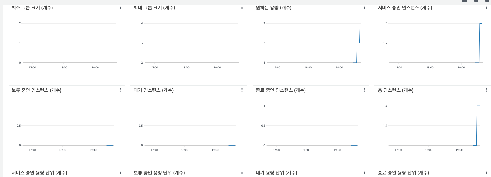
    
```sh
$ stress -c 2
```

3. 성능 개선 결과를 공유해주세요 (Smoke, Load, Stress 테스트 결과)
    - smoke 
    
    - load
    
    - stress 
    
   > 결과적으로 오토스케일링의 효과로 인하여 vus 2400 정도 부하를 버티는것으로 확인하였습니다.

---

### 3단계 - 쿼리 최적화

1. 인덱스 설정을 추가하지 않고 아래 요구사항에 대해 1s 이하(M1의 경우 2s)로 반환하도록 쿼리를 작성하세요.

- 활동중인(Active) 부서의 현재 부서관리자 중 연봉 상위 5위안에 드는 사람들이 최근에 각 지역별로 언제 퇴실했는지 조회해보세요. (사원번호, 이름, 연봉, 직급명, 지역, 입출입구분, 입출입시간)

* 쿼리 
```sql
SELECT a.id            AS 사원번호,
       a.last_name     AS 이름,
       a.annual_income AS 연봉,
       a.position_name AS 직급명,
       Max(time)       AS 입출입시간,
       r.record_symbol AS 입출입구분,
       r.region        AS 지역
FROM   (SELECT e.id,
               e.last_name,
               s.annual_income,
               p.position_name
        FROM   manager m
               JOIN department dept
                 ON m.department_id = dept.id
                    AND dept.note = 'active'
                    AND m.end_date >= Now()
               JOIN salary s
                 ON s.id = m.employee_id
                    AND s.end_date >= Now()
               JOIN employee e
                 ON m.employee_id = e.id
               JOIN `position` p
                 ON e.id = p.id
                    AND p.position_name = 'manager'
        ORDER  BY annual_income DESC
        LIMIT  5) a
       JOIN record r
         ON a.id = r.employee_id
            AND r.record_symbol = 'O'
GROUP  BY a.id,
          a.last_name,
          a.annual_income,
          a.position_name,
          r.record_symbol,
          r.region
ORDER  BY a.annual_income DESC,
          r.region 

```
* 그룹 바이를 쓴 이유
> record 테이블에 record_symbol이 퇴실(o)인 경우가 한 id당 한개가 이후에도 보장 될까 하는 마음에 작성하였습니다.
> id당 한개가 추후에도 보장된 환경이라면 제거가 가능할껏 같습니다.
```sql
SELECT a.id            AS 사원번호,
       a.last_name     AS 이름,
       a.annual_income AS 연봉,
       a.position_name AS 직급명,
       r.time       AS 입출입시간,
       r.record_symbol AS 입출입구분,
       r.region        AS 지역
FROM   (SELECT e.id,
               e.last_name,
               s.annual_income,
               p.position_name
        FROM   manager m
               JOIN department dept
                 ON m.department_id = dept.id
                    AND dept.note = 'active'
                    AND m.end_date >= Now()
               JOIN salary s
                 ON s.id = m.employee_id
                    AND s.end_date >= Now()
               JOIN employee e
                 ON m.employee_id = e.id
               JOIN `position` p
                 ON e.id = p.id
                    AND p.position_name = 'manager'
        ORDER  BY annual_income DESC
        LIMIT  5) a
       JOIN record r
         ON a.id = r.employee_id
            AND r.record_symbol = 'O'
ORDER  BY a.annual_income DESC,
          r.region 
```

* 결과 
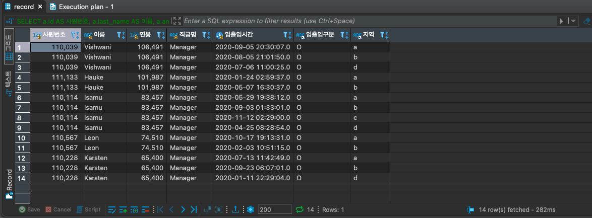


---

### 4단계 - 인덱스 설계

1. 인덱스 적용해보기 실습을 진행해본 과정을 공유해주세요

- [X] Coding as a Hobby 와 같은 결과를 반환하세요.
  - SQL
   ```sql 
       SELECT hobby,
       ROUND(COUNT(hobby) / (SELECT COUNT(hobby)
                          FROM   programmer p) * 100, 1) AS rate
       FROM   programmer
       GROUP  BY hobby;
   ```     
   * 이전 실행 계획
    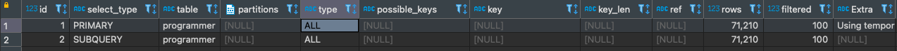
   * 작업 내용 
     1. hobby에 인덱스 추가
     ```sql 
     CREATE INDEX programmer_hobby_IDX USING BTREE ON subway.programmer (hobby); 
     ```
     2. 실행 계획
     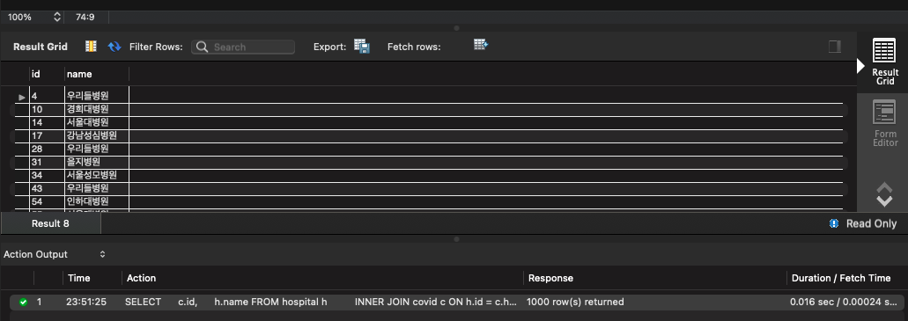
     3. 결과 80ms
     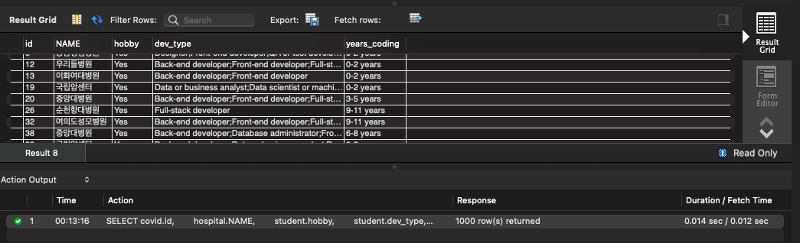
      
- [X] 프로그래머별로 해당하는 병원 이름을 반환하세요. (covid.id, hospital.name)
  - SQL 
  ```sql
     SELECT c.id,h.name
     FROM   covid c
        JOIN hospital h
          ON c.hospital_id = h.id
        JOIN programmer p
          ON c.programmer_id = p.id; 
  ```
    * 이전 실행 계획
      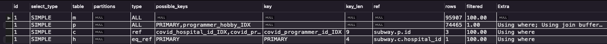
    * 작업 내용
      1. 각 테이블에 PK 추가 
      ```sql
         alter table covid add primary key(id)
         alter table hospital add primary key(id)
         alter table programmer add primary key(id)
      ```
      2. covid 테이블에 인덱스 추가 
      ```sql
       CREATE INDEX covid_hospital_id_IDX ON subway.covid (hospital_id);
       CREATE INDEX covid_programmer_id_IDX ON subway.covid (programmer_id);     
      ```
      3. 실행 계획 & 결과 - 0.61ms
         * 실행 계획 
           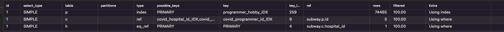
         * 결과 
           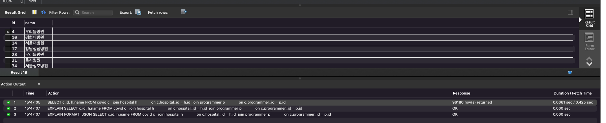
     
      
   - [X] 프로그래밍이 취미인 학생 혹은 주니어(0-2년)들이 다닌 병원 이름을 반환하고 user.id 기준으로 정렬하세요. (covid.id, hospital.name, user.Hobby, user.DevType, user.YearsCoding)
     - SQL    
     ```sql
           SELECT c.id,
                  h.name,
                  p.hobby,
                  p.dev_type,
                  p.years_coding
           FROM   programmer p
                  JOIN covid c
                    ON p.id = c.programmer_id
                  JOIN hospital h
                    ON c.hospital_id = h.id
                  JOIN member m
                    ON p.member_id = m.id
           WHERE  p.hobby = 'YES'
                  AND ( ( p.years_coding = '0-2 years' )
                         OR ( p.student LIKE 'Yes%' ) )
           ORDER  BY p.id; 
      ```
     * 이전 실행 계획
      
     * 작업 내용
       * memeber 테이블에 pk 추가 
       ```sql
       alter table member add primary key(id);
       ```
       * programer 테이블에 member_id 인덱스 추가
       ```sql
        CREATE INDEX programmer_member_id_IDX  ON subway.programmer (member_id);
       ```
       * 실행 계획 & 결과 : 0.78ms
         * 실행 계획 
          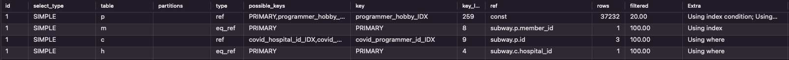
         * 결과
          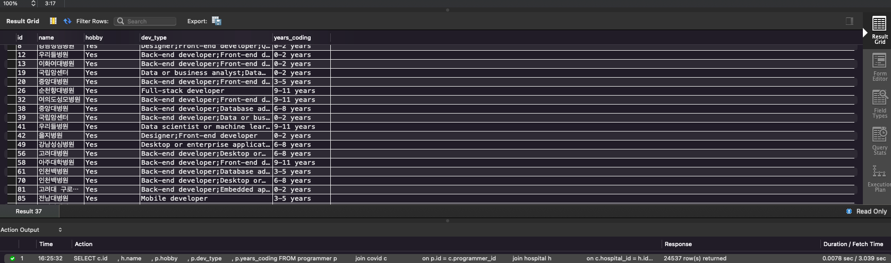
       
   - [X] 서울대병원에 다닌 20대 India 환자들을 병원에 머문 기간별로 집계하세요. (covid.Stay)
     - SQL
     ```sql
        SELECT c.stay, COUNT(*) count
        FROM   programmer p
               JOIN covid c
                 ON c.programmer_id = p.id
               JOIN member m
                 ON c.member_id = m.id
               JOIN hospital h
                 ON c.hospital_id = h.id
        WHERE  h.name = '서울대병원'
               AND p.country = 'India'
               AND m.age BETWEEN 20 AND 29 
        group by c.stay;
     ```
     * 이전 실행 계획
       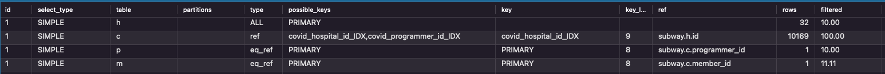
     * 작업 내용
       * covid 테이블에 member_id 인덱스 추가
       ```sql
          CREATE INDEX covid_member_id_IDX ON subway.covid (member_id);
       ```
    
     * 실행 계획 & 결과 : 0.17ms 
         * 실행 계획
          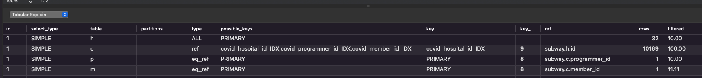
         * 결과
          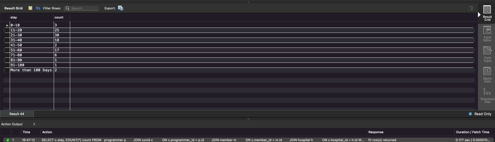
           
   - [X] 서울대병원에 다닌 30대 환자들을 운동 횟수별로 집계하세요. (user.Exercise)
     - SQL
     ```sql
        SELECT p.exercise,
               COUNT(*) count
        FROM   programmer p
               JOIN covid c
                 ON c.programmer_id = p.id
               JOIN member m
                 ON c.member_id = m.id
               JOIN hospital h
                 ON c.hospital_id = h.id
        WHERE  h.name = '서울대병원'
               AND m.age BETWEEN 30 AND 39
        GROUP  BY exercise; 
     ```
     * 실행 계획 & 결과 : 0.01ms 미만
           * 실행 계획
            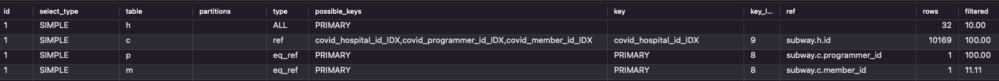
         * 결과
            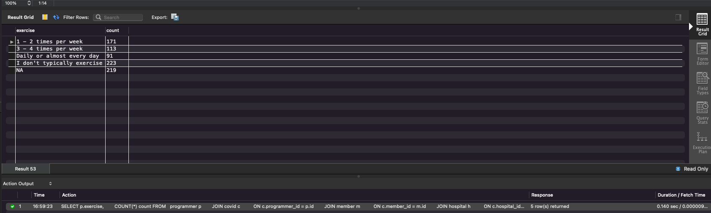
     > 단계를 수행 하면서 이미 튜닝된 결과로 해당 부분은 별도 튜닝이 필요 없어 보입니다.
---

### 추가 미션

1. 페이징 쿼리를 적용한 API endpoint를 알려주세요
