<p align="center">
    
</p>
<p align="center">
  
  
  <a href="https://edu.nextstep.camp/c/R89PYi5H" alt="nextstep atdd">
    
  </a>
  
</p>

<br>

# 인프라공방 샘플 서비스 - 지하철 노선도

<br>

## 🚀 Getting Started

### Install
#### npm 설치
```
cd frontend
npm install
```
> `frontend` 디렉토리에서 수행해야 합니다.

### Usage
#### webpack server 구동
```
npm run dev
```
#### application 구동
```
./gradlew clean build
```
<br>

## 미션

* 미션 진행 후에 아래 질문의 답을 작성하여 PR을 보내주세요.


### 1단계 - 화면 응답 개선하기
1. 성능 개선 결과를 공유해주세요 (Smoke, Load, Stress 테스트 결과)

#### 개선 전

1. Smoke Test(http://3.35.223.220/d/bvXIAmq7z/k6-smoke-testing-results?orgId=1&from=1656599880000&to=1656600599000)
2. Load Test(http://3.35.223.220/d/080n0mqnz/k6-load-testing-results?orgId=1&from=1656597900000&to=1656599100000)
3. Stress Test(http://3.35.223.220/d/TMFSAmq7k/k6-stress-test-result?orgId=1&from=1656598800000&to=1656599699000)

#### 개선 후
1. Smoke Test(http://3.35.223.220/d/bvXIAmq7z/k6-smoke-testing-results?orgId=1&from=1656668640000&to=1656669299000)
2. Load Test(http://3.35.223.220/d/080n0mqnz/k6-load-testing-results?orgId=1&from=1656669300000&to=1656670200000)
3. Stress Test(http://3.35.223.220/d/TMFSAmq7k/k6-stress-test-result?orgId=1&from=1656667140000&to=1656667920000)

#### 성능 비교 표(pageSpeed)

| https://jhsong2580.kro.kr/ | FCP(Sec) | LCP(Sec) | TTI(Sec) | TBT(mSec) |
|:--------------------------:|:--------:|:--------:|:--------:|:---------:|
|            개선전             |   14.8   |   15.3   |   15.4   |    510    |
|     1차 개선 (캐싱/Gzip설정)      |   5.4    |   6.0    |   6.1    |    560    |
|      3차 개선 (Http2설정)       |   5.2    |   5.7    |   5.7    |    400    |


| https://jhsong2580.kro.kr/stations | FCP(Sec) | LCP(Sec) | TTI(Sec) | TBT(mSec) |
|:--------------------------:|:--------:|:--------:|:--------:|:---------:|
|            개선전             |   16.7   |   16.7   |   25.7   |   8_510   |
|      1차 개선 (캐싱/Gzip설정)       |   7.1    |   7.1    |   17.1   |   9_720   |
|      2차 개선 (redis 캐싱설정)       |   6.8    |   6.8    |   13.4   |   6_330   |
|      3차 개선 (Http2설정)       |   6.8    |   6.8    |   12.9   |   5_950   |

| https://jhsong2580.kro.kr/lines | FCP(Sec) | LCP(Sec) | TTI(Sec) | TBT(mSec) |
|:-------------------------------:|:--------:|:--------:|:--------:|:---------:|
|               개선전               |   16.2   |   16.2   |   17.9   |   1_210   |
|        1차 개선 (캐싱/Gzip설정)        |   6.8    |   6.8    |   8.3    |   1_240   |
|       2차 개선 (redis 캐싱설정)        |   6.8    |   6.8    |   8.0    |   1_040   |
|       3차 개선 (Http2설정)         |   6.7    |   6.8    |   7.9    |   1_030   |

#### 성능비교 표(K6)
| testType |                      개선전                      |                      개선후                      | 
|:--------:|:---------------------------------------------:|:---------------------------------------------:|
|  smoke   | 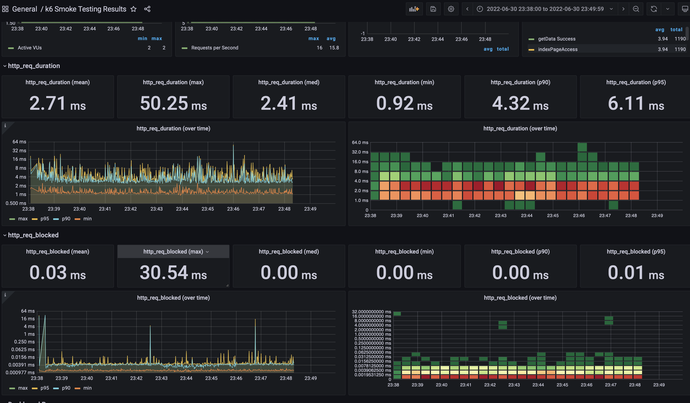  | 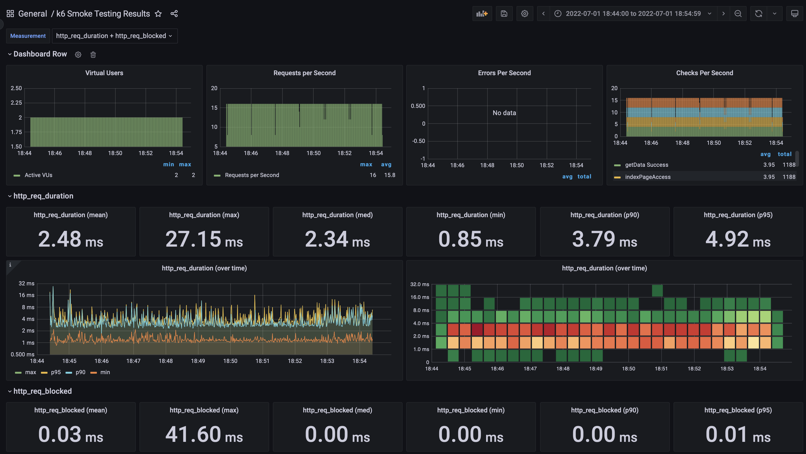  |   
|   load   |  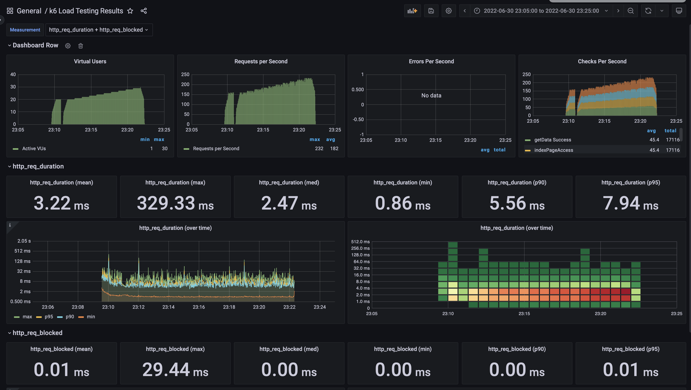  |  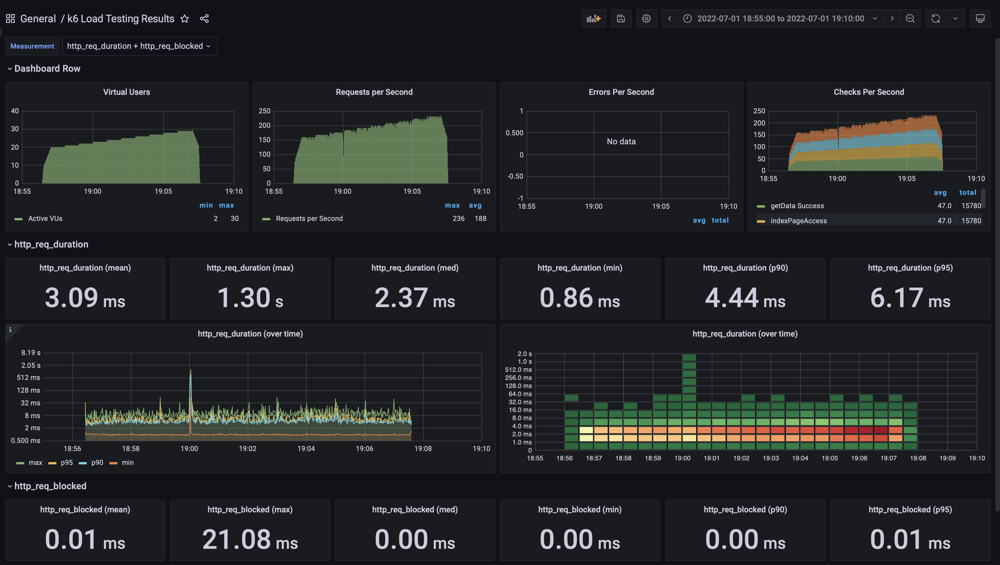  |   
|  stress  | 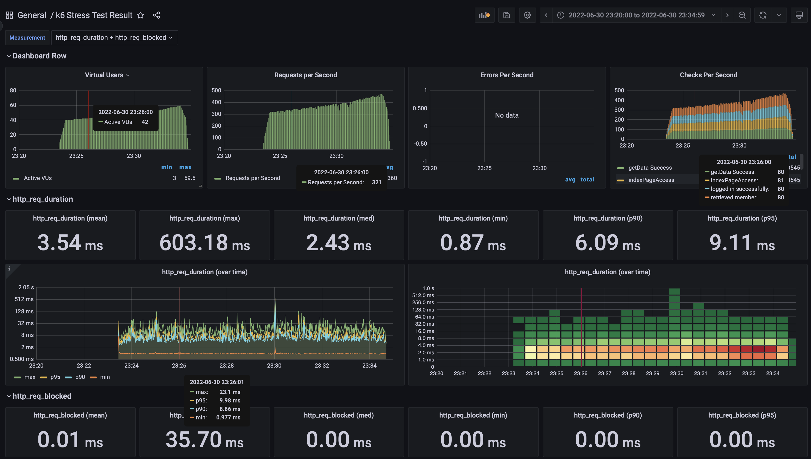 | 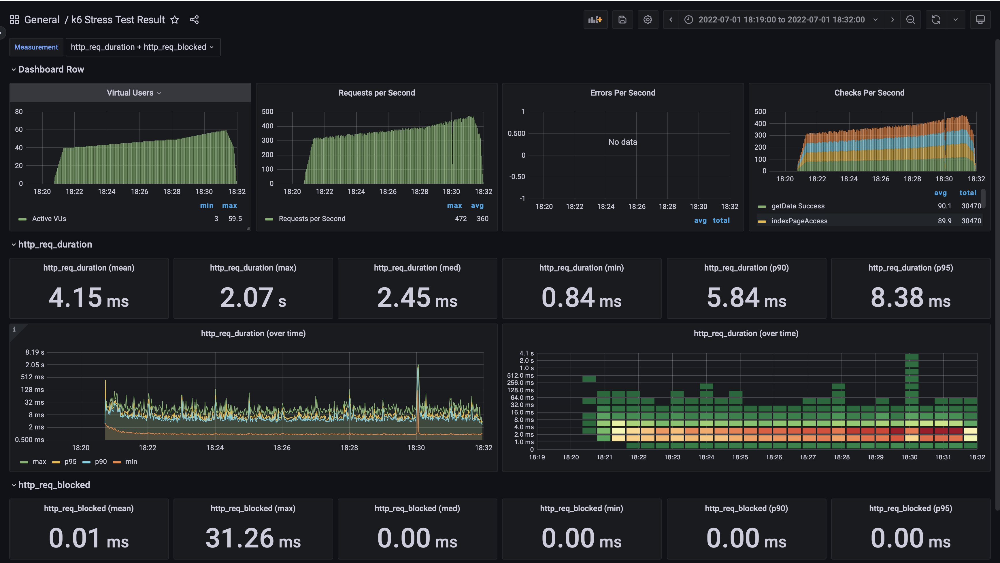 |   
 
###개선 전 후 vuser 수용 가능량

|      | 수용 가능한 vuser |                  Cloudwatch                  |                  비고                  |
|:----:|:------------:|:--------------------------------------------:|:------------------------------------:|
| 개선 전 |     338      |  | vuser 338명 이후로 급격하게 요청시간이 늘어남을 알수 있다 |
| 개선 후 |     360      | 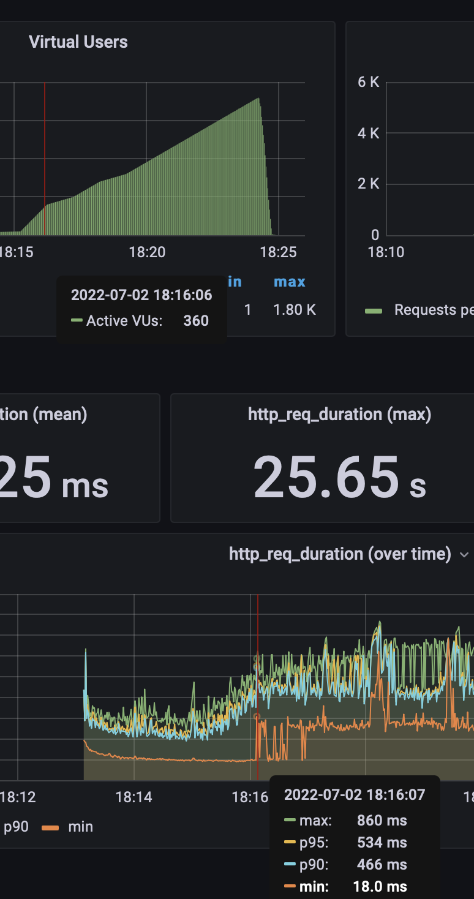 | vuser 360명 이후로 급격하게 요청시간이 늘어남을 알수 있다 |


2. 어떤 부분을 개선해보셨나요? 과정을 설명해주세요
   0. 점검
      1. thread.dump 점검 결과 교착 걸린 부분이나 지나치게 CPU 점유기간이 긴 쓰레드는 없음
   1. 1차 개선
      1. Gzip : 가장 높은 압축률(9)로 압축 설정
      2. Proxy Cache 설정 : css,이미지들을 한달간 캐싱한다.
   2. 2차개선 (/lines, /stations)
      1. line.findAll(), station.findAll()에 대해 캐싱한다
   3. 3차개선 (Http2 설정)


---

### 2단계 - 스케일 아웃

1. Launch Template 링크를 공유해주세요.
   https://ap-northeast-2.console.aws.amazon.com/ec2/home?region=ap-northeast-2#LaunchTemplateDetails:launchTemplateId=lt-090ddf89b23bf5e3c
2. cpu 부하 실행 후 EC2 추가생성 결과를 공유해주세요. (Cloudwatch 캡쳐)
   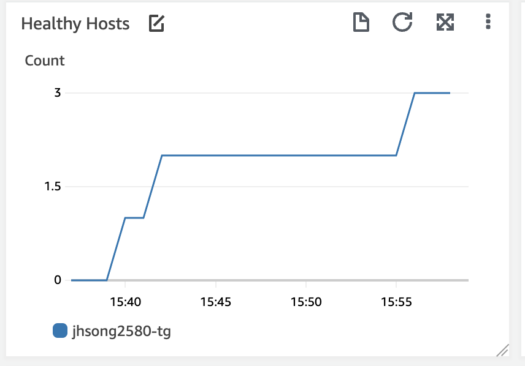
  
   1. 세션별 Reverse proxy기능을 위해 Target Group에 대해 Stickiness옵션 설정
```sh
$ stress -c 2
```

3. 성능 개선 결과를 공유해주세요 (Smoke, Load, Stress 테스트 결과)

### 개선 전/후 vuser 수용 가능량

|                        | 수용 가능한 vuser |                       Cloudwatch                       |                  비고                   |
|:----------------------:|:------------:|:------------------------------------------------------:|:-------------------------------------:|
|          개선 전          |     338      |  | vuser 338명 이후로 급격하게 요청시간이 늘어남을 알수 있다  |
|      개선 후(step1)       |     360      |  | vuser 360명 이후로 급격하게 요청시간이 늘어남을 알수 있다  |
| 개선 후(step2 - scaleOut) |     1340     | 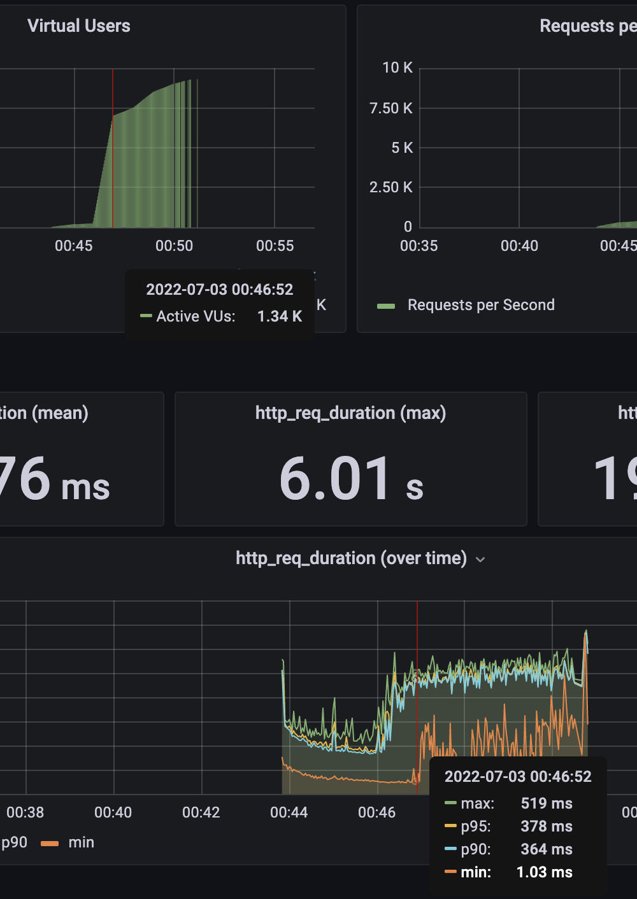 | vuser 1340명 이후로 급격하게 요청시간이 늘어남을 알수 있다 |


#### 성능비교 표(K6)
| testType |                      개선전                      |                      개선후                      | 
|:--------:|:---------------------------------------------:|:---------------------------------------------:|
|  smoke   |   | 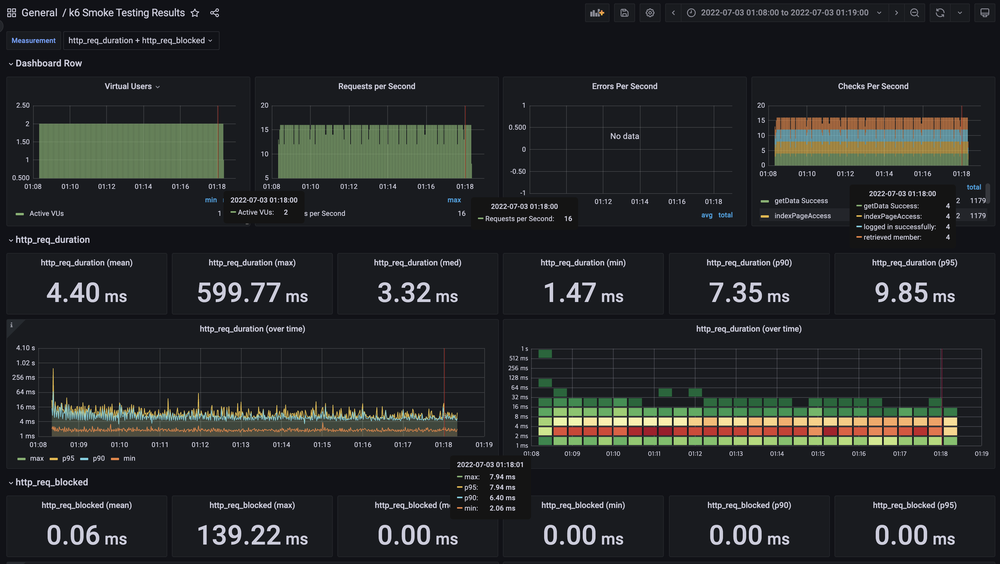  |   
|   load   |    |  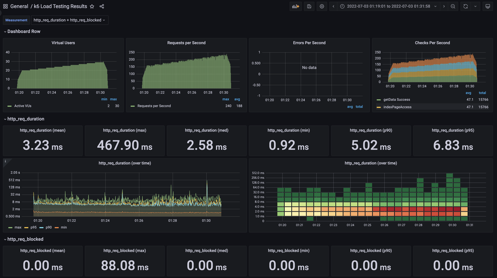  |   
|  stress  | 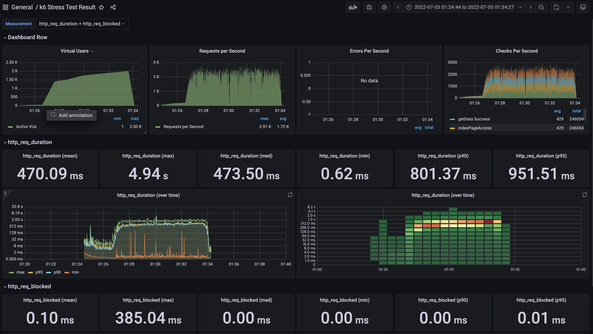 | 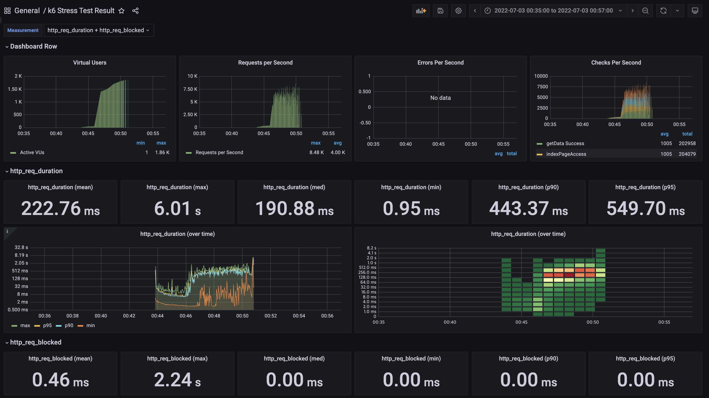 | 


#### 리뷰어님 코멘트
##### CDN? (Content Delivery Network)
 - 서버와 사용자 사이의 물리적인 거리를 줄여 콘텐츠 로딩에 소요되는 시간을 감소시킴
 - 각 지역의 캐시 서버를 분산 배치에 근접한 사용자의 요청에 원본 서버가 아닌 캐시서버가 콘텐츠를 전

##### 분산서버 형태에서 Redis에 Session 저장 (https://dev-setung.tistory.com/39)
 - 세션을 관리하는 Redis서버를 별도로 두어, 어느 서버로 접근하던 Redis서버에서 세션을 참조한다.

---

### 1단계 - 쿼리 최적화

1. 인덱스 설정을 추가하지 않고 아래 요구사항에 대해 1s 이하(M1의 경우 2s)로 반환하도록 쿼리를 작성하세요.
  - 활동중인(Active) 부서의 현재 부서관리자 중 연봉 상위 5위안에 드는 사람들이 최근에 각 지역별로 언제 퇴실했는지 조회해보세요. (사원번호, 이름, 연봉, 직급명, 지역, 입출입구분, 입출입시간)

    1. 일단 조회해보자 (평균 소요시간 : 0.45sec)
       select e.id as 사원번호, e.last_name as 이름, e.annual_income as 연봉, "Manager" as 직급명, r.time as 입출입시간, r.region as 지역, 'O' as 입출입구분 from (
           select e.*, s.annual_income from employee as e
               join (
                   select employee_id from manager
                       where end_date ="9999-01-01"
                           and employee_id in (select  id from position where position_name="manager") ##POSITION이 manager
                           and employee_id in (select employee_id from employee_department where department_id in (select id from department where note="active"))
               ) as m on m.employee_id = e.id
               join (
                   select id as salary_id, annual_income from salary where end_date ="9999-01-01"
               ) as s on s.salary_id = e.id
               order by s.annual_income desc 
               limit 0,5
        ) as e
        join (
            select employee_id, time, region  from record
                where record_symbol="O"
                    and region <> ""
        ) as r on r.employee_id = e.id
        order by 연봉 desc, 지역;

       1. 1차 조회 결과(정상, 평균 0.43sec)
          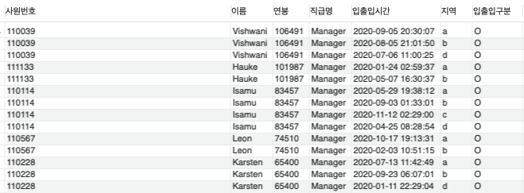
       2. 실행계획
          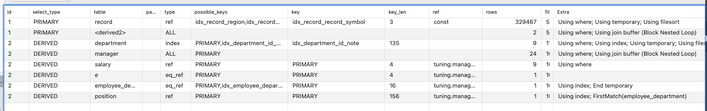
          1. Manager과 Record에서 풀스캔 발생

    2. 쿼리 개선(0.432sec)
       1. 서브쿼리가 아닌 join으로 변경하는것이 좋다(update와 delete문은 서브쿼리가 활성화되지 않는다)
       2. 가독성과 Join Table 의 Column값의 자유로운 사용을 위해 depth 1을 까지만 join하도록 노력한다.
select m.employee_id as 사원번호, m.last_name as 이름, m.annual_income as 연봉, m.position_name as 직급명, r.region as 지역, r.record_symbol as 입출입구분, r.time as 입출입시간  
    from (
        select m.employee_id, e.last_name, s.annual_income, p.position_name from manager as m
            join position as p on (m.end_date="9999-01-01" and p.position_name="manager" and m.employee_id = p.id)
            join department as d on (d.note="active" and d.id = m.department_id)
            join salary as s on (s.end_date = "9999-01-01" and s.id = m.employee_id)
            join employee as e on (m.employee_id = e.id)
            order by s.annual_income desc
            limit 0, 5
        ) as m
    join record as r on (r.record_symbol="O" and r.region <> "" and r.employee_id = m.employee_id)
    order by m.annual_income desc, r.region;
       3. 실행계획
          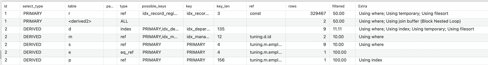
          1. 서브쿼리를 없앤 후 Join을 통해서 쿼리 하니 All scan이 사라지고 key lookup으로 개선된걸 확인할수 있었음
          2. 최대한 낮은 depth로 쿼리를 작성하니, 중간에 불필요한 tmp table을 생성/유지하기위한 메모리를 절약할수 있었음
    3. db 서버 튜닝 (튜닝결과 : 효과 미미함)
       1. innodb buffer pool size 
       2. key_buffer
       3. tmp_table_size
       4. max_heap_table_size
---
---

### 2단계 - 인덱스 설계

1. 인덱스 적용해보기 실습을 진행해본 과정을 공유해주세요
    1. key, foreign key 매핑하기
       ```
       alter table covid add primary key (id);
       alter table hospital add primary key(id);
       alter table programmer add primary key(id);
       alter table hospital modify column id bigint(20);
       alter table covid add foreign key(hospital_id) references hospital(id);
       alter table covid add foreign key(programmer_id) references programmer(id);
       ```

    3. 프로그래머별로 해당하는 병원 이름을 반환하세요. (covid.id, hospital.name)
       1. 일단 조회하기(4.14sec)
          ```
          select c.programmer_id, h.name from hospital as h
              join covid as c on c.hospital_id = h.id
              join programmer as p on c.programmer_id = p.id;
          ```
       2. indexing설정 내역 및 설정 후 쿼리 속도(0.0053sec)
          1. 각 테이블 별 기본키 / 외래키 설정을 통한 자동 인덱싱
       3. 개선 전 실행계획

          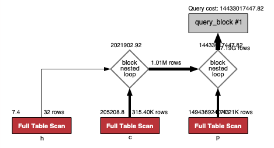
       4. 개선 후 실행계획
       
          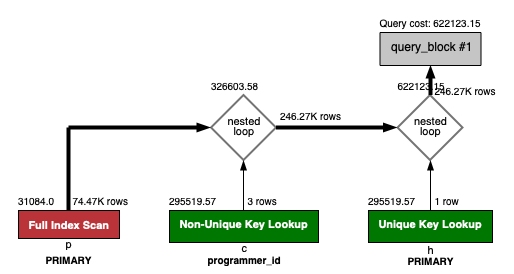
          1. covid - hospital foreign key 에 의한 indexing
          2. hospital primary key 에 대한 indexing

    4. 프로그래밍이 취미인 학생 혹은 주니어(0-2년)들이 다닌 병원 이름을 반환하고 user.id 기준으로 정렬하세요. (covid.id, hospital.name, user.Hobby, user.DevType, user.YearsCoding) 
       1. 일단 조회하기(조회불가)
          1. 특이사항 : 시작 모수를 programmer가 아닌 covid를 driving table로 설정시, 시작 모수가 많아 executing시간이 1분을 넘어간다.
       ```
       select c.id, h.name, p.hobby, p.dev_type, p.years_coding  from programmer as p    -- and (years_coding = "0-2 years" or (student in ("Yes, part-time", "Yes, full-time")) and
           join covid as c on (c.programmer_id is not null and hobby = "Yes" and (years_coding = "0-2 years" or (student in ("Yes, part-time", "Yes, full-time"))) and p.id = c.programmer_id)
           join hospital as h on h.id = c.hospital_id
           order by c.programmer_id;
       ```
       2. indexing설정 내역 및 설정 후 쿼리 속도 (0.304sec)
          1. 각 테이블 별 기본키 / 외래키 설정을 통한 자동 인덱싱
       3. 개선전 실행계획(추출불가)
       4. 개선 후 실행계획
          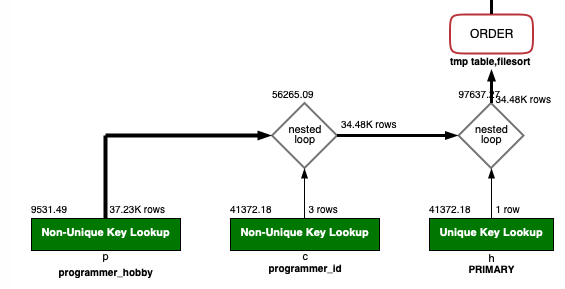
          1. programmer의 Hobby에 대한 indexing 
          2. covid - programmer foreign key에 의한 indexing
          3. covid - hospital foreign key 에 의한 indexing
       
    5. 서울대병원에 다닌 20대 India 환자들을 병원에 머문 기간별로 집계하세요. (covid.Stay)
       1. 일단 조회하기(조회불가)
       ```
       select c.stay, count(c.stay) from covid as c where
          c.hospital_id = (select id from hospital where name = "서울대병원")
          and programmer_id in (select id from programmer where country = "India")
          and member_id in (select id from member where age >= 20 and age <= 29)
          group by c.stay;
       ```
       2. indexing설정 내역 및 설정 후 쿼리 속도(0.073sec)
          1. 각 테이블 별 기본키 / 외래키 설정을 통한 자동 인덱싱
          ```
          create index programmer_country on subway.programmer(id, country);
             create index member_age on subway.member(id, age);
          ```
       3. 개선 전 실행계획(추출불가)
       4. 개선 후 실행계획
          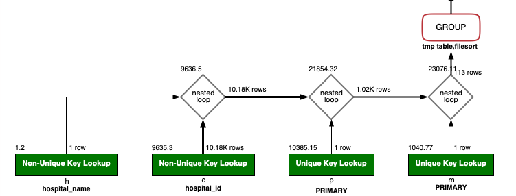
          1. hospital의 name에 대한 indexing
          2. programmer의 primary key에 대한 indexing
          3. member의 primary key에 대한 indexing 
       
    6. 서울대병원에 다닌 30대 환자들을 운동 횟수별로 집계하세요. (user.Exercise)
       1. 일단 조회하기(0.495sec)
       ```
          select exercise, count(exercise) from programmer as p
              where p.id in (select programmer_id from covid where hospital_id in (select id from hospital where name = "서울대병원"))
              and p.id in (select id from member where age >= 30 and age <= 39)
              group by exercise;
       ```
       2. indexing설정 내역 및 설정 후 쿼리 속도(0.055sec)
       ```
          create index member_id_age on subway.member( age);
       ```
       3. 개선 전 실행계획(추출불가)
       4. 개선 후 실행계획
          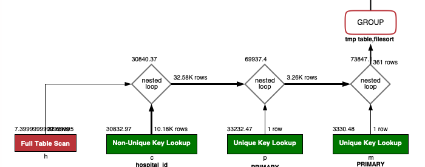
          1. hospital의 name에 대한 indexing
          2. programmer의 primary key에 대한 indexing
          3. member의 primary key에 대한 indexing


---

### 추가 미션

1. 페이징 쿼리를 적용한 API endpoint를 알려주세요


### study
http2 protocol
1. 헤더를 압축해서 보낸다
2. Connection 1개로 여러개의 요청을 처리할수 있다(비동기적)
3. 리소스간 의존관계에 따른 우선 순위를 설정하여, 리소스 로드문제를 해결할수 있다
4. db 서버 튜닝
    1. innodb buffer pool size 수정
        1. buffer memory 가 가득 차면 swap 메모리에 침범하여, 전반적인 서버 performance를 낮추는 결과를 초래하여, buffer사이즈를 충분히 늘려야한다
        2. 현재 도커 물리(가상) 메모리 : 8G
        3. 권장 pool size : 물리메모리의 80% (6.4G) / 최대 512M
           mysql> select @@innodb_buffer_pool_size/1024/1024/1024;
           +------------------------------------------+
           | @@innodb_buffer_pool_size/1024/1024/1024 |
           +------------------------------------------+
           |                           0.625000000000 |
           +------------------------------------------+
    2. key_buffer
        1. index를 캐싱하는데 사용하는 버퍼
        2. 전체 물리 메모리의 20%정도 할당함 (해당 서버가 오직 DB서버로만 운용될때)
    3. tmp_table_size
        1. 내부 메모리 내에 임시 테이블 최대 크기
        2. group by 를 사용한 쿼리가 많으면 늘려주는게 좋다. 메모리 여유가 있다면 max_heap_table_size도 같이 늘려준다
    4. max_heap_table_size
        1. 사용자가 생성한 memory가 증가할수 있는 최대 크기


#### mysql indexing
1. 인덱스 설정을 해본다
   1. 설정 조건
      1. 테이블 내 데이터 양이 많고 조건 검색을 하는경우
      2. WHERE문, 결합 , ORDER BY문을 이용하는 경우
      3. NULL값이 많은 데이터로 부터 NULL이외의 값을 검색하는 경우
      4. 인덱스 시 테이블 엑세스를 최소화 하기 위해 인덱스에 primary key를 추가 (가장 앞에)
   2. 인덱스가 사용될때
      1. 컬럼값을 정수와 비교할때
      2. 컬럼값 전체로 JOIN할때
      3. 컬럼값의 범위를 요구할때
      4. LIKE로 문자열의 선두가 고정일때
      5. MIN(),MAX()
      6. ORDER BY, GROUP BY
   3. 인덱스가 사용 안될때
      1. LIKE문이 와일드 카드(*)로 시작될때
      2. DB전체를 읽는것이 빠르다고 MySQL이 판단할때
      3. WHERE과 ORDER BY의 컬럼이 다를때에는 한쪽만 사용