<p align="center">
    
</p>
<p align="center">
  
  
  <a href="https://edu.nextstep.camp/c/R89PYi5H" alt="nextstep atdd">
    
  </a>
  
</p>

<br>

# 인프라공방 샘플 서비스 - 지하철 노선도

<br>

## 🚀 Getting Started

### Install
#### npm 설치
```
cd frontend
npm install
```
> `frontend` 디렉토리에서 수행해야 합니다.

### Usage
#### webpack server 구동
```
npm run dev
```
#### application 구동
```
./gradlew clean build
```
<br>

## 미션

* 미션 진행 후에 아래 질문의 답을 작성하여 PR을 보내주세요.

### 1단계 - 화면 응답 개선하기
1. 성능 개선 결과를 공유해주세요 (Smoke, Load, Stress 테스트 결과)
   - Load 테스트(로그인, 나의 정보 찾기, 라인 찾기, 최소경로 찾기)
     - <details>
         <summary>성능개선 전</summary>
         <div markdown="1">
   
         ```text
               
                     /\      |‾‾| /‾‾/   /‾‾/   
                /\  /  \     |  |/  /   /  /    
               /  \/    \    |     (   /   ‾‾\  
              /          \   |  |\  \ |  (‾)  |
             / __________ \  |__| \__\ \_____/ .io
         
         execution: local
         script: load.js
         output: -
         
         scenarios: (100.00%) 1 scenario, 300 max VUs, 45s max duration (incl. graceful stop):
         * default: Up to 300 looping VUs for 15s over 3 stages (gracefulRampDown: 30s, gracefulStop: 30s)
         
         
         running (16.0s), 000/300 VUs, 1237 complete and 0 interrupted iterations
         default ✓ [======================================] 000/300 VUs  15s
         
              ✓ logged in successfully
              ✓ found member
              ✓ found line
              ✓ found path
         
            ✓ checks.........................: 100.00% ✓ 4948       ✗ 0    
              data_received..................: 16 MB   978 kB/s
              data_sent......................: 1.4 MB  91 kB/s
              http_req_blocked...............: avg=1.09ms   min=3.57µs  med=4.73µs   max=169.84ms p(90)=35.22µs  p(95)=4.63ms  
              http_req_connecting............: avg=295µs    min=0s      med=0s       max=69.66ms  p(90)=0s       p(95)=476.8µs
            ✓ http_req_duration..............: avg=333.72ms min=3.65ms  med=339.54ms max=1.78s    p(90)=602.31ms p(95)=711.13ms
                  { expected_response:true }...: avg=333.72ms min=3.65ms  med=339.54ms max=1.78s    p(90)=602.31ms p(95)=711.13ms
              http_req_failed................: 0.00%   ✓ 0          ✗ 4948
              http_req_receiving.............: avg=294.7µs  min=26.04µs med=48.79µs  max=63.9ms   p(90)=168.99µs p(95)=567.17µs
              http_req_sending...............: avg=369.13µs min=9.39µs  med=15.88µs  max=67.19ms  p(90)=97.59µs  p(95)=508.12µs
              http_req_tls_handshaking.......: avg=762.96µs min=0s      med=0s       max=105.49ms p(90)=0s       p(95)=3.91ms  
              http_req_waiting...............: avg=333.06ms min=3.58ms  med=339.43ms max=1.78s    p(90)=601.31ms p(95)=710.66ms
              http_reqs......................: 4948    309.370429/s
              iteration_duration.............: avg=2.34s    min=1.04s   med=2.41s    max=4.57s    p(90)=3.39s    p(95)=3.72s   
              iterations.....................: 1237    77.342607/s
              vus............................: 53      min=41       max=300
              vus_max........................: 300     min=300      max=300
         
         ```
   
         </div>
       </details>
   
     - <details>
         <summary>성능개선 후</summary>
         <div markdown="1">
   
         ```text
         
                      /\      |‾‾| /‾‾/   /‾‾/   
                 /\  /  \     |  |/  /   /  /    
                /  \/    \    |     (   /   ‾‾\  
               /          \   |  |\  \ |  (‾)  |
              / __________ \  |__| \__\ \_____/ .io
         
         execution: local
         script: load.js
         output: -
         
         scenarios: (100.00%) 1 scenario, 300 max VUs, 45s max duration (incl. graceful stop):
         * default: Up to 300 looping VUs for 15s over 3 stages (gracefulRampDown: 30s, gracefulStop: 30s)
         
         
         running (15.7s), 000/300 VUs, 2132 complete and 0 interrupted iterations
         default ✓ [======================================] 000/300 VUs  15s
         
              ✓ logged in successfully
              ✓ found member
              ✓ found line
              ✓ found path
         
             ✓ checks.........................: 100.00% ✓ 8528       ✗ 0    
             data_received..................: 25 MB   1.6 MB/s
             data_sent......................: 1.0 MB  66 kB/s
             http_req_blocked...............: avg=2.16ms  min=2.51µs  med=2.72µs  max=421.56ms p(90)=2.95µs   p(95)=45.35µs
             http_req_connecting............: avg=668µs   min=0s      med=0s      max=140.73ms p(90)=0s       p(95)=0s      
           ✓ http_req_duration..............: avg=60.82ms min=2.08ms  med=37.57ms max=436.58ms p(90)=147.43ms p(95)=182.62ms
                 { expected_response:true }...: avg=60.82ms min=2.08ms  med=37.57ms max=436.58ms p(90)=147.43ms p(95)=182.62ms
             http_req_failed................: 0.00%   ✓ 0          ✗ 8528
             http_req_receiving.............: avg=15.31ms min=19.27µs med=3.04ms  max=241.16ms p(90)=43.3ms   p(95)=64.62ms
             http_req_sending...............: avg=1.77ms  min=28.95µs med=50.39µs max=262.4ms  p(90)=756.8µs  p(95)=3.75ms  
             http_req_tls_handshaking.......: avg=1.43ms  min=0s      med=0s      max=373.58ms p(90)=0s       p(95)=0s      
             http_req_waiting...............: avg=43.74ms min=0s      med=29.73ms max=267.45ms p(90)=105.24ms p(95)=124.57ms
             http_reqs......................: 8528    543.014608/s
             iteration_duration.............: avg=1.27s   min=1.01s   med=1.22s   max=2.06s    p(90)=1.61s    p(95)=1.68s   
             iterations.....................: 2132    135.753652/s
             vus............................: 33      min=33       max=300
             vus_max........................: 300     min=300      max=300

         ```
   
         </div>
       </details>
   
   - Stress 테스트(로그인, 나의 정보 찾기, 라인 찾기, 최소경로 찾기)
     - <details>
         <summary>성능개선 전</summary>
         <div markdown="1">
   
         ```text
         
                      /\      |‾‾| /‾‾/   /‾‾/   
                 /\  /  \     |  |/  /   /  /    
                /  \/    \    |     (   /   ‾‾\  
               /          \   |  |\  \ |  (‾)  |
              / __________ \  |__| \__\ \_____/ .io
         
         execution: local
         script: stress.js
         output: -
         
         scenarios: (100.00%) 1 scenario, 400 max VUs, 2m50s max duration (incl. graceful stop):
         * default: Up to 400 looping VUs for 2m20s over 8 stages (gracefulRampDown: 30s, gracefulStop: 30s)
         
         
         running (2m20.9s), 000/400 VUs, 13012 complete and 0 interrupted iterations
         default ✓ [======================================] 000/400 VUs  2m20s
         
              ✗ logged in successfully
               ↳  93% — ✓ 12230 / ✗ 782
              ✓ found member
              ✓ found line
              ✓ found path
         
           ✓ checks.........................: 98.42% ✓ 48744      ✗ 782  
             data_received..................: 153 MB 1.1 MB/s
             data_sent......................: 14 MB  102 kB/s
             http_req_blocked...............: avg=20.46ms  min=0s     med=4.64µs   max=2.07s    p(90)=19.17µs  p(95)=48.09ms
             http_req_connecting............: avg=6.82ms   min=0s     med=0s       max=979.4ms  p(90)=0s       p(95)=16.59ms
           ✓ http_req_duration..............: avg=345.62ms min=0s     med=297.26ms max=2.95s    p(90)=717.23ms p(95)=913.09ms
                 { expected_response:true }...: avg=350.96ms min=3.54ms med=302.33ms max=2.95s    p(90)=721.57ms p(95)=916.28ms
             http_req_failed................: 1.76%  ✓ 876        ✗ 48737
             http_req_receiving.............: avg=844.97µs min=0s     med=45.57µs  max=524.81ms p(90)=170.08µs p(95)=623.44µs
             http_req_sending...............: avg=3.53ms   min=0s     med=15.12µs  max=2.01s    p(90)=184.37µs p(95)=4.8ms   
             http_req_tls_handshaking.......: avg=13.14ms  min=0s     med=0s       max=1.49s    p(90)=0s       p(95)=27.63ms
             http_req_waiting...............: avg=341.24ms min=0s     med=295.83ms max=2.95s    p(90)=702.16ms p(95)=890.38ms
             http_reqs......................: 49613  352.031499/s
             iteration_duration.............: avg=2.34s    min=1.7ms  med=2.2s     max=8.59s    p(90)=4.13s    p(95)=4.6s    
             iterations.....................: 13012  92.32729/s
             vus............................: 6      min=6        max=400
             vus_max........................: 400    min=400      max=400
         
         ```
   
         </div>
       </details>
   
     - <details>
         <summary>성능개선 후</summary>
         <div markdown="1">
   
         ```text
         
                      /\      |‾‾| /‾‾/   /‾‾/   
                 /\  /  \     |  |/  /   /  /    
                /  \/    \    |     (   /   ‾‾\  
               /          \   |  |\  \ |  (‾)  |
              / __________ \  |__| \__\ \_____/ .io
         
         execution: local
         script: stress.js
         output: -
         
         scenarios: (100.00%) 1 scenario, 400 max VUs, 2m50s max duration (incl. graceful stop):
         * default: Up to 400 looping VUs for 2m20s over 8 stages (gracefulRampDown: 30s, gracefulStop: 30s)
         
         
         running (2m21.0s), 000/400 VUs, 23126 complete and 0 interrupted iterations
         default ✓ [======================================] 000/400 VUs  2m20s
         
              ✓ logged in successfully
              ✓ found member
              ✓ found line
              ✓ found path
         
           ✓ checks.........................: 100.00% ✓ 92504      ✗ 0    
             data_received..................: 255 MB  1.8 MB/s
             data_sent......................: 9.5 MB  67 kB/s
             http_req_blocked...............: avg=401.72µs min=2.48µs  med=2.71µs  max=903.59ms p(90)=2.87µs   p(95)=3.41µs  
             http_req_connecting............: avg=114.81µs min=0s      med=0s      max=384.06ms p(90)=0s       p(95)=0s      
           ✓ http_req_duration..............: avg=71.85ms  min=1.91ms  med=27.02ms max=876.15ms p(90)=212.21ms p(95)=274.53ms
                 { expected_response:true }...: avg=71.85ms  min=1.91ms  med=27.02ms max=876.15ms p(90)=212.21ms p(95)=274.53ms
             http_req_failed................: 0.00%   ✓ 0          ✗ 92504
             http_req_receiving.............: avg=18.75ms  min=18.53µs med=2.03ms  max=582.45ms p(90)=57.96ms  p(95)=95.49ms
             http_req_sending...............: avg=1.94ms   min=27.08µs med=51.09µs max=446.22ms p(90)=657.5µs  p(95)=3.21ms  
             http_req_tls_handshaking.......: avg=233.15µs min=0s      med=0s      max=608.34ms p(90)=0s       p(95)=0s      
             http_req_waiting...............: avg=51.14ms  min=0s      med=21.64ms max=650.38ms p(90)=146.53ms p(95)=185.54ms
             http_reqs......................: 92504   656.116513/s
             iteration_duration.............: avg=1.3s     min=1.01s   med=1.15s   max=2.59s    p(90)=1.86s    p(95)=2.02s   
             iterations.....................: 23126   164.029128/s
             vus............................: 5       min=5        max=400
             vus_max........................: 400     min=400      max=400
         
         ```
   
         </div>
       </details>

   - Load 테스트(멤버추가, 멤버나이변경, 멤버삭제)
     - <details>
         <summary>캐쉬 적용 전</summary>
         <div markdown="1">

         ```text
         
                      /\      |‾‾| /‾‾/   /‾‾/   
                 /\  /  \     |  |/  /   /  /    
                /  \/    \    |     (   /   ‾‾\  
               /          \   |  |\  \ |  (‾)  |
              / __________ \  |__| \__\ \_____/ .io
         
         execution: local
         script: add-update-delete-load.js
         output: -
         
         scenarios: (100.00%) 1 scenario, 300 max VUs, 45s max duration (incl. graceful stop):
         * default: Up to 300 looping VUs for 15s over 3 stages (gracefulRampDown: 30s, gracefulStop: 30s)
         
         
         running (16.0s), 000/300 VUs, 2442 complete and 0 interrupted iterations
         default ✓ [======================================] 000/300 VUs  15s
         
              ✓ add result status is 201
              ✓ update result status is 200
              ✓ delete result status is 204
         
         ✓ checks.........................: 100.00% ✓ 7326       ✗ 0    
           data_received..................: 2.5 MB  156 kB/s
           data_sent......................: 905 kB  57 kB/s
           http_req_blocked...............: avg=369.74µs min=1.42µs  med=2.73µs  max=83.07ms  p(90)=2.93µs   p(95)=89.35µs
           http_req_connecting............: avg=75.53µs  min=0s      med=0s      max=51.4ms   p(90)=0s       p(95)=0s     
         ✓ http_req_duration..............: avg=32.06ms  min=17.64µs med=18.58ms max=293.62ms p(90)=77.39ms  p(95)=96.44ms
             { expected_response:true }...: avg=32.06ms  min=17.64µs med=18.58ms max=293.62ms p(90)=77.39ms  p(95)=96.44ms
           http_req_failed................: 0.00%   ✓ 0          ✗ 7326
           http_req_receiving.............: avg=1.15ms   min=17.28µs med=42.94µs max=67.21ms  p(90)=2.83ms   p(95)=6.41ms
           http_req_sending...............: avg=431.98µs min=0s      med=58.87µs max=66.86ms  p(90)=368.88µs p(95)=1.33ms
           http_req_tls_handshaking.......: avg=269.07µs min=0s      med=0s      max=52.67ms  p(90)=0s       p(95)=0s     
           http_req_waiting...............: avg=30.47ms  min=0s      med=16.9ms  max=286.39ms p(90)=74.62ms  p(95)=94.14ms
           http_reqs......................: 7326    458.426294/s
           iteration_duration.............: avg=1.1s     min=1.01s   med=1.06s   max=1.45s    p(90)=1.23s    p(95)=1.27s  
           iterations.....................: 2442    152.808765/s
           vus............................: 30      min=30       max=299
           vus_max........................: 300     min=300      max=300
                       
         ```
         </div>
       </details>

     - <details>
         <summary>캐쉬 적용 후</summary>
         <div markdown="1">

         ```text
         
                      /\      |‾‾| /‾‾/   /‾‾/   
                 /\  /  \     |  |/  /   /  /    
                /  \/    \    |     (   /   ‾‾\  
               /          \   |  |\  \ |  (‾)  |
              / __________ \  |__| \__\ \_____/ .io
         
         execution: local
         script: add-update-delete-load.js
         output: -
         
         scenarios: (100.00%) 1 scenario, 300 max VUs, 45s max duration (incl. graceful stop):
         * default: Up to 300 looping VUs for 15s over 3 stages (gracefulRampDown: 30s, gracefulStop: 30s)
         
         
         running (15.8s), 000/300 VUs, 2548 complete and 0 interrupted iterations
         default ✓ [======================================] 000/300 VUs  15s
         
              ✓ add result status is 201
              ✓ update result status is 200
              ✓ delete result status is 204
         
            ✓ checks.........................: 100.00% ✓ 7644       ✗ 0    
              data_received..................: 2.5 MB  161 kB/s
              data_sent......................: 935 kB  59 kB/s
              http_req_blocked...............: avg=344.82µs min=1.4µs   med=2.72µs  max=55.73ms  p(90)=3.03µs   p(95)=253.39µs
              http_req_connecting............: avg=60.39µs  min=0s      med=0s      max=21.28ms  p(90)=0s       p(95)=0s      
            ✓ http_req_duration..............: avg=15.4ms   min=28.66µs med=11.06ms max=112.41ms p(90)=30.45ms  p(95)=37.82ms
                { expected_response:true }...: avg=15.4ms   min=28.66µs med=11.06ms max=112.41ms p(90)=30.45ms  p(95)=37.82ms
              http_req_failed................: 0.00%   ✓ 0          ✗ 7644
              http_req_receiving.............: avg=921.34µs min=15.28µs med=66.08µs max=40.2ms   p(90)=2.59ms   p(95)=4.9ms   
              http_req_sending...............: avg=367.07µs min=0s      med=62.09µs max=36.79ms  p(90)=536.45µs p(95)=1.35ms  
              http_req_tls_handshaking.......: avg=248.19µs min=0s      med=0s      max=54.49ms  p(90)=0s       p(95)=0s      
              http_req_waiting...............: avg=14.12ms  min=0s      med=10.28ms max=112.32ms p(90)=27.2ms   p(95)=34.24ms
              http_reqs......................: 7644    483.866819/s
              iteration_duration.............: avg=1.05s    min=1.01s   med=1.03s   max=1.19s    p(90)=1.09s    p(95)=1.1s    
              iterations.....................: 2548    161.28894/s
              vus............................: 27      min=27       max=300
              vus_max........................: 300     min=300      max=300                

         ```
         </div>
       </details>
  
   - Stress 테스트(멤버추가, 멤버나이변경, 멤버삭제) 
     - <details>
         <summary>캐쉬 적용 전</summary>
         <div markdown="1">

         ```text
         
                   /\      |‾‾| /‾‾/   /‾‾/   
              /\  /  \     |  |/  /   /  /    
              /  \/    \    |     (   /   ‾‾\  
              /          \   |  |\  \ |  (‾)  |
              / __________ \  |__| \__\ \_____/ .io
         
         execution: local
         script: add-update-delete-stress.js
         output: -
         
         scenarios: (100.00%) 1 scenario, 400 max VUs, 2m50s max duration (incl. graceful stop):
         * default: Up to 400 looping VUs for 2m20s over 8 stages (gracefulRampDown: 30s, gracefulStop: 30s)
         
         
         running (2m20.6s), 000/400 VUs, 27614 complete and 0 interrupted iterations
         default ✓ [======================================] 000/400 VUs  2m20s
         
              ✓ add result status is 201
              ✓ update result status is 200
              ✓ delete result status is 204
         
            ✓ checks.........................: 100.00% ✓ 82842      ✗ 0    
              data_received..................: 14 MB   103 kB/s
              data_sent......................: 8.5 MB  61 kB/s
              http_req_blocked...............: avg=96.2µs   min=1.34µs  med=2.71µs   max=265.64ms p(90)=2.91µs   p(95)=8.27µs  
              http_req_connecting............: avg=19.1µs   min=0s      med=0s       max=109.26ms p(90)=0s       p(95)=0s      
            ✓ http_req_duration..............: avg=29.85ms  min=13.95µs med=16.14ms  max=616.5ms  p(90)=70.49ms  p(95)=104.32ms
                { expected_response:true }...: avg=29.85ms  min=13.95µs med=16.14ms  max=616.5ms  p(90)=70.49ms  p(95)=104.32ms
              http_req_failed................: 0.00%   ✓ 0          ✗ 82842
              http_req_receiving.............: avg=1.84ms   min=13.81µs med=151.13µs max=119.25ms p(90)=4.84ms   p(95)=9.27ms  
              http_req_sending...............: avg=527.89µs min=0s      med=62.66µs  max=137.36ms p(90)=642.33µs p(95)=1.73ms  
              http_req_tls_handshaking.......: avg=53.61µs  min=0s      med=0s       max=156.21ms p(90)=0s       p(95)=0s      
              http_req_waiting...............: avg=27.47ms  min=0s      med=14.79ms  max=611.59ms p(90)=63.5ms   p(95)=96.85ms
              http_reqs......................: 82842   589.227654/s
              iteration_duration.............: avg=1.09s    min=1.01s   med=1.05s    max=2.04s    p(90)=1.22s    p(95)=1.31s   
              iterations.....................: 27614   196.409218/s
              vus............................: 4       min=4        max=400
              vus_max........................: 400     min=400      max=400

         ```
         </div>
       </details>
  
     - <details>
         <summary>캐쉬 적용 후</summary>
         <div markdown="1">
  
         ```text

                   /\      |‾‾| /‾‾/   /‾‾/   
              /\  /  \     |  |/  /   /  /    
              /  \/    \    |     (   /   ‾‾\  
              /          \   |  |\  \ |  (‾)  |
              / __________ \  |__| \__\ \_____/ .io
         
         execution: local
         script: add-update-delete-stress.js
         output: -
         
         scenarios: (100.00%) 1 scenario, 400 max VUs, 2m50s max duration (incl. graceful stop):
         * default: Up to 400 looping VUs for 2m20s over 8 stages (gracefulRampDown: 30s, gracefulStop: 30s)
         
         
         running (2m21.0s), 000/400 VUs, 28037 complete and 0 interrupted iterations
         default ✓ [======================================] 000/400 VUs  2m20s
         
              ✓ add result status is 201
              ✓ update result status is 200
              ✓ delete result status is 204
         
              ✓ checks.........................: 100.00% ✓ 84111      ✗ 0    
                data_received..................: 15 MB   104 kB/s
                data_sent......................: 8.7 MB  61 kB/s
                http_req_blocked...............: avg=84.98µs  min=1.39µs  med=2.72µs  max=202.96ms p(90)=2.91µs   p(95)=6.97µs
                http_req_connecting............: avg=17.21µs  min=0s      med=0s      max=101.75ms p(90)=0s       p(95)=0s     
              ✓ http_req_duration..............: avg=24.12ms  min=12.89µs med=14.45ms max=1.05s    p(90)=54.52ms  p(95)=76.16ms
                  { expected_response:true }...: avg=24.12ms  min=12.89µs med=14.45ms max=1.05s    p(90)=54.52ms  p(95)=76.16ms
                http_req_failed................: 0.00%   ✓ 0          ✗ 84111
                http_req_receiving.............: avg=2.08ms   min=12.89µs med=138.6µs max=137.71ms p(90)=5.35ms   p(95)=9.96ms
                http_req_sending...............: avg=619.34µs min=0s      med=62.49µs max=222.37ms p(90)=708.98µs p(95)=1.97ms
                http_req_tls_handshaking.......: avg=45.44µs  min=0s      med=0s      max=129.38ms p(90)=0s       p(95)=0s     
                http_req_waiting...............: avg=21.42ms  min=0s      med=12.94ms max=1.05s    p(90)=47.86ms  p(95)=66.07ms
                http_reqs......................: 84111   596.602789/s
                iteration_duration.............: avg=1.07s    min=1.01s   med=1.05s   max=2.22s    p(90)=1.16s    p(95)=1.22s  
                iterations.....................: 28037   198.867596/s
                vus............................: 6       min=6        max=399
                vus_max........................: 400     min=400      max=400       
       
         ```
       
         </div>
       </details>  
  
  
2. 어떤 부분을 개선해보셨나요? 과정을 설명해주세요
   - Reverse Proxy 개선하기   
     - nginx를 컨테이너 방식이 아닌 직접 설치(apt install nginx)
     - /etc/nginx.conf에 4주차 미션이었던 `그럴듯한 서비스`의 `2단계 - 서비스 배포하기`에서 사용했던 nginx.conf를 활용하여 설정(개선전 상태)
     - k6를 이용하여 Smoke, Load, Stress 테스트를 시행하고 기록을 작성 
     - 이번 미션에서 제공된 설정파일에 있는 것들을 순차적으로 적용하였음
       1. `worker_processes auto;` 추가 및 k6테스트 후 최초테스트의 지표와 비교 후 성능상 개선점 확인 불가
       2. `events { worker_connections 10240; }` 추가 및 k6테스트 후 최초테스트의 지표와 비교 후 성능상 개선점 확인 불가
       3. `gzip on`을 비롯한 압축 관련 설정 추가 및 k6테스트 후 최초테스트의 지표와 비교 후 성능상 개선점 확인 불가
       4. 단일 포트(8080)에서, 듀얼포트(8080, 8081)로 분배 설정 추가 및 k6테스트 후 최초테스트의 지표와 비교 후 성능상 개선점 확인 불가
       5. proxy관련 설정을 전부추가(이 부분은 지식 부족으로 관련되어 있을 것으로 추정하였음) 후에 k6테스트 후 최초테스트의 지표와 비교 후 성능상 개선점 확인 불가 
     - 결론
       1. 모든 설정을 전부 추가 하였음에도 성능상의 이점을 발견할 수 없었음
       2. 그대로 복사 붙여 넣기 했음에도 설정을 잘 했는지에 대해서는 현재의 학습자의 수준상 확인하기 어려운 점으로 성능상 개선을 못했을 수 있음
   - WAS 성능 개선하기(Spring Data Cache)
     - docker로 redis를 구동 및 build.gradle에 redis관련 라이브러리 가져오도록 설정  
     - CacheConfig 클래스 추가 및 테스트 서비스에 해당하는 메서드에 대해서 @Cacheable 어노테이션 설정
       - 멤버조회, 역조회, 경로조회 서비스에 해당 어노테이션 
       - DTO중 캐쉬처리를 위해 (역)직렬화 안되는 LocalDateTime 필드에 관련 어노테이션 추가
         - https://www.tutorialspoint.com/jackson_annotations/jackson_annotations_jsonserialize.htm
         - https://www.tutorialspoint.com/jackson_annotations/jackson_annotations_jsondeserialize.htm
     - 정적 리소스(js, img)에 대한 캐시처리 진행하기
       - application-prod.properties에 spring.web.resources.cache.cachecontrol.max-age=365d를 추가하였음
       - Reverse Proxy에 설정이 되어 있다면 그것을 우선하게 됨
     - 결론
       - 가장 쉽고 명확하게 응답시간의 감소를 확인할 수 있었음
       - http_req_duration기준 전/후 결과 값을 다음과 같이 확인 할 수 있었음
         - 다음 결과는 `테스트 유형(전 -> 후)`의 형태로 작성하였음 
         - Load(333.72ms -> 60.82ms)
         - Stress(345.62ms -> 71.85ms)
       - `멤버추가, 멤버나이변경, 멤버삭제`에 대한 Load, Stress 테스트 진행에 대한 진단리뷰
         - http_req_duration기준 avg값을 기반으로 함 
         - 다음 결과는 `테스트 유형(전 -> 후)`의 형태로 작성하였음
         - Load(32.06ms -> 15.4ms)
         - Stress(29.85ms -> 24.12ms)
         - 테스트 결과를 볼 때, 성능 개선이 되었다고 보기 어려움
         - 데이터를 추가/삭제가 빈번할 때는 캐쉬의 영향이 크게 작용하지 않을 수도 있다는 생각을 해봄
--- 

### 2단계 - 조회 성능 개선하기
1. 쿼리 최적화

   - [X] 활동중인(Active) 부서의 현재 부서관리자 중 연봉 상위 5위안에 드는 사람들이 최근에 각 지역별로 언제 퇴실했는지 조회해보세요.
     (사원번호, 이름, 연봉, 직급명, 지역, 입출입구분, 입출입시간)

     - <details>
         <summary>조회 쿼리문</summary>
         <div markdown="1">
       
         ```mysql-sql
         SELECT I.사원번호, I.이름, I.연봉, I.직급명, J.입출입시간, J.지역, J.입출입구분
           FROM ( SELECT G.사원번호, G.이름, H.연봉, G.직급명
                    FROM ( SELECT E.사원번호, E.이름, F.직급명
                             FROM ( SELECT C.사원번호, D.이름
                                      FROM ( SELECT B.사원번호
                                               FROM ( SELECT 부서번호
                                                        FROM 부서
                                                       WHERE 비고 = 'ACTIVE'
                                                    ) A INNER JOIN 부서관리자 B
                                                 ON A.부서번호 = B.부서번호
                                                AND B.종료일자 >= NOW()
                                           ) C INNER JOIN 사원 D
                                        ON C.사원번호 = D.사원번호
                                  ) E INNER JOIN 직급 F
                               ON E.사원번호 = F.사원번호
                              AND F.종료일자 >= NOW()
                         ) G INNER JOIN 급여 H
                      ON G.사원번호 = H.사원번호
                     AND H.종료일자 >= NOW()
                   ORDER BY H.연봉 DESC LIMIT 5
                ) I INNER JOIN 사원출입기록 J
             ON I.사원번호 = J.사원번호
            AND J.입출입구분 = 'O';
         ```
       
         </div>
       </details>

     - <details>
         <summary>튜닝 전 실행계획 / 조회 시간</summary>
         <div markdown="1">

         - 실행계획
         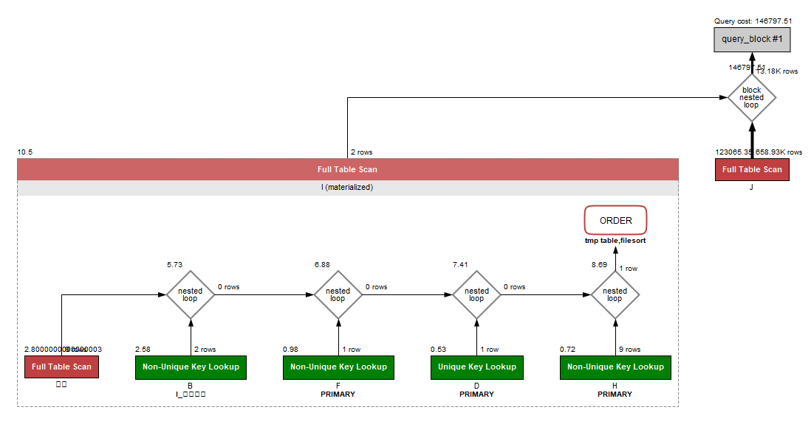
  
         - 조회시간
         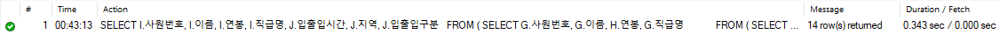

         </div>
       </details>

     - <details>
         <summary>튜닝 작업 / 튜닝 후 실행계획 / 조회 시간</summary>
         <div markdown="1">

         - `사원출입기록` 테이블에 `사원번호`를 컬럼으로 하는 인덱스(`I_사원번호`) 추가
         

         - 실행계획
         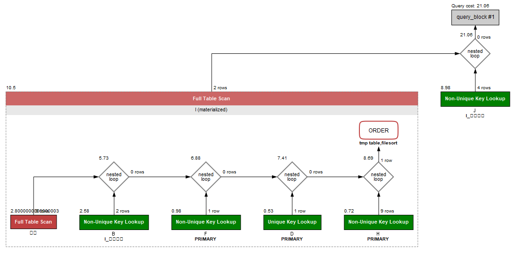
  
         - 조회시간
         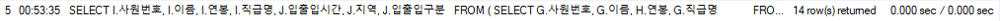

         </div>
       </details>

  
2. 인덱스 설계
  
   - [X] Coding as a Hobby 와 같은 결과를 반환하세요.

     - <details>
         <summary>조회 쿼리문</summary>
         <div markdown="1">

         ```mysql-sql
         SELECT HOBBY, CONCAT(ROUND(COUNT(1) / (SELECT COUNT(*) FROM PROGRAMMER) * 100, 1), '%')  PERCENT
           FROM PROGRAMMER
          GROUP BY HOBBY
          ORDER BY HOBBY DESC;
         ```

         </div>
       </details>

     - <details>
         <summary>튜닝 전 실행계획 / 조회 시간</summary>
         <div markdown="1">

         - 실행계획       
         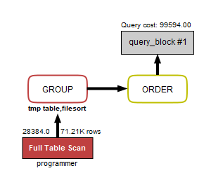

         - 조회시간    
         
         
         </div>
       </details>

     - <details>
         <summary>튜닝 작업 / 튜닝 후 실행계획 / 조회 시간</summary>
         <div markdown="1">

         - `programmer` 테이블에 `hobby`를 컬럼으로 하는 인덱스(`I_hobby`) 추가       
         

         - 실행계획    
         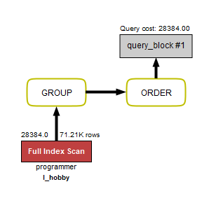

         - 조회시간    
         
  
         </div>
       </details>   
     
   - [X] 프로그래머별로 해당하는 병원 이름을 반환하세요. (covid.id, hospital.name)   
 
     - <details>
         <summary>조회 쿼리문</summary>
         <div markdown="1">
 
         ```mysql-sql
         select b.id covid_id, c.name hospital_name
           from programmer a, covid b, hospital c
          where a.id = b.programmer_id
            and b.hospital_id = c.id;
         ```
       
         </div>
       </details>
 
     - <details>
         <summary>튜닝 전 실행계획 / 조회 시간</summary>
         <div markdown="1">
 
         - 실행계획       
         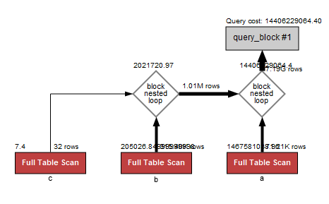
 
         - 조회시간    
         
 
         </div>
       </details>
 
     - <details>
         <summary>튜닝 작업 / 튜닝 후 실행계획 / 조회 시간</summary>
         <div markdown="1">
 
         - `programmer` 테이블에 `id`를 컬럼으로 하는 인덱스(`I_id`) 추가       
         
 
         - 실행계획    
         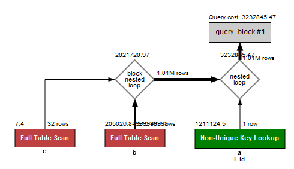  
 
         - 조회시간    
         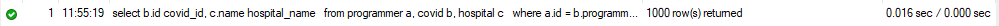  
 
         </div>
       </details>  
     
   - [X] 프로그래밍이 취미인 학생 혹은 주니어(0-2년)들이 다닌 병원 이름을 반환하고 user.id 기준으로 정렬하세요. (covid.id, hospital.name, user.Hobby, user.DevType, user.YearsCoding)

     - <details>
         <summary>조회 쿼리문</summary>
         <div markdown="1">
 
         ```mysql-sql
         select b.id covid_id, c.name hospital_name, user.hobby, user.dev_type, user.years_coding
           from programmer user, covid b, hospital c
          where user.id = b.programmer_id
            and b.hospital_id = c.id
            and ((user.student = 'yes' and user.hobby = 'yes') or user.years_coding = '0-2 years')
          order by user.id;
         ```
 
         </div>
       </details>      

     - <details>
         <summary>튜닝 전 실행계획 / 조회 시간</summary>
         <div markdown="1">

         - 실행계획       
         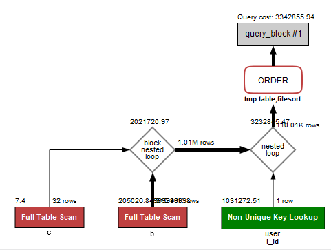

         - 조회시간    
          

         </div>
       </details>

     - <details>
         <summary>튜닝 작업 / 튜닝 후 실행계획 / 조회 시간</summary>
         <div markdown="1">

         - `hospital` 테이블에 `id`를 컬럼으로 하는 인덱스(`I_id`) 추가       
         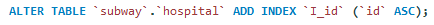         

         - `covid` 테이블에 `programmer_id`, `hospital_id`를 컬럼으로 하는 인덱스(`I_programmer_id_n_hospital_id`) 추가
         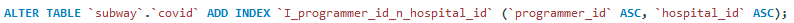

         - 실행계획    
         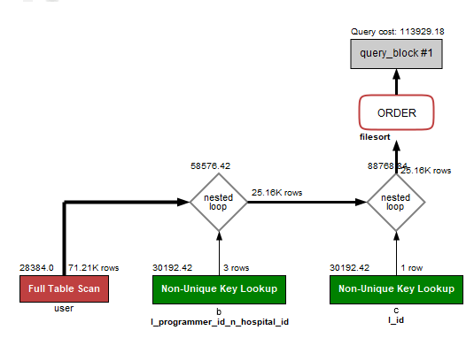        

         - 조회시간    
         

         </div>
       </details>  

   - [X] 서울대병원에 다닌 20대 India 환자들을 병원에 머문 기간별로 집계하세요. (covid.Stay)

     - <details>
         <summary>조회 쿼리문</summary>
         <div markdown="1">

         ```mysql-sql
         select c.stay, count(*) count
           from programmer a, member b, covid c, hospital d
          where a.member_id = b.id
            and a.id = c.programmer_id
            and c.hospital_id = d.id
            and b.age >= 20
            and b.age <= 29
            and a.country = 'India'
            and d.name = '서울대병원'
          group by c.stay
          order by c.stay;
         ```

         </div>
       </details>      

     - <details>
         <summary>튜닝 전 실행계획 / 조회 시간</summary>
         <div markdown="1">

         - 실행계획       
         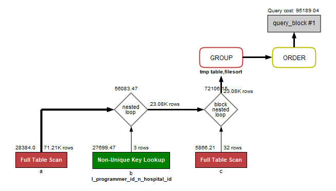

         - 조회시간    
         

         </div>
       </details>

     - <details>
         <summary>튜닝 작업 / 튜닝 후 실행계획 / 조회 시간</summary>
         <div markdown="1">

         - `covid` 테이블에 `hospital_id`를 컬럼으로 하는 인덱스(`I_hospital_id`) 추가
         

         - `programmer` 테이블에 `member_id`. `id`, `country`를 컬럼으로 하는 인덱스(`I_hospital_id`) 추가 
         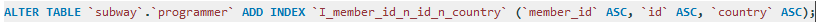

         - 실행계획    
         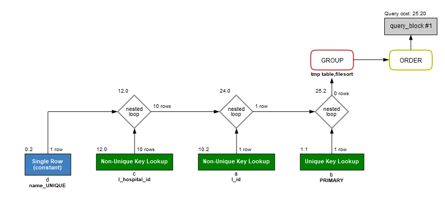

         - 조회시간    
         

         </div>
       </details>  
  
   - [X] 서울대병원에 다닌 30대 환자들을 운동 횟수별로 집계하세요. (user.Exercise)
 
     - <details>
         <summary>조회 쿼리문</summary>
         <div markdown="1">
 
         ```mysql-sql
         select a.Exercise 'user.Exercise', count(*)
           from programmer a, member b, covid c, hospital d
          where a.member_id = b.id
            and a.id = c.programmer_id
            and c.hospital_id = d.id
            and b.age >= 30
            and b.age <= 39
            and d.name = '서울대병원'
          group by a.Exercise
          order by a.Exercise; 
         ```
 
         </div>
       </details>      

     - <details>
         <summary>튜닝 전 실행계획 / 조회 시간</summary>
         <div markdown="1">

         - 실행계획       
         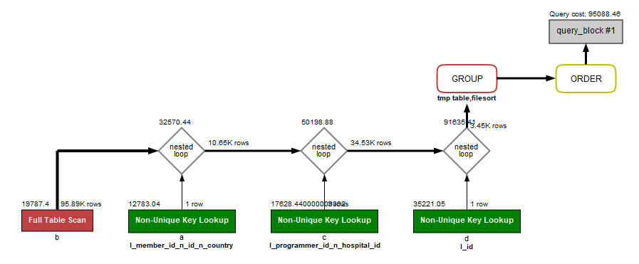

         - 조회시간    
          

         </div>
       </details>  

     - <details>
         <summary>튜닝 작업 / 튜닝 후 실행계획 / 조회 시간</summary>
         <div markdown="1">

         - `member` 테이블에 `age`를 컬럼으로 하는 인덱스(`I_age`) 추가
         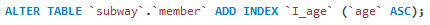

         - 실행계획    
         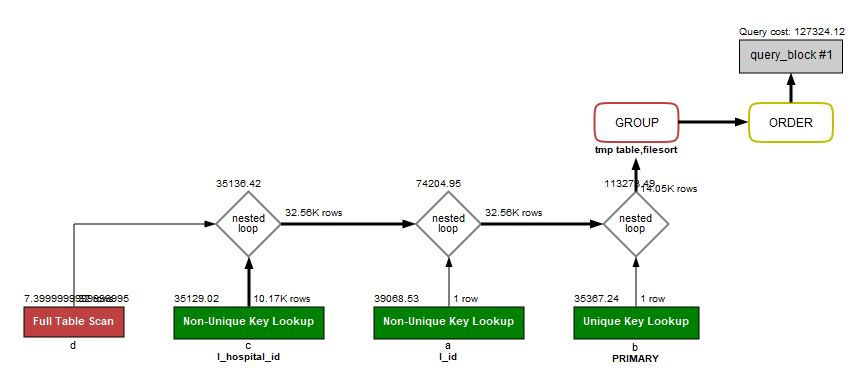

         - 조회시간    
         

         </div>
       </details>  
  
  
3. 페이징 쿼리를 적용한 API endpoint를 알려주세요
   - https://changsubkwak.kro.kr/stations   
     - id를 정렬기준으로 하여 8개씩 페이지 처리하였습니다.
     - <details>
         <summary>결과 화면</summary>
         <div markdown="1">
       
         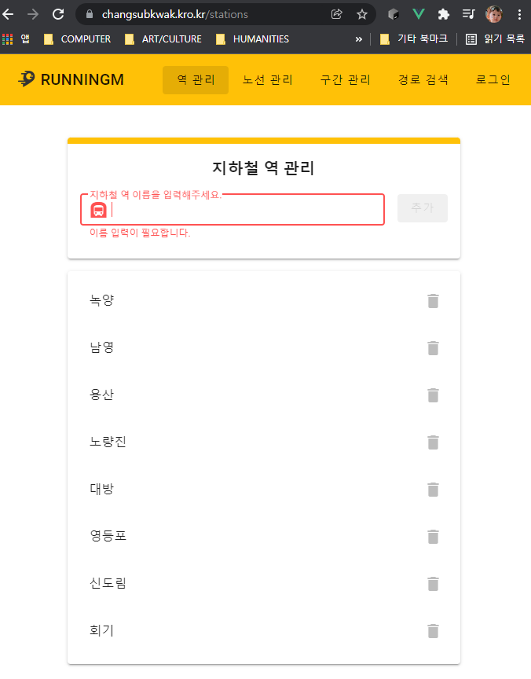

         </div>
       </details>
   - https://changsubkwak.kro.kr/stations/{page}
     - page에 숫자를 넣으면 페이지 단위의 데이터를 볼 수 있습니다.
     - 단, FrontEnd 작업이 되어 있지 않아 텍스트 JSON 데이터를 볼 수 있습니다.
     - <details>
         <summary> 페이지 0 결과 화면</summary>
         <div markdown="1">

         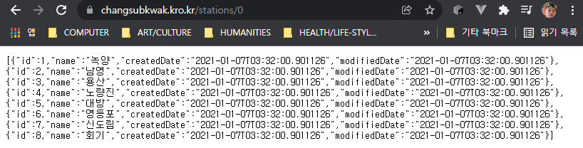

         </div>
       </details>
     - <details>
         <summary> 페이지 1 결과 화면</summary>
         <div markdown="1">

         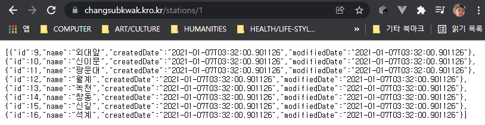

         </div>
       </details>  


4. MySQL Replication with JPA
   - 가이드에 따른 설정을 진행   
     1. DATABASE(EC2 인스턴스 이름 : changsubkwak-ec2-database)서버에 master(PORT : 13306) / slave(PORT : 13307)로 세팅하였음   
     2. 애플리케이션에 application.properties에 localhost를 DATABASE서버 IP로 변경한 master/slave DB접속 설정을 추가하였음   
     3. nextstep.subway 패키지에 ReplicationRoutingDataSource와 DataBaseConfig를 추가하였음   
   - 빌드 / 테스트 과정
     1. 빌드하였으나 ` A bean with that name has already been defined in nextstep.subway.favorite.domain.FavoriteRepository defined in @EnableJpaRepositories declared on DataBaseConfig and overriding is disabled.` 에러 발생
        - 정확히 이유는 모르겠으나 @EnableJpaRepositories로 두번 등록하려는 것 때문에 생기는 것으로 추정
        - SubwayApplication클래스에서 @EnableJpaRepositories 어노테이션 제거
     2. 빌드는 잘되나 테스트에서 실패하여, 테스트를 스킵(./gradlew clean build -x test)하여 빌드후 정상 구동 확인
        - master / slave 테스트에 중점을 두었기에 테스트에 의미를 크게 생각하지 않았음
     3. 구동하였으나, DB에 subway 스키마가 없는 것을 확인
        - master/slave에 `create database subway;` DB스키마 생성
        - `brainbackdoor/data-subway:0.0.1`에 있는 데이터를 mysqldump를 이용하여 스크립트를 가져옴
        - 가져온 스크립트를 master/slaver DB에 생성하였음
     4. 이후 구동한 결과 정상임을 확인

   - 테스트 결과
     - <details>
         <summary>slave서버 중지후 @Transactional이 붙은 메서드인 `findAllStations()`가 호출되는 `경로 검색` 기능 수행이 안되는 현상</summary>
         <div markdown="1">

         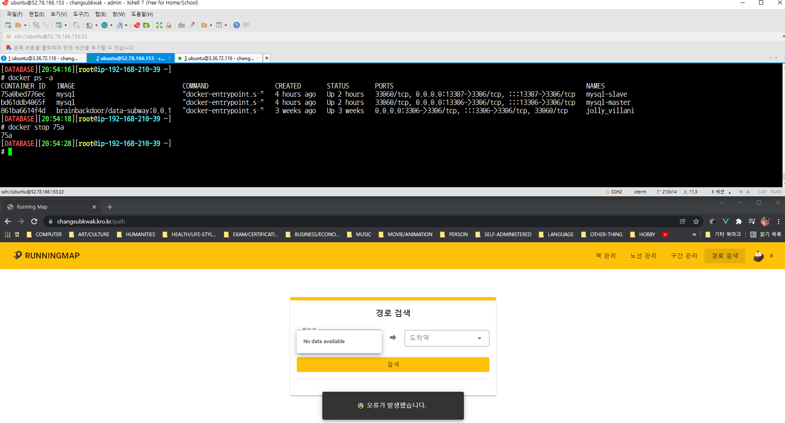             
    
         </div>
       </details>  

     - <details>
         <summary>master서버 중지후 `findLines()`가 호출되는 `노선 관리` 클릭 시, 노선 조회 안되는 현상</summary>
         <div markdown="1">

         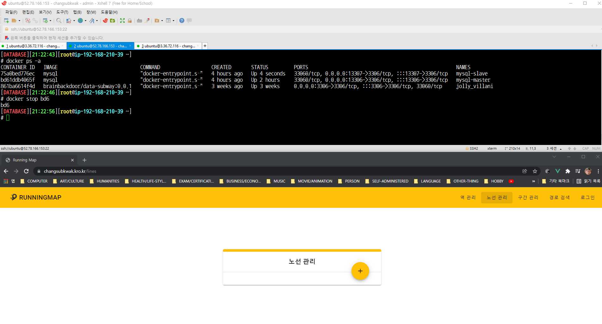

         </div>
       </details>