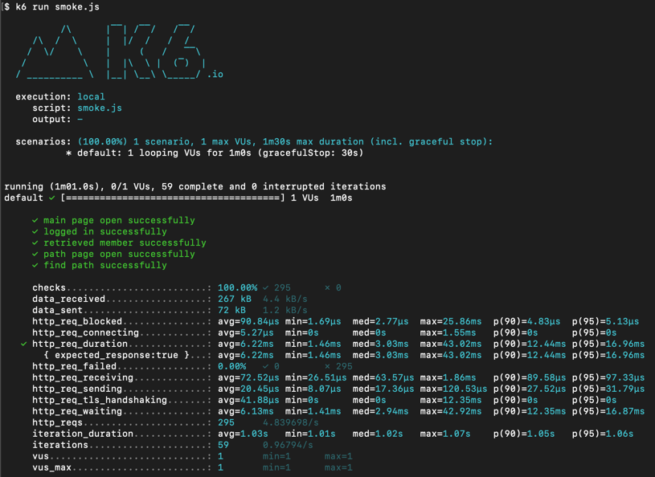
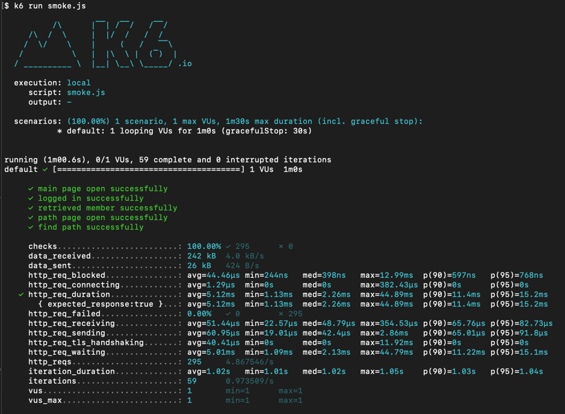
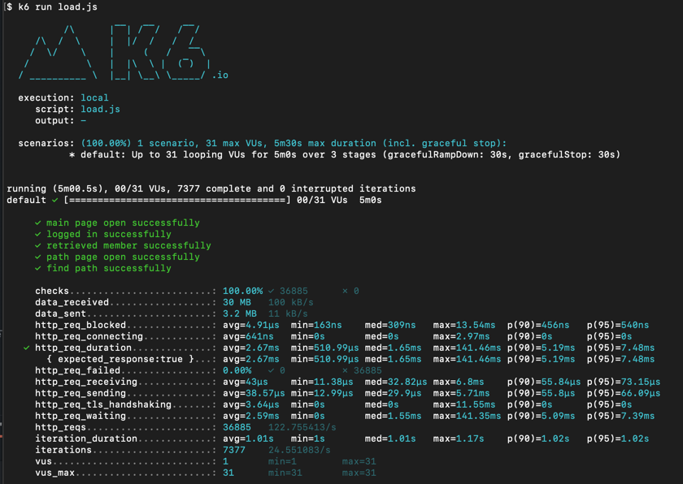
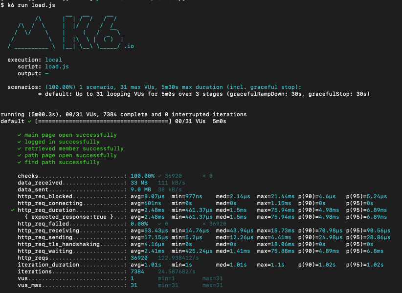
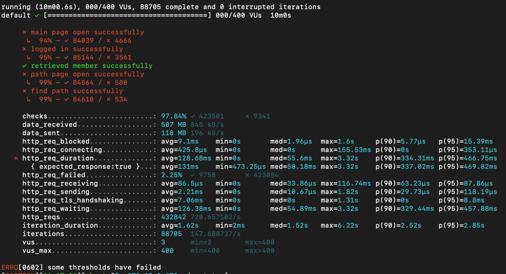
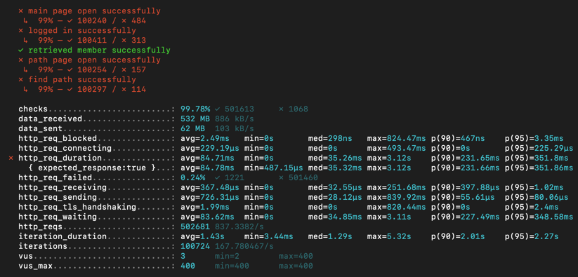
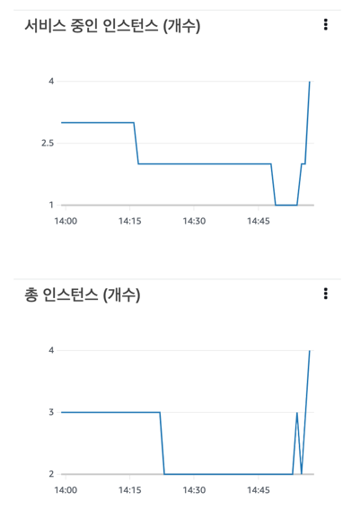
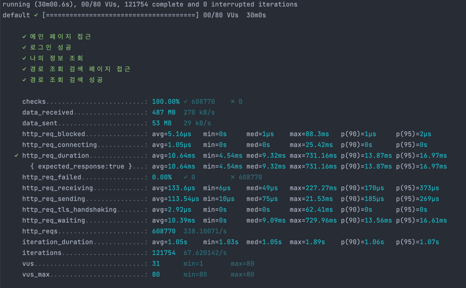
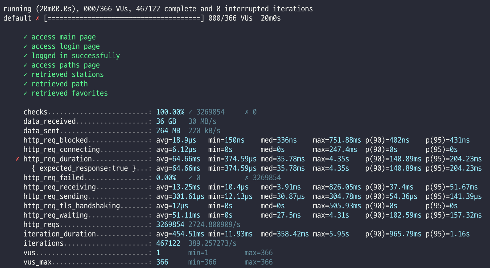

<p align="center">
    
</p>
<p align="center">
  
  
  <a href="https://edu.nextstep.camp/c/R89PYi5H" alt="nextstep atdd">
    
  </a>
  
</p>

<br>

# 인프라공방 샘플 서비스 - 지하철 노선도

<br>

## 🚀 Getting Started

### Install

#### npm 설치

```
cd frontend
npm install
```

> `frontend` 디렉토리에서 수행해야 합니다.

### Usage

#### webpack server 구동

```
npm run dev
```

#### application 구동

```
./gradlew clean build
```

<br>

## 미션

* 미션 진행 후에 아래 질문의 답을 작성하여 PR을 보내주세요.

### 1단계 - 화면 응답 개선하기

1. 성능 개선 결과를 공유해주세요 (Smoke, Load, Stress 테스트 결과)

- smoke
    - before
        - 
    - after
        - 
- load
    - before
        - 
    - after
        - 
- stress
    - before
        - 
    - after
        - 

2. 어떤 부분을 개선해보셨나요? 과정을 설명해주세요

- 처음엔 생각했던 것만큼 개선 효과를 크게 확인할 수 없어서 기존 메모리 db 를 외장 db 로 교체한 후 테스트를 다시 진행하니 조금은 더 개선효과를 확인할 수 있었습니다

- web(리버스 프록시)
    - gzip 압축
    - 정적자원 cache
    - TLS, HTTP/2
- was(tomcat)
    - redis cache 도입
        - 주요 조회(경로조회, 노선조회)에 적용

---

### 2단계 - 스케일 아웃

1. Launch Template 링크를 공유해주세요.

- https://ap-northeast-2.console.aws.amazon.com/ec2/v2/home?region=ap-northeast-2#LaunchTemplateDetails:launchTemplateId=lt-01322c68e058cdff7

2. cpu 부하 실행 후 EC2 추가생성 결과를 공유해주세요. (Cloudwatch 캡쳐)

```
At 2022-12-17T14:54:00Z a monitor alarm TargetTracking-velcronicity-asg-AlarmHigh-864259ef-64f1-44ea-810a-bc8fe4b72ea4 in state ALARM triggered policy Target Tracking Policy changing the desired capacity from 1 to 2. At 2022-12-17T14:54:12Z an instance was started in response to a difference between desired and actual capacity, increasing the capacity from 1 to 2.
At 2022-12-17T14:56:00Z a monitor alarm TargetTracking-velcronicity-asg-AlarmHigh-864259ef-64f1-44ea-810a-bc8fe4b72ea4 in state ALARM triggered policy Target Tracking Policy changing the desired capacity from 2 to 3. At 2022-12-17T14:56:14Z an instance was started in response to a difference between desired and actual capacity, increasing the capacity from 2 to 3.
At 2022-12-17T14:57:00Z a monitor alarm TargetTracking-velcronicity-asg-AlarmHigh-864259ef-64f1-44ea-810a-bc8fe4b72ea4 in state ALARM triggered policy Target Tracking Policy changing the desired capacity from 3 to 4. At 2022-12-17T14:57:05Z an instance was started in response to a difference between desired and actual capacity, increasing the capacity from 3 to 4.
```

- 

3. 성능 개선 결과를 공유해주세요 (Smoke, Load, Stress 테스트 결과)

- smoke
    - 
- load
    - 
- stress
    - 

- 부하 상황에서 최대설정 인스턴스 값인 4까지 증가하는 것을 확인했습니다.
- 스케일아웃 적용 전인 지난번 스텝에서 stress 테스트 시 오류가 많이 났지만 이번엔 동적 확장되면서 에러가 발생하지 않았습니다.

---

### 3단계 - 쿼리 최적화

1. 인덱스 설정을 추가하지 않고 아래 요구사항에 대해 1s 이하(M1의 경우 2s)로 반환하도록 쿼리를 작성하세요.

- 활동중인(Active) 부서의 현재 부서관리자 중 연봉 상위 5위안에 드는 사람들이 최근에 각 지역별로 언제 퇴실했는지 조회해보세요. (사원번호, 이름, 연봉, 직급명, 지역, 입출입구분, 입출입시간)

```
select employee.id                   AS 사원번호,
       employee.last_name            AS 이름,
       employee_salary.annual_income AS 연봉,
       employee_salary.position_name AS 직급명,
       record.time                   AS 입출입시간,
       record.region                 AS 지역,
       record.record_symbol          AS 입출입구분
from (select salary.id, salary.annual_income, position.position_name
      from (select *
            from salary
            where end_date = '9999-01-01') salary
               join (select employee_id, department_id
                     from manager
                     where end_date = '9999-01-01') manaer
                    on manaer.employee_id = salary.id
               join (select id
                     from department
                     where note = 'active') department
                    on department.id = manaer.department_id
               join (select id, position_name
                     from position
                     where `end_date` = '9999-01-01'
                       and position_name = 'manager') position
                    on position.id = manaer.employee_id
      order by salary.annual_income desc
      limit 5) employee_salary
         join (select id, last_name
               from employee) employee
              on employee.id = employee_salary.id
         join (select employee_id, time, region, record_symbol
               from record
               where record_symbol = 'O') record
              on record.employee_id = employee.id
         join (select employee_id, department_id
               from employee_department
               where end_date = '9999-01-01') employee_department
              on employee_department.employee_id = employee.id
order by employee_salary.annual_income desc;
```
---

### 4단계 - 인덱스 설계

1. 인덱스 적용해보기 실습을 진행해본 과정을 공유해주세요

---

### 추가 미션

1. 페이징 쿼리를 적용한 API endpoint를 알려주세요

### Step 요구사항

## step1

-[x] 부하테스트 각 시나리오의 요청시간을 목푯값 이하로 개선
    -[x] 개선 전/후를 직접 계측하여 확인
        -[x] 리버스 프록시 개선
        -[x] was 성능 개선

## step2

-[x] springboot에 HTTP Cache, gzip 설정하기
    -[x] test code
-[x] Launch Template 작성하기
-[x] Auto Scaling Group 생성하기
-[x] Smoke, Load, Stress 테스트 후 결과를 기록

## step3

-[x] 활동중인(Active) 부서의 현재 부서관리자(manager) 중 연봉 상위 5위안에 드는 사람들이 최근에 각 지역별로 언제 퇴실(O)했는지 조회해보세요.
    - (사원번호, 이름, 연봉, 직급명, 지역, 입출입구분, 입출입시간)
-[x] 인덱스 설정을 추가하지 않고 200ms 이하로 반환합니다.
    - M1의 경우엔 시간 제약사항을 달성하기 어렵습니다. 2s를 기준으로 해보시고 어렵다면, 일단 리뷰요청 부탁드려요
