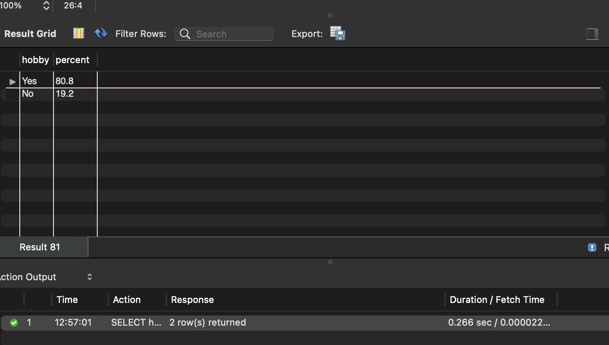
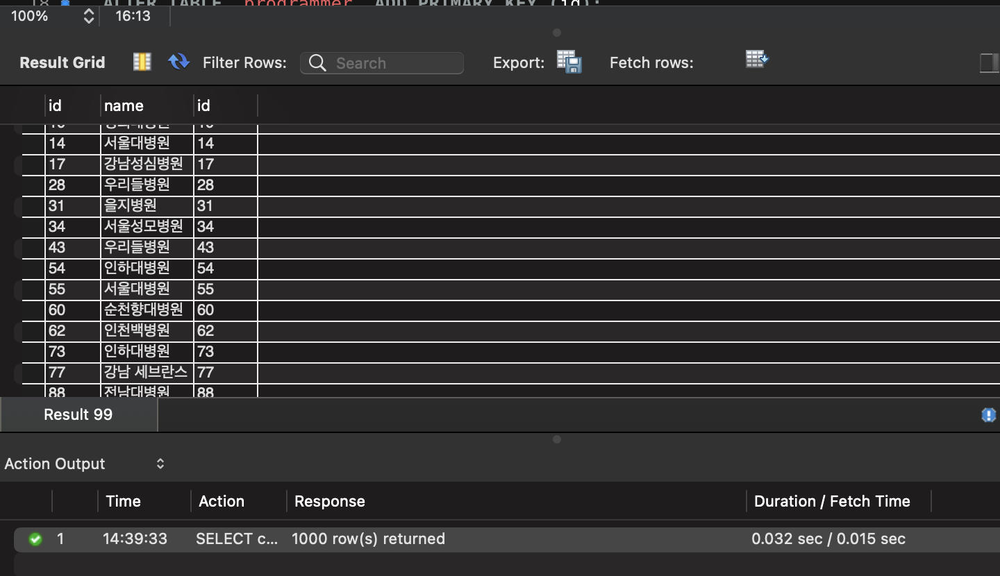

<p align="center">
    
</p>
<p align="center">
  
  
  <a href="https://edu.nextstep.camp/c/R89PYi5H" alt="nextstep atdd">
    
  </a>
  
</p>

<br>

# 인프라공방 샘플 서비스 - 지하철 노선도

<br>

## 🚀 Getting Started

### Install
#### npm 설치
```
cd frontend
npm install
```
> `frontend` 디렉토리에서 수행해야 합니다.

### Usage
#### webpack server 구동
```
npm run dev
```
#### application 구동
```
./gradlew clean build
```
<br>

## 미션

* 미션 진행 후에 아래 질문의 답을 작성하여 PR을 보내주세요.

### 1단계 - 쿼리 최적화

1. 인덱스 설정을 추가하지 않고 아래 요구사항에 대해 1s 이하(M1의 경우 2s)로 반환하도록 쿼리를 작성하세요.

- 활동중인(Active) 부서의 현재 부서관리자 중 연봉 상위 5위안에 드는 사람들이 최근에 각 지역별로 언제 퇴실했는지 조회해보세요. (사원번호, 이름, 연봉, 직급명, 지역, 입출입구분, 입출입시간)


- **M1 노트북으로 실행한 결과입니다.**
```sql
SELECT 
	SUB_TABLE.사원번호,
	SUB_TABLE.이름,
	SUB_TABLE.연봉,
	SUB_TABLE.직급명,
	사원출입기록.입출입시간,
	사원출입기록.지역, 
	사원출입기록.입출입구분
FROM (
	SELECT 
		사원.사원번호, 
		사원.이름, 
		급여.연봉, 
		직급.직급명
	FROM 사원
	INNER JOIN 직급 ON 사원.사원번호 = 직급.사원번호
	INNER JOIN 급여 ON 사원.사원번호 = 급여.사원번호
	INNER JOIN 부서관리자 ON 사원.사원번호 = 부서관리자.사원번호
	INNER JOIN 부서 ON 부서.부서번호 = 부서관리자.부서번호
	WHERE 부서.비고 = 'active' 
	AND 직급.종료일자 > now() 
	AND 급여.종료일자 > now()
	AND 부서관리자.종료일자 > now()
	ORDER BY 급여.연봉 DESC
	LIMIT 5
) SUB_TABLE
INNER JOIN 사원출입기록 ON SUB_TABLE.사원번호 = 사원출입기록.사원번호 
WHERE 사원출입기록.입출입구분 = 'O';
```


---

### 2단계 - 인덱스 설계

1. 인덱스 적용해보기 실습을 진행해본 과정을 공유해주세요
-  Coding as a Hobby 와 같은 결과를 반환하세요.
    ```sql
    CREATE INDEX `idx_hobby` ON `subway`.`programmer` (hobby);
     
    SELECT 
        hobby,
        ROUND((count(*) * 100) / (select count(*) from subway.programmer), 1) as percent
    FROM subway.programmer
    GROUP BY hobby
    ORDER BY percent desc;
    ```
    


-  프로그래머별로 해당하는 병원 이름을 반환하세요. (covid.id, hospital.name)
    ```sql
    ALTER TABLE `hospital` ADD PRIMARY KEY (id);
    ALTER TABLE `programmer` ADD PRIMARY KEY (id);
    CREATE INDEX `idx_programmer_id` ON `subway`.`covid` (programmer_id);

    SELECT 
        covid.id, 
        hospital.name, 
        programmer.id
    FROM programmer
    INNER JOIN covid ON covid.programmer_id = programmer.id
    INNER JOIN hospital ON covid.hospital_id = hospital.id;
    ```
   


---

### 추가 미션

1. 페이징 쿼리를 적용한 API endpoint를 알려주세요
