<p align="center">
    
</p>
<p align="center">
  
  
  <a href="https://edu.nextstep.camp/c/R89PYi5H" alt="nextstep atdd">
    
  </a>
  
</p>

<br>

# 인프라공방 샘플 서비스 - 지하철 노선도

<br>

## 🚀 Getting Started

### Install
#### npm 설치
```
cd frontend
npm install
```
> `frontend` 디렉토리에서 수행해야 합니다.

### Usage
#### webpack server 구동
```
npm run dev
```
#### application 구동
```
./gradlew clean build
```
<br>

## 서비스 주소
- https://cwjonhpark-subway-px.o-r.kr/

## 미션

* 미션 진행 후에 아래 질문의 답을 작성하여 PR을 보내주세요.


### 1단계 - 화면 응답 개선하기

1. 성능 개선 결과를 공유해주세요 (Smoke, Load, Stress 테스트 결과)

### Smoke 테스트 결과
```markdown
     ✓ logged in successfully
     ✓ retrieved member

     checks.....................: 100.00% ✓ 596      ✗ 0
     data_received..............: 220 kB  733 B/s
     data_sent..................: 119 kB  397 B/s
     http_req_blocked...........: avg=55.2µs  min=1.65µs  med=4.16µs  max=30.67ms  p(90)=5.13µs  p(95)=5.52µs
     http_req_connecting........: avg=501ns   min=0s      med=0s      max=298.72µs p(90)=0s      p(95)=0s
   ✓ http_req_duration..........: avg=2.95ms  min=2.15ms  med=3.02ms  max=17.89ms  p(90)=3.5ms   p(95)=3.86ms
     http_req_failed............: 100.00% ✓ 596      ✗ 0
     http_req_receiving.........: avg=56.06µs min=26.79µs med=54µs    max=235.37µs p(90)=70.88µs p(95)=76.8µs
     http_req_sending...........: avg=20.4µs  min=7.88µs  med=21.22µs max=169.74µs p(90)=30.42µs p(95)=33.2µs
     http_req_tls_handshaking...: avg=29.83µs min=0s      med=0s      max=17.78ms  p(90)=0s      p(95)=0s
     http_req_waiting...........: avg=2.87ms  min=2.08ms  med=2.94ms  max=17.8ms   p(90)=3.41ms  p(95)=3.78ms
     http_reqs..................: 596     1.986125/s
     iteration_duration.........: avg=1s      min=1s      med=1s      max=1.03s    p(90)=1s      p(95)=1s
     iterations.................: 298     0.993063/s
     vus........................: 1       min=1      max=1
     vus_max....................: 1       min=1      max=1
```

### Load 테스트 결과
```markdown
    ✓ logged in successfully
    ✓ retrieved member
    ✓ find path

    checks.........................: 100.00% ✓ 10365     ✗ 0    
    data_received..................: 11 MB   18 kB/s
    data_sent......................: 2.4 MB  4.0 kB/s
    http_req_blocked...............: avg=12.72µs min=1.04µs  med=4.26µs  max=16.58ms  p(90)=5.28µs  p(95)=5.72µs 
    http_req_connecting............: avg=693ns   min=0s      med=0s      max=481.18µs p(90)=0s      p(95)=0s     
    ✓ http_req_duration..............: avg=11.46ms min=2.66ms  med=4.18ms  max=363.64ms p(90)=27.19ms p(95)=32.91ms
    { expected_response:true }...: avg=11.72ms min=2.71ms  med=4.22ms  max=363.64ms p(90)=27.42ms p(95)=33.27ms
    http_req_failed................: 3.22%   ✓ 345       ✗ 10365
    http_req_receiving.............: avg=63.21µs min=15.46µs med=59.74µs max=4.51ms   p(90)=80.71µs p(95)=89.82µs
    http_req_sending...............: avg=21.52µs min=5.47µs  med=19.55µs max=3.94ms   p(90)=29.87µs p(95)=34.18µs
    http_req_tls_handshaking.......: avg=6.14µs  min=0s      med=0s      max=12.83ms  p(90)=0s      p(95)=0s     
    http_req_waiting...............: avg=11.38ms min=2.59ms  med=4.09ms  max=363.56ms p(90)=27.1ms  p(95)=32.81ms
    http_reqs......................: 10710   17.792301/s
    iteration_duration.............: avg=1.93s   min=1s      med=2.03s   max=2.37s    p(90)=2.04s   p(95)=2.05s  
    iterations.....................: 3570    5.930767/s
    vus............................: 13      min=1       max=22
    vus_max........................: 23      min=23      max=23
```

### Stress 테스트 결과

```markdown
    ✗ logged in successfully
     ↳  99% — ✓ 6026 / ✗ 12
    ✓ retrieved member
    ✓ find path

    checks.........................: 99.92% ✓ 17058     ✗ 12    
    data_received..................: 19 MB  38 kB/s
    data_sent......................: 4.2 MB 8.4 kB/s
    http_req_blocked...............: avg=37.18ms min=0s       med=2.84µs  max=5m30s   p(90)=5.03µs  p(95)=8.06µs  
    http_req_connecting............: avg=7.2µs   min=0s       med=0s      max=14.78ms p(90)=0s      p(95)=0s      
    ✗ http_req_duration..............: avg=2.89s   min=0s       med=5ms     max=5m49s   p(90)=53.88ms p(95)=85.74ms
    { expected_response:true }...: avg=1.28s   min=2.54ms   med=5.31ms  max=5m49s   p(90)=53.85ms p(95)=83.41ms
    http_req_failed................: 5.51%  ✓ 996       ✗ 17058
    http_req_receiving.............: avg=1.05s   min=0s       med=42.15µs max=5m44s   p(90)=79.85µs p(95)=111.24µs
    http_req_sending...............: avg=72.67ms min=0s       med=13.22µs max=5m36s   p(90)=28.64µs p(95)=39.33µs
    http_req_tls_handshaking.......: avg=50.25µs min=0s       med=0s      max=30.82ms p(90)=0s      p(95)=0s      
    http_req_waiting...............: avg=1.77s   min=0s       med=4.92ms  max=5m36s   p(90)=53.76ms p(95)=85.59ms
    http_reqs......................: 18054  36.34331/s
    iteration_duration.............: avg=4.32s   min=254.36µs med=2.03s   max=5m50s   p(90)=2.12s   p(95)=2.19s   
    iterations.....................: 5892   11.860794/s
    vus............................: 716    min=1       max=716
    vus_max........................: 1000   min=1000    max=1000
    
    time="2022-12-17T13:45:22Z" level=error msg="some thresholds have failed"
```

2. 어떤 부분을 개선해보셨나요? 과정을 설명해주세요

## Reverse Proxy (Nginx) 성능 개선 결과
- 다음 표는 Lighthouse를 이용해 검사한 리버스 프록시 성능 개선 적용 이전과 이후 결과 입니다.
- FCP(First Contentful Paint)와 TTI(Time to Interactive), SI(Speed Index)가 크게 개선되었습니다. 

|        | FCP   | TTI   | SI    | TBT   | LCP   | CLS   |
|--------|-------|-------|-------|-------|-------|-------|
| AS-IS  | 13.8s | 14.9s | 14.4s | 410ms | 13.8s | 0.041 |
| TO-BE  | 4.5s  | 5.8s  | 4.5 s | 600ms | 5.0s  | 0.039 |

js 파일의 크기가 최대 20배까지 줄었음을 알 수 있습니다. 
- /js/vendors.js (2,125.4 KiB -> 416 KiB) 
- /js/main.js (637.3 KiB -> 29.2 KiB)


---

### 2단계 - 스케일 아웃

- springboot에서 HTTP Cache, gzip 설정하기
- Launch Template 작성하기
- Auto Scaling Group 생성하기
- Smoke, Load, Stress 테스트 후 결과를 기록

1. Launch Template 링크를 공유해주세요.

https://ap-northeast-2.console.aws.amazon.com/ec2/v2/home?region=ap-northeast-2#LaunchTemplateDetails:launchTemplateId=lt-06947fbc479ee9bef
 
2. cpu 부하 실행 후 EC2 추가생성 결과를 공유해주세요. (Cloudwatch 캡쳐)
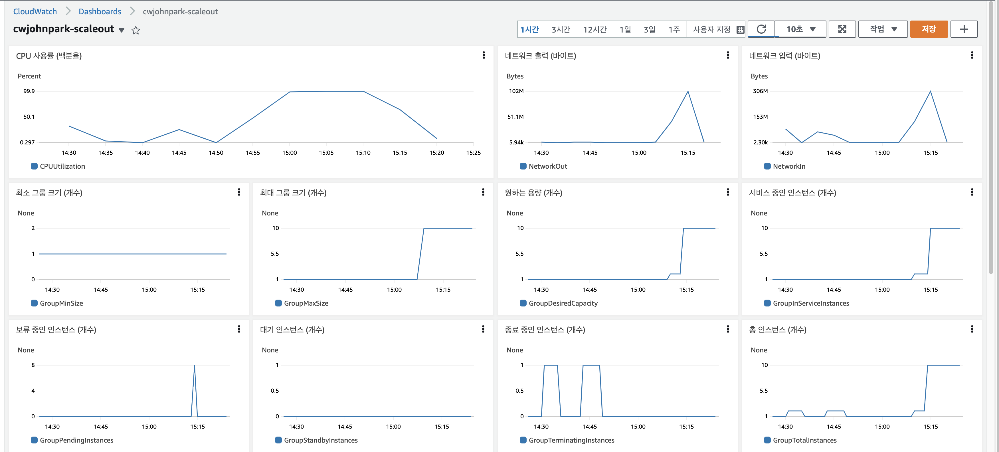

3. 성능 개선 결과를 공유해주세요 (Smoke, Load, Stress 테스트 결과)


## Smoke 테스트 결과
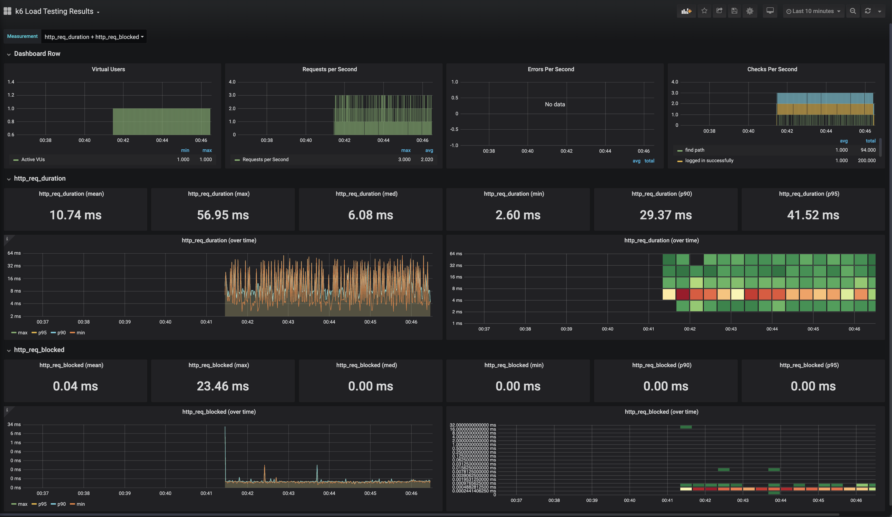
```markdown
running (5m00.8s), 0/1 VUs, 200 complete and 0 interrupted iterations
default ✓ [======================================] 1 VUs  5m0s

     ✓ logged in successfully
     ✓ retrieved member
     ✓ find path

     checks.........................: 100.00% ✓ 494      ✗ 0
     data_received..................: 341 kB  1.1 kB/s
     data_sent......................: 73 kB   244 B/s
     http_req_blocked...............: avg=39.53µs  min=224ns   med=396ns   max=23.46ms  p(90)=459ns    p(95)=496ns
     http_req_connecting............: avg=1.05µs   min=0s      med=0s      max=630.92µs p(90)=0s       p(95)=0s
    ✓ http_req_duration..............: avg=10.73ms  min=2.6ms   med=6.07ms  max=56.94ms  p(90)=29.45ms  p(95)=41.51ms
        { expected_response:true }...: avg=11.98ms  min=3.18ms  med=6.6ms   max=56.94ms  p(90)=35.4ms   p(95)=42.61ms
     http_req_failed................: 17.66%  ✓ 106      ✗ 494
     http_req_receiving.............: avg=118.27µs min=24.41µs med=55.88µs max=10.26ms  p(90)=129.11µs p(95)=205.25µs
     http_req_sending...............: avg=48.55µs  min=21.33µs med=47.42µs max=159.63µs p(90)=68.26µs  p(95)=80.91µs
     http_req_tls_handshaking.......: avg=33.5µs   min=0s      med=0s      max=20.1ms   p(90)=0s       p(95)=0s
     http_req_waiting...............: avg=10.57ms  min=2.47ms  med=5.93ms  max=56.83ms  p(90)=29.32ms  p(95)=41.28ms
     http_reqs......................: 600     1.994997/s
     iteration_duration.............: avg=1.5s     min=1.01s   med=1.02s   max=2.07s    p(90)=2.05s    p(95)=2.06s
     iterations.....................: 200     0.664999/s
     vus............................: 1       min=1      max=1
     vus_max........................: 1       min=1      max=1
```

## Load 테스트 결과
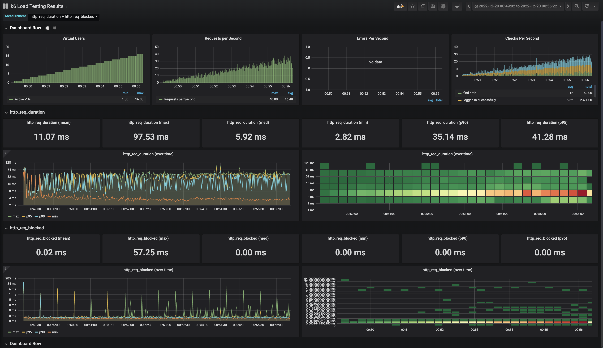
```markdown
running (10m02.0s), 00/23 VUs, 4543 complete and 0 interrupted iterations
default ✓ [ 100% ] 00/23 VUs  10m0s

     ✓ logged in successfully
     ✓ retrieved member
     ✓ find path

     checks.........................: 100.00% ✓ 11302     ✗ 0
     data_received..................: 8.2 MB  14 kB/s
     data_sent......................: 1.7 MB  2.8 kB/s
     http_req_blocked...............: avg=12.46µs min=162ns   med=379ns   max=57.24ms p(90)=457ns   p(95)=506ns
     http_req_connecting............: avg=1.04µs  min=0s      med=0s      max=3.21ms  p(90)=0s      p(95)=0s
   ✓ http_req_duration..............: avg=11.32ms min=2.82ms  med=6.25ms  max=97.52ms p(90)=39.08ms p(95)=41.51ms
       { expected_response:true }...: avg=12.7ms  min=2.82ms  med=6.55ms  max=97.52ms p(90)=39.85ms p(95)=42.29ms
     http_req_failed................: 17.07%  ✓ 2327      ✗ 11302
     http_req_receiving.............: avg=74.21µs min=13.63µs med=53.29µs max=7.95ms  p(90)=94.55µs p(95)=144.38µs
     http_req_sending...............: avg=51.3µs  min=15.54µs med=46.78µs max=3.51ms  p(90)=75.73µs p(95)=85.57µs
     http_req_tls_handshaking.......: avg=8.31µs  min=0s      med=0s      max=39.26ms p(90)=0s      p(95)=0s
     http_req_waiting...............: avg=11.2ms  min=2.2ms   med=6.15ms  max=97.08ms p(90)=38.95ms p(95)=41.38ms
     http_reqs......................: 13629   22.640546/s
     iteration_duration.............: avg=1.52s   min=1.01s   med=1.02s   max=2.17s   p(90)=2.05s   p(95)=2.06s
     iterations.....................: 4543    7.546849/s
     vus............................: 7       min=1       max=22
     vus_max........................: 23      min=23      max=23
```

## Stress 테스트 결과

### 오토 스케일 적용 전
```markdown
running (3m25.3s), 110/500 VUs, 4662 complete and 0 interrupted iterations
default   [  49% ] 111/500 VUs  3m27.8s/7m00.0s
time="2022-12-19T17:16:14Z" level=warning msg="Request Failed" error="Post \"https://cwjonhpark-subway-px.o-r.kr/login/token\": write tcp 192.168.91.173:49844->3.34.75.117:443: write: broken pipe"
...
running (7m20.5s), 108/500 VUs, 4745 complete and 382 interrupted iterations
default ↓ [ 100% ] 112/500 VUs  7m0s

```
- Request 실패 지점이 110 VUser 에서 발생합니다.
- 부하가 낮아지며 정상적으로 돌아오는 지점은 108 VUser 에서 부터입니다.
```markdown

     ✗ logged in successfully
      ↳  99% — ✓ 4826 / ✗ 27
     ✓ retrieved member
     ✓ find path

     checks.........................: 99.76% ✓ 11316     ✗ 27
     data_received..................: 8.0 MB 18 kB/s
     data_sent......................: 1.9 MB 4.2 kB/s
     http_req_blocked...............: avg=3.72ms   min=0s       med=318ns   max=6.39s    p(90)=415ns    p(95)=473ns
     http_req_connecting............: avg=6.51ms   min=0s       med=0s      max=19.04s   p(90)=0s       p(95)=0s
    ✗ http_req_duration..............: avg=233.66ms min=0s       med=6.14ms  max=4m13s    p(90)=38.51ms  p(95)=43.44ms
    { expected_response:true }...: avg=100.94ms min=3.56ms   med=6.76ms  max=1m20s    p(90)=39.65ms  p(95)=45.09ms
    http_req_failed................: 21.98% ✓ 3188      ✗ 11316
    http_req_receiving.............: avg=84.97ms  min=0s       med=39.84µs max=45.13s   p(90)=117.02µs p(95)=214.95µs
    http_req_sending...............: avg=41.48ms  min=0s       med=32.04µs max=1m1s     p(90)=63.8µs   p(95)=82.52µs
    http_req_tls_handshaking.......: avg=904.21µs min=0s       med=0s      max=253.94ms p(90)=0s       p(95)=0s
    http_req_waiting...............: avg=107.2ms  min=0s       med=6.04ms  max=4m13s    p(90)=38.31ms  p(95)=43.08ms
    http_reqs......................: 14504  32.742068/s
    iteration_duration.............: avg=8.07s    min=221.82µs med=1.02s   max=5m17s    p(90)=2.06s    p(95)=2.07s
    iterations.....................: 4851   10.950894/s
    vus............................: 29     min=1       max=112
    vus_max........................: 500    min=500     max=500
```

### 오토 스케일 적용 후
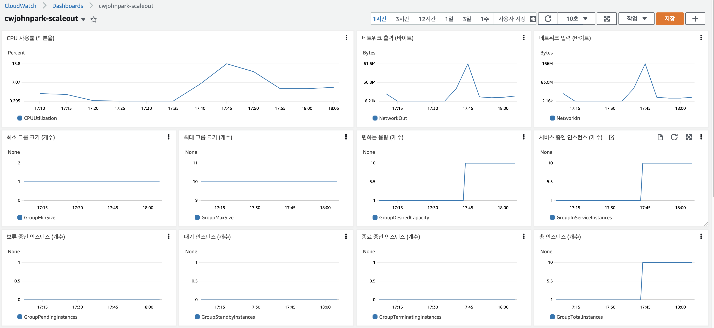
- 오토 스케일링 적용후 10개 인스턴스까지 로드 밸런싱되어 최대 1000 VUser 까지 부하를 받을 수 있는 것을 확인했습니다.
```markdown
     checks.........................: 100.00% ✓ 327214     ✗ 0
     data_received..................: 78 MB   326 kB/s
     data_sent......................: 49 MB   204 kB/s
     http_req_blocked...............: avg=12.37µs  min=122ns  med=280ns   max=34.38ms  p(90)=349ns    p(95)=378ns
     http_req_connecting............: avg=2.08µs   min=0s     med=0s      max=21.16ms  p(90)=0s       p(95)=0s
   ✓ http_req_duration..............: avg=5.53ms   min=1.7ms  med=4.82ms  max=1.13s    p(90)=8.43ms   p(95)=9.24ms
       { expected_response:true }...: avg=5.53ms   min=1.7ms  med=4.82ms  max=1.13s    p(90)=8.43ms   p(95)=9.24ms
     http_req_failed................: 0.00%   ✓ 0          ✗ 327214
     http_req_receiving.............: avg=104.19µs min=9.69µs med=37.1µs  max=488.61ms p(90)=162.63µs p(95)=231.6µs
     http_req_sending...............: avg=36.32µs  min=11.8µs med=25.83µs max=16.89ms  p(90)=48.14µs  p(95)=82.76µs
     http_req_tls_handshaking.......: avg=9.53µs   min=0s     med=0s      max=23.77ms  p(90)=0s       p(95)=0s
     http_req_waiting...............: avg=5.39ms   min=1.03ms med=4.71ms  max=1.13s    p(90)=8.29ms   p(95)=9.11ms
     http_reqs......................: 327214  1357.68146/s
     iteration_duration.............: avg=1.01s    min=1s     med=1.01s   max=2.14s    p(90)=1.01s    p(95)=1.01s
     iterations.....................: 163607  678.84073/s
     vus............................: 294     min=4        max=1000
     vus_max........................: 1000    min=1000     max=1000
```

---

### 3단계 - 쿼리 최적화
### 실습환경 세팅
```bash
$ docker run -d -p 23306:3306 brainbackdoor/data-tuning:0.0.3 
```
- workbench를 설치한 후 localhost:23306 (ID : user, PW : password) 로 접속합니다.

### 요구사항
- 활동중인(Active) 부서의 현재 부서관리자(manager) 중 연봉 상위 5위안에 드는 사람들이 최근에 각 지역별로 언제 퇴실(O)했는지 조회해보세요.
- (사원번호, 이름, 연봉, 직급명, 지역, 입출입구분, 입출입시간)
- 인덱스 설정을 추가하지 않고 200ms 이하로 반환합니다.
- M1의 경우엔 시간 제약사항을 달성하기 어렵습니다. 2s를 기준으로 해보시고 어렵다면, 일단 리뷰요청 부탁드려요
- 급여 테이블의 사용여부 필드는 사용하지 않습니다. 현재 근무중인지 여부는 종료일자 필드로 판단해주세요.

1. 인덱스 설정을 추가하지 않고 아래 요구사항에 대해 200ms 이하(M1의 경우 2s)로 반환하도록 쿼리를 작성하세요.
- 활동중인(Active) 부서의 현재 부서관리자 중 연봉 상위 5위안에 드는 사람들이 최근에 각 지역별로 언제 퇴실했는지 조회해보세요. 
- 칼럼명: 사원번호, 이름, 연봉, 직급명, 지역, 입출입구분, 입출입시간
```sql
SELECT employee_id as '사원번호', 
	first_name as '이름',
    annual_income as '연봉',
    'Manager' as '직급명',
	time as '입출입시간', 
    region as '지역', 
    record_symbol as '입출입구분'
FROM  (SELECT employee_id, region, time, record_symbol 
	FROM record 
	WHERE record_symbol = 'O') r,
    ( SELECT m.id, annual_income
		FROM ( SELECT m.employee_id as id
		FROM 
		(SELECT id FROM department WHERE note = 'active' ) ad,
		(SELECT employee_id, department_id FROM manager WHERE end_date='9999-01-01') m
		WHERE ad.id = m.department_id
	) m, 
    ( SELECT id, annual_income
	 FROM salary
	 WHERE end_date = '9999-01-01'
	) s
	WHERE m.id = s.id
	ORDER BY s.annual_income DESC 
	LIMIT 5) e,
	( SELECT id, first_name FROM employee ) n
WHERE r.employee_id = e.id and n.id = e.id;
```
### 쿼리 결과
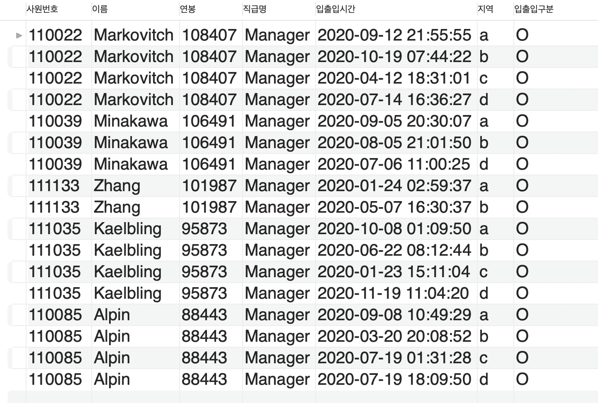
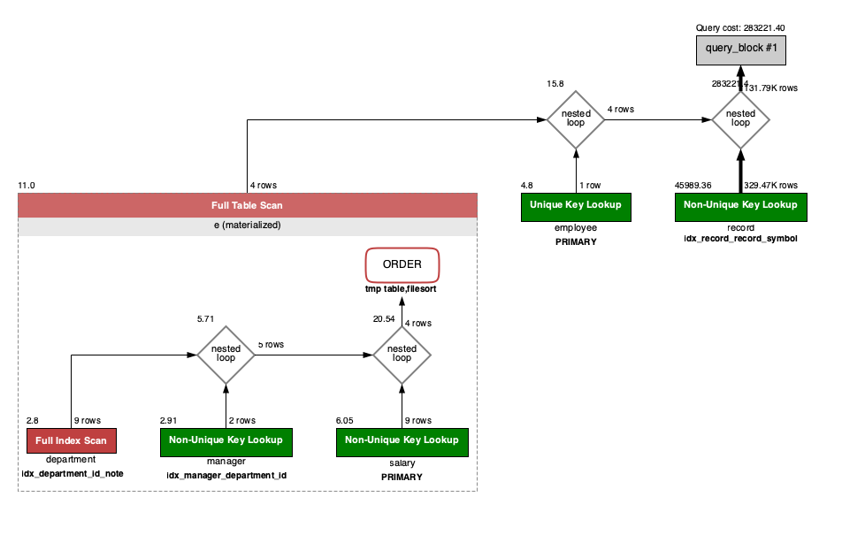
---

### 4단계 - 인덱스 설계
### 실습환경 세팅
```bash
$ docker run -d -p 13306:3306 brainbackdoor/data-subway:0.0.3
```
- workbench를 설치한 후 localhost:13306 (ID : root, PW : masterpw) 로 접속합니다.

### 요구사항
- 주어진 데이터셋을 활용하여 아래 조회 결과를 100ms 이하로 반환 (M1의 경우엔 시간 제약사항을 달성하기 어렵습니다. 2배를 기준으로 해보시고 어렵다면, 일단 리뷰요청 부탁드려요)
1. 인덱스 적용해보기 실습을 진행해본 과정을 공유해주세요
- Coding as a Hobby 와 같은 결과를 반환하세요.
```sql
/*
 - 인덱스 추가 전: 4.3 s
 - programmer.hobby 칼럼에 인덱스 추가 후: 70ms
*/
CREATE INDEX idx_programmer_hobby ON programmer(hobby);

SELECT hobby,
       ROUND(COUNT(hobby) / (SELECT COUNT(hobby) FROM programmer) * 100, 1) AS perentage
FROM programmer
GROUP BY hobby
ORDER by hobby DESC;
```
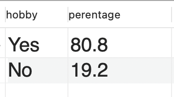

- 프로그래머별로 해당하는 병원 이름을 반환하세요. (covid.id, hospital.name)
```sql
/*
  - covid.hospital_id 에 non unique index 추가 
  - 쿼리 수행 시간: 4ms
 */
CREATE INDEX idx_covid_hospital_id ON covid(hospital_id);
CREATE UNIQUE INDEX idx_programmer_id ON programmer(id);

SELECT programmer_id, hospital.name
FROM hospital
       INNER JOIN covid
                  ON hospital.id = covid.hospital_id
       INNER JOIN programmer
                  ON covid.programmer_id = programmer.id

```
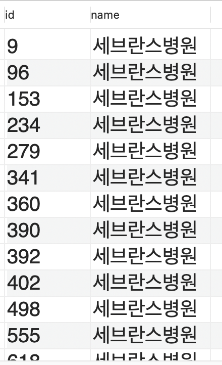

- 프로그래밍이 취미인 학생 혹은 주니어(0-2년)들이 다닌 병원 이름을 반환하고 user.id 기준으로 정렬하세요. (covid.id, hospital.name, user.Hobby, user.DevType, user.YearsCoding)
```sql
/*
  - covid 테이블에 id unique index 추가
  - 쿼리수행시간: 30ms
 */
CREATE UNIQUE INDEX idx_covid_id ON covid(id);

SELECT covid.id,
       hospital.name,
       user.hobby,
       user.dev_type,
       user.years_coding
FROM
    (
        SELECT id, years_coding, hobby, student, dev_type
        FROM programmer
        WHERE
            (hobby = 'Yes' AND student like 'Yes%')
           OR
            years_coding like '0-2 years'
    ) user 
INNER JOIN (SELECT id, hospital_id FROM covid ORDER BY id ) covid ON user.id = covid.id
    INNER JOIN hospital ON covid.hospital_id = hospital.id
;
```
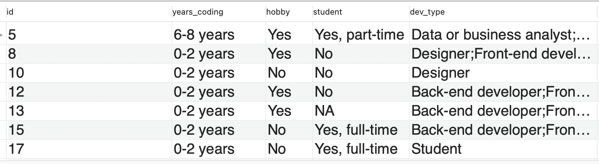

- 서울대병원에 다닌 20대 India 환자들을 병원에 머문 기간별로 집계하세요. (covid.Stay)
```sql
/*
20대 India 회원
- member.id에 unique index 추가시 7s-> 60ms 개선
- programmer.country에 index 추가시 60ms -> 30ms 개선
  */
CREATE UNIQUE INDEX idx_member_id on member(id);
CREATE INDEX idx_programmer_country on programmer(country);

SELECT id
FROM (
       SELECT id, age
       FROM member
       WHERE age BETWEEN 20 AND 29
     ) member,
     (
       SELECT member_id
       FROM programmer
       WHERE country = 'India'
     ) india
WHERE member.id = india.member_id;
/*
서울대 병원의 환자가 병원에 머문기간
- 인덱스 추가 없이 30ms
- covid.hospital_id index 추가시 30ms -> 10ms 개선
*/
CREATE INDEX idx_covid_hospital_id ON covid(hospital_id);

SELECT member_id, stay
FROM (
       SELECT hospital_id, member_id, stay
       FROM covid
     ) covid,
     (
       SELECT id
       FROM hospital
       WHERE name = '서울대병원'
     ) hospital
WHERE covid.hospital_id = hospital.id;

/*
서울대 병원에 다닌 20대 India 회원이 병원에 머문 기간
- 인덱스를 추가하지 않을 경우 Timeout 발생
- programmer.id 에 unique index 추가시 100ms
- covid.member_id 에 index 추가시 100ms -> 50ms
  */

-- INDEX: hospital
CREATE INDEX idx_hospital_name ON hospital(name);
-- INDEX: member
CREATE UNIQUE INDEX idx_member_id ON member(id);
CREATE INDEX idx_member_age ON member(age);
-- INDEX: programmer
CREATE INDEX idx_programmer_member_id ON programmer(member_id);
-- INDEX: covid
CREATE INDEX idx_covid_member_id ON covid(member_id);
CREATE INDEX idx_covid_hospital_id ON covid(hospital_id);

SELECT stay, count(stay)
FROM (
         SELECT id
         FROM
             (
                 SELECT id, age FROM member WHERE age BETWEEN 20 AND 29
             ) member,
             (
                 SELECT member_id FROM programmer WHERE country = 'India'
             ) india
         WHERE member.id = india.member_id
     ) member
         INNER JOIN covid 
             ON member.id = covid.member_id
         INNER JOIN
             (
                 SELECT id FROM hospital WHERE name = '서울대병원'
             ) hospital
            ON covid.hospital_id = hospital.id
GROUP BY stay
ORDER BY NULL
;
```
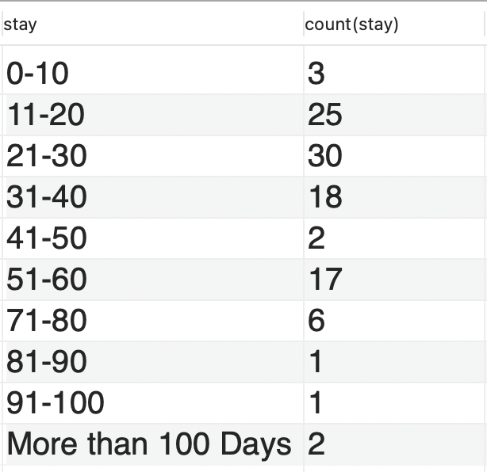
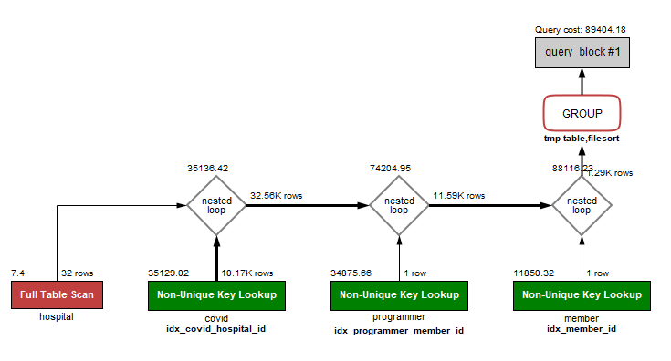

- 서울대병원에 다닌 30대 환자들을 운동 횟수별로 집계하세요. (user.Exercise)
```sql
/*
서울대병원에 다닌 환자
- 모수가 적은 드라이빙 테이블을  hospital로 지정
- 조인 키가 되는 covid.hospital_id 에 Index 부여
- 수행시간: 4ms
*/
CREATE INDEX idx_covid_hospital_id ON covid(hospital_id);

SELECT member_id, stay
FROM covid,
     (
       SELECT id FROM hospital WHERE name = '서울대병원'
     ) hospital
WHERE covid.hospital_id = hospital.id;

/*
30대 환자의 운동 횟수
- member, programmer 두 테이블의 크기는 비슷함
- 조인 키가 되는 programmer.member_id를 Index로 지정
- 수행시간: 10ms
*/
CREATE INDEX idx_programmer_member_id on programmer(member_id);

SELECT exercise
FROM programmer,
     (
       SELECT id, age
       FROM member
       WHERE age BETWEEN 30 AND 39
     ) member
WHERE programmer.member_id = member.id
;

/*
서울대병원에 다닌 환자의 운동 횟수 집계
- 드라이빙 테이블을 모수가 적은 member와 조인된 hospital로 지정
- programmer.exercise Index 추가 후, 20ms -> 40ms 개선
*/
-- 추가한 모든 인덱스
---- INDEX: hospital
CREATE INDEX idx_hospital_name ON hospital(name);
CREATE UNIQUE INDEX idx_hospital_id ON hospital(id);
---- INDEX: member
CREATE UNIQUE INDEX idx_member_id ON member(id);
CREATE INDEX idx_member_age ON member(age);
---- INDEX: programmer
CREATE INDEX idx_programmer_member_id ON programmer(member_id);
CREATE INDEX idx_programmer_exercise ON programmer(exercise);
---- INDEX: covid
CREATE INDEX idx_covid_member_id ON covid(member_id);
CREATE INDEX idx_covid_hospital_id ON covid(hospital_id);

SELECT exercise, count(exercise) as exercise_count
FROM (
         SELECT member_id, exercise
         FROM programmer
     ) programmer
INNER JOIN (
    SELECT member_id
    FROM covid, ( SELECT id FROM hospital WHERE name = '서울대병원') hospital
    WHERE covid.hospital_id = hospital.id
) covid
ON covid.member_id = programmer.member_id
INNER JOIN (
    SELECT id, age
    FROM member
    WHERE age BETWEEN 30 AND 39
) member
ON programmer.member_id = member.id
GROUP BY exercise;
```
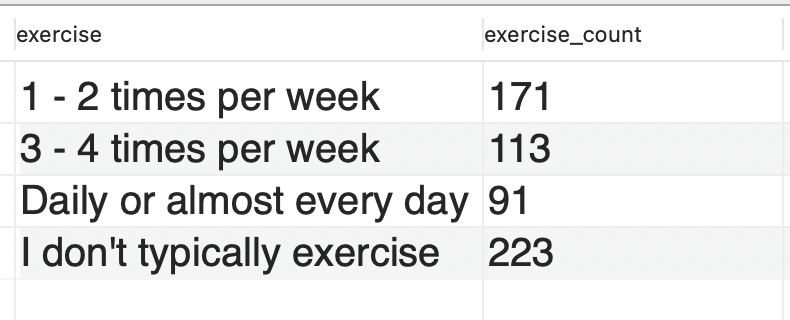
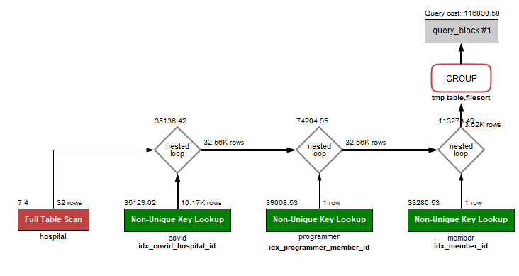

```sql
/*
만약, 임의로 드리븐 테이블을 covid 로 둘 경우, 수행시간이 1초 이상 발생
이유는, member의 9만개의 행을 full scan된 드라이빙 테이블이 되기 때문에 조인시 느려짐
*/
SELECT exercise, count(exercise)
FROM programmer, 
	( SELECT id, age 
      FROM member 
      WHERE age BETWEEN 30 AND 39
	) member
		STRAIGHT_JOIN ( SELECT member_id, stay 
			FROM covid, ( SELECT id FROM hospital WHERE name = '서울대병원') hospital
			WHERE covid.hospital_id = hospital.id ) covid
		ON covid.member_id = member.id
WHERE programmer.member_id = member.id 
GROUP BY exercise
;
```
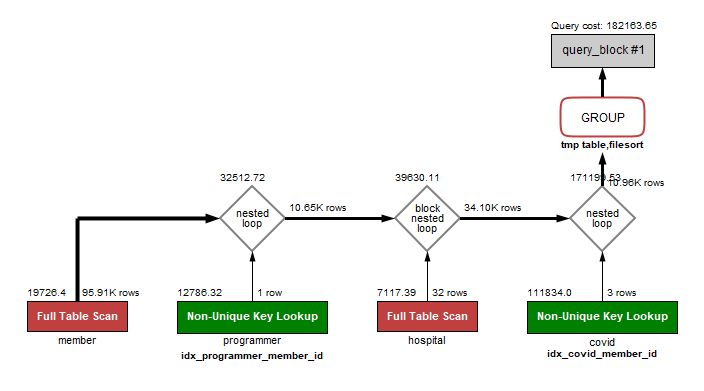
---

### 추가 미션

1. 페이징 쿼리를 적용한 API endpoint를 알려주세요
- GET /stations
- GET /lines

2. Replication 적용 로그
### POST /stations 요청시 Master 로 라우팅
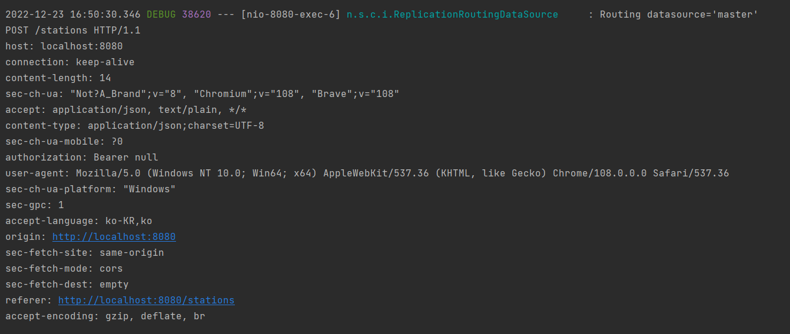

### GET /stations 요청시 Slave 로 라우팅
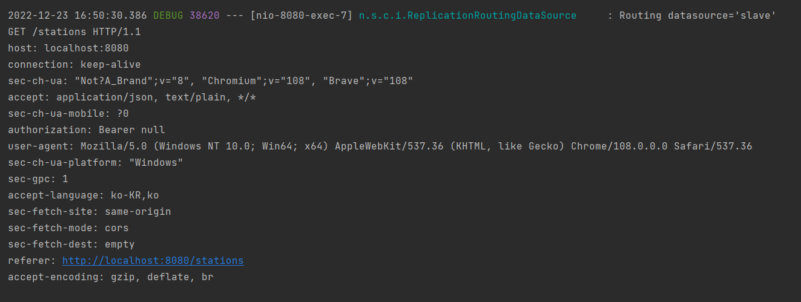
