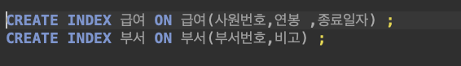
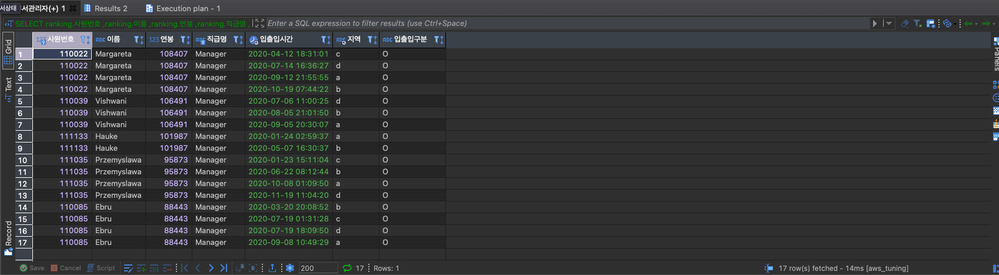

    

  
  
  
  

 

# 인프라공방 샘플 서비스 - 지하철 노선도

## 미션

* 미션 진행 후에 아래 질문의 답을 작성하여 PR을 보내주세요.

### 2단계 - 조회 성능 개선하기
####1. 인덱스 적용해보기 실습을 진행해본 과정을 공유해주세요
##A. 쿼리 최적화
1) 조회 건수를 줄이자
   -> 최대한 조회 건수를 줄여나가는 것이 좋을거라고 생각해서
   MANAGER인 사람들이 데이터의 기준이 되니깐 부서관리자 테이블과 부서로 처음 JOIN 하였습니다.

2) EXPLAIN을 통해서 plan을 확인하고, type을 ALL인 부분을 index로 바꾸는 작업을 하였습니다.
* before query

* before result

* before explain

---

* after create index

  

* after query
  
* after result
  
* after explain
  

##B. 인덱스 설계
---
####2. 페이징 쿼리를 적용한 API endpoint를 알려주세요
