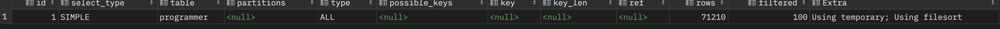
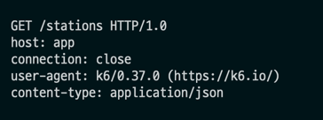

<p align="center">
    
</p>
<p align="center">
  
  
  <a href="https://edu.nextstep.camp/c/R89PYi5H" alt="nextstep atdd">
    
  </a>
  
</p>

<br>

# 인프라공방 샘플 서비스 - 지하철 노선도

<br>

## 🚀 Getting Started

### Install
#### npm 설치
```
cd frontend
npm install
```
> `frontend` 디렉토리에서 수행해야 합니다.

### Usage
#### webpack server 구동
```
npm run dev
```
#### application 구동
```
./gradlew clean build
```
<br>

## 미션

* 미션 진행 후에 아래 질문의 답을 작성하여 PR을 보내주세요.


### 1단계 - 화면 응답 개선하기
1. 성능 개선 결과를 공유해주세요 (Smoke, Load, Stress 테스트 결과)
웹사이트 성능 비교
- 전:


- 후:


smoke 비교

load 비교 

stress 비교

2. 어떤 부분을 개선해보셨나요? 과정을 설명해주세요

    2-1. reverse proxy 를 개선했습니다.
   - 리소스를 압축(gzip)하여 제공
   - 리소스 브라우저 캐싱 적용

    2-2. was 내 조회 로직에 redis 캐시를 적용했습니다.
   - 노선, 노선 목록, 회원 정보

---

### 2단계 - 스케일 아웃

1. Launch Template 링크를 공유해주세요.
  
`https://ap-northeast-2.console.aws.amazon.com/ec2/v2/home?region=ap-northeast-2#LaunchTemplateDetails:launchTemplateId=lt-0fc72886af9bd913d`

3. cpu 부하 실행 후 EC2 추가생성 결과를 공유해주세요. (Cloudwatch 캡쳐)

```sh
$ stress -c 4
```


3. 성능 개선 결과를 공유해주세요 (Smoke, Load, Stress 테스트 결과)
- smoke

- load

- stress

---

### 1단계 - 쿼리 최적화

1. 인덱스 설정을 추가하지 않고 아래 요구사항에 대해 1s 이하(M1의 경우 2s)로 반환하도록 쿼리를 작성하세요.

- 활동중인(Active) 부서의 현재 부서관리자 중 연봉 상위 5위안에 드는 사람들이 최근에 각 지역별로 언제 퇴실했는지 조회해보세요. (사원번호, 이름, 연봉, 직급명, 지역, 입출입구분, 입출입시간)
```
   select 사원번호, 이름, 연봉, 직급명, r.time as 입출입시간, region as 지역, r.record_symbol as 입출입구분
   from record r,
   (select employee.id as 사원번호, employee.last_name as 이름, salary.annual_income as 연봉, position.position_name as 직급명 from position, manager, employee, salary
   where
   position.id = manager.employee_id
   and employee.id = manager.employee_id
   and position.position_name = 'Manager'
   and position.start_date = manager.start_date
   and position.end_date = manager.end_date
   and manager.end_date = '9999-01-01'
   and salary.end_date = '9999-01-01'
   and salary.id = manager.employee_id
   and manager.department_id in ( select id from department where note = 'Active')
   order by salary.annual_income desc limit 5) as a
   where r.employee_id = a.사원번호
   and r.record_symbol = 'O';
```
`14 row(s) returned	0.212 sec`

---

### 2단계 - 인덱스 설계

1. 인덱스 적용해보기 실습을 진행해본 과정을 공유해주세요

---

### 추가 미션

1. 페이징 쿼리를 적용한 API endpoint를 알려주세요
