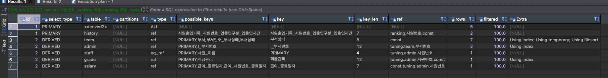
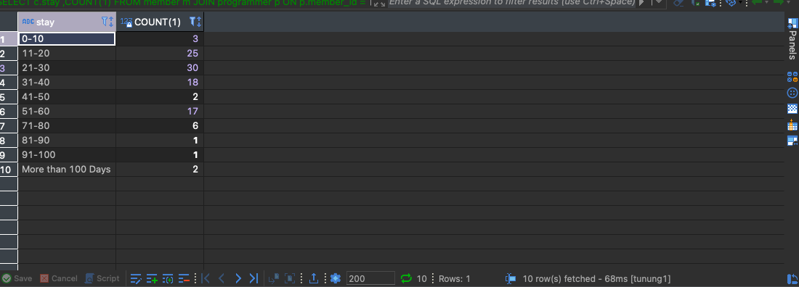

<p align="center">
    
</p>
<p align="center">
  
  
  <a href="https://edu.nextstep.camp/c/R89PYi5H" alt="nextstep atdd">
    
  </a>
  
</p>

<br>

# 인프라공방 샘플 서비스 - 지하철 노선도

## 미션

* 미션 진행 후에 아래 질문의 답을 작성하여 PR을 보내주세요.

### 2단계 - 조회 성능 개선하기

#### 1. 인덱스 적용해보기 실습을 진행해본 과정을 공유해주세요

## A. 쿼리 최적화

1) 조회 건수를 줄이자 -> 최대한 조회 건수를 줄여나가는 것이 좋을거라고 생각해서 MANAGER인 사람들이 데이터의 기준이 되니깐 부서관리자 테이블과 부서로 처음 JOIN 하였습니다.

2) EXPLAIN을 통해서 plan을 확인하고, type을 ALL인 부분을 index로 바꾸는 작업을 하였습니다.

* before query
  
* before result
  
* before explain
  

---

* after create index

  

* after query

```sql
SELECT ranking.사원번호
     , ranking.이름
     , ranking.연봉
     , ranking.직급명
     , history.입출입시간
     , history.지역
     , history.입출입구분
FROM (
         SELECT admin.사원번호
              , staff.이름
              , salary.연봉
              , salary.시작일자
              , salary.종료일자
              , grade.직급명
         FROM 부서관리자 admin
                  JOIN 부서 team
                       ON admin.부서번호 = team.부서번호
                           AND team.부서상태 = '02'
                  JOIN 직급 grade
                       ON grade.사원번호 = admin.사원번호
                           AND grade.직급코드 = '07'
                  JOIN 사원 staff
                       ON staff.사원번호 = grade.사원번호
                  JOIN 급여 salary
                       ON salary.사원번호 = staff.사원번호
                           AND salary.종료일자 = '99990101'
         ORDER BY salary.연봉 DESC LIMIT 0, 5
     ) ranking
         JOIN 사원출입기록 history
              ON history.사원번호 = ranking.사원번호
                  AND history.입출입구분 = 'O';
```

* after result
  
* after explain
  

```sql
ALTER table 부서
    add 부서상태 varchar(2) not null default '01';
INSERT INTO 부서상태
VALUES ('01', 'INACTIVE');
INSERT INTO 부서상태
VALUES ('02', 'ACTIVE');
```

```sql
ALTER table 직급
    add 직급코드 varchar(2) not null default '01';
INSERT INTO 직급관리
VALUES ('01', 'Senior Engineer');
INSERT INTO 직급관리
VALUES ('02', 'Staff');
INSERT INTO 직급관리
VALUES ('03', 'Engineer');
INSERT INTO 직급관리
VALUES ('04', 'Senior Staff');
INSERT INTO 직급관리
VALUES ('05', 'Assistant Engineer');
INSERT INTO 직급관리
VALUES ('06', 'Technique Leader');
INSERT INTO 직급관리
VALUES ('07', 'Manager');
```

active같은 값 검색하는 것들이 대소문자 섞여있어서 검색할때 느릴거라고 생각이 들었습니다. 따라서 다른 테이블을 만들어서 코드로 만든 다음에 코드로 검색을 하면 더 속도가 빨라지지 않을까라는 생각을 하였습니다.

그래서 부서상태 테이블과 직급코드라는 테이블을 만들어서 글자로 검색을 하는 것을 코드로 관리하려고 만들었고, 기본키를 만들어서 인덱스 검색을 하려고 하였습니다.

그리고 종료일자도 종료를 하기 전에는 종료일자가 9999-01-01로 세팅 되어있었습니다. 그래서 9999-01-01이 아니면 정지 상태라고 판단하여도 괜찮을거라고 생각하였습니다.

결과적으로 Using where로 하였던 것을 없앨 수 있었고, extra에 아무 표시 안되어있는 것은 type이 eq_ref이거나 ref인 경우라서 괜찮을거라 생각이 듭니다.

## B. 인덱스 설계

[ ] 주어진 데이터셋을 활용하여 아래 조회 결과를 100ms 이하로 반환

B-1) [ ] Coding as a Hobby 와 같은 결과를 반환하세요.

마지막 소수점 첫째자리는 일부러 표시 하지 않았습니다. 반올림처리 되면 어차피 x.0으로 되버리기 때문입니다.

```sql
 SELECT hobby, ROUND((Count(1) / (SELECT COUNT(1) FROM programmer) * 100), 0) as 'percent'
 FROM programmer
 GROUP BY hobby;

```


B-2) [ ] 프로그래머별로 해당하는 병원 이름을 반환하세요. (covid.id, hospital.name)

```sql

SELECT c.id, h.name
FROM covid c
         JOIN hospital h
              ON c.hospital_id = h.id LIMIT 0, 10;

```

Index 추가 및 페이징 처리 10개씩 조회

```sql
CREATE INDEX hospital_id_name ON hospital (id);
CREATE INDEX covid_id ON covid (id);
```

primary key 설정으로 변경

```sql
ALTER TABLE hospital
    ADD CONSTRAINT hospital_pk PRIMARY KEY (id);

ALTER TABLE covid
    ADD CONSTRAINT covid_pk PRIMARY KEY (id);
```

B-3) [ ] 프로그래밍이 취미인 학생 혹은 주니어(0-2년)들이 다닌 병원 이름을 반환하고 user.id 기준으로 정렬하세요.

(covid.id, hospital.name, user.Hobby, user.DevType, user.YearsCoding)

1) 페이징 추가 및 programmer memberId index 추가
2) covid, programmer, hospital PK설정

```sql
SELECT c.id, h.name, p.hobby, p.dev_type, p.years_coding
FROM programmer p
         JOIN covid c
              ON p.member_id = c.programmer_id
                  AND p.hobby = 'YES'
                  AND p.years_coding = '0-2 years'
         JOIN hospital h
              ON h.id = c.hospital_id
ORDER BY p.id LIMIT 0, 10
;
```


B-4) [ ] 서울대병원에 다닌 20대 India 환자들을 병원에 머문 기간별로 집계하세요. (covid.Stay)

1) member age 컬럼, programmer country 추가

```sql
SELECT c.stay, COUNT(1)
FROM member m
         JOIN programmer p
              ON p.member_id = m.id
                  AND p.country = 'India'
                  AND m.age >= 20
                  AND m.age <= 29
         JOIN covid c
              ON c.member_id = m.id
         JOIN hospital h
              ON c.hospital_id = h.id
                  AND h.name = '서울대병원'
GROUP BY c.stay;
```

* result
  

B-5 [ ] 서울대병원에 다닌 30대 환자들을 운동 횟수별로 집계하세요. (user.Exercise)

```sql
SELECT p.exercise, COUNT(1) as execiseCount
FROM member m
         JOIN programmer p
              ON p.member_id = m.id
                  AND m.age BETWEEN 30 AND 39
         JOIN covid c
              ON c.member_id = m.id
         JOIN hospital h
              ON c.hospital_id = h.id
                  AND h.name = '서울대병원'
GROUP BY p.exercise;
```

* result
  

---

#### 2. 페이징 쿼리를 적용한 API endpoint를 알려주세요

https://nhs0912-subway-infra.kro.kr/favorites

```json

HTTP/1.1 200
Content-Type: application/json
Transfer-Encoding: chunked
Date: Fri, 17 Dec 2021 12: 39: 19 GMT
Keep-Alive: timeout=60
Connection: keep-alive

{
"content": [
{
"id": 6,
"source": {
"id": 1,
"name": "강남역",
"createdDate": "2021-12-17T21:39:18.548733",
"modifiedDate": "2021-12-17T21:39:18.548733"
},
"target": {
"id": 4,
"name": "광교역",
"createdDate": "2021-12-17T21:39:18.738149",
"modifiedDate": "2021-12-17T21:39:18.738149"
}
},
{
"id": 5,
"source": {
"id": 1,
"name": "강남역",
"createdDate": "2021-12-17T21:39:18.548733",
"modifiedDate": "2021-12-17T21:39:18.548733"
},
"target": {
"id": 2,
"name": "양재역",
"createdDate": "2021-12-17T21:39:18.691745",
"modifiedDate": "2021-12-17T21:39:18.691745"
}
},
{
"id": 4,
"source": {
"id": 2,
"name": "양재역",
"createdDate": "2021-12-17T21:39:18.691745",
"modifiedDate": "2021-12-17T21:39:18.691745"
},
"target": {
"id": 3,
"name": "정자역",
"createdDate": "2021-12-17T21:39:18.717666",
"modifiedDate": "2021-12-17T21:39:18.717666"
}
},
{
"id": 3,
"source": {
"id": 8,
"name": "시청역",
"createdDate": "2021-12-17T21:39:18.813837",
"modifiedDate": "2021-12-17T21:39:18.813837"
},
"target": {
"id": 7,
"name": "영등포역",
"createdDate": "2021-12-17T21:39:18.793482",
"modifiedDate": "2021-12-17T21:39:18.793482"
}
},
{
"id": 2,
"source": {
"id": 5,
"name": "당산역",
"createdDate": "2021-12-17T21:39:18.755904",
"modifiedDate": "2021-12-17T21:39:18.755904"
},
"target": {
"id": 6,
"name": "선유도역",
"createdDate": "2021-12-17T21:39:18.77439",
"modifiedDate": "2021-12-17T21:39:18.77439"
}
}
],
"pageable": "INSTANCE",
"totalPages": 1,
"totalElements": 5,
"last": true,
"numberOfElements": 5,
"size": 5,
"number": 0,
"first": true,
"sort": {
"sorted": false,
"unsorted": true,
"empty": true
},
"empty": false
}
```
