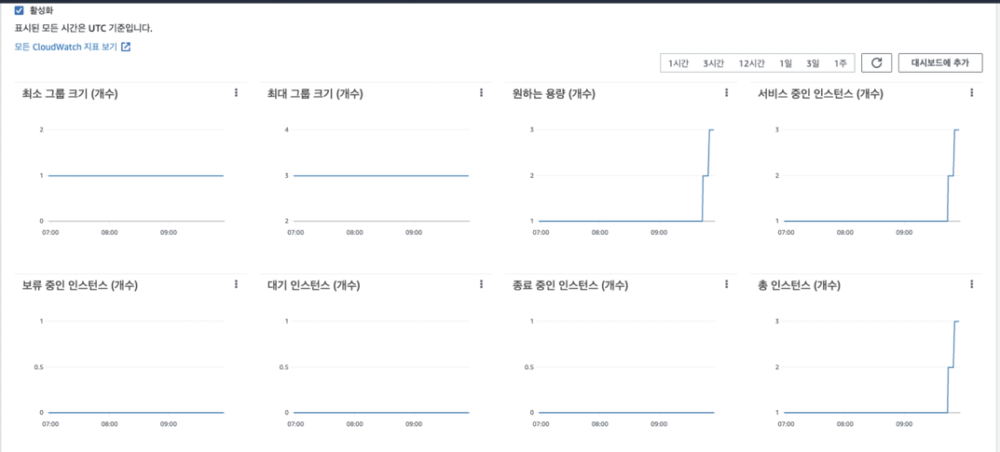

<p align="center">
    
</p>
<p align="center">
  
  
  <a href="https://edu.nextstep.camp/c/R89PYi5H" alt="nextstep atdd">
    
  </a>
  
</p>

<br>

# 인프라공방 샘플 서비스 - 지하철 노선도

<br>

## 🚀 Getting Started

### Install

#### npm 설치

```
cd frontend
npm install
```

> `frontend` 디렉토리에서 수행해야 합니다.

### Usage

#### webpack server 구동

```
npm run dev
```

#### application 구동

```
./gradlew clean build
```

<br>

## 미션

* 미션 진행 후에 아래 질문의 답을 작성하여 PR을 보내주세요.

### 1단계 - 화면 응답 개선하기

1. 성능 개선 결과를 공유해주세요 (Smoke, Load, Stress 테스트 결과)
    * result directory 에 정리해 뒀습니다.
2. 어떤 부분을 개선해보셨나요? 과정을 설명해주세요
    1. Nginx 개편
        1. HTTP2 적용
           
        2. Cache Control 처리
           
        3. GZIP을 통한 압축
           
    2. 캐싱 처리
        1. Line 조회, 수정, 삭제 캐싱처리
        2. Station 조회, 삭제 캐싱 처리.
           
    3. Scale Out [2단계에서 로드밸런서 포함해서 테스트 해보겠습니다.]

---

### 2단계 - 요구사항 정의

#### 미션 요구사항

* 미션1: 모든 정적 자원에 대해 no-cache, private 설정을 하고 테스트 코드를 통해 검증합니다. [완료]
* 미션2: 확장자는 css인 경우는 max-age를 1년, js인 경우는 no-cache, private 설정을 합니다. [완료]
* 미션3: 모든 정적 자원에 대해 no-cache, no-store 설정을 한다. 가능한가요?

#### 요구사항

* springboot에 HTTP Cache, gzip 설정하기
* Launch Template 작성하기 [완료]
* Auto Scaling Group 생성하기 [완료]
* Smoke, Load, Stress 테스트 후 결과를 기록 [완료]

### 2단계 - 스케일 아웃

1. Launch Template 링크를 공유해주세요.
    - https://ap-northeast-2.console.aws.amazon.com/ec2/v2/home?region=ap-northeast-2#LaunchTemplateDetails:launchTemplateId=lt-0e60ba4e1f50aa214
2. cpu 부하 실행 후 EC2 추가생성 결과를 공유해주세요. (Cloudwatch 캡쳐)
    - 

```sh
$ stress -c 2
```

3. 성능 개선 결과를 공유해주세요 (Smoke, Load, Stress 테스트 결과)
    - result 하위 폴더에 있습니다. grafana 는 influx db가 죽어버려서ㅜㅜ 캡처를 못했습니다.

---

### 3단계 - 쿼리 최적화

1. 인덱스 설정을 추가하지 않고 아래 요구사항에 대해 1s 이하(M1의 경우 2s)로 반환하도록 쿼리를 작성하세요.

```sql
SELECT tb.id            as 사원번호,
       tb.last_name     as 이름,
       tb.annual_income as 연봉,
       tb.position_name as 직급명,
       r.time           as 입출입시간,
       r.region         as 지역,
       r.record_symbol  as 입출입구분
FROM (
         SELECT e.id, e.last_name, s.annual_income, p.position_name
         FROM department d
                  JOIN manager m on d.id = m.department_id and m.end_date = '9999-01-01'
                  JOIN employee e on m.employee_id = e.id
                  JOIN salary s on m.employee_id = s.id and s.end_date = '9999-01-01'
                  JOIN position p on e.id = p.id and p.end_date = '9999-01-01'
         WHERE UPPER(d.note) = 'ACTIVE'
         ORDER BY s.annual_income desc limit 5
     ) tb
         JOIN record r on tb.id = r.employee_id
WHERE record_symbol = 'O';
```



- 활동중인(Active) 부서의 현재 부서관리자 중 연봉 상위 5위안에 드는 사람들이 최근에 각 지역별로 언제 퇴실했는지 조회해보세요. (사원번호, 이름, 연봉, 직급명, 지역,
  입출입구분, 입출입시간)

---

### 4단계 - 인덱스 설계

1. 인덱스 적용해보기 실습을 진행해본 과정을 공유해주세요

#### 1-1 Coding as a Hobby 와 같은 결과를 반환

1. 인터넷에서 집계쿼리 확인

```sql
ROUND
((SUM(tot_amt) / (SELECT SUM(tot_amt) FROM [RFM_BASE_SEG2]))*100, 2)
```

2. 쿼리 생성 후 실행

```sql
SELECT hobby,
       ROUND((SUM(1) / (SELECT SUM(1) FROM programmer)) * 100, 2)
FROM programmer
GROUP by hobby
```

3. 결과


4. programmer pk 와 hobby 컬럼 인덱스 설정

> 인덱스 적용은 Datagrip 으로 했습니다 :)


5. 적용 후 결과

> 0.26초


#### 1-2 프로그래머별로 해당하는 병원 이름을 반환하세요. (covid.id, hospital.name)

1. 숫자가 적은 순으로 조인 쿼리 생성

```sql
SELECT count(1)
FROM covid;
#31825
SELECT count(1)
FROM hospital;
#32
SELECT count(1)
FROM programmer;
#98855

SELECT c.id, h.name
FROM hospital h
         JOIN covid c on c.hospital_id = h.id
         JOIN programmer p on p.id = c.programmer_id;
```

2. 1차 결과

> 3.4초 소모


3. hospital, covid PK 적용 및 각각 FK 적용

```sql
alter table hospital
    add constraint hospital_pk
        primary key (id);

alter table covid
    add constraint covid_pk
        primary key (id);

alter table covid
    add constraint covid_hospital_id_fk
        foreign key (hospital_id) references hospital (id);

alter table covid
    add constraint covid_programmer_id_fk
        foreign key (programmer_id) references programmer (id);
```

4. 적용 후 결과

> 0.083 초 소모


#### 1-3 프로그래머별로 해당하는 병원 이름을 반환하세요. (covid.id, hospital.name)

1. 쿼리 생성

```sql
SELECT c.id, h.name, p.hobby, p.dev_type, p.years_coding
FROM programmer p
         JOIN covid c on c.programmer_id = p.id
         JOIN hospital h on h.id = c.hospital_id
WHERE (p.hobby = 'Yes' and p.student like 'Yes%')
   or p.years_coding = '0-2 years'
ORDER BY p.id;
```

2. 1차 실행 결과

> 6.7초 소요


3. 다중 컬럼 인덱스 설정

> 처음에는 p.student 와, p.year_coding 에 인덱스를 적용해 봤는데 별로 개선이 없어서 찾아보니 다중 컬럼 인덱스를 적용해 보라고 해서 적용해 봤습니다.

```sql
create
index covid_programmer_id_hospital_id_index
	on covid (programmer_id,hospital_id);
```

4. 적용 후 결과

> 0.09 초 소모
> 

#### 1-4 서울대병원에 다닌 20대 India 환자들을 병원에 머문 기간별로 집계하세요. (covid.Stay)

1. 쿼리 생성

```sql
SELECT c.stay, count(1)
FROM hospital h
         JOIN covid c on c.hospital_id = h.id
         JOIN programmer p on p.id = c.programmer_id
         JOIN member m on m.id = c.member_id
WHERE h.name = '서울대병원'
  and p.country = 'India'
  and m.age like '2_'
GROUP BY c.stay;
```

2. 1차 결과

> 15.21 초 소모
> 

3. 인덱스들 적용

> 각각 로우를 확인해보고 where 에서 사용하는 인덱스 추가
>```sql
>select count(1) from hospital; # 32
>select count(1) from member; # 96206
>select count(1) from programmer; # 98855
>
>create index programmer_country_indexon programmer (country); #14초로 1초 감소
>```
> member 에 pk 추가
> ```sql
> alter table member add constraint member_pk primary key (id); #0.5초 로 14초 감소
>```
> 다중 컬럼 인덱스 적용
> ```sql
> create index covid_hospital_id_programmer_id_member_id_index on covid (hospital_id, programmer_id, member_id); #0.142로 개선
>```

4. 적용 후 결과

> 0.142 소모


#### 1-5 서울대병원에 다닌 30대 환자들을 운동 횟수별로 집계하세요. (user.Exercise)

1. 쿼리 생성

```sql
SELECT p.exercise, count(1)
FROM hospital h
         JOIN covid c on c.hospital_id = h.id
         JOIN programmer p on p.id = c.programmer_id
         JOIN member m on m.id = c.member_id
WHERE h.name = '서울대병원'
  and m.age LIKE '3_'
GROUP BY p.exercise;
```

2. 적용전 결과

> 1.2초.. 그렇게 안느리네요?? 🙄

>

3. 흠.. 나이에 인덱스 적용? 쿼리도 인덱스 타도록 변경

```sql
create
index member_age_index on member (age);

SELECT p.exercise, count(1)
FROM hospital h
         JOIN covid c on c.hospital_id = h.id
         JOIN programmer p on p.id = c.programmer_id
         JOIN member m on m.id = c.member_id
WHERE h.name = '서울대병원'
  and m.age BETWEEN 30 and 39
GROUP BY p.exercise;
```
4. 개선후 결과
> 0.09초 소모
> 

   
---

### 추가 미션

1. 페이징 쿼리를 적용한 API endpoint를 알려주세요
