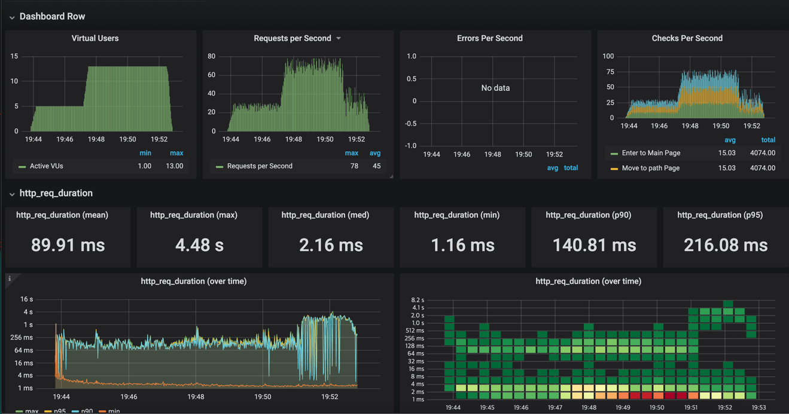
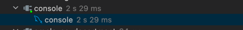

<p align="center">
    
</p>
<p align="center">
  
  
  <a href="https://edu.nextstep.camp/c/R89PYi5H" alt="nextstep atdd">
    
  </a>
  
</p>

<br>

# 인프라공방 샘플 서비스 - 지하철 노선도

<br>

## 🚀 Getting Started

### Install
#### npm 설치
```
cd frontend
npm install
```
> `frontend` 디렉토리에서 수행해야 합니다.

### Usage
#### webpack server 구동
```
npm run dev
```
#### application 구동
```
./gradlew clean build
```
<br>

## 미션

* 미션 진행 후에 아래 질문의 답을 작성하여 PR을 보내주세요.


### 1단계 - 화면 응답 개선하기
1. 성능 개선 결과를 공유해주세요 (Smoke, Load, Stress 테스트 결과)

### stations 스모크 테스트  


### stations 로드 테스트


### stations 스트레스 테스트

   - 기존에는 VUser 가 500 일때, max 가 15.98s 였으나 현재는 VUser 가 1000 일때도 max 가 3.93s 로 성능이 향상되었습니다.

3. 어떤 부분을 개선해보셨나요? 과정을 설명해주세요

- 정적 파일 gzip 압축
- bundle minimization
- http1 -> http2
- 잘 변하지 않고, 조회가 잦은 값에 cache 적용

---

### 2단계 - 스케일 아웃

1. Launch Template 링크를 공유해주세요.
   1. https://ap-northeast-2.console.aws.amazon.com/ec2/v2/home?region=ap-northeast-2#LaunchTemplateDetails:launchTemplateId=lt-0ef469cf9e3dd716d
   2. 기존에 존재하는 Instance 를 Launch Template 으로 생성하였습니다.

2. cpu 부하 실행 후 EC2 추가생성 결과를 공유해주세요. (Cloudwatch 캡쳐)
   1. 

```sh
$ stress -c 2
```

3. 성능 개선 결과를 공유해주세요 (Smoke, Load, Stress 테스트 결과)

---

### 3단계 - 쿼리 최적화

1. 인덱스 설정을 추가하지 않고 아래 요구사항에 대해 1s 이하(M1의 경우 2s)로 반환하도록 쿼리를 작성하세요.

- 활동중인(Active) 부서의 현재 부서관리자 중 연봉 상위 5위안에 드는 사람들이 최근에 각 지역별로 언제 퇴실했는지 조회해보세요. (사원번호, 이름, 연봉, 직급명, 지역, 입출입구분, 입출입시간)

```sql
SELECT sub_result.사원번호,
       sub_result.이름,
       sub_result.연봉,
       p.position_name as '직급명',
       r.time          as '입출입 시간',
       r.region        as '지역',
       r.record_symbol as '입출입구분'
FROM (
         SELECT employee.id as '사원번호', employee.last_name as '이름', s.annual_income as '연봉'
         FROM tuning.employee
                  INNER JOIN tuning.manager m on m.employee_id = employee.id AND m.end_date >= NOW()
                  INNER JOIN tuning.department d on d.id = m.department_id AND d.note = 'active'
                  INNER JOIN tuning.salary s on s.id = employee.id AND s.end_date > NOW()
         ORDER BY annual_income DESC
         LIMIT 5
     ) as sub_result
         INNER JOIN tuning.position p ON p.id = sub_result.사원번호 AND p.position_name = 'manager'
         INNER JOIN tuning.record r ON r.employee_id = sub_result.사원번호 AND r.record_symbol = 'o';

```
현재 M1 사용중입니다. Explain 보면서 최대한 빠르게 쿼리를 구성했습니다.

---

### 4단계 - 인덱스 설계

1. 인덱스 적용해보기 실습을 진행해본 과정을 공유해주세요
   1. codding as hobby
      ```sql
         SELECT hobby, COUNT(id) AS percentage
         FROM programmer
         GROUP BY hobby
      ```
     - 원래 실행시간 (2s 791ms)
     - 원래 실행계획
       - 
     - 인덱스 생성
       ```sql
          CREATE INDEX idx_hobby ON programmer (hobby);
       ```
       - hobby 의 카디널리티가 너무 높아 사실 인덱스를 만들어도 의미가 없을것 같습니다.
     - 인덱스 생성 쿼리 결과
       - 실행시간이 (4s 532ms) 로 증가하였습니다.
       - 따라서 인덱스를 만드는 것보다 그냥 기존 방식으로 검색하거나 통계 자료라면 차라리 다른 테이블 혹은 다른 데이터베이스에 저장해두고 그 값을 캐싱해서 주는게 더 효율적이지 않을까 싶었습니다.
   2. 프로그래머별로 해당하는 병원을 출력하시오 (covid.id, hospital.name)
   ```sql
   # programmer_id 당 hospital 이 두개 이상 있는 경우를 확인하는 작업  
   SELECT programmer_id, COUNT(*) as c
   FROM covid
   WHERE programmer_id IS NOT NULL
   GROUP BY programmer_id
   HAVING c > 1;
   # result = 0 따라서 1:1 맵핑임

   SELECT c.id, h.name
   FROM covid c
   INNER JOIN hospital h on c.hospital_id = h.id; 
   #(executeTime = 158ms) M1 의 경우라 두배(200ms 이하)로 지정
   ```
      - Primary Key 지정
        - covid -> id is primary key
        - programmer -> id is primary key
        - hospital -> id is primary key
        - member -> id is primary key
      - 인덱스 생성
        ```sql
            CREATE UNIQUE INDEX unique_idx_programmer_id_hospital_id ON covid (programmer_id, hospital_id);
        ```
   3. 프로그래밍이 취미인 학생 혹은 주니어(0-2년)들이 다닌 병원 이름을 반환하고 user.id 기준으로 정렬하세요. (covid.id, hospital.name, user.Hobby, user.DevType, user.YearsCoding)
   ```sql
   
   ```

---

### 추가 미션

1. 페이징 쿼리를 적용한 API endpoint를 알려주세요
