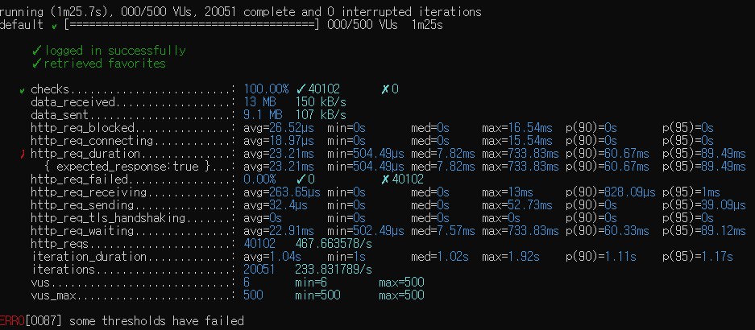
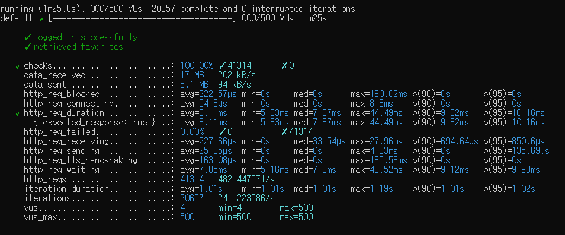

<p align="center">
    
</p>
<p align="center">
  
  
  <a href="https://edu.nextstep.camp/c/R89PYi5H" alt="nextstep atdd">
    
  </a>
  
</p>

<br>

# 인프라공방 샘플 서비스 - 지하철 노선도

<br>

## 🚀 Getting Started

### Install
#### npm 설치
```
cd frontend
npm install
```
> `frontend` 디렉토리에서 수행해야 합니다.

### Usage
#### webpack server 구동
```
npm run dev
```
#### application 구동
```
./gradlew clean build
```
<br>

## 미션

* 미션 진행 후에 아래 질문의 답을 작성하여 PR을 보내주세요.

### 1단계 - 화면 응답 개선하기
#### 타겟 : https://performance.honbabzone.com/

 ### 목표 - PageSpeed : 총점 70점 이상 
 #### First Contentful Paint (FCP) : 1초 미만
 #### Time to Interactive (TTI) : 2초 미만
 #### Speed Index : 3초 미만
 #### Total Blocking Time : 150ms 미만
 #### Large Contentful Paint (LCP) : 3초 미만
 
1. 성능 개선 결과를 공유해주세요 (Smoke, Load, Stress 테스트 결과)
 ### 전
 
 
 
 
 
 ### 후
 
 
 
 

2. 어떤 부분을 개선해보셨나요? 과정을 설명해주세요
 - 리버스 프록시 개선 :  강의에서 다룬 내용을 위주로 Reverse Proxy 설정 중 gzip 설정을 통해 패킷의 양을 줄였으며 css,js이미지 파일 등에 대해 캐쉬를 
 설정하여 반복된 요청에 대한 효율적인 응답을 가지도록 하였습니다. 또한 HTTP 2.0 병렬화를 통해 1.0의 문제인  HOL 블로킹을 해결하여 TCP 
 사용 효율을 높였습니다. 

 - WAS 개선 : Redis를 통해 매서드에 대한 재 사용성을 높였습니다.

---

### 2단계 - 조회 성능 개선하기
1. 인덱스 적용해보기 실습을 진행해본 과정을 공유해주세요

2. 페이징 쿼리를 적용한 API endpoint를 알려주세요

