### 1. 성능 개선 결과를 공유해주세요 (Smoke, Load, Stress 테스트 결과)

- 기준치는 이전 미션에서 진행했던 수치를 기반으로 진행
- https://github.com/next-step/infra-subway-monitoring/blob/heowc/docs/step2/index.md

### Smoke

#### Before

- 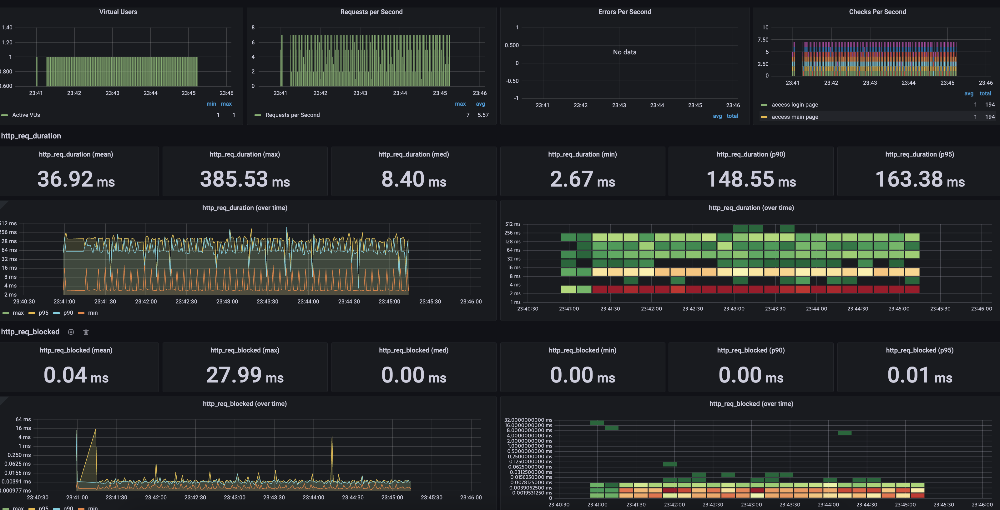
- 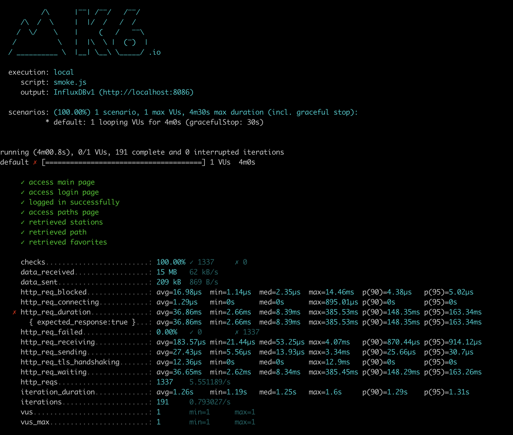

#### After

- 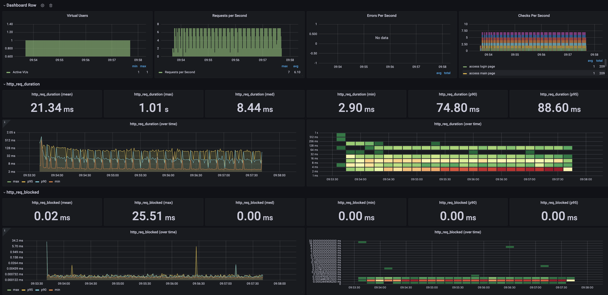
- 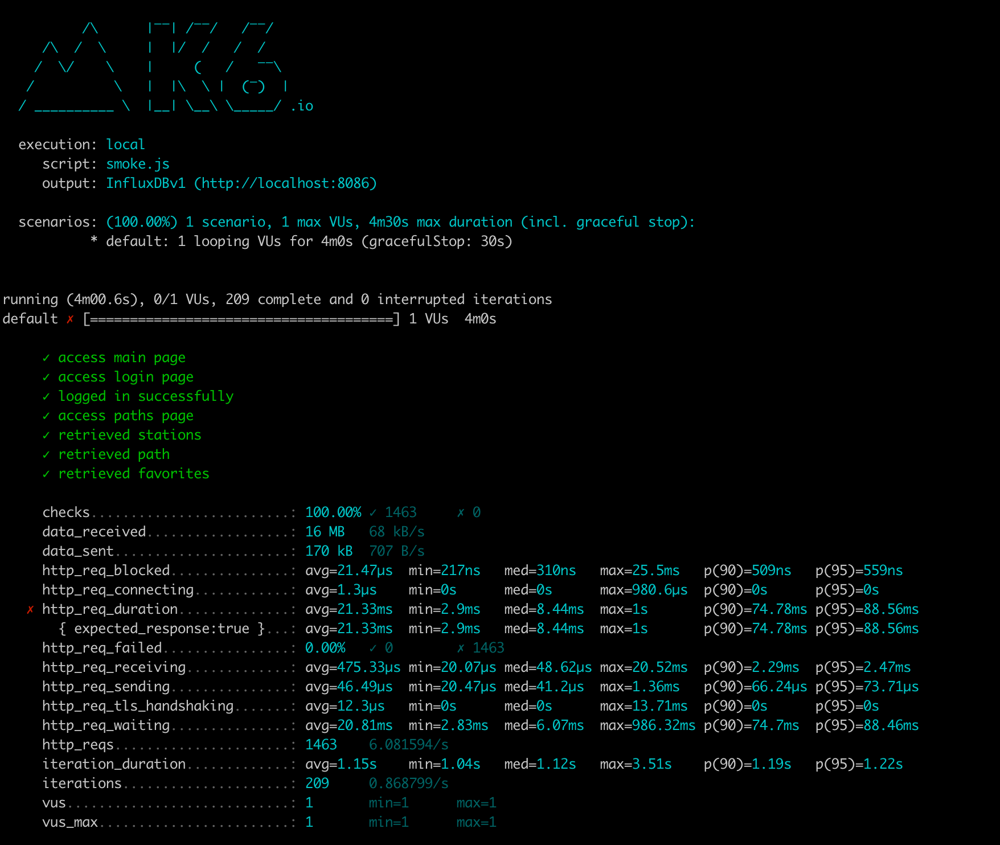

### Load

#### Before

- 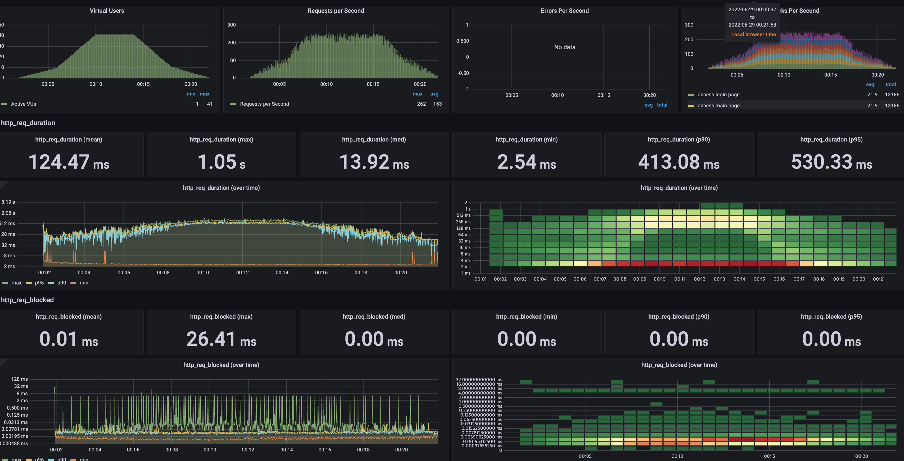
- 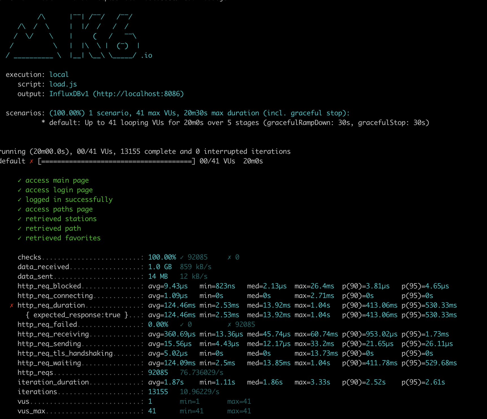

#### After

- 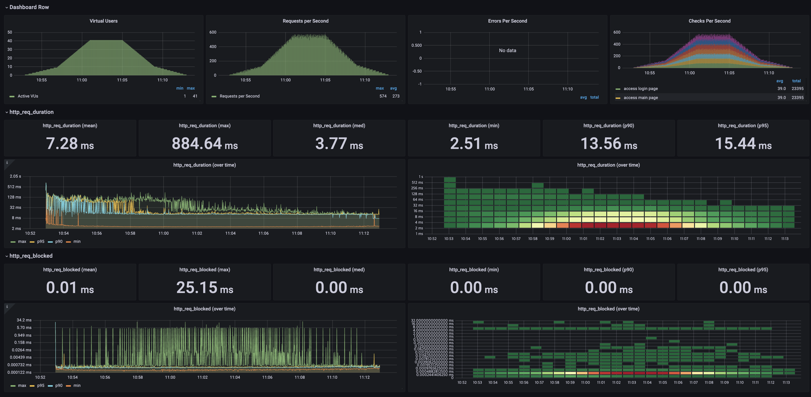
- 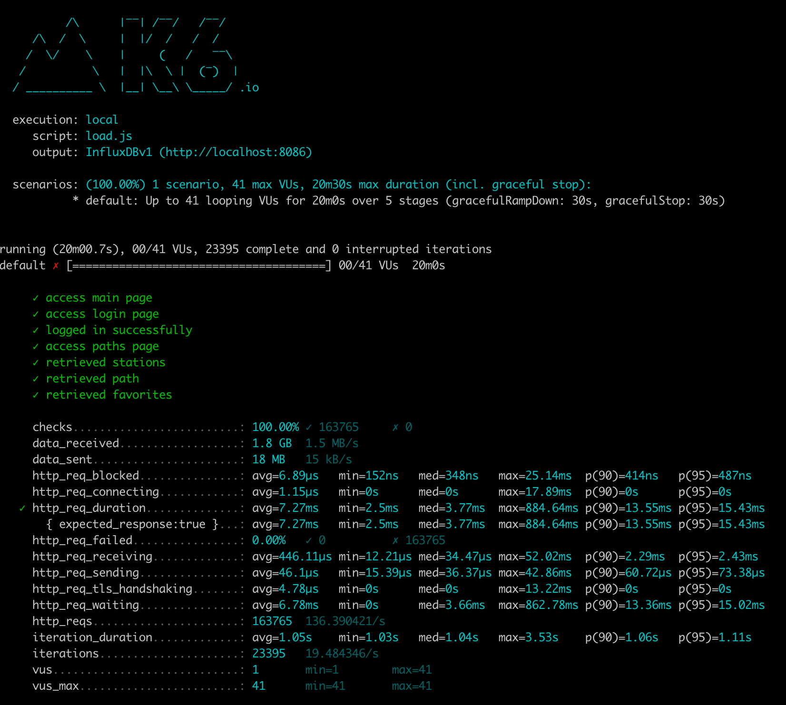

### Stress

#### Before

- 
- 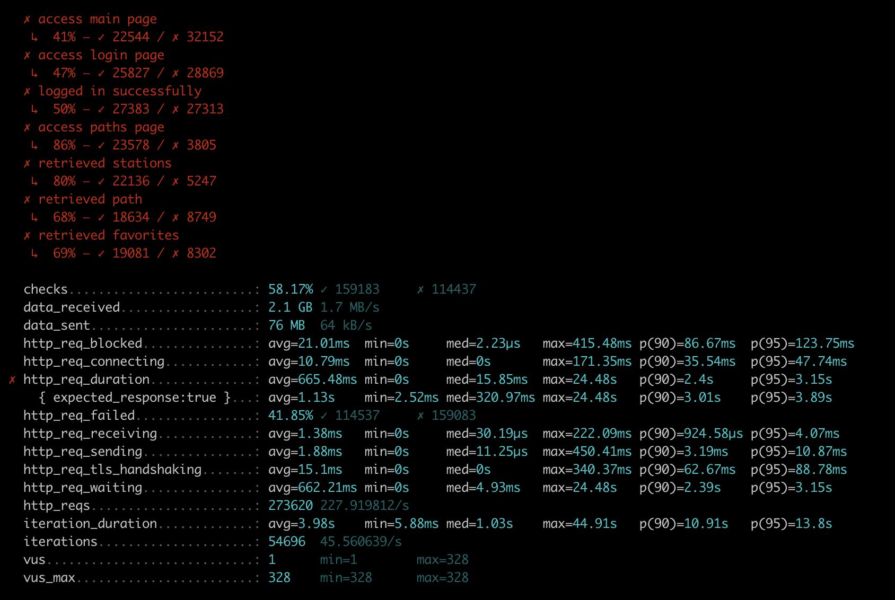

#### After

- 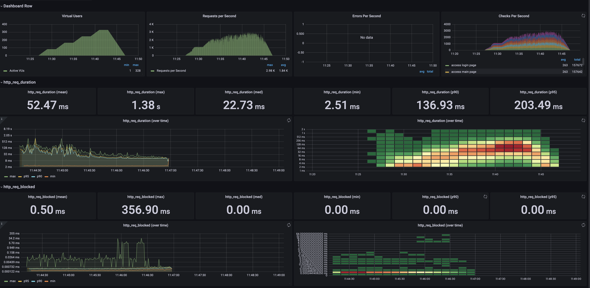
- 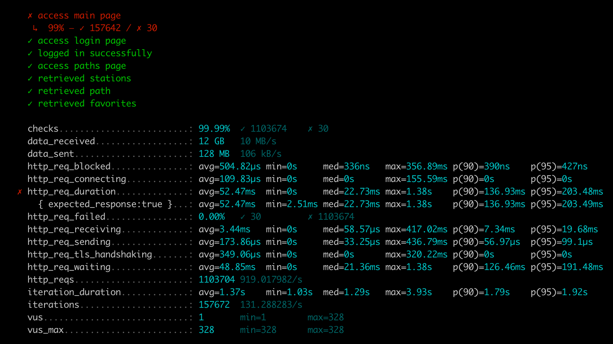

### 2. 어떤 부분을 개선해보셨나요? 과정을 설명해주세요

- nginx cache 적용
- nginx compression(gzip) 적용
- nginx http2 적용
- was cache(redis) 적용