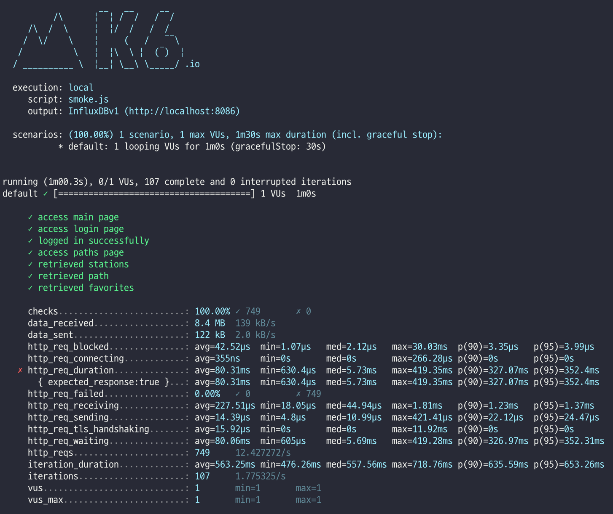
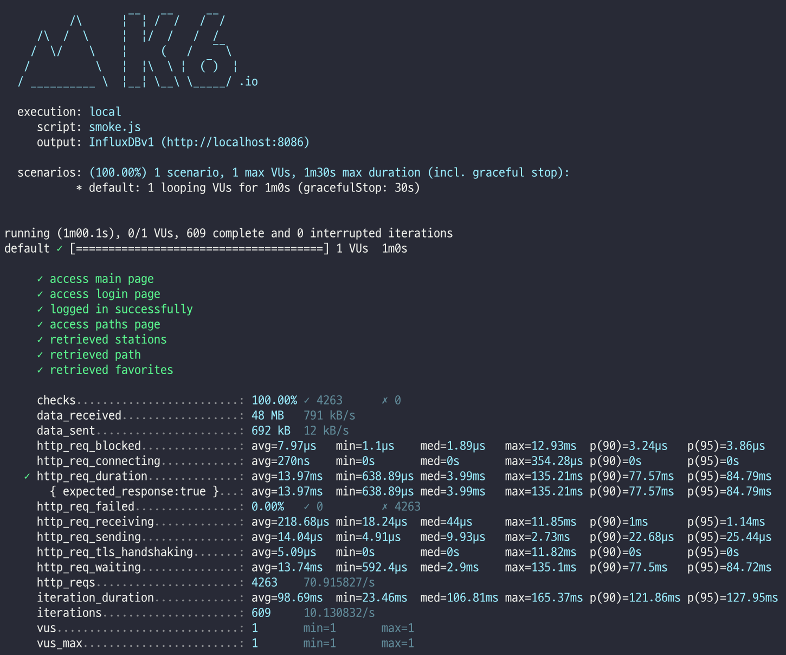
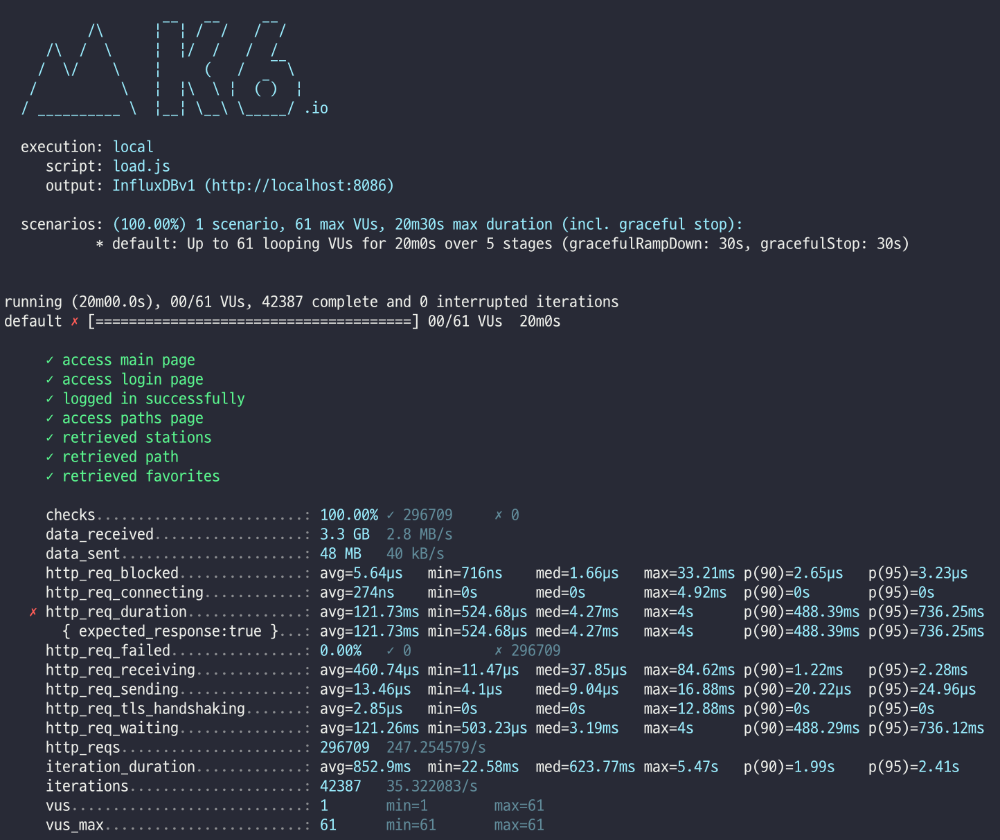

## 1. 성능 개선 결과를 공유해주세요 (Smoke, Load, Stress 테스트 결과)
### 개선전
- smoke  

- load  

- stress  

### 개선후
- smoke  

- load  

- stress  

## 2. 어떤 부분을 개선해보셨나요? 과정을 설명해주세요
- nginx cache 적용
- nginx-gzip 압축 설정 적용
- nginx http2 적용
- was cache(redis) 적용