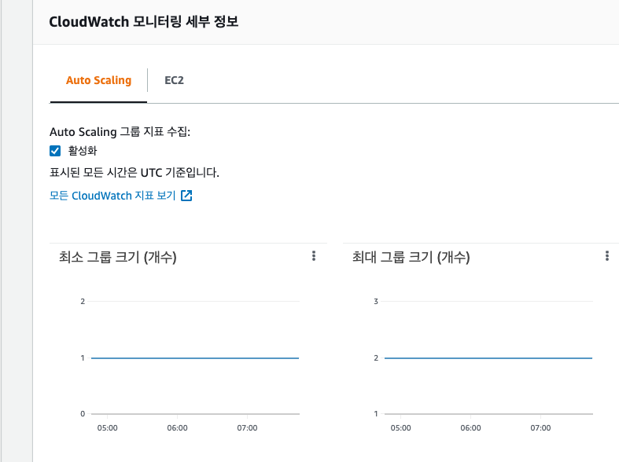
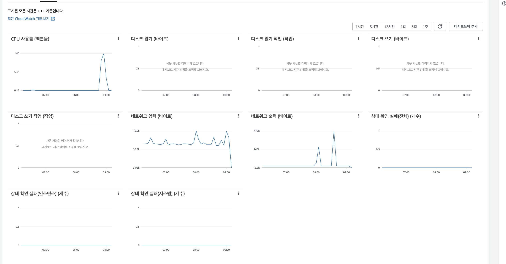
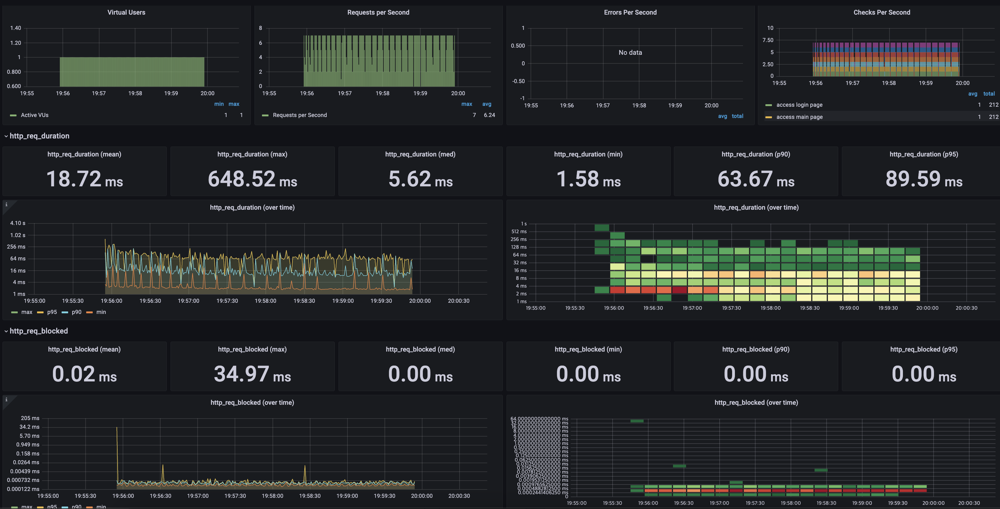
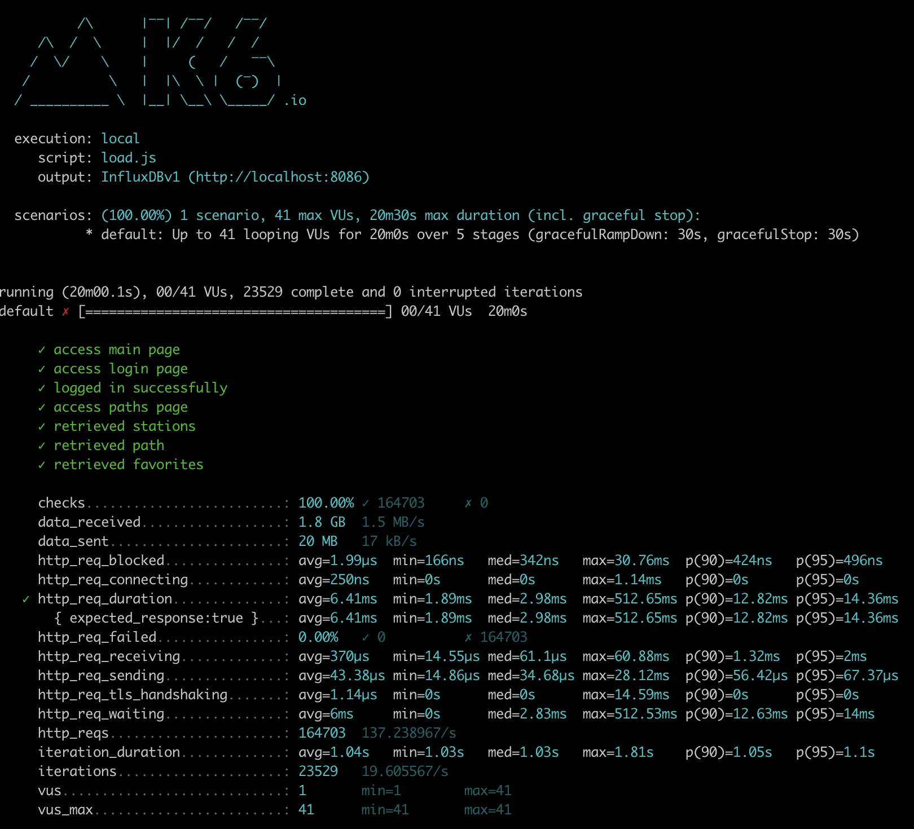
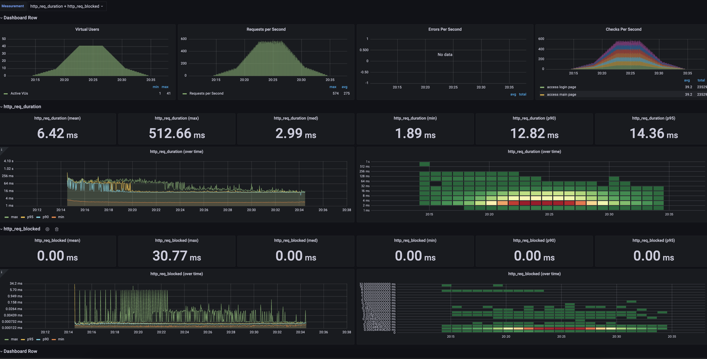
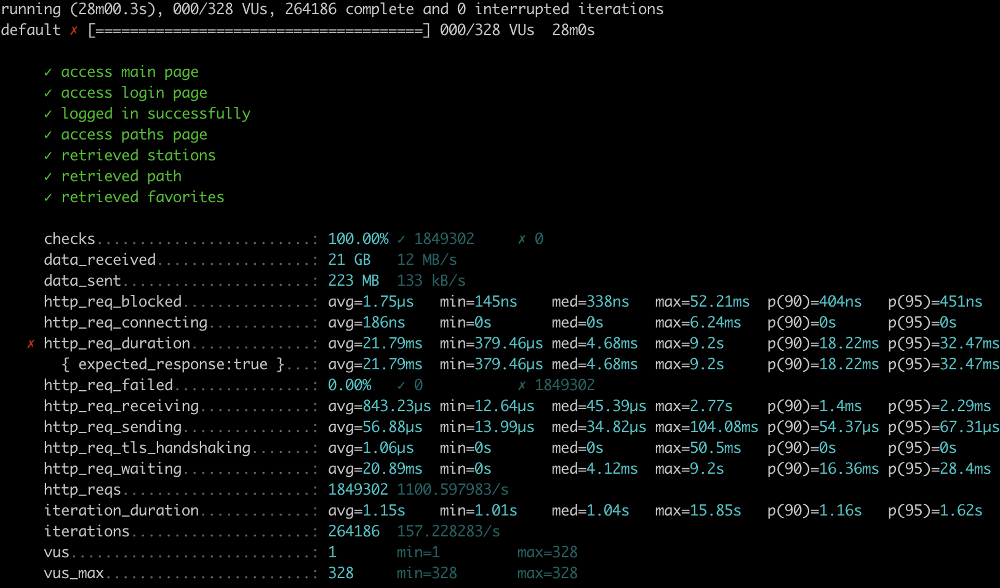
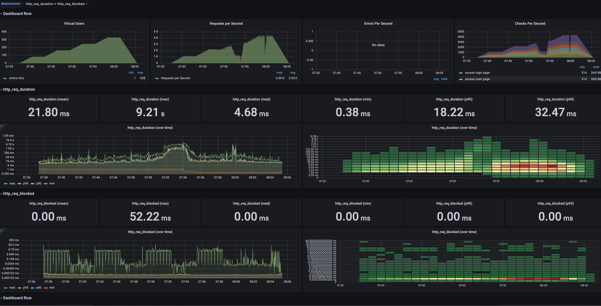

## 실습 미션

### 미션1: 모든 정적 자원에 대해 no-cache, private 설정을 하고 테스트 코드를 통해 검증합니다.
### 미션2: 확장자는 css인 경우는 max-age를 1년, js인 경우는 no-cache, private 설정을 합니다.

[링크](https://github.com/heowc/infra-subway-performance/blob/step2/src/main/java/nextstep/subway/common/WebMvcConfig.java)
[링크](https://github.com/heowc/infra-subway-performance/blob/step2/src/test/java/nextstep/subway/config/StaticResourceTest.java)

### 미션3: 모든 정적 자원에 대해 no-cache, no-store 설정을 한다. 가능한가요?

[rfc7234](https://datatracker.ietf.org/doc/html/rfc7234#section-5.2.2.2) 문서상 관련 내용은 없는 것으로 보아 가능한 것으로 보입니다. 다만, Spring에서 제공하는 `CacheControl` 이나 그 외 기타 설정으로는 항상 no-store를 우선순위로 높게 주거나 각각의 설정을 갖게 하는 것 같습니다. (`ResponseEntity` 를 활용하는 등으로 별도로 헤더를 기입하거나 하면 가능은 할 것 같네요.)

이를 왜 막았을까? 라는 고민을 해보고 여러 자료를 찾아보았는데요. [Cache-Control 순서도](https://web.dev/http-cache/#flowchart)를 보면 no-store 이후에는 다른 검사(?)를 할 필요성이 없기 떄문이라고 추측되네요. 하지만, 그럼에도 불구하고 mdn 문서에는 캐싱을 막기 위해선 다음과 같은 옵션을 사용하라고 [예시](https://developer.mozilla.org/ko/docs/Web/HTTP/Headers/Cache-Control#%EC%BA%90%EC%8B%B1_%EB%A7%89%EA%B8%B0)로 적어놨습니다. 이 또한 추측해보건데, 이전/이후 릴리즈에 대해서 Cache-Control에 대한 변경으로 인한 사이드 이펙트 혹은 브라우저 스펙/호환성 등 다양한 이유로 이를 완벽히 막기 위해선 `no-cache, no-store, must-revalidate`를 사용해야(?) 하는 것으로 보입니다. 
참고) 실제로 구글, 네이버 같은 회사는 위 옵션을 사용하고 있습니다.

## 요구사항

### 1. Launch Template 링크를 공유해주세요.

https://ap-northeast-2.console.aws.amazon.com/ec2/v2/home?region=ap-northeast-2#LaunchTemplateDetails:launchTemplateId=lt-0bab8b70909485e82

### 2. cpu 부하 실행 후 EC2 추가생성 결과를 공유해주세요. (Cloudwatch 캡쳐)

```text
$ stress -c 2
```




### 3. 성능 개선 결과를 공유해주세요 (Smoke, Load, Stress 테스트 결과)

#### smoke




#### load




#### stress



