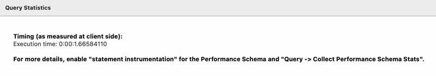

#활동중인(Active) 부서의 현재 부서관리자 중 연봉 상위 5위안에 드는 사람들이 최근에 각 지역별로 언제 퇴실했는지 조회해보세요. (사원번호, 이름, 연봉, 직급명, 지역, 입출입구분, 입출입시간)
## 쿼리
```sql
SELECT
    t.id AS 사원번호,
    t.first_name AS 이름,
    t.annual_income AS 연봉,
    t.position_name AS 직급명,
    r.region AS 지역,
    r.record_symbol AS 입출입구분,
    r.time AS 입출입시간
FROM (
    SELECT
        e.id,
        e.first_name,
        s.annual_income,
        p.position_name
    FROM manager m
    JOIN department d
        ON d.id = m.department_id
        AND NOW() BETWEEN m.start_date AND m.end_date
        AND d.note = 'active'
	JOIN employee e
        ON e.id = m.employee_id 
    JOIN position p
        ON p.id =  m.employee_id
        AND p.position_name = 'Manager'
    JOIN salary s
        ON s.id = m.employee_id
        AND NOW() BETWEEN s.start_date AND s.end_date
    ORDER BY s.annual_inco e DESC
    LIMIT 5
) t
JOIN record r
    ON t.id = r.employee_id
    AND r.record_symbol = 'O';
```

## 실행시간
*m1이라 1초는 넘게 걸렸습니다*

