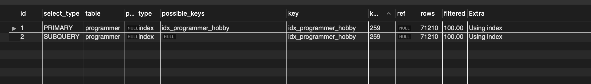
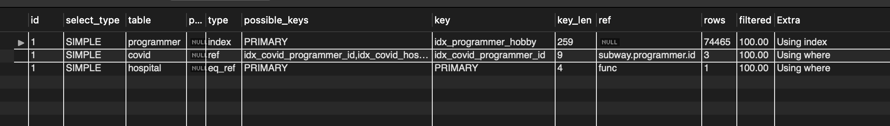
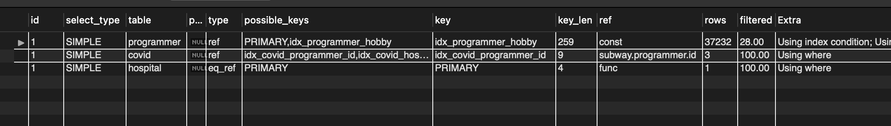
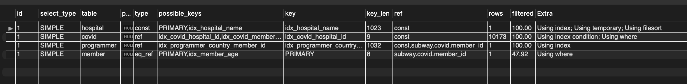
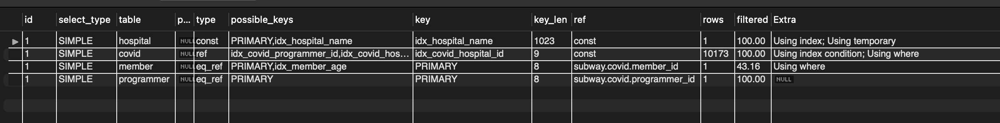

## 1. 인덱스 적용해보기 실습을 진행해본 과정을 공유해주세요

### Coding as a Hobby 와 같은 결과를 반환하세요.

#### index

```sql
create index idx_programmer_hobby
on programmer (hobby);
```

#### query

```sql
select h.hobby, count(1) / (select count(1) from programmer) * 100 as percent
from (select hobby from programmer) h
group by hobby;
```

#### explain



### 프로그래머별로 해당하는 병원 이름을 반환하세요. (covid.id, hospital.name)

#### index

```sql
create index idx_covid_programmer_id
on covid (programmer_id);

create index idx_covid_hospital_id
on covid (hospital_id);

alter table programmer
add constraint programmer_pk
primary key (id);

alter table covid
add constraint covid_pk
primary key (id);   

create unique index idx_hospital_name
on hospital (name);

alter table hospital
add constraint hospital_pk
primary key (id);
```

#### query

```sql
select c.id, h.name
from (select id from programmer) p
join (select id, hospital_id, programmer_id from covid) c on p.id = c.programmer_id
join (select id, name from hospital) h on h.id = c.hospital_id
limit 100;
```

#### explain



### 프로그래밍이 취미인 학생 혹은 주니어(0-2년)들이 다닌 병원 이름을 반환하고 user.id 기준으로 정렬하세요. (covid.id, hospital.name, user.Hobby, user.DevType, user.YearsCoding)

#### query

```sql
select c.id, 
       h.name,
       student_or_junior.hobby,
       student_or_junior.dev_type,
       student_or_junior.years_coding
from (select id, years_coding, hobby, dev_type
      from programmer
      where (years_coding = '0-2 years' or student in ('Yes, full-time', 'Yes, part-time'))
      and hobby = 'Yes') student_or_junior
join (select id, hospital_id, programmer_id from covid) c
on student_or_junior.id = c.programmer_id
join (select id, name from hospital) h
on h.id = c.hospital_id
order by student_or_junior.id
limit 100;
```

#### explain



### 서울대병원에 다닌 20대 India 환자들을 병원에 머문 기간별로 집계하세요. (covid.Stay)

#### index

```sql
create index idx_programmer_country_member_id
on programmer (country, member_id);

alter table member
add constraint member_pk
primary key (id);

create index idx_member_age
on member (age);
```

#### query

```sql
select c.stay, count(c.stay)
from (select id, member_id from programmer where country = 'India') as indian
join (select id from member where age between 20 and 29) as twenties
on twenties.id = indian.member_id
join (select id, hospital_id, member_id, stay from covid) c
on twenties.id = c.member_id
join (select id from hospital where name = '서울대병원') as h
on c.hospital_id = h.id
group by c.stay;
```

#### explain



### 서울대병원에 다닌 30대 환자들을 운동 횟수별로 집계하세요. (user.Exercise)

#### index

```sql
create index idx_covid_member_id
on covid (member_id);
```

#### query

```sql
select p.exercise, count(1)
from (select id from member where age between 30 and 39) as thirthes
join (select id, member_id, programmer_id, hospital_id from covid) as c
on thirthes.id = c.member_id
join (select id from hospital where name = '서울대병원') as h
on c.hospital_id = h.id
join (select id, exercise from programmer) as p
on c.programmer_id = p.id
group by p.exercise
order by null;
```

#### explain


