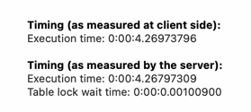
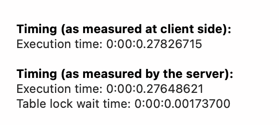

# Coding as a Hobby 와 같은 결과를 반환하세요.
## Query
```sql
SELECT hobby, COUNT(*) / (SELECT COUNT(*) FROM programmer) * 100 AS percent
FROM programmer p
GROUP BY p.hobby
ORDER BY percent DESC;
```


## improvement
```sql
ALTER TABLE programmer ADD PRIMARY KEY (id);
CREATE INDEX idx_programmer_hobby on programmer (hobby);
```



# 프로그래머별로 해당하는 병원 이름을 반환하세요. (covid.id, hospital.name)
## Query
```sql
 SELECT c.id, h.name
 FROM covid c
 JOIN programmer p ON p.id = c.programmer_id
 JOIN hospital h ON h.id = c.hospital_id;
```

## Improvement 
```sql
alter table hospital add primary key (id);
alter table covid add primary key (id);
create index idx_covid_hospital_id on covid (hospital_id);
```


