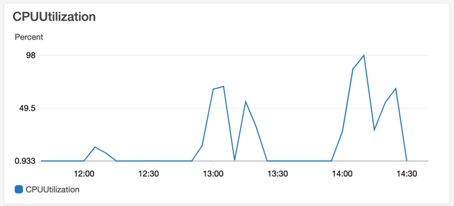

# stress

### before

            /\      |‾‾| /‾‾/   /‾‾/   
       /\  /  \     |  |/  /   /  /    
      /  \/    \    |     (   /   ‾‾\  
     /          \   |  |\  \ |  (‾)  |
    / __________ \  |__| \__\ \_____/ .io
    
    execution: local
    script: MultipleData_stress.js
    output: -
    
    scenarios: (100.00%) 1 scenario, 900 max VUs, 12m40s max duration (incl. graceful stop):
    * default: Up to 900 looping VUs for 12m10s over 9 stages (gracefulRampDown: 30s, gracefulStop: 30s)
    
    
    running (12m40.0s), 000/900 VUs, 14362 complete and 322 interrupted iterations
    default ✗ [======================================] 000/900 VUs  12m10s

     ✓ find path in successfully
     ✓ distance

     checks.........................: 100.00% ✓ 28756 ✗ 0    
     data_received..................: 61 MB   80 kB/s
     data_sent......................: 1.8 MB  2.4 kB/s
     http_req_blocked...............: avg=323.43µs min=2.09µs  med=2.91µs  max=80.27ms p(90)=3.27µs   p(95)=4.35ms  
     http_req_connecting............: avg=39.94µs  min=0s      med=0s      max=19.22ms p(90)=0s       p(95)=447.41µs
    ✗ http_req_duration..............: avg=28.55s   min=92.54ms med=25.18s  max=56.46s  p(90)=46.12s   p(95)=46.29s  
    { expected_response:true }...: avg=28.55s   min=92.54ms med=25.18s  max=56.46s  p(90)=46.12s   p(95)=46.29s  
    http_req_failed................: 0.00%   ✓ 0     ✗ 14378
    http_req_receiving.............: avg=122.73µs min=50.38µs med=106µs   max=5.21ms  p(90)=154.02µs p(95)=176.56µs
    http_req_sending...............: avg=66.39µs  min=28.12µs med=55.99µs max=6.59ms  p(90)=76.29µs  p(95)=123.33µs
    http_req_tls_handshaking.......: avg=267.63µs min=0s      med=0s      max=62.81ms p(90)=0s       p(95)=3.69ms  
    http_req_waiting...............: avg=28.55s   min=92.35ms med=25.18s  max=56.46s  p(90)=46.12s   p(95)=46.29s  
    http_reqs......................: 14378   18.918814/s
    iteration_duration.............: avg=29.53s   min=1.09s   med=26.18s  max=57.46s  p(90)=47.12s   p(95)=47.29s  
    iterations.....................: 14362   18.897761/s
    vus............................: 34      min=5   max=900
    vus_max........................: 900     min=900 max=900
    
    ERRO[0762] some thresholds have failed

--- 
### after

    
            /\      |‾‾| /‾‾/   /‾‾/   
       /\  /  \     |  |/  /   /  /    
      /  \/    \    |     (   /   ‾‾\  
     /          \   |  |\  \ |  (‾)  |
    / __________ \  |__| \__\ \_____/ .io
    
    execution: local
    script: MultipleData_stress.js
    output: -
    
    scenarios: (100.00%) 1 scenario, 900 max VUs, 12m40s max duration (incl. graceful stop):
    * default: Up to 900 looping VUs for 12m10s over 9 stages (gracefulRampDown: 30s, gracefulStop: 30s)
    
    
    running (12m11.0s), 000/900 VUs, 407727 complete and 0 interrupted iterations
    default ✓ [======================================] 000/900 VUs  12m10s

     ✓ find path in successfully
     ✓ distance

     checks.........................: 100.00% ✓ 815454 ✗ 0     
     data_received..................: 1.6 GB  2.2 MB/s
     data_sent......................: 36 MB   49 kB/s
     http_req_blocked...............: avg=41.25µs  min=1.61µs  med=2.72µs  max=300.74ms p(90)=2.98µs   p(95)=7.5µs  
     http_req_connecting............: avg=5.79µs   min=0s      med=0s      max=109.83ms p(90)=0s       p(95)=0s     
    ✓ http_req_duration..............: avg=21.03ms  min=2.4ms   med=6.05ms  max=1.26s    p(90)=49.47ms  p(95)=91.38ms
    { expected_response:true }...: avg=21.03ms  min=2.4ms   med=6.05ms  max=1.26s    p(90)=49.47ms  p(95)=91.38ms
    http_req_failed................: 0.00%   ✓ 0      ✗ 407727
    http_req_receiving.............: avg=422.47µs min=30.8µs  med=63.12µs max=278.95ms p(90)=339.82µs p(95)=921.76µ
    http_req_sending...............: avg=186.52µs min=18.21µs med=38.78µs max=320.6ms  p(90)=114.98µs p(95)=362.56µ
    http_req_tls_handshaking.......: avg=15.01µs  min=0s      med=0s      max=176.87ms p(90)=0s       p(95)=0s     
    http_req_waiting...............: avg=20.42ms  min=0s      med=5.72ms  max=1.26s    p(90)=48.27ms  p(95)=89.2ms
    http_reqs......................: 407727  557.802837/s
    iteration_duration.............: avg=1.02s    min=1s      med=1s      max=2.31s    p(90)=1.06s    p(95)=1.11s  
    iterations.....................: 407727  557.802837/s
    vus............................: 39      min=6    max=900
    vus_max........................: 900     min=900  max=900 

---
### 최대성능 측정

사용자를 1000명 까지는 괜찮다가 1000명을 넘어가는 순간부터는 too many open files 에러와 함께 cpu사용률도 높다는것을 확인하였습니다.
그래서 최대 성능은 1000 명까지가 된다고 추측하였습니다.

            /\      |‾‾| /‾‾/   /‾‾/   
       /\  /  \     |  |/  /   /  /    
      /  \/    \    |     (   /   ‾‾\  
     /          \   |  |\  \ |  (‾)  |
    / __________ \  |__| \__\ \_____/ .io
    
    execution: local
    script: MultipleData_stress.js
    output: -
    
    scenarios: (100.00%) 1 scenario, 1050 max VUs, 8m40s max duration (incl. graceful stop):
    * default: Up to 1050 looping VUs for 8m10s over 7 stages (gracefulRampDown: 30s, gracefulStop: 30s)
    
    ...

    WARN[0323] Request Failed                                error="Get \"https://dacapolife87-test.n-e.kr//paths?source=227&target=56\": dial tcp 13.125.205.49:443: socket: too many open files"
    ERRO[0323] GoError: invalid type <nil>, expected string, []byte or ArrayBuffer
    running at reflect.methodValueCall (native)
    default at distance (file:///home/ubuntu/service/k6/MultipleData_stress.js:35:63(4))
    at go.k6.io/k6/js/common.Bind.func1 (native)
    at file:///home/ubuntu/service/k6/MultipleData_stress.js:33:28(25)  executor=ramping-vus scenario=default source=stacktrace

    ERRO[0481] GoError: invalid type <nil>, expected string, []byte or ArrayBuffer
    running at reflect.methodValueCall (native)
    default at distance (file:///home/ubuntu/service/k6/MultipleData_stress.js:35:63(4))
    at go.k6.io/k6/js/common.Bind.func1 (native)
    at file:///home/ubuntu/service/k6/MultipleData_stress.js:33:28(25)  executor=ramping-vus scenario=default source=stacktrace
    
    ...

    running (8m11.0s), 0000/1050 VUs, 466441 complete and 0 interrupted iterations
    default ✓ [======================================] 0000/1050 VUs  8m10s

     ✗ find path in successfully
      ↳  68% — ✓ 321240 / ✗ 145201
     ✗ distance
      ↳  68% — ✓ 321240 / ✗ 145201

     checks.........................: 68.87% ✓ 642480 ✗ 290402
     data_received..................: 1.3 GB 2.6 MB/s
     data_sent......................: 28 MB  58 kB/s
     http_req_blocked...............: avg=145.24µs min=0s       med=2.68µs   max=962.49ms p(90)=2.95µs   p(95)=3.15µs  
     http_req_connecting............: avg=38.68µs  min=0s       med=0s       max=540.76ms p(90)=0s       p(95)=0s      
    ✓ http_req_duration..............: avg=116.32ms min=0s       med=14.3ms   max=2.26s    p(90)=361.66ms p(95)=452.14ms
    { expected_response:true }...: avg=168.9ms  min=2.57ms   med=102.91ms max=2.26s    p(90)=409.39ms p(95)=502.2ms
    http_req_failed................: 31.12% ✓ 145201 ✗ 321240
    http_req_receiving.............: avg=1.22ms   min=0s       med=54.1µs   max=1.11s    p(90)=180.02µs p(95)=572.77µs
    http_req_sending...............: avg=941.63µs min=0s       med=36.52µs  max=746.64ms p(90)=107.75µs p(95)=345.51µs
    http_req_tls_handshaking.......: avg=40.63µs  min=0s       med=0s       max=525.29ms p(90)=0s       p(95)=0s      
    http_req_waiting...............: avg=114.15ms min=0s       med=13.36ms  max=1.94s    p(90)=356.58ms p(95)=445.5ms
    http_reqs......................: 466441 950.038925/s
    iteration_duration.............: avg=857.21ms min=158.69µs med=1.02s    max=3.54s    p(90)=1.47s    p(95)=1.61s   
    iterations.....................: 466441 950.038925/s
    vus............................: 0      min=0    max=1050
    vus_max........................: 1050   min=1050 max=1050

