### 1. 성능 개선 결과를 공유해주세요 (Smoke, Load, Stress 테스트 결과)

### Smoke

#### Before

- 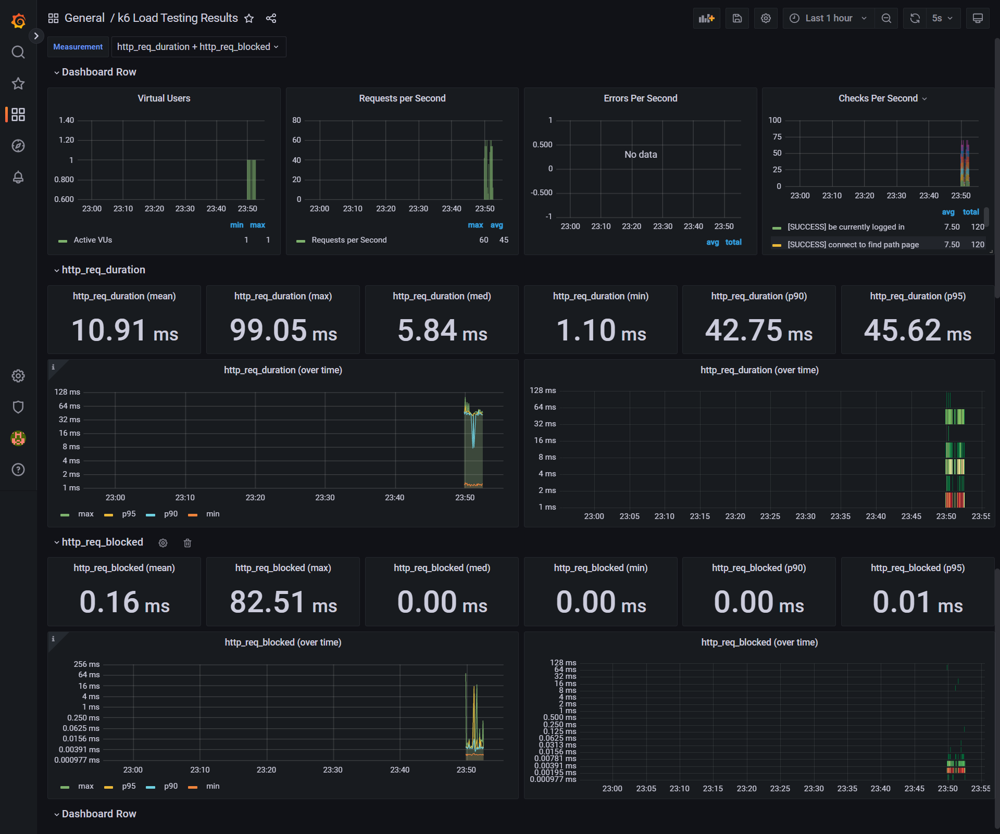
- 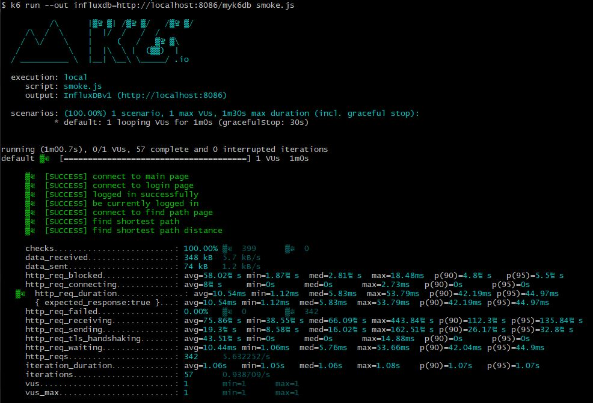

#### After

- 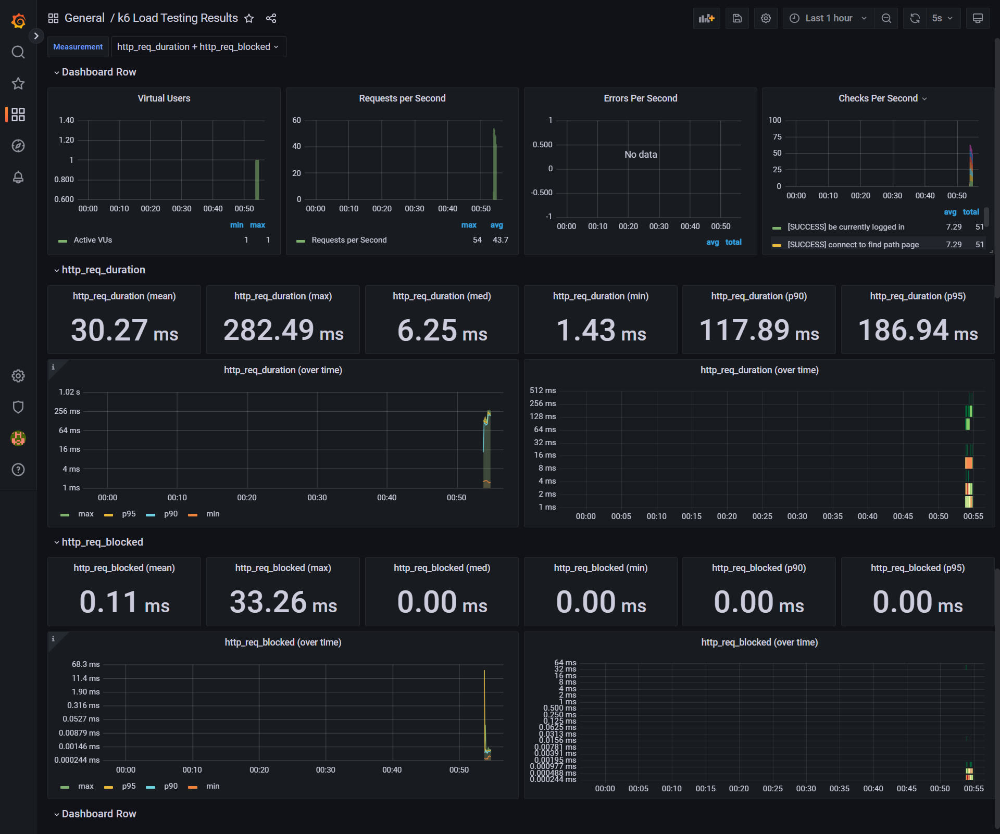
- 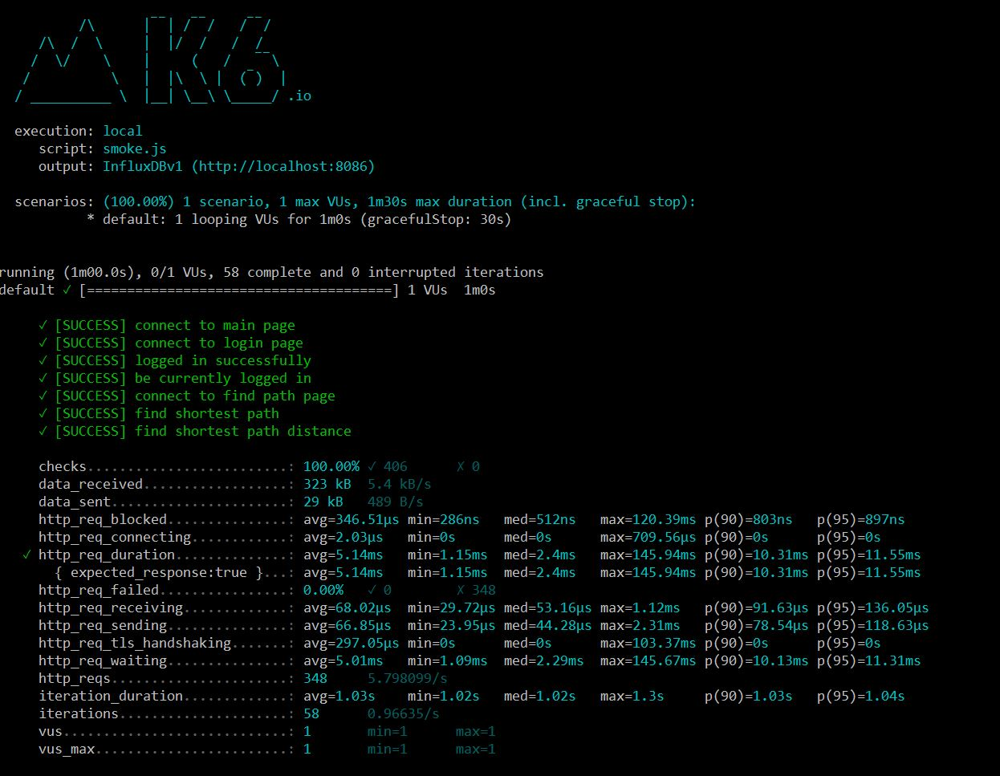

### Load

#### Before

- 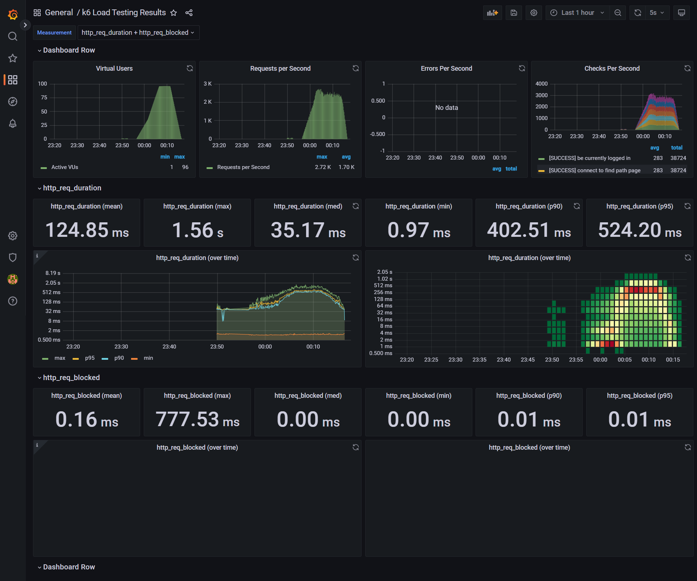
- 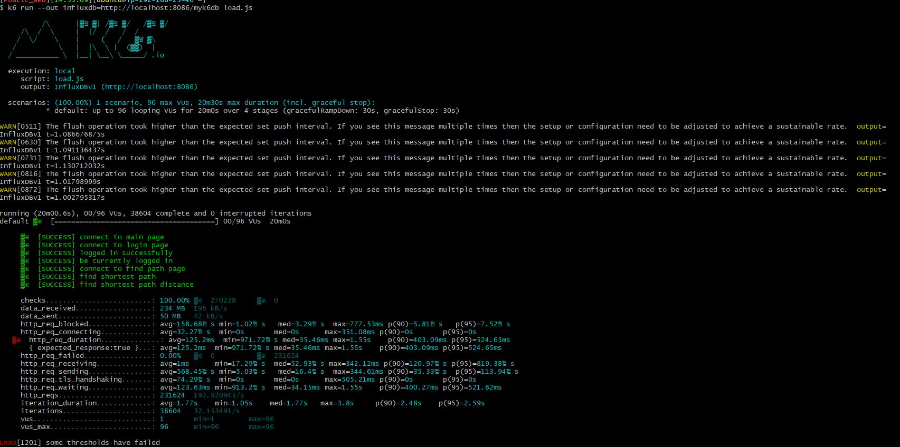

#### After

- 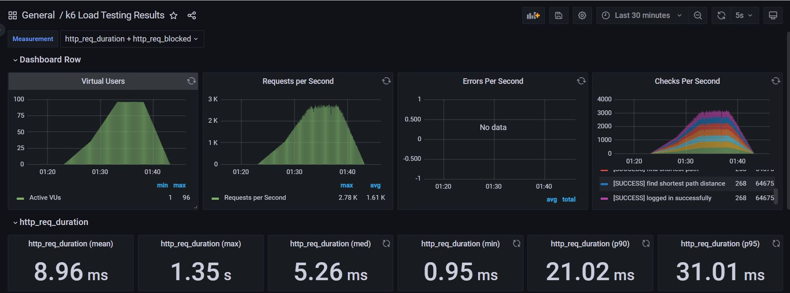
- 

### Stress

#### Before

- 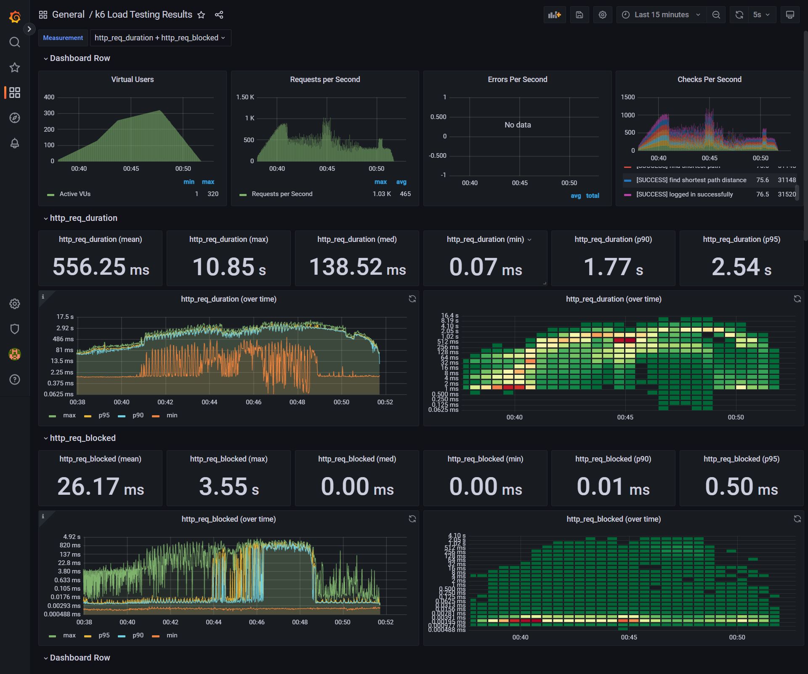
- 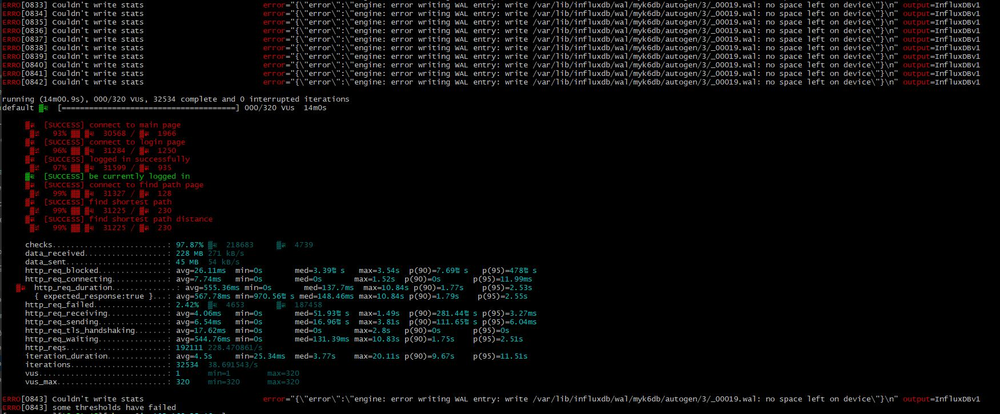

#### After

- 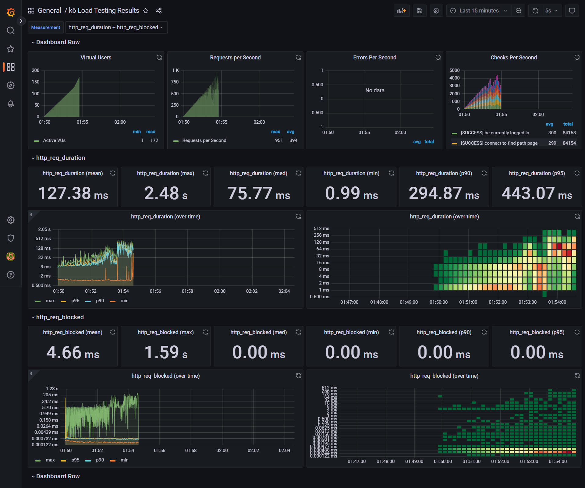
- 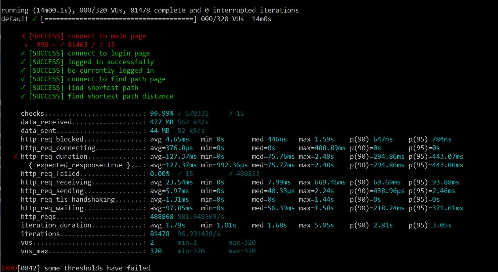

### 2. 어떤 부분을 개선해보셨나요? 과정을 설명해주세요

- nginx cache 적용
- nginx compression(gzip) 적용
- nginx http2 적용
- was cache(redis) 적용
