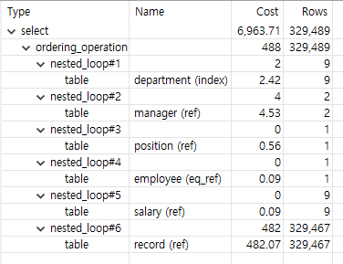

### 활동중인(Active) 부서의 현재 부서관리자 중 연봉 상위 5위안에 드는 사람들이 최근에 각 지역별로 언제 퇴실했는지 조회해보세요. (사원번호, 이름, 연봉, 직급명, 지역, 입출입구분, 입출입시간)

조회 SQL
```
SELECT M.employee_id
	,  E.last_name
	,  M.annual_income
	,  M.position_name
	,  R.`time`
	,  R.region
	,  R.record_symbol
  FROM (
        SELECT M.employee_id
            ,  P.position_name 
            ,  S.annual_income 
          FROM tuning.department D
         INNER JOIN tuning.manager M
            ON D.id = M.department_id
         INNER JOIN tuning.`position` P
            ON M.employee_id = P.id 
         INNER JOIN tuning.salary S
            ON M.employee_id = S.id
         WHERE D.note IN ('active', 'Active')
           AND M.end_date = '9999-01-01'
           AND P.position_name = 'Manager'
           AND P.end_date = '9999-01-01'
           AND S.end_date = '9999-01-01'
         ORDER BY S.annual_income DESC 
         LIMIT 5
	) M
 INNER JOIN tuning.employee E
    ON M.employee_id = E.id 
 INNER JOIN tuning.record R
    ON M.employee_id = R.employee_id 
 WHERE R.record_symbol = 'O'
 ORDER BY M.annual_income DESC
        , R.`time` DESC 
```

실행 결과
```
첫번째 : 6.28s
두번째 : 205ms
세번재 : 190ms

employee_id|last_name|annual_income|position_name|time               |region|record_symbol|
-----------|---------|-------------|-------------|-------------------|------|-------------|
     110039|Vishwani |       106491|Manager      |2020-09-05 20:30:07|a     |O            |
     110039|Vishwani |       106491|Manager      |2020-08-05 21:01:50|b     |O            |
     110039|Vishwani |       106491|Manager      |2020-07-06 11:00:25|d     |O            |
     111133|Hauke    |       101987|Manager      |2020-05-07 16:30:37|b     |O            |
     111133|Hauke    |       101987|Manager      |2020-01-24 02:59:37|a     |O            |
     110114|Isamu    |        83457|Manager      |2020-11-12 02:29:00|c     |O            |
     110114|Isamu    |        83457|Manager      |2020-09-03 01:33:01|b     |O            |
     110114|Isamu    |        83457|Manager      |2020-05-29 19:38:12|a     |O            |
     110114|Isamu    |        83457|Manager      |2020-04-25 08:28:54|d     |O            |
     110567|Leon     |        74510|Manager      |2020-10-17 19:13:31|a     |O            |
     110567|Leon     |        74510|Manager      |2020-02-03 10:51:15|b     |O            |
     110228|Karsten  |        65400|Manager      |2020-09-23 06:07:01|b     |O            |
     110228|Karsten  |        65400|Manager      |2020-07-13 11:42:49|a     |O            |
     110228|Karsten  |        65400|Manager      |2020-01-11 22:29:04|d     |O            |
```

실행 계획


