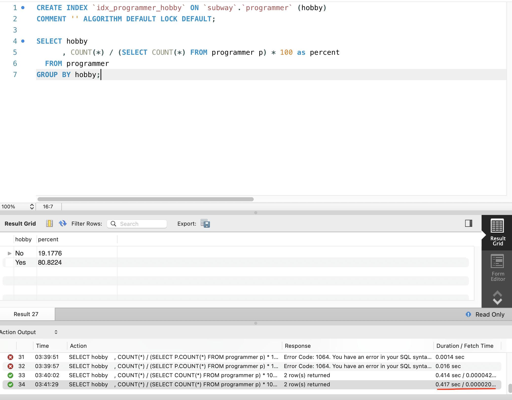
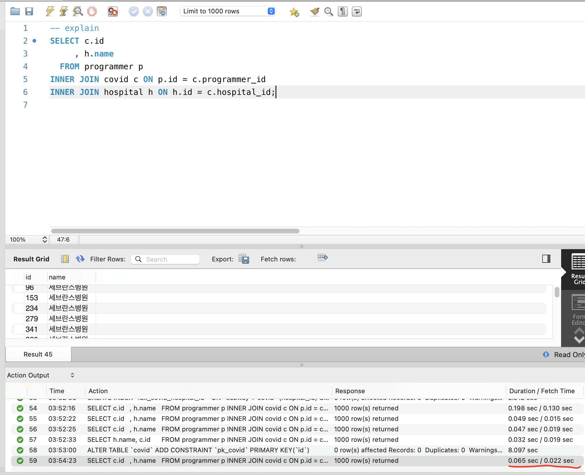
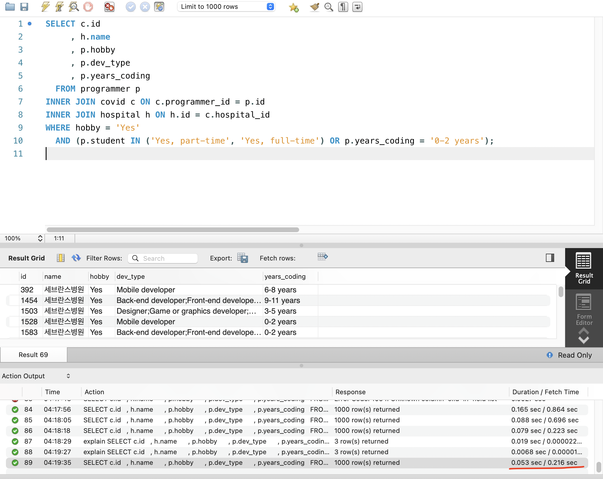
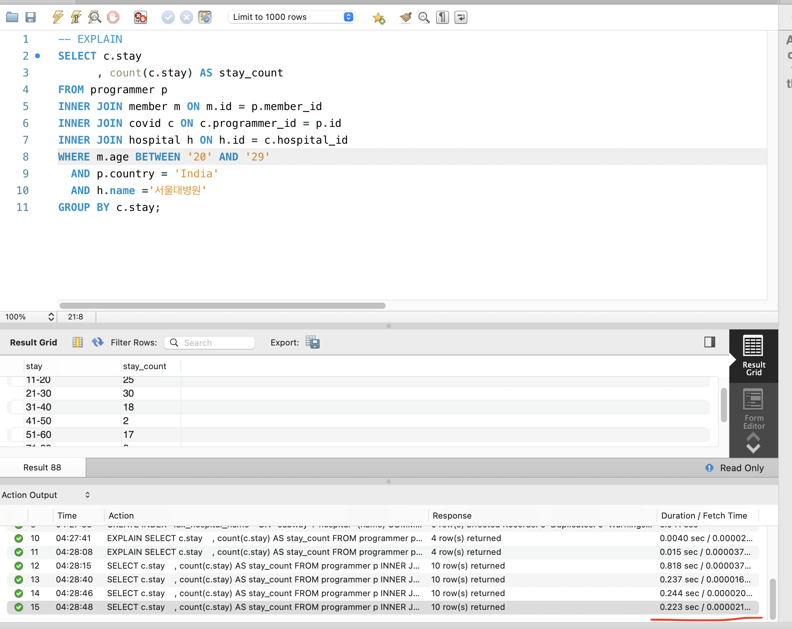

### 1. Coding as a Hobby와 같은 결과 반환
```sql

# 인덱스 생성
CREATE INDEX `idx_programmer_hobby` ON `subway`.`programmer` (hobby)
    COMMENT '' ALGORITHM DEFAULT LOCK DEFAULT;

# 조회
SELECT hobby
     , COUNT(*) / (SELECT COUNT(*) FROM programmer p) * 100 as percent
FROM programmer
GROUP BY hobby;
```
* 1번 결과


### 2. 프로그래머별로 해당하는 병원 이름을 반환 (covid.id, hospital.name)
```sql
# 인덱스 생성
ALTER TABLE `programmer` ADD CONSTRAINT `pk_programmer` PRIMARY KEY(`id`);
CREATE INDEX `idx_covid_programmer_id`  ON `subway`.`covid` (programmer_id) COMMENT '' ALGORITHM DEFAULT LOCK DEFAULT;
ALTER TABLE `hospital` ADD CONSTRAINT `pk_hospital` PRIMARY KEY(`id`);
CREATE INDEX `idx_covid_hospital_id`  ON `subway`.`covid` (hospital_id) COMMENT '' ALGORITHM DEFAULT LOCK DEFAULT;

# 조회
SELECT c.id
     , h.name 
  FROM programmer p
INNER JOIN covid c ON p.id = c.programmer_id
INNER JOIN hospital h ON h.id = c.hospital_id;
```
* 2번 결과


### 3. 프로그래밍이 취미인 학생 혹은 주니어(0-2년)들이 다닌 병원 이름을 반환하고 user.id 기준으로 정렬
(covid.id, hospital.name, user.Hobby, user.DevType, user.YearsCoding)
```sql
# 조회
SELECT c.id
	 , h.name
     , p.hobby
     , p.dev_type
     , p.years_coding
  FROM programmer p
INNER JOIN covid c ON c.programmer_id = p.id   
INNER JOIN hospital h ON h.id = c.hospital_id
WHERE hobby = 'Yes'
  AND (p.student IN ('Yes, part-time', 'Yes, full-time') OR p.years_coding = '0-2 years');
```
* 3번 결과


### 4. 서울대병원에 다닌 20대 India 환자들을 병원에 머문 기간별로 집계 (covid.Stay)
```sql
# 인덱스 생성
ALTER TABLE `member` ADD CONSTRAINT `pk_member` PRIMARY KEY(`id`);
CREATE INDEX `idx_covid_stay`  ON `subway`.`covid` (stay) COMMENT '' ALGORITHM DEFAULT LOCK DEFAULT;
CREATE INDEX `idx_hospital_name`  ON `subway`.`hospital` (name) COMMENT '' ALGORITHM DEFAULT LOCK DEFAULT;

# 조회
SELECT c.stay
     , COUNT(c.stay) AS stay_count
FROM programmer p
         INNER JOIN member m ON m.id = p.member_id
         INNER JOIN covid c ON c.programmer_id = p.id
         INNER JOIN hospital h ON h.id = c.hospital_id
WHERE m.age BETWEEN '20' AND '29'
  AND p.country = 'India'
  AND h.name ='서울대병원'
GROUP BY c.stay;
```
* 4번 결과

### 5. 서울대병원에 다닌 30대 환자들을 운동 횟수별로 집계 (user.Exercise)
```sql
# 조회
SELECT p.exercise
     , COUNT(p.exercise) AS exercise_count
FROM programmer p
         INNER JOIN member m ON m.id = p.member_id
         INNER JOIN covid c ON c.programmer_id = p.id
         INNER JOIN hospital h ON h.id = c.hospital_id
WHERE m.age BETWEEN '30' AND '39'
  AND h.name = '서울대병원'
GROUP BY p.exercise;
```
* 5번 결과


