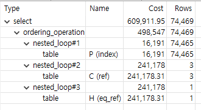
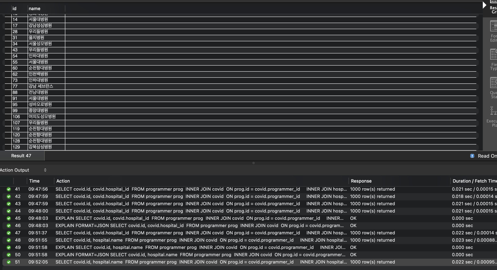
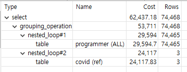
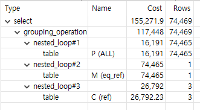

### 프로그래머별로 해당하는 병원 이름을 반환하세요. (covid.id, hospital.name)
기본키 생성
```
ALTER TABLE `subway`.`programmer` ADD PRIMARY KEY (`id`)
ALTER TABLE `subway`.`covid` ADD PRIMARY KEY (`id`)
ALTER TABLE `subway`.`hospital` ADD PRIMARY KEY (`id`)
```

인덱스 생성
```
ALTER TABLE `subway`.`covid` ADD INDEX `idx_programmer_id`(`programmer_id`)
ALTER TABLE `subway`.`covid` ADD INDEX `idx_hospital_id`(`hospital_id`)
```

조회 SQL
```
SELECT C.id 
    ,  H.name 
  FROM subway.programmer P
 INNER JOIN subway.covid C 
    ON P.id = C.programmer_id 
 INNER JOIN subway.hospital H 
    ON C.hospital_id = H.id 
 ORDER BY P.id 
```

실행 결과
```
200 row(s) fetched - 4ms
id |name    |
---|--------|
1|고려대병원   |
2|분당서울대병원 |
3|경희대병원   |
4|우리들병원   |
5|우리들병원   |
...
```

실행 계획



### 프로그래밍이 취미인 학생 혹은 주니어(0-2년)들이 다닌 병원 이름을 반환하고 user.id 기준으로 정렬하세요. (covid.id, hospital.name, user.Hobby, user.DevType, user.YearsCoding)
조회 SQL
```
SELECT C.id 
    ,  H.name 
    ,  P.hobby 
    ,  P.dev_type 
    ,  P.years_coding
  FROM (
        SELECT P.id 
            ,  P.hobby 
            ,  P.dev_type 
            ,  P.years_coding
          FROM subway.programmer P
         WHERE ((   P.hobby = 'Yes'
                AND P.student IN ('Yes, full-time', 'Yes, part-time'))
                 OR 
                (   P.employment IN ('Employed full-time', 'Employed part-time')
                AND P.student NOT LIKE 'Yes%'
                AND P.years_coding = '0-2 years'))
    ) P 
 INNER JOIN subway.covid C
    ON P.id = C.programmer_id 
 INNER JOIN subway.hospital H 
    ON C.hospital_id = H.id 
 ORDER BY P.id 
```

실행 결과
``` 
200 row(s) fetched - 8ms
 id |name    |hobby|dev_type                                                                                                                                                                                                                                                       |years_coding|
---|--------|-----|---------------------------------------------------------------------------------------------------------------------------------------------------------------------------------------------------------------------------------------------------------------|------------|
  5|우리들병원   |Yes  |Data or business analyst;Desktop or enterprise applications developer;Game or graphics developer;QA or test developer;Student                                                                                                                                  |6-8 years   |
  8|강남성심병원  |Yes  |Designer;Front-end developer;QA or test developer                                                                                                                                                                                                              |0-2 years   |
 10|경희대병원   |No   |Designer                                                                                                                                                                                                                                                       |0-2 years   |
 12|우리들병원   |Yes  |Back-end developer;Front-end developer;Full-stack developer                                                                                                                                                                                                    |0-2 years   |
 13|이화여대병원  |Yes  |Back-end developer;Front-end developer                                                                                                                                                                                                                         |0-2 years   |
...
```

실행 계획



### 서울대병원에 다닌 20대 India 환자들을 병원에 머문 기간별로 집계하세요. (covid.Stay)
조회 SQL
```
SELECT C.stay 
    ,  COUNT(1)
  FROM subway.programmer P
 INNER JOIN subway.covid C
    ON P.id = C.programmer_id
   AND C.city_code_hospital = 9
 WHERE P.country = 'India'
 GROUP BY C.stay
```

실행 결과
```
11 row(s) fetched - 197ms
stay              |COUNT(1)|
------------------|--------|
0-10              |      75|
11-20             |     228|
21-30             |     278|
31-40             |     203|
41-50             |      29|
51-60             |     157|
61-70             |       4|
71-80             |      45|
81-90             |      23|
91-100            |      11|
More than 100 Days|      29|
```

실행 계획



### 서울대병원에 다닌 30대 환자들을 운동 횟수별로 집계하세요. (user.Exercise)
기본키 생성
```
ALTER TABLE `subway`.`member` ADD PRIMARY KEY (`id`)
```

인덱스 생성
```
ALTER TABLE `subway`.`covid` ADD INDEX `idx_member_id`(`member_id`)
```

조회 SQL
```
SELECT P.exercise
    ,  COUNT(1) 
  FROM subway.`member` M
 INNER JOIN subway.programmer P
    ON M.id = P.member_id
 INNER JOIN subway.covid C
    ON M.id = C.member_id 
   AND C.hospital_id = 9
 WHERE M.age >= 30
   AND M.age <= 39
 GROUP BY P.exercise
```

실행 결과
```
5 row(s) fetched - 403ms
exercise                  |COUNT(1)|
--------------------------|--------|
1 - 2 times per week      |     171|
3 - 4 times per week      |     113|
Daily or almost every day |      91|
I don't typically exercise|     223|
NA                        |     219|
```

실행 계획


