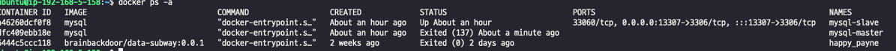

# 이중화된 디비에서 masterDB stop 후 slaveDB만 사용
### stress-test/stress.js

```shell
              /\      |‾‾| /‾‾/   /‾‾/   
         /\  /  \     |  |/  /   /  /    
        /  \/    \    |     (   /   ‾‾\  
       /          \   |  |\  \ |  (‾)  | 
      / __________ \  |__| \__\ \_____/ .io
    
      execution: local
         script: ./stress.js
         output: -
    
      scenarios: (100.00%) 1 scenario, 140 max VUs, 12m40s max duration (incl. graceful stop):
               * default: Up to 140 looping VUs for 12m10s over 9 stages (gracefulRampDown: 30s, gracefulStop: 30s)
    
    
    running (12m10.7s), 000/140 VUs, 58825 complete and 0 interrupted iterations
    default ✓ [======================================] 000/140 VUs  12m10s
    
         ✓ logged in successfully
         ✓ correct distance
    
         checks.........................: 100.00% ✓ 117650    ✗ 0    
         data_received..................: 196 MB  268 kB/s
         data_sent......................: 5.1 MB  7.0 kB/s
         http_req_blocked...............: avg=41.63µs  min=0s     med=1µs    max=156.19ms p(90)=1µs     p(95)=2µs    
         http_req_connecting............: avg=10.75µs  min=0s     med=0s     max=7.94ms   p(90)=0s      p(95)=0s     
       ✓ http_req_duration..............: avg=10.09ms  min=6.55ms med=9.58ms max=332.16ms p(90)=12.49ms p(95)=13.94ms
           { expected_response:true }...: avg=10.09ms  min=6.55ms med=9.58ms max=332.16ms p(90)=12.49ms p(95)=13.94ms
         http_req_failed................: 0.00%   ✓ 0         ✗ 58825
         http_req_receiving.............: avg=101.17µs min=24µs   med=69µs   max=9.97ms   p(90)=182µs   p(95)=315µs  
         http_req_sending...............: avg=68.07µs  min=16µs   med=61µs   max=2.06ms   p(90)=109µs   p(95)=125µs  
         http_req_tls_handshaking.......: avg=29.3µs   min=0s     med=0s     max=139.87ms p(90)=0s      p(95)=0s     
         http_req_waiting...............: avg=9.92ms   min=6.41ms med=9.41ms max=332.02ms p(90)=12.32ms p(95)=13.76ms
         http_reqs......................: 58825   80.501484/s
         iteration_duration.............: avg=1.01s    min=1s     med=1.01s  max=1.33s    p(90)=1.01s   p(95)=1.01s  
         iterations.....................: 58825   80.501484/s
         vus............................: 8       min=1       max=140
         vus_max........................: 140     min=140     max=140
```
