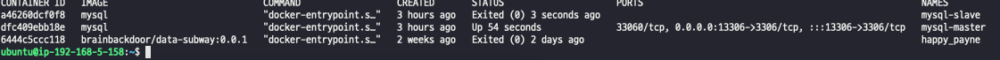
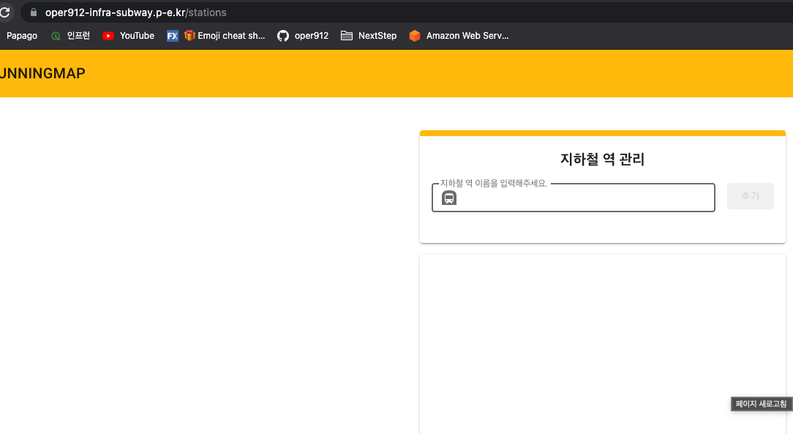

# 이중화된 디비에서 masterDB stop 후 masterDB만 사용
### stress-test/stress.js


```shell
          /\      |‾‾| /‾‾/   /‾‾/   
     /\  /  \     |  |/  /   /  /    
    /  \/    \    |     (   /   ‾‾\  
   /          \   |  |\  \ |  (‾)  | 
  / __________ \  |__| \__\ \_____/ .io

  execution: local
     script: ./stress.js
     output: -

  scenarios: (100.00%) 1 scenario, 140 max VUs, 12m40s max duration (incl. graceful stop):
           * default: Up to 140 looping VUs for 12m10s over 9 stages (gracefulRampDown: 30s, gracefulStop: 30s)


running (12m10.8s), 000/140 VUs, 58834 complete and 0 interrupted iterations
default ✓ [======================================] 000/140 VUs  12m10s

     ✓ logged in successfully
     ✓ correct distance

     checks.........................: 100.00% ✓ 117668    ✗ 0    
     data_received..................: 196 MB  268 kB/s
     data_sent......................: 5.1 MB  7.0 kB/s
     http_req_blocked...............: avg=41.19µs min=0s     med=1µs    max=159.87ms p(90)=1µs     p(95)=2µs    
     http_req_connecting............: avg=10.75µs min=0s     med=0s     max=5.92ms   p(90)=0s      p(95)=0s     
   ✓ http_req_duration..............: avg=10.01ms min=6.58ms med=9.53ms max=25.38ms  p(90)=12.46ms p(95)=13.81ms
       { expected_response:true }...: avg=10.01ms min=6.58ms med=9.53ms max=25.38ms  p(90)=12.46ms p(95)=13.81ms
     http_req_failed................: 0.00%   ✓ 0         ✗ 58834
     http_req_receiving.............: avg=94.06µs min=24µs   med=64µs   max=7.5ms    p(90)=169µs   p(95)=291µs  
     http_req_sending...............: avg=64.41µs min=16µs   med=57µs   max=1.68ms   p(90)=107µs   p(95)=124µs  
     http_req_tls_handshaking.......: avg=29.04µs min=0s     med=0s     max=148.88ms p(90)=0s      p(95)=0s     
     http_req_waiting...............: avg=9.85ms  min=6.45ms med=9.37ms max=25.3ms   p(90)=12.3ms  p(95)=13.65ms
     http_reqs......................: 58834   80.507414/s
     iteration_duration.............: avg=1.01s   min=1s     med=1.01s  max=1.17s    p(90)=1.01s   p(95)=1.01s  
     iterations.....................: 58834   80.507414/s
     vus............................: 6       min=1       max=140
     vus_max........................: 140     min=140     max=140
```
