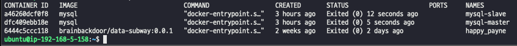
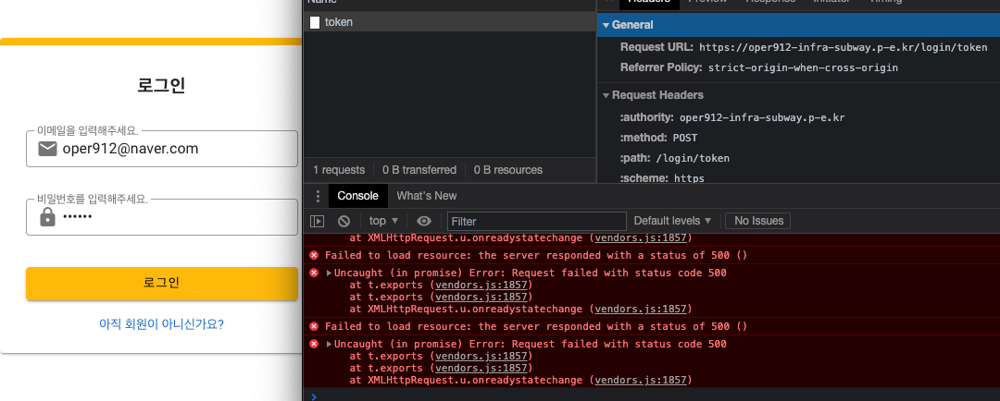
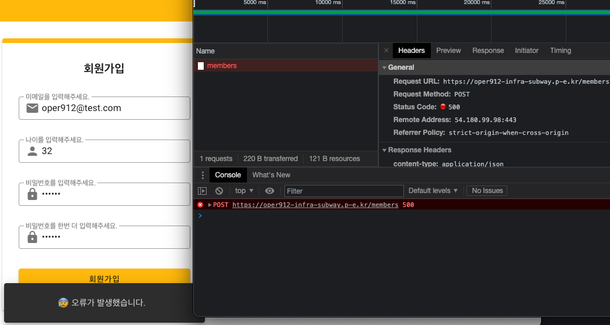

# 이중화된 디비에서 masterdb, slavedb 모두 중
### stress-test/stress.js



```shell
              /\      |‾‾| /‾‾/   /‾‾/   
         /\  /  \     |  |/  /   /  /    
        /  \/    \    |     (   /   ‾‾\  
       /          \   |  |\  \ |  (‾)  | 
      / __________ \  |__| \__\ \_____/ .io
    
      execution: local
         script: ./stress.js
         output: -
    
      scenarios: (100.00%) 1 scenario, 140 max VUs, 12m40s max duration (incl. graceful stop):
               * default: Up to 140 looping VUs for 12m10s over 9 stages (gracefulRampDown: 30s, gracefulStop: 30s)
    
    
    running (12m10.8s), 000/140 VUs, 58800 complete and 0 interrupted iterations
    default ✓ [======================================] 000/140 VUs  12m10s
    
         ✓ logged in successfully
         ✓ correct distance
    
         checks.........................: 100.00% ✓ 117600   ✗ 0    
         data_received..................: 196 MB  268 kB/s
         data_sent......................: 5.1 MB  7.0 kB/s
         http_req_blocked...............: avg=42.39µs  min=0s     med=1µs    max=157.52ms p(90)=1µs     p(95)=2µs    
         http_req_connecting............: avg=10.83µs  min=0s     med=0s     max=5.94ms   p(90)=0s      p(95)=0s     
       ✓ http_req_duration..............: avg=10.28ms  min=6.41ms med=9.8ms  max=29.81ms  p(90)=12.85ms p(95)=14.1ms 
           { expected_response:true }...: avg=10.28ms  min=6.41ms med=9.8ms  max=29.81ms  p(90)=12.85ms p(95)=14.1ms 
         http_req_failed................: 0.00%   ✓ 0        ✗ 58800
         http_req_receiving.............: avg=105.66µs min=25µs   med=73µs   max=10.05ms  p(90)=193µs   p(95)=325µs  
         http_req_sending...............: avg=72.67µs  min=15µs   med=66µs   max=1.67ms   p(90)=116µs   p(95)=133µs  
         http_req_tls_handshaking.......: avg=29.96µs  min=0s     med=0s     max=145.17ms p(90)=0s      p(95)=0s     
         http_req_waiting...............: avg=10.1ms   min=6.33ms med=9.62ms max=29.51ms  p(90)=12.67ms p(95)=13.93ms
         http_reqs......................: 58800   80.45509/s
         iteration_duration.............: avg=1.01s    min=1s     med=1.01s  max=1.16s    p(90)=1.01s   p(95)=1.01s  
         iterations.....................: 58800   80.45509/s
         vus............................: 8       min=1      max=140
         vus_max........................: 140     min=140    max=140
```
