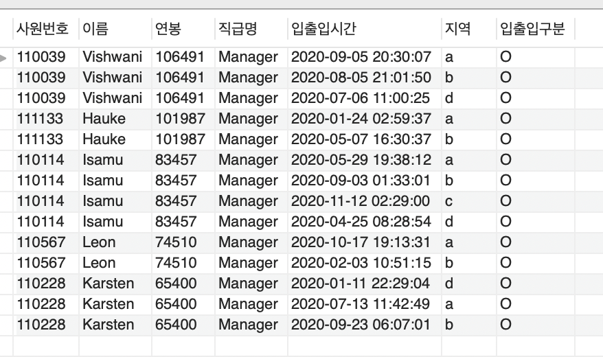

#🚀 3단계 - 쿼리 최적화
## 미션
### 실습환경 세팅
```shell
$ docker run -d -p 23306:3306 brainbackdoor/data-tuning:0.0.3
```
- [workbench](https://www.mysql.com/products/workbench/)를 설치한 후 localhost:23306 (ID : user, PW : password) 로 접속합니다.

## 요구사항
- 활동중인(Active) 부서의 현재 부서관리자(manager) 중 연봉 상위 5위안에 드는 사람들이 최근에 각 지역별로 언제 퇴실(O)했는지 조회해보세요.
  - (사원번호, 이름, 연봉, 직급명, 지역, 입출입구분, 입출입시간)
- 인덱스 설정을 추가하지 않고 1s 이하로 반환합니다.
  - M1의 경우엔 시간 제약사항을 달성하기 어렵습니다. 2배를 기준으로 해보시고 어렵다면, 일단 리뷰요청 부탁드려요
  - 급여 테이블의 사용여부 필드는 사용하지 않습니다. 현재 근무중인지 여부는 종료일자 필드로 판단해주세요.


### 📚 Todo List 📚
- [x] 활동중인(Active) 부서의 현재 부서관리자(manager) 중 연봉 상위 5위안에 드는 사람들이 최근에 각 지역별로 언제 퇴실(O)했는지 조회
- [x] 인덱스 추가 설정하지 않고 1s 이하로 반환 
