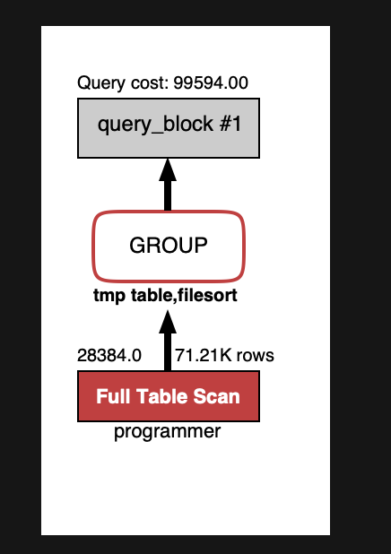
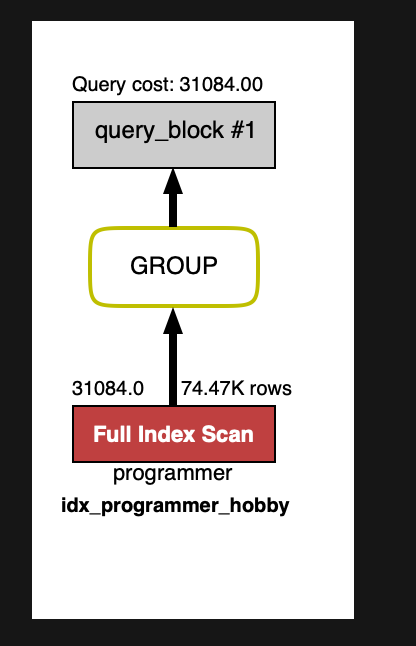
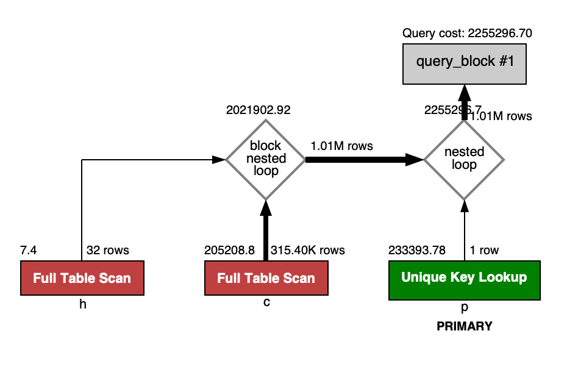
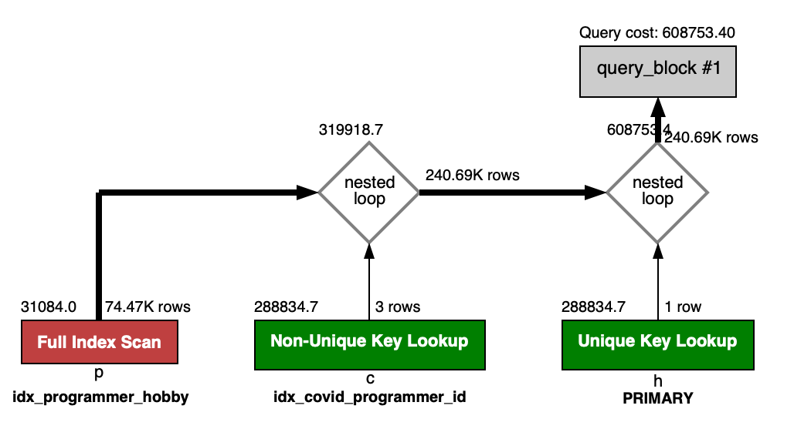
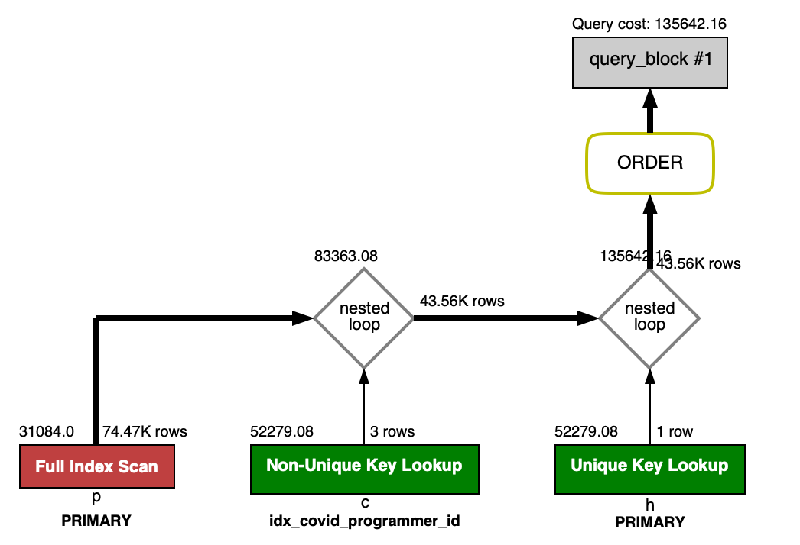
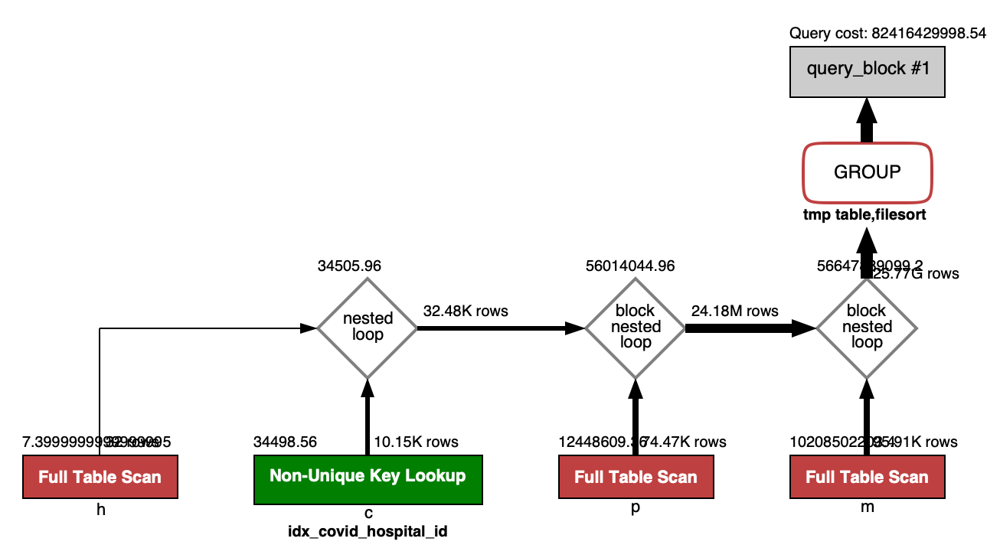
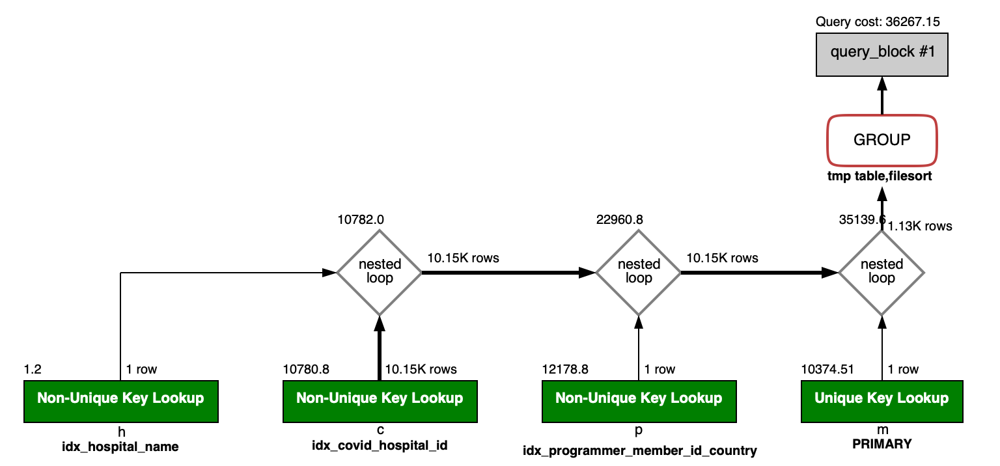

# 🚀 4단계 - 인덱스 설계
## 생각해보기


## 미션
### 실습환경 세팅
```shell
$ docker run -d -p 13306:3306 brainbackdoor/data-subway:0.0.3
```
- workbench를 설치한 후 localhost:13306 (ID : root, PW : masterpw) 로 접속합니다.

### 요구사항
- 주어진 데이터셋을 활용하여 아래 조회 결과를 100ms 이하로 반환
  - M1의 경우엔 시간 제약사항을 달성하기 어렵습니다. 2배를 기준으로 해보시고 어렵다면, 일단 리뷰요청 부탁드려요
  - [Coding as a Hobby](https://insights.stackoverflow.com/survey/2018#developer-profile-_-coding-as-a-hobby) 와 같은 결과를 반환하세요.
  - 프로그래머별로 해당하는 병원 이름을 반환하세요. (covid.id, hospital.name)
  - 프로그래밍이 취미인 학생 혹은 주니어(0-2년)들이 다닌 병원 이름을 반환하고 user.id 기준으로 정렬하세요. (covid.id, hospital.name, user.Hobby, user.DevType, user.YearsCoding)
  - 서울대병원에 다닌 20대 India 환자들을 병원에 머문 기간별로 집계하세요. (covid.Stay)
  - 서울대병원에 다닌 30대 환자들을 운동 횟수별로 집계하세요. (user.Exercise)

### 📚 Todo List 📚
- [x] Coding as a Hobby와 같은 결과 반환
  - 실행 Query
```sql
SELECT hobby,
       count(*) * 100 / (SELECT count(*) FROM programmer) as 'percentage'
FROM programmer
GROUP BY hobby;
```
  - 인덱스 적용 전
  > 2.577sec / 0.000026sec ( Duration / Fetch Time )

  

  - 개선 작업
```sql
-- hobby
  PRIMARY KEY (`id`),
  KEY `idx_programmer_hobby` (`hobby`)
```
  
  - 인덱스 적용 후
  > 0.040sec / 0.000007sec ( Duration / Fetch Time )

  

- [x] 프로그래머별로 해당하는 병원 이름을 반환하세요. (covid.id, hospital.name)
  - 실행 Query
```sql
SELECT c.id,
       h.name
  FROM covid c
       INNER JOIN programmer p
       ON        c.programmer_id = p.id
       INNER JOIN hospital h
       ON        c.hospital_id = h.id;
```
  - 인덱스 적용 전
  > 0.122sec / 2.049sec ( Duration / Fetch Time )

  

  - 개선 작업
```sql
-- covid
PRIMARY KEY (`id`),
KEY `idx_covid_programmer_id` (`programmer_id`),
KEY `idx_covid_hospital_id` (`hospital_id`)

-- hospital
  PRIMARY KEY (`id`)
```
  - 인덱스 적용 후 
  > 0.013sec / 0.512sec ( Duration / Fetch Time )

  

- [x] 프로그래밍이 취미인 학생 혹은 주니어(0-2년)들이 다닌 병원 이름을 반환하고 user.id 기준으로 정렬하세요. (covid.id, hospital.name, user.Hobby, user.DevType, user.YearsCoding)
  - 실행 Query
```sql
SELECT c.id, h.name, p.hobby, p.dev_type, p.years_coding
  FROM programmer p
	   INNER JOIN covid c
	   ON         p.id = c.programmer_id
       INNER JOIN hospital h
       ON         c.hospital_id = h.id
 WHERE (hobby = 'Yes' and student <> 'No')
    OR years_coding = '0-2 years'
 ORDER BY p.id;
```

  - 인덱스 적용 전 (전 문제에서 적용하여 추가할 인덱스 없음)
  > 0.025sec / 0.823sec ( Duration / Fetch Time )

  

- [x] 서울대병원에 다닌 20대 India 환자들을 병원에 머문 기간별로 집계하세요. (covid.Stay)
  - 실행 Query
```sql
SELECT c.stay,
       count(*) as 'COUNT'
  FROM member m
       INNER JOIN programmer p
	   ON         m.id = p.member_id
       AND        p.country = 'India'
       INNER JOIN covid c
       ON         m.id = c.member_id
       INNER JOIN hospital h
       ON         c.hospital_id = h.id
       AND        h.name = '서울대병원'
 WHERE m.age BETWEEN 20 AND 29
 GROUP BY c.stay;
```
  
  - 인덱스 적용 전
  > 25.663sec / 0.00006sec ( Duration / Fetch Time )

  

  - 개선작업
```sql
-- member
PRIMARY KEY (`id`)

-- hospital
KEY `idx_hospital_name` (`name`)

-- programmer
KEY `idx_programmer_member_id_country` (`member_id`,`country`)

```
 
  - 인덱스 적용 후
  > 0.0045sec / 0.00001sec ( Duration / Fetch Time )

  

  - [ ] 서울대병원에 다닌 30대 환자들을 운동 횟수별로 집계하세요. (user.Exercise)
