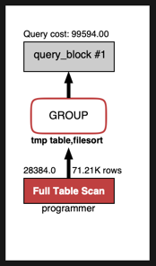
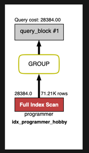

# Coding as a Hobby 와 같은 결과를 반환하세요.
1. 실행쿼리

```sql
select hobby, count(hobby) as 'HobbyCount' from subway.programmer group by hobby;
```



소요시간 : 2.083 sec

2. 인덱스 생성

programmer의 hobby에 인덱스를 추가하였습니다.



소요시간 : 0.042 sec

