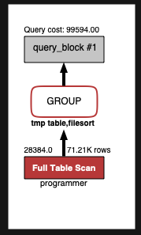
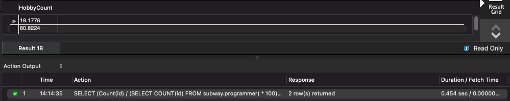
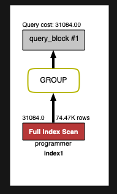
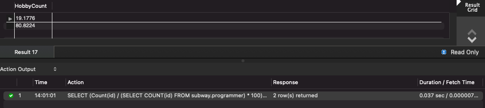

## Coding as a Hobby 와 같은 결과를 반환하세요.

```sql
SELECT (Count(id) / (SELECT COUNT(id) FROM subway.programmer) * 100) as 'HobbyCount'
FROM subway.programmer
GROUP BY hobby;
```

```
1. programmer 테이블의 id pk 설정
2. prograamer 테이블에 hobby 컬럼으로 인덱스 추가

결과 : 0.454 sec -> 0.037 sec
```






