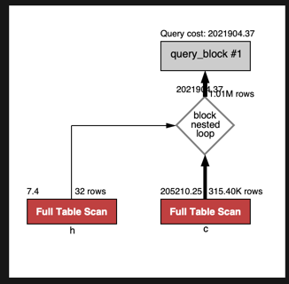
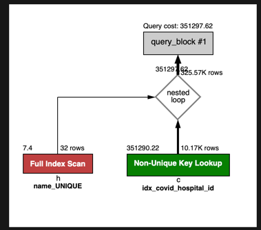
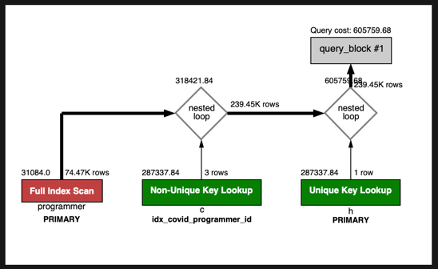

# 프로그래머별로 해당하는 병원 이름을 반환하세요. (covid.id, hospital.name)
1. 실행쿼리

```sql
select p.id, ch.name
from
    (select c.programmer_id, h.name from subway.covid as c join hospital as h on c.hospital_id = h.id) ch
        join (select id from subway.programmer) p
             on ch.programmer_id = p.id
    limit 0, 10;
```



소요시간 : 0.049 sec

2. 인덱스 생성

covid테이블의 hospital_id의 값을 인덱스로 추가하였고 hospital에서 id를 PK설정과 name을 UK로 설정하였습니다.



소요시간 : 0.036 sec

3. programmer 테이블 조인 및 페이징쿼리 적용



소요시간 : 0.022 sec
