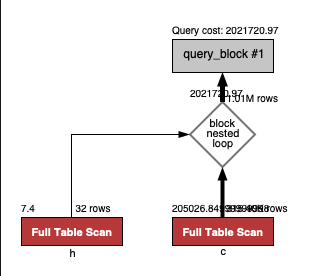
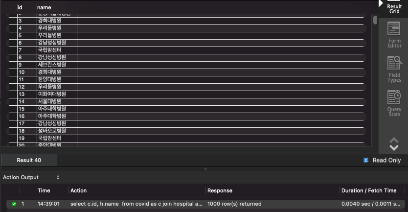
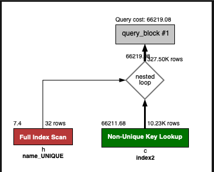
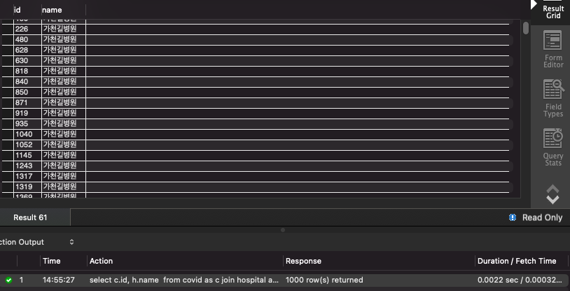

## 프로그래머별로 해당하는 병원 이름을 반환하세요. (covid.id, hospital.name)

```sql
select c.id, h.name
from covid as c
         join hospital as h
              on c.hospital_id = h.id;
```

```
1. hospital 테이블의 id pk 설정
2. hospital 테이블의 name 컬럼 dataType text -> varchar로 변경 및 unique 설정
3. covid 테이블 id pk 설정
4. covid 테이블 hospital_id 컬럼으로 인덱스 추가

결과 : 0.0040 sec -> 0.0022 sec
```





