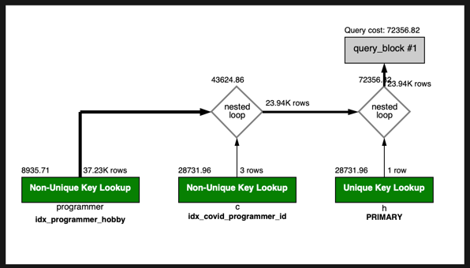

# 프로그래밍이 취미인 학생 혹은 주니어(0-2년)들이 다닌 병원 이름을 반환하고 user.id 기준으로 정렬하세요. (covid.id, hospital.name, user.Hobby, user.DevType, user.YearsCoding)
1. 실행쿼리

```sql
select
    c.id, c.name, p.hobby, p.dev_type, p.years_coding
from (
         select id, hobby, dev_type, years_coding from subway.programmer where hobby ='yes' and (student like 'yes%' or years_coding = '0-2 years')
     ) p
         join (
    select c.id, c.programmer_id, h.name from subway.covid as c join hospital as h on c.hospital_id = h.id
) c on p.id = c.programmer_id;
```

조건인 취기로 프로그래밍인 사람과 학생 또는 주니어를 조건으로하여 먼저 서브 쿼리로 조회를 시작하였습니다
그리고 병원이름을 구한뒤에 조인을 진행하여 데이터를 조회하였습니다.
앞서 생성한 인덱스 만으로는 데이터 조회가 너무 오래걸렸고 데이터 조회시에 워크벤치에서 타임아웃이 떨어져서 쿼리타임아웃 시간을 600초로 증가하여 다시 조회를 하였습니다.

그럼에도 불구하고 너무 오래걸려 해당 쿼리를 종료하였고 다른 인덱스를 추가후 진행하려고했었으나 잘진행이 되질않았고
DB에서는 그대로 그 쿼리가 돌아가는것을 show processlist를 통하여 알게되어 해당 쓰레드를 종료한후에 인덱스를 추가하였습니다.

2. 인덱스 생성

취미 + 학생유무 , 취미 + 경력을 인덱스로 우선추가하였습니다.
프로그래머 테이블의 ID PK를 추가하였고, 
Covid 테이블에서 Programmer_id값을 인덱스로 추가해 주었습니다.



소요시간 : 0.024 sec

