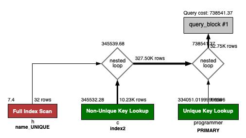
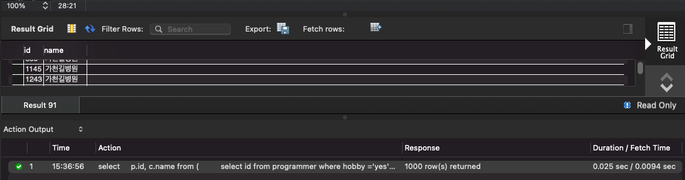
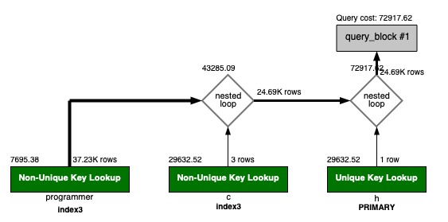
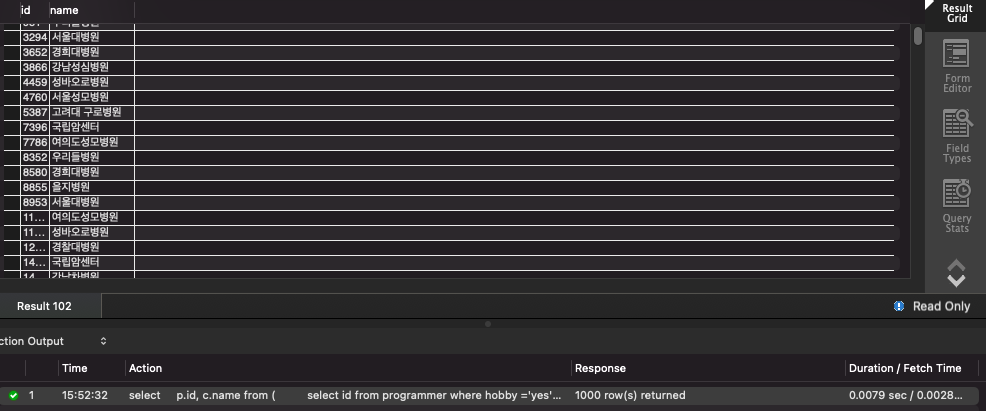

## 프로그래밍이 취미인 학생 혹은 주니어(0-2년)들이 다닌 병원 이름을 반환하고 user.id 기준으로 정렬하세요. (covid.id, hospital.name, user.Hobby, user.DevType, user.YearsCoding)

```sql
select p.id, c.name
from (
         select id from programmer where hobby = 'yes' and (student like 'yes%' or years_coding = '0-2 years')
     ) p
         join (
    select c.programmer_id, h.name
    from covid as c
             join hospital as h
                  on c.hospital_id = h.id
) c on p.id = c.programmer_id;
```

```
1. 기존에 각 테이블의 id는 pk 설정 + programmer 테이블에 hobby 컬럼으로 인덱스 생성 + covid 테이블에 hospital 컬럼으로 인덱스 생성 
2. covid 테이블에 programmer_id 컬럼으로 인덱스 추가
3. 여기까지 진행했음에도 Duration 0.012 sec로 100ms 초과 
4. 테이블 액세스를 최소화하기 위해 programmer 테이블에 hobby 컬럼을 선두 컬럼으로 hobby + student + years_coding 인덱스를 추가
 
결과 : 0.025 sec -> 0.0079 sec
```





