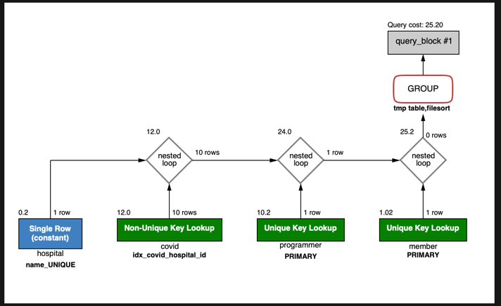
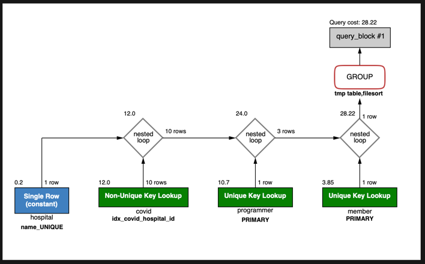
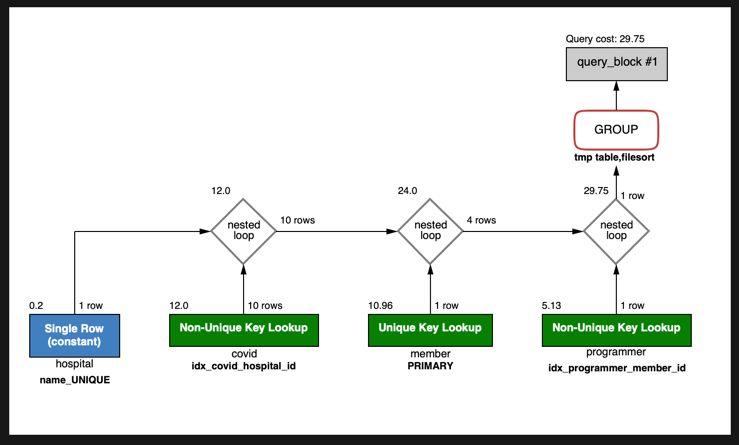

# 서울대병원에 다닌 20대 India 환자들을 병원에 머문 기간별로 집계하세요. (covid.Stay)
1. 실행쿼리

```sql
select c.stay, count(c.stay) as count
from (select id, member_id from subway.programmer where country = 'india') p
         join (SELECT id FROM subway.member where age BETWEEN 20 AND 29) m
              on p.member_id = m.id
         join (
    select c.stay, c.programmer_id, c.hospital_id from (
        select stay, programmer_id, hospital_id from subway.covid) c
           join (select id from subway.hospital where name = '서울대병원') h
                on c.hospital_id = h.id
) c
  on p.id = c.programmer_id
group by c.stay;
```



소요시간 : 0.432 sec

2. 인덱스 생성

member의 age와 programmer의 country에 인덱스를 추가하였습니다.
인덱스를 추가하니 소요시간은 줄어들었는데 쿼리 비용을 오히려 증가를 하게되었네요.
이부분에 대해서는 학습을 좀더해서 분석해봐야할거같습니다.



소요시간 : 0.395 sec

3. 쿼리 변경
 기본에 생성된 쿼리가 성능이 재대로 나오질 않아서 쿼리를 수정하였습니다
   
```sql
select
	count(mch.stay)
from (
	select m.id, ch.stay
	from (
		SELECT id FROM subway.member where age BETWEEN 20 AND 29
	) m
	join (
		select member_id, stay
			from 
				(select member_id, hospital_id, stay from subway.covid ) c
			join  
		(select id from subway.hospital where name = '서울대병원') h
		on c.hospital_id = h.id
    ) ch
    on m.id = ch.member_id
) mch join (
	select  member_id, exercise from subway.programmer where country = 'india'
) p
on mch.id = p.member_id
group by mch.stay;
```



소요시간 : 0.057 sec
