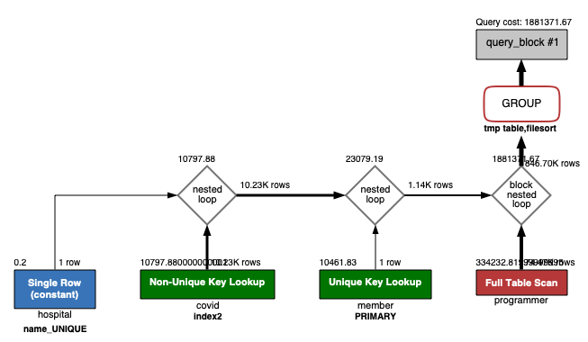
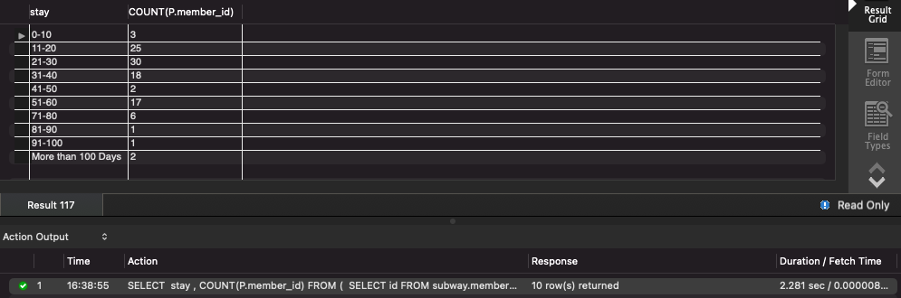
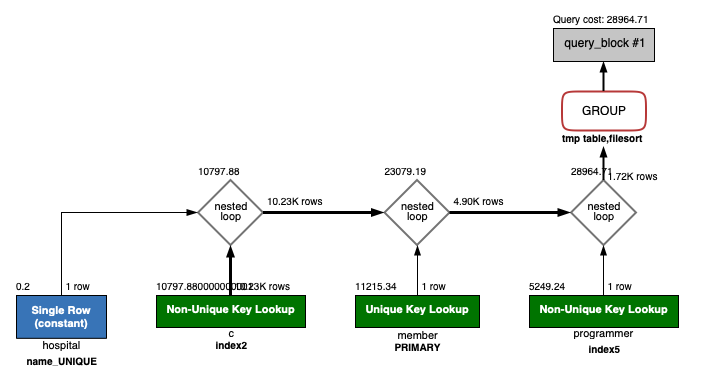
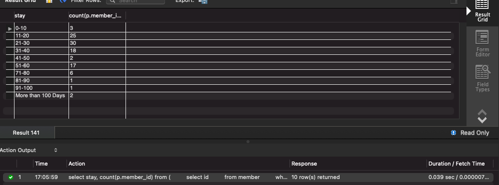

## 서울대병원에 다닌 20대 India 환자들을 병원에 머문 기간별로 집계하세요. (covid.Stay)

```sql
select stay, count(p.member_id)
from (
         select id
         from member
         where age between 20 and 29) as m
         join (
    select member_id
    from programmer
    where country = 'India') as p
              on m.id = p.member_id
         join (
    select c.id, c.member_id, hospital_id, stay
    from covid as c
             join (select id from hospital where name = '서울대병원') as h on c.hospital_id = h.id) as ch
              on m.id = ch.member_id
group by stay;
```

```
1. 기존에 각 테이블의 id는 pk 설정 + covid 테이블에 hospital_id에 인덱스 생성
2. programmer 테이블에 country 컬럼으로 인덱스 생성
3. group by 시 성능 향상 위해 covid 테이블의 stay 컬럼에 인댁스 생성
4. 여기까지는 크게 성능 향상이 안됨
5. 실행 계획에서 programmer 테이블의 Full Table Scan 제거를 위해 member_id 컬럼으로 인덱스 생성 
 
결과 : 2.281 sec -> 0.0039 sec
```





