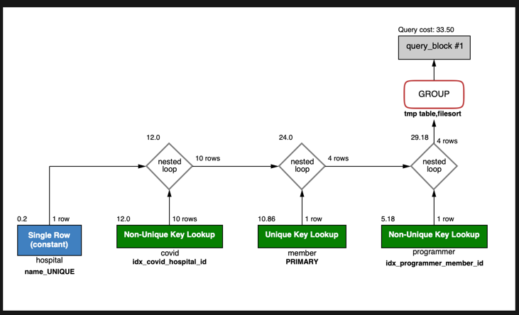

# 서울대병원에 다닌 30대 환자들을 운동 횟수별로 집계하세요. (user.Exercise)
1. 실행쿼리

```sql
(select id, member_id, exercise from subway.programmer) p
```



소요시간 : 0.069 sec

2. 인덱스 생성

소요시간이 100ms 이하로 별도의 인덱스 변겨없이 기존의 인덱스로 해결되었습니다.
