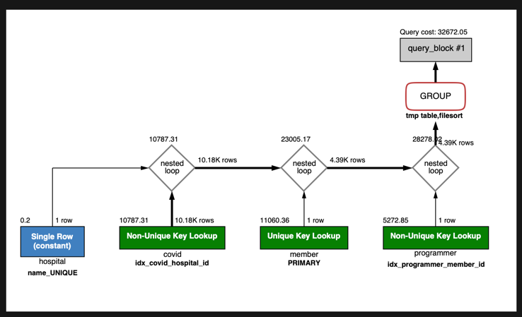

# 서울대병원에 다닌 30대 환자들을 운동 횟수별로 집계하세요. (user.Exercise)
1. 실행쿼리

```sql
select
	count(mpc.exercise)
from
(select
	mp.exercise, c.hospital_id
from
(
select
	m.id, p.exercise
from
	(SELECT id FROM subway.member where age BETWEEN 30 AND 39) m
join
	(select  member_id, exercise from subway.programmer) p
on m.id = p.member_id
) mp
join 
(select member_id, hospital_id from subway.covid ) c
on mp.id = c.member_id
) mpc
join
(select id from subway.hospital where name = '서울대병원') h
on mpc.hospital_id = h.id
group by exercise;

```

2. 인덱스 생성

Member의 age는 이전 단계에서 추가되었습니다.
Programmer의 exercise 필드가 Text로 되어 있어서 이부분을 varchar(256)변경후에 인덱스를 후가하였습니다.

이외에 각 테이블의 id를 pk로 지정하였습니다.



소요시간 : 0.055 sec
