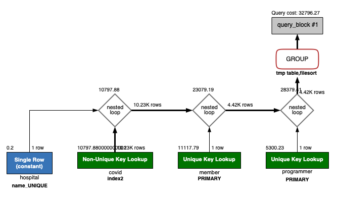
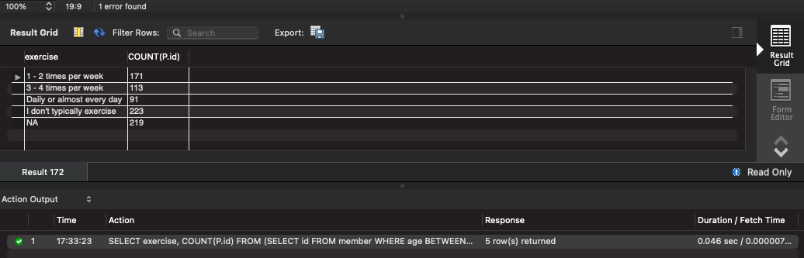
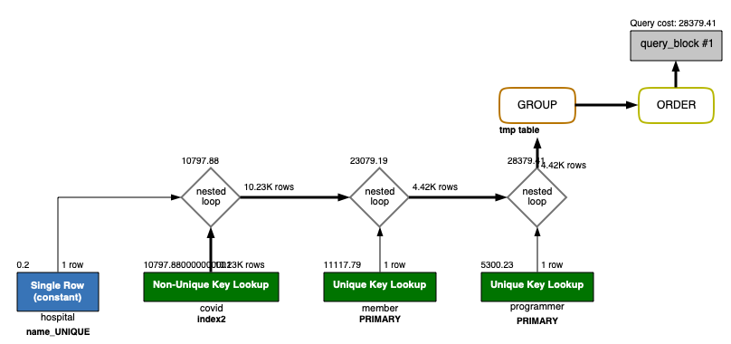
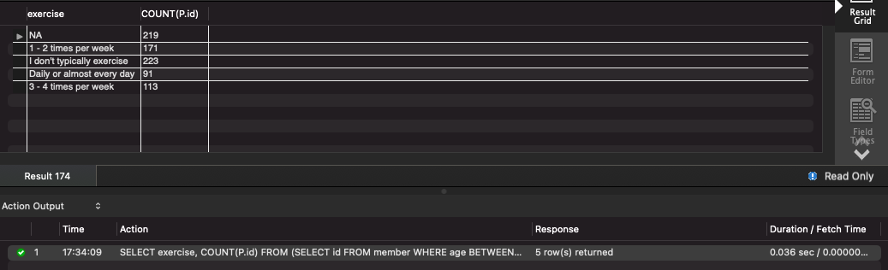

## 서울대병원에 다닌 30대 환자들을 운동 횟수별로 집계하세요. (user.Exercise)

```sql
select exercise, count(p.id)
from (select id from member where age between 30 and 39) as m
         join (select member_id, hospital_id, programmer_id from covid) as c
              on c.member_id = m.id
         join (select id, exercise from programmer) as p
              on c.programmer_id = p.id
         join (select id from hospital where name = '서울대병원') as h
              on c.hospital_id = h.id
group by exercise
order by null;
```

```
1. 기존에 각 테이블의 id는 pk 설정
2. 기존에 member 테이블의 age 인덱스 생성 + covid 테이블에 member_id, programmer_id, hospital_id 각각 인덱스 생성 
3. file sort가 필요 없으므로 order by null 구문 추가  
 
결과 : 0.046 sec -> 0.036 sec
```





